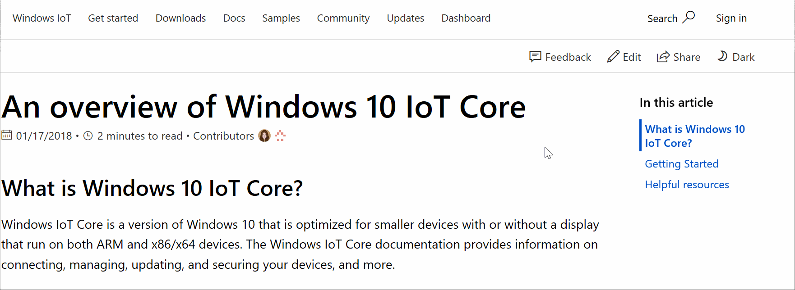
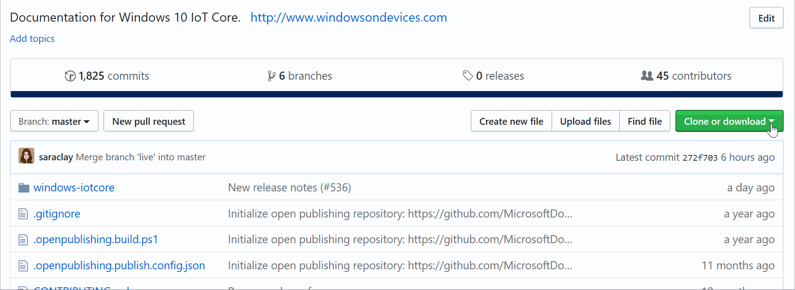

## Microsoft Open Source Code of Conduct

This project has adopted the [Microsoft Open Source Code of Conduct](https://opensource.microsoft.com/codeofconduct/).
For more information see the [Code of Conduct FAQ](https://opensource.microsoft.com/codeofconduct/faq/) or contact [opencode@microsoft.com](mailto:opencode@microsoft.com) with any additional questions or comments.

# How to contribute to Windows 10 IoTCore documentation

## Legal Notices
Microsoft and any contributors grant you a license to the Microsoft documentation and other content
in this repository under the [Creative Commons Attribution 4.0 International Public License](https://creativecommons.org/licenses/by/4.0/legalcode),
see the [LICENSE](LICENSE) file, and grant you a license to any code in the repository under the [MIT License](https://opensource.org/licenses/MIT), see the
[LICENSE-CODE](LICENSE-CODE) file.

Microsoft, Windows, Microsoft Azure and/or other Microsoft products and services referenced in the documentation
may be either trademarks or registered trademarks of Microsoft in the United States and/or other countries.
The licenses for this project do not grant you rights to use any Microsoft names, logos, or trademarks.
Microsoft's general trademark guidelines can be found at http://go.microsoft.com/fwlink/?LinkID=254653.

Privacy information can be found at https://privacy.microsoft.com/en-us/

Microsoft and any contributors reserve all others rights, whether under their respective copyrights, patents,
or trademarks, whether by implication, estoppel or otherwise.

## Contributing

This is the repository for Windows 10 IoT **documentation** hosted at [https://docs.microsoft.com/windows/iot-core](https://docs.microsoft.com/windows/iot-core).

If you would like to see new coverage or have feedback, please consider [**contributing**](/CONTRIBUTING.md).  You can edit the existing content, add new content, or simply create new [issues](https://github.com/MicrosoftDocs/windows-iotcore-docs/issues). We’ll take a look at your suggestions and will work together to incorporate them into the docs.

To edit content, just click edit on the article you want to make changes to:




You can also clone or download the repo to make changes:



You will also need to add a reviewer or reviews to your pull requests to get them approved:


# Conventions
  - When adding a page, you must add an entry for it in [toc.md](windows-iotcore/TOC.md) for it to appear.
  - A folder can contain more folders or `readme.md`s
  - Folder/directory names are dash-separated (e.g., `f12-tools`) and lowercase. They are used in URLs on the docs.microsoft.com site. Don't use underscores or PascalCase/camelCase.


## Other text elements

These other text elements have styling available:

* Unordered lists
* Have regular bullets
   * You can also nest bullets
   * Bullets lists should have more than one entry.
* Pretty standard

1. Ordered lists
2. Use regular ol' western-style numbering.
3. Should be used only when a list truly has order.

_________________________

Horizontal rules are available. We suggest using them sparingly to reduce clutter.
Do not combine horizontal rules with heading tags; some already used line styles for visual hierarchy.
Also, do not combine notes (see below) in the middle of numbered lists. This messes with the numbering order.

## Displaying code

You can use inline `code` Markdown syntax (with the backticks).

Or you can display blocks of code like so:

```css
body {
    background: #fff;
}
```

## Tables

| You can     | use headers | on tables    |
|-------------|-------------|-------------:|
| Left-aligned| Unless a #  | 456          |
| Text value  | More text   | $0.00        |

## Notes

Use notes sparingly. They are blocks designed to highlight "don't-miss-it" information.

We have four different versions of notes currently styled:
- NOTE
- WARNING
- TIP
- IMPORTANT


For multi-line blockquote notes, use a > in front of each line of the notes as seen in the example below.

## Images

Images should be stored in a `media` folder and referenced with a relative path:

``


## Code of Conduct
This project has adopted the [Microsoft Open Source Code of Conduct](https://opensource.microsoft.com/codeofconduct/). For more information see the [Code of Conduct FAQ](https://opensource.microsoft.com/codeofconduct/faq/) or contact [opencode@microsoft.com](mailto:opencode@microsoft.com) with any additional questions or comments.
