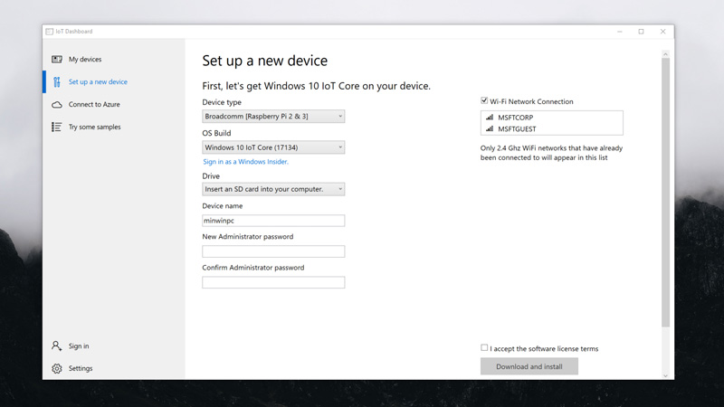

# Downloads
Download the tools and software you need to get started with Windows 10 IoT Core.

## Windows 10 IoT Core Dashboard

The Windows 10 IoT Core Dashboard makes flashing Windows 10 IoT Core onto your device simpler with a navigable interface. Once downloaded, learn how to set up your device with the dashboard [here](https://docs.microsoft.com/windows/iot-core/tutorials/quickstarter/devicesetup#using-the-iot-dashboard-raspberry-pi-minnowboard-nxp).

> [!div class="nextstepaction"]
> [Download the Windows 10 IoT Core Dashboard](https://go.microsoft.com/fwlink/?LinkID=708576)

_By downloading and using the Windows 10 IoT Core Dashboard you agree to the [license terms](https://go.microsoft.com/fwlink/?LinkID=703960&clcid=0x4809) and [privacy statement](https://go.microsoft.com/fwlink/?LinkId=521839) for the Windows 10 IoT Core Dashboard._

## Latest Windows 10 IoT Core builds

> [!WARNING]
> Do not use maker images for commercialization. If you are commercializing a device, you must use a custom FFU for optimal security. Learn more [here](https://docs.microsoft.com/windows-hardware/manufacture/iot/iot-core-manufacturing-guide).

When commercializing your IoT Solution, you will need to download builds from the [Microsoft Software Downloads site](https://aka.ms/AA7twzo). We've included releases from the past below as well in case you need to work with a previous build of Windows 10 IoT Core for your device. 

### October 2018 Release

* [Windows 10 IoT Core Packages](https://aka.ms/AA7twzo)
* [Raspberry Pi 2 & 3](https://go.microsoft.com/fwlink/?LinkId=846058)
* [DragonBoard 410c](https://go.microsoft.com/fwlink/?LinkId=846059)
* [MinnowBoard Turbot/Max](https://go.microsoft.com/fwlink/?linkid=846057)

## Previous Windows 10 IoT Core releases

### April 2018 Update

* [Windows 10 IoT Core Packages](https://software-download.microsoft.com/download/pr/17134.1.180410-1804.rs4_release_amd64fre_IOTCORE_PACKAGES.iso)
* [Raspberry Pi 2 & 3](https://software-download.microsoft.com/download/pr/17134.1.180410-1804.rs4_release_amd64fre_IOTCORE_RPi.iso)
* [DragonBoard 410c](https://software-download.microsoft.com/download/pr/17134.1.180410-1804.rs4_release_amd64fre_IOTCORE_QCDB410C.iso)
* [MinnowBoard Turbot/Max](https://software-download.microsoft.com/download/pr/17134.1.180410-1804.rs4_release_amd64fre_IOTCORE_MBM.iso)

### Fall Creators Update

* [Windows 10 IoT Core Packages](https://software-download.microsoft.com/download/pr/16299.15.170928-1534.rs3_release_amd64fre_IOTCORE_PACKAGES.iso)
* [Raspberry Pi 2 & 3](https://download.microsoft.com/download/9/6/2/9629C69B-02B8-4A82-A4C8-860D6E880C66/16299.15.170928-1534.rs3_release_amd64fre_IOTCORE_RPi.iso)
* [DragonBoard 410c](https://download.microsoft.com/download/1/0/C/10CAECC2-3B60-45BF-BF0D-D0BACF4072E5/16299.15.170928-1534.rs3_release_amd64fre_IOTCORE_QCDB410C.iso)
* [MinnowBoard Turbot/Max](https://download.microsoft.com/download/5/F/9/5F917B68-020E-4993-A972-F1A7038510CF/16299.15.170928-1534.rs3_release_amd64fre_IOTCORE_MBM.iso)

## Other downloads

### [mDNS Responder](https://go.microsoft.com/fwlink/?linkid=2077676)
Download the Bonjour-compatible mDNS Responder for Windows IoT (sample source). Learn more [here](mDNS.md).

### [Firmware Update](http://firmware.intel.com/projects/minnowboard-max)
Download firmware components and updates for the MinnowBoard Max reference board from Intel.

### [Visual Studio 2017](https://www.visualstudio.com/downloads/)
State of the art IDE, tools and services that you can use to create great IoT apps.

### [Windows Driver Kit 2017](https://msdn.microsoft.com/windows/hardware/hh852365.aspx)
Provides an integrated development environment for creating efficient high quality drivers for devices running Windows 10.

### [Windows Developer Tools for Visual Studio](https://developer.microsoft.com/windows/downloads/)
Tools that integrate with Visual Studio 2017 and are required for developing for the Universal Windows App Platform.
