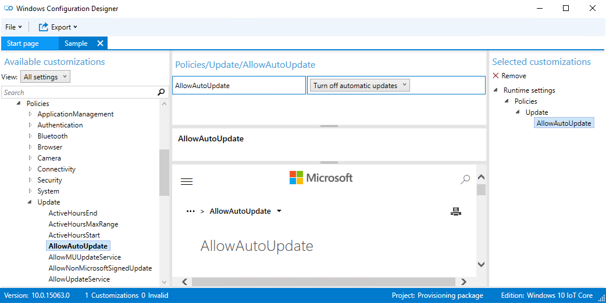
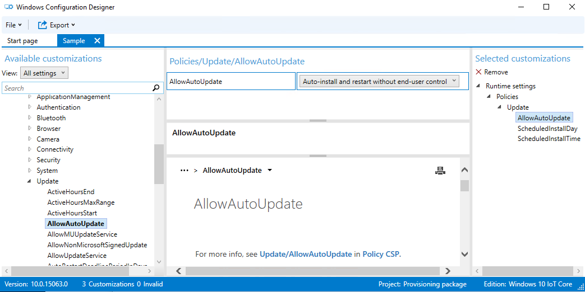
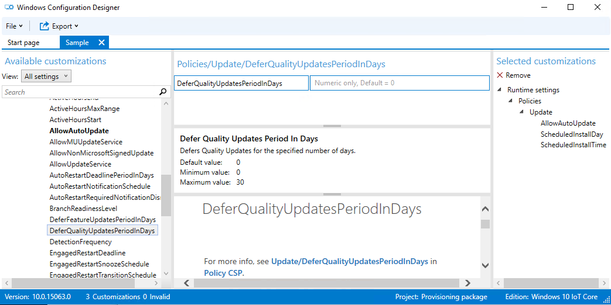

# Manage IoT Core device updates

OEM and enterprise customers using Windows 10 IoT Core can take advantage of device management configuration service providers (CSPs) that allow some control over the device update process.

>[!NOTE]
>Starting with Windows 10 version 1703, IoT Core Pro is discontinued and update control is enabled in IoT Core. WSUS support is also removed.

## Using Update APIs

[Windows.System.Update](/uwp/api/windows.system.update) provides interactive control for Windows Update for Windows 10 IoT Core. OEM can build custom UI in their UWP App to manage the windows update process and also show update status/progress. Note that the interactive update overrules the update policies set through MDM or provisioning packages as detailed below.

## Using Device Management

Device Management Policy can be set using either the Windows Imaging and Configuration Designer (ICD) tool or a mobile device management (MDM) service. See [Mobile Device Management](/windows/client-management/mdm/index) for more detail about device management protocols.

The Windows Imaging and Configuration Designer (ICD) tool creates a provisioning package that can be included in the image either at imaging time or runtime.
For adding the provisioning package at imaging time, see [add provisioning package](/windows-hardware/manufacture/iot/add-a-provisioning-package-to-an-image).
For adding the provisioning package to the device at runtime, follow the steps given below

- Connect to the device ([using SSH](/windows/iot-core/connect-your-device/ssh) or [using Powershell](/windows/iot-core/connect-your-device/powershell))
- Copy the `<filename>.ppkg` file to the directory `C:\Windows\Provisioning\Packages` on the device
- Reboot the device. On the next boot, the ppkg will be processed and the settings will be applied to the device.

### AllowAutoUpdate to turn updates on or off

Updates for IoT Core can be turned off by setting the AllowAutoUpdate policy.

- If the AllowAutoUpdate policy is not configured, it defaults to **Auto-install and restart**, devices will get IoT Core updates and install immediately and reboot after ActiveHours.
- If the AllowAutoUpdate policy set to **Turn off automatic updates**, automatic updates for IoT Core are turned off.

### AllowAutoUpdate to control updates

The AllowAutoUpdate policy can also control the timing of updates for IoT Core:

If the AllowAutoUpdate policy is set to **Auto-install and restart without end-user control**, IoT Core updates will automatically install and the device will restart at a specified day/time. An IT administrator specifies the install day/time (i.e., every Sunday at 3am).
If no day/time is specified, the install time defaults to 3 AM daily. All end-user update related notifications are suppressed as well.

View the set day using `<LocURI>./Vendor/MSFT/PolicyManager/Device/Update/ScheduledInstallDay</LocURI>` or time using `<LocURI>./Vendor/MSFT/PolicyManager/Device/Update/ScheduledInstallTime</LocURI>` in **syncml**.

### Deferring updates

**DeferQualityUpdatePeriodInDays** policy can be used to delay the update of the device by required number of days(max 30 days).

## Using Azure IoT Device Management

[Azure IoT Device Management (Azure DM)](/windows/iot-core/manage-your-device/azureiotdm) is a highly scalable management solution available on Windows 10 IoT Core. See  [Windows Update Management](https://github.com/ms-iot/iot-core-azure-dm-client/blob/master/docs/windows-update-management.md) for the details on managing the updates using this channel.

Azure DM also provides ability to set the flighting ring ( see "ring" property in [Windows Update Policy](https://github.com/ms-iot/iot-core-azure-dm-client/blob/master/docs/windows-update-management.md#windows-update-policy) ) and control the reboot of the device via [Reboot Management](https://github.com/ms-iot/iot-core-azure-dm-client/blob/master/docs/reboot-management.md).
