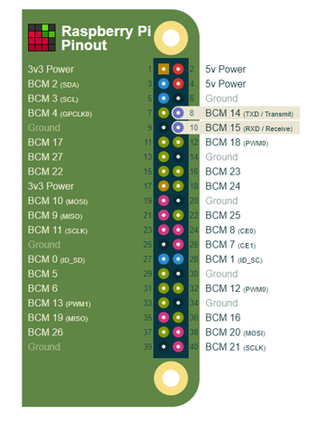
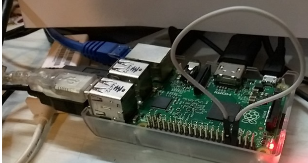

# Troubleshooting
This is an article that contains common troubleshooting issues that people have come across. To find something specific, use Ctrl+F to find a word or phrase. Have any insight you want to add? Create a PR for this documentation or provident content feedback below.

> [!TIP]
> For troubleshooting issues related to manufacturing, please read the [Troubleshooting doc](https://docs.microsoft.com/en-us/windows-hardware/manufacture/iot/troubleshooting) in our manufacturing guide.

## ASUS Tinkerboard and Rockchip support

While the ASUS Tinkerboard and Rockchip are not officially supported by us, there are cases where Rockchip has worked with other third parties to get SoC working on Windows 10 IoT Core.

## Issue when connecting a MBM device when roaming

There are two things to consider when enabling roaming:

1. The profile.xml configures roaming and sets the behavior to automatically establish a connection to the cellular network.
To set a profile for roaming please refer to [this article](https://docs.microsoft.com/windows/desktop/mbn/schema-root).

```
  <!-- applicability to any combination of home carrier, partner MOs and non-partner MOs, except for HomeAndNonPartner -->
  <xs:simpleType name="roamApplicabilityType">
    <xs:restriction base="xs:token">
       <xs:enumeration value="NonPartnerOnly"/>
       <xs:enumeration value="PartnerOnly"/>
       <xs:enumeration value="HomeOnly"/>
       <xs:enumeration value="HomeAndPartner"/>
       <xs:enumeration value="PartnerAndNonpartner"/>
       <xs:enumeration value="AllRoaming"/>
    </xs:restriction>
  </xs:simpleType>
  
  <xs:simpleType name="roamControlType">
    <xs:restriction base="xs:token">
       <xs:enumeration value="AllRoamAllowed"/>
       <xs:enumeration value="PartnerRoamAllowed"/>
       <xs:enumeration value="NoRoamAllowed"/>
    </xs:restriction>
  </xs:simpleType>
``` 

To set a profile for automatic connection, select "auto":

```  
<!-- Connection Mode, default is "manual" -->
    <xs:element name="ConnectionMode" minOccurs="0">
      <xs:simpleType>
        <xs:restriction base="xs:string">
          <!-- manual connect always -->
          <xs:enumeration value="manual" />
          <!-- auto connect always -->
          <xs:enumeration value="auto" />
          <!-- auto connect when not roaming -->
          <xs:enumeration value="auto-home"/>
        </xs:restriction>
      </xs:simpleType>
    </xs:element>
```

2. Another factor is that the per-interface roaming policy must be satisfied. By default, that policy is set to FALSE ("home carrier only"). This can be queried and changed in command line via `netsh mbn get/set dataroamcontrol.`

Example:

```
    netsh mbn show dataroamcontrol int=*
    netsh mbn set dataroamcontrol interface=Cellular profileset=all state=all
    netsh mbn set dataroamcontrol help
```

You may get error **0x139f (ERROR_INVALID_STATE)** in the case when the device is roaming but the roaming policy disallows data roaming - error on a connect request sent to wwansvc.

## Raspberry Pi 3B+ booting issues

> [!NOTE]
> This release for the Raspberry Pi 3B+ is an unsupported technical preview. Limited validation and enablement has been completed. For a better evaluation experience and for any commercial products, please use the Raspberry Pi 3B or other devices with supported Intel, Qualcomm, or NXP SoCs. For troubleshooting issues with the Raspberry Pi 3B+, please see our Troubleshooting Guide, [here](https://docs.microsoft.com/en-us/windows/iot-core/troubleshooting?branch=master#raspberry-pi-3b-booting-issues). 

The Raspberry Pi 3 Model B+ is the latest product in the Raspberry Pi 3 range, boasting a 64-bit quad core processor running at 1.4GHz, dual-band 2.4GHz and 5GHz wireless LAN, Bluetooth 4.2/BLE, faster Ethernet, and PoE capability via a separate PoE HA.

Recently, many customers who are interested in Windows 10 IoT Core encountered a problem where the device could not boot normally after flushing Windows 10 IoT Core, but the Raspbian works fine on it. The following are some suggestions on how to troubleshoot the boot problem.

There are some known issues in this Insider Preview image. Please note that:
* This image is only meant for the Raspberry Pi 3B+ and will not boot on the Raspbierry Pi 2.
* F5 driver deployment from Visual Studio does not work on Windows 10 IoT Core.
* Onboard Wi-Fi and Bluetooth do not work on the Raspberry Pi 3B+.
* Ft5406 touch screen driver is disabled on the Raspberry Pi 3B+.
* SD card activity LED is disabled.

There are only two requirements when choosing which SD cards to use with Windows 10 IoT Core. You need to use a class 10 SD card and make sure the card has enough space - at least 8 GB of space. There are a couple of SD cards that have been verified by Microsoft to be compatible with Windows 10 IoT Core:
* Samsung EVO 32 GB class 10 Micros SDHC card
* SanDisk Ultra Micro SDHC, 16 GB card

Generally, you need to check if the SD card is fake or if it is damaged or corrupt. The SD card is equally prone to corruption due to a variety of factors such as power shortage or improper removal. It is important to safeguard your memroy card from damage.

To flash your image to a SD card, you can use the [Windows 10 IoT Core Dashboard](https://docs.microsoft.com/en-us/windows/iot-core/connect-your-device/iotdashboard). You will need to choose "Custom" in the OS Build field, then select the FFU file to flash. 

Check to see if there are any hardware failure in the device. There are two LEDs on the Raspberry Pi 3B+ board, same as the 3B. One is for PWR while another is for ACT. The number of blinks the ACT light makes will determine whether or not your board is booting. The SD card activity LED will not flash during some portions of booting on the Raspberry Pi 3B+.

When the device is booting and the device shows the waiting page, please wait patiently. Generally, this will last up to a minute. But sometimes, due to the SD card read-write speed, it may take longer.

If the device can't boot normally with Windows 10 IoT Core, you can try to flash a Linux OS (such as Raspbian) to the SD card to narrow down whether the issue is caused by hardware. 

If you find that you're getting a "rainbow screen", please check to make sure that you flashed the 3B+ release version, available [here](https://www.microsoft.com/en-us/software-download/windowsiot). You can verify your process with a community-submitted 3B+ flashing tutorial [here](https://www.hackster.io/JiongShi/windows-10-iot-core-for-raspberry-pi-3-model-b-92b1a3).

## Serial Port communication on Windows 10 IoT Core for Raspberry Pi 

On the Raspberry Pi, hardware UART and USB UART adapters both are usable for your application with serial communicaiton. By default, the UART transmit and receive pins are pins 8 and 10 on teh GPIO header.



You can read [this article](https://docs.microsoft.com/en-us/windows/iot-core/learn-about-hardware/pinmappings/pinmappingsrpi#serial-uart) to learn more about how to initialize UART0 and perform a write followed by a read.

In addition, Radio Frequency Communication (RFCOMM) is the underlying serial communications for classic Bluetooth. Refer to [this GitHub sample](https://github.com/djaus2/iotbluetoothserial) to learn about running UWP apps on Windows 10 IoT Core to connected over an IoT device with Bluetooth Serial.

If you encounter that the device cannot read/write data through the serial port, follow the steps below to troubleshoot:

1. Connect the TX to RX with Jumper - shown below - then run the sample code to check if the app can read/write data. If this does not work, the IC on the board may be broken.



2. Make sure the BaudRate, Handshaking and StopBits are configured correctly. If the serial port to be tested has a complete RS232 interface (e.g. DB9), use a DB plug with the RxTx crossover wires connected with the typical handshaking crossovers. Some RS232 ports (or USB adapters) require signals such as Carrier Detect (DCD) and DCE Ready (DSR) to be asserted before they function properly.

3. If you want to use USB UART adapters on Windows 10 IoT Core, the following are supported:

* CP2102 USB 2.0
* TTL Module Serial Converter
* FTDI
* Generic usbser.sys

You can also use the devcon.exe stack * and devcon.exe status* cmdlet to check the expected drivers stack and drivers status on Windows 10 IoT Core.

```
USB\VID_10C4&PID_EA60\0001
    Name: Silicon Labs CP210x USB to UART Bridge
    Setup Class: {4d36e978-e325-11ce-bfc1-08002be10318} Ports
    Controlling service:
        silabser
```
[Mincomm](https://github.com/Microsoft/Windows-iotcore-samples/tree/develop/BusTools/MinComm) is another helpful tool to troubleshoot serial port issues. This tool can enumerate ports, give you their friendly name and Device ID, open ports, configure settings (i.e. baud rate, stop bits, etc.) and send and receive data. 

## Sirep Test service
Even though the Sirep Test service is not enabled by default in retail images, in case you still want to disable the Sirep service on startup, you can login and disable Sirep from autostart. 

You can use the following PowerShell commands to do so, as shown below:

```
administrator@MINWINPC C:\Data\Users\administrator>sc stop TestSirepSvc

SERVICE_NAME: TestSirepSvc
       TYPE               : 20  WIN32_SHARE_PROCESS
        STATE              : 3  STOP_PENDING
                                (STOPPABLE, NOT_PAUSABLE, ACCEPTS_PRESHUTDOWN)
        WIN32_EXIT_CODE    : 0  (0x0)
        SERVICE_EXIT_CODE  : 0  (0x0)
        CHECKPOINT         : 0x4
        WAIT_HINT          : 0x1770

administrator@MINWINPC C:\Data\Users\administrator>sc query TestSirepSvc

SERVICE_NAME: TestSirepSvc
        TYPE               : 20  WIN32_SHARE_PROCESS
        STATE              : 1  STOPPED
        WIN32_EXIT_CODE    : 0  (0x0)
        SERVICE_EXIT_CODE  : 0  (0x0)
        CHECKPOINT         : 0x0
        WAIT_HINT          : 0x0

administrator@MINWINPC C:\Data\Users\administrator>sc config TestSirepSvc start=disabled
[SC] ChangeServiceConfig SUCCESS
```

## Tablet mode

"Tablet Mode" is a concept that only exist on Desktop shell and doesn’t apply to IoT Core. 

If the device have supported hardware (either through I2C or USB HID touch), touch should function automatically using the inbox class drivers. You can read more about this [here](https://docs.microsoft.com/en-us/windows-hardware/design/component-guidelines/touchscreen-device-bus-connectivity).


## Yubikey support

Windows 10 IoT Core does not have smart card support. However, smart cards are usually devices used for user identity and not device identity because they are secured with PINs and, in the case of the Yubikey, a button to press. This does not harmonize with an IoT device. If you're looking for an alternative, a TPM 2.0 on the device may serve better than a Yubikey or smart card. We have full certificate support for TPMs and they are meant to store devices as well as user certificates and Azure IoT access credentials (Limpets).
