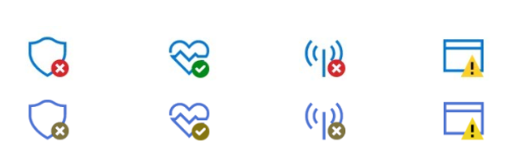
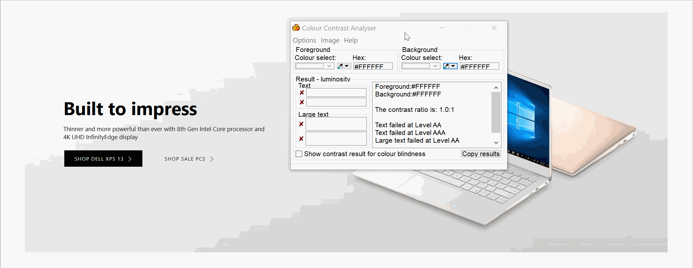
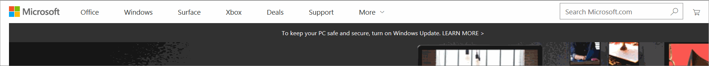
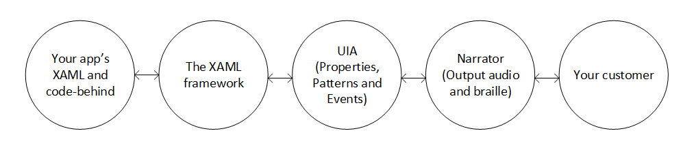

# An Overview of Accessibility for Windows IoT

## Introduction
In addition to development, design, and testing, accessibility is another concept to take into account when publishing
applications or manufacturing devices. Accessibility enables all people to leverage all of the functionalities your applications or devices
offer, regardless of a user's abilities.

To ensure that applications and devices leveraging Windows IoT products offer accessibility-ready features and experiences,
we've put together an overview on best practices and important considerations.

## Common Accessibility Bugs
When it comes to designing and developing with accessibility in mind, successful execution requires awareness and preparation.
Accessibility should be considered initially when technical specifications are decided on. It's also helpful to keep in mind common accessibility
bugs that often make a big difference when implemented.

* Colors and contrast: Don't convey important information through the use of color alone.

* Colors and contrast: Provide a minimum default contrast of 4.5:1. You can find this ratio using a color contrast analyzer ([download here](https://developer.paciellogroup.com/resources/contrastanalyser/))
or any other color contrast tool available online.

* Keyboard accessibility: Keyboard focus needs to be clearly visible, with required contrast and colors. The tab/arrow path through the UI must be intuitive.

* Programmatic accessibility: Use Windows desktop tools to learn about programmatic representation. 

## Accessibility in UWP apps
The UWP team at Microsoft has put together a comprehensive guide on accessiblity for UWP app design and development. For your convenience,
we've included the list below, but you can also learn more by reading their [Usability in UWP apps documentation](https://docs.microsoft.com/en-us/windows/uwp/design/usability/).

| Article | Description |
|---------|-------------|
| [Accessibility overview](accessibility-overview.md) | This article is an overview of the concepts and technologies related to accessibility scenarios for UWP apps. |
| [Designing inclusive software](designing-inclusive-software.md) | Learn about evolving inclusive design with UWP apps for Windows 10.  Design and build inclusive software with accessibility in mind. |
| [Developing inclusive Windows apps](developing-inclusive-windows-apps.md) | This article is a roadmap for developing accessible UWP apps. |
| [Accessibility testing](accessibility-testing.md) | Testing procedures to follow to ensure that your UWP app is accessible. |
| [Accessibility in the Store](accessibility-in-the-store.md) | Describes the requirements for declaring your UWP app as accessible in the Microsoft Store. |
| [Accessibility checklist](accessibility-checklist.md) | Provides a checklist to help you ensure that your UWP app is accessible. |
| [Expose basic accessibility information](basic-accessibility-information.md) | Basic accessibility info is often categorized into name, role, and value. This topic describes code to help your app expose the basic information that assistive technologies need. |
| [Keyboard accessibility](keyboard-accessibility.md) | If your app does not provide good keyboard access, users who are blind or have mobility issues can have difficulty using your app or may not be able to use it at all. |
| [High-contrast themes](high-contrast-themes.md) | Describes the steps needed to ensure your UWP app is usable when a high-contrast theme is active. |
| [Accessible text requirements](accessible-text-requirements.md) | This topic describes best practices for accessibility of text in an app, by assuring that colors and backgrounds satisfy the necessary contrast ratio. This topic also discusses the Microsoft UI Automation roles that text elements in a UWP app can have, and best practices for text in graphics. |
| [Accessibility practices to avoid](practices-to-avoid.md) | Lists the practices to avoid if you want to create an accessible UWP app. |
| [Custom automation peers](custom-automation-peers.md) | Describes the concept of automation peers for UI Automation, and how you can provide automation support for your own custom UI class. |
| [Control patterns and interfaces](control-patterns-and-interfaces.md) | Lists the Microsoft UI Automation control patterns, the classes that clients use to access them, and the interfaces providers use to implement them. |
