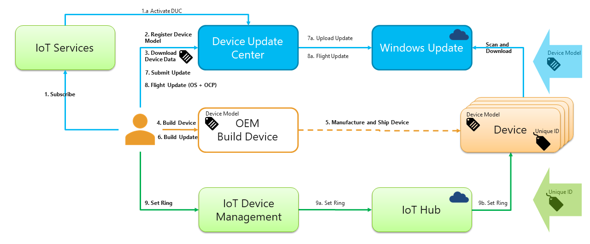

# OEM license requirements

## Commercialization Agreement
In order to start your commercialization journey, you will need to sign a license, which you will need to request the license agreement [here](https://forms.office.com/Pages/ResponsePage.aspx?id=v4j5cvGGr0GRqy180BHbR4oorCHCXCJHla0pHy8o5GpUMlVHVkNZNVVON1ZTVUQ0T0lHS1pDV0JFVy4u). A member of the team will get back to you with the agreement form within 48 to 72 hours. 

You can view a copy of this agreement before requesting to sign it [here](https://az835927.vo.msecnd.net/sites/iot/Resources/documents/Commercial-License.pdf).

Once you receive the agreement, you are required to sign it to meet the system requirements for the Windows 10 IoT Core device you are manufacturing and commercializing.

## SMBIOS Support

The system firmware must implement support for SMBIOS that complies with System Management BIOS Reference Specification, Version 2.4 or later. The SMBIOS implementation must follow all conventions and include all required structures and fields as indicated in the SMBIOS Specification, Section 3.2, and follow all conformance requirements as indicated in Section 4. Bit 2 in the BIOS Characteristics Extension Byte 2 field must be set (Section 3.3.1.2.2 of the specification). The length of the Type 1 (System Information) table must be at least 1Bh bytes (includes SKU Number and Family fields from Version 2.4 of the specification).

The following are the minimum required fields in SMBIOS for IoTCore 

* (Table 1, offset 04h) System Manufacturer
* (Table 1, offset 05h) System Product Name
* (Table 1, offset 19h) System SKU
* (Table 1, offset 1Ah) System Family
* (Table 2, offset 05h) Baseboard Product

These fields gain prominence as fields which will be used for identifying unique system configurations for telemetry and servicing. The *Manufacturer*, *Product Name*, *SKU Number* and *Family* fields must not be longer than 64 characters in length. Avoid leading or trailing spaces or other invisible characters.

> [!TIP]
> Design Notes: SKU Number has been moved to a required field in order to improve telemetry reporting. We encourage the OEM to be careful to fill in *Manufacturer* consistently and to fill in *SKU Number* with a value that can identify what the OEM considers a unique system configuration for telemetry and servicing.

See [SMBIOS Specification](https://docs.microsoft.com/en-us/windows-hardware/design/compatibility/whcp-specifications-policies) for more information.

> [!IMPORTANT]
> If you are re-using the BIOS/Firmware/UEFI, make sure make sure to update the entries.

## Compliance with minimum hardware requirements

Review the IoT Core sections of [minimum hardware requirements](https://msdn.microsoft.com/library/windows/hardware/dn915086(v=vs.85).aspx).

## Windows 10 IoT Core Services

Windows 10 IoT Core Services is a new cloud services subscription that provides the essential services needed to commercialize a device on Windows 10 IoT Core. Through this subscription, OEMs have access to 10 years of support on Windows 10 IoT Core Long Term Servicing Channel (LTSC) along with services to manage device updates and assess device health.

### What's included with Windows 10 IoT Core Services?

A subscription to Windows 10 IoT Core Services comes with three main benefits:

> | _Benefit_  |  _Description_  |
> |----------|---------|
> | [10 years of support](https://docs.microsoft.com/windows/deployment/update/waas-overview#long-term-servicing-channel) | Access to Windows 10 IoT Core LTSC with security and quality updates only (no new features). |
> | [Update control with Device Update Center](https://docs.microsoft.com/windows-hardware/service/iot/) | Create and manage device updates at scale using cloud-side controls. |
> | [Device Health Attestation (DHA)](https://github.com/ms-iot/iot-core-azure-dm-client/blob/master/docs/dha-architecture.md) | Rights to commercialize a device with DHA to affirm device health remotely. |

### 10 Years of Support

OEMs get 10 years of support on Windows 10 IoT Core via access to monthly updates from the [Windows Long-Term Servicing Channel (LTSC)](https://docs.microsoft.com/windows/deployment/update/waas-overview#long-term-servicing-channel). This includes security and quality updates for the operating system to keep device security up to date. Devices using the LTSC release won’t receive feature updates, enabling OEMs to focus updates on stability by minimizing changes to the base operating system. Microsoft typically offers new LTSC releases every 2-3 years, with each release supported over a 10-year lifecycle.

### Update Control with Device Update Center

[Update control](https://docs.microsoft.com/windows-hardware/service/iot/) with the newly announced Device Update Center (DUC) provides the ability to create, customize, and control device updates. These updates are distributed by the same Content Distribution Network (CDN) as Windows Update which is used daily by millions of Windows customers around the world. Updates can be applied to the operating system and device drivers as well as OEM-specific applications and files. Updates can be flighted to test devices prior to broader distribution.

Here's a diagram of the update flow in Device Update Center:

 
### Commercialize with Device Health Attestation

[Device Health Attestation (DHA)](https://github.com/ms-iot/iot-core-azure-dm-client/blob/master/docs/dha-architecture.md) enables enterprises and OEMs to raise the security bar of their organization's assets with hardware-attested security. Evaluating the trustworthiness of a device at boot time is essential for a trusted IoT system. However, a device cannot attest to its own trustworthiness - this must be done by an external entity such as the [DHA cloud service](https://docs.microsoft.com/windows-server/security/device-health-attestation). This service evaluates device health and can be combined with a device management system, such as Azure IoT Device Management. Based on DHA report data, the device management system can take corrective actions such as re-imaging the device, denying network access, or creating a service ticket.
 
### Getting Started

Windows 10 IoT Core Services is currently in limited preview with select partners. To join the preview program, please email [iotservices@microsoft.com](mailto:iotservices@microsoft.com). A broader preview will be ready in July 2018 with general availability later this year.

Earlier in the year, [we announced](https://blogs.windows.com/business/2018/02/27/microsoft-doubles-down-on-windows-10-iot-with-added-support/) that with the next release of Windows 10 IoT, we will provide 10 years of support for both Windows 10 IoT Core and Windows 10 IoT Enterprise. We also announced a partnership with NXP to support Windows 10 IoT Core on their i.MX 6 and i.MX 7 processors. The Windows 10 IoT Core Services offering builds on these announcements, as we continue to evolve the Windows IoT platform and make investments to support the IoT devices of today and tomorrow.

