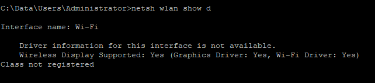
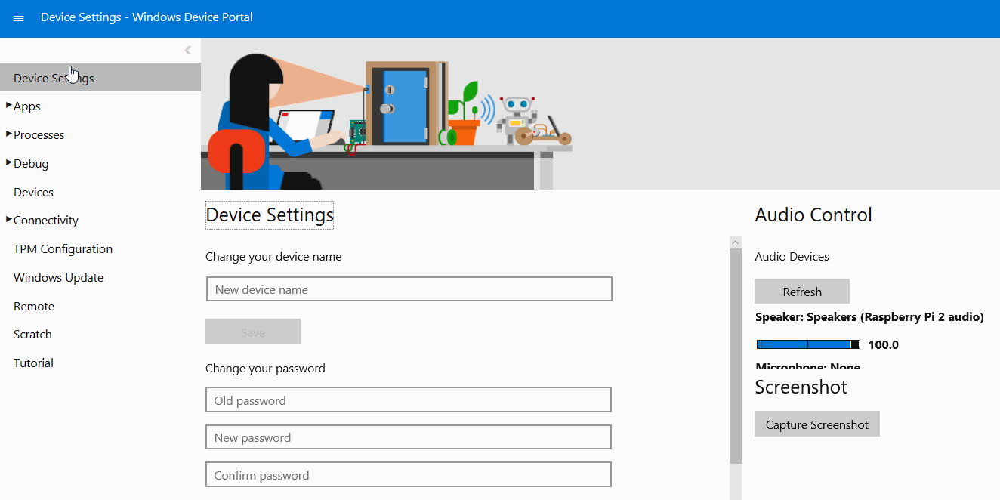

# Miracast on IoT Core

This document will show you how to include Miracast functionality on your IoT Core device.

## Miracast Overview

A Miracast connection is made up of two components: the Source and the Sink. The **Miracast Source** sends content to the **Miracast Sink**, which displays the content. To create the connection, the Sink advertises itself to the connected Wi-Fi network. The Source uses the **Device Picker** to select the Sink and request a connection. Once the connection is requested, a user at the Sink receives an alert that the source is attempting to make a connection and must verify that the connection should take place. Once this happens, the Source begins casting to the Sink until either the Source cancels the connection or the Sink stops advertising.

## Hardware requirements

Both Source and Sink devices require Miracast-compatible Wi-Fi and Graphics drivers and chipsets to function properly. To find out if your device has Miracast-compatible hardware, run 
```
netsh wlan show driver
```
in the device's command prompt.

If the device supports Miracast, you should see the output below:



The below table shows Miracast compatability for the IoT Core reference platforms:

| Board | SoC | WiFi Drivers Present | Graphics Drivers Present | Miracast-Compatible |
|-------|-----|----------------------|--------------------------|---------------------|
| Qualcomm Dragonboard 410c | Snapdragon 410 | Yes | Yes | Yes |
| Raspberry Pi 2/3 | Broadcom BCM283x | Yes | No | No |
| Minnowboard Max | Intel Atom E3825 | Yes | No | No |
| UP Squared | Intel Celeron N3350 | Yes | Yes | Yes |


### Wi-Fi

The Wi-Fi driver and chipset for the device must support Wi-Fi Direct, among other capabilities, to support Miracast. If your device does not have these features, you can use a USB Wi-Fi dongle instead. We recommend the [300M Wireless USB Adapter](http://a.co/fdhEhV9).

### Graphics

The Graphics driver and chipset must support h.264 encoding and decoding to support Miracast. If your device does not have a compatible graphics driver and/or chipset, you will have to pick a new device. Please consult the above matrix when choosing a Miracast-compatible device.

## Windows IoT as a Miracast Sink
## Windows IoT as a Miracast Source

> [!IMPORTANT]
> Before trying to use your device as a Miracast Source, please turn off the IoTOnboardingTask app from the [Windows Device Portal](https://docs.microsoft.com/en-us/windows/iot-core/manage-your-device/deviceportal) as shown below, which you'll only need to do once:
> 

