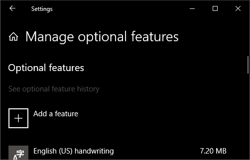
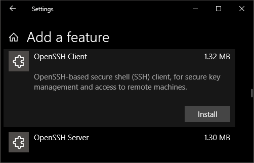

# Secure Shell (SSH)
Secure Shell (SSH) allows you to remotely administer and configure your Windows IoT Core device

## Using the Windows 10 OpenSSH client
> [!IMPORTANT]
> The Windows OpenSSH client requires that your SSH client host OS is Windows 10 version 1803(17134). Also, the Windows 10 IoT Core device must be running RS5 Windows Insider Preview release 17723 or greater.

The **OpenSSH Client** was added to Windows 10 in 1803 (build 17134) as an optional feature. To install the client you will can search for **Manage Optional Features** in Windows 10 settings. If the **OpenSSH Client** is not listed in the list of installed features then choose **Add a feature**.

    

Next select **OpenSSH Client** in the list and click **Install**.

    

To login with a username and password use the following command:

```cmd
ssh administrator@host
```

Where host is either the IP address of the Windows IoT Core device or the device name.

The first time you connect you see a message like the following:

```cmd
The authenticity of host 'hostname (192.168.0.12)' can't be established.
ECDSA key fingerprint is SHA256:RahZpBFpecRiPmw8NGSa+7VKs8mgqQi/j2i1Qr9lUNU.
Are you sure you want to continue connecting (yes/no)?
```

Type **yes** and press **enter**.

If you need to log in as **DefaultAccount** rather than as administrator you will need to generate a key and use the key to log in.  From the desktop that you intend to connect to your IoT Device from, open a powershell window and change to your personal data folder (e.g cd ~)

```cmd
cd ~
ssh-keygen -t rsa -f id_rsa
```

Register the key with ssh-agent (optional, for single sign-on experience).  Note that ssh-add must be performed from a folder that is  ACL'd to you as the signed-in user (Builtin\Administrators and the NT_AUTHORITY\System user are also ok).  By default cd ~ from powershell should be sufficient as shown below.

```cmd
cd ~
net start ssh-agent
ssh-add id_rsa
```

> [!TIP]
> If you receive a message that the ssh-agent service is disabled you can enable it with **sc.exe config ssh-agent start=auto**

To enable single sign append the public key to the Windows IoT Core device **authorized_keys** file.  Or if you only have one key you copy the public key file to the remote **authorized_keys** file.

```cmd
net use X: \\host\c$ /user:host\administrator
if not exist x:\data\users\defaultaccount\.ssh md x:\data\users\defaultaccount\.ssh
copy .\id_rsa.pub x:\data\users\defaultaccount\.ssh\authorized_keys
```

If the key is not registered with ssh-agent it must be specified on the command line to login: 

```cmd
ssh -i .\id_rsa DefaultAccount@host
```

If the private key is registered with ssh-agent then you only need to specify <strong>DefaultAccount@host</strong>:

```cmd
ssh DefaultAccount@host
```

The first time you connect you see a message like the following:

```cmd
The authenticity of host 'hostname (192.168.0.12)' can't be established.
ECDSA key fingerprint is SHA256:RahZpBFpecRiPmw8NGSa+7VKs8mgqQi/j2i1Qr9lUNU.
Are you sure you want to continue connecting (yes/no)?
```

Type **yes** and press **enter**.

You should now be connected as **DefaultAccount**

To use single sign-on with the **administrator** account, append your public key to c:\data\ProgramData\ssh\administrators_authorized_keys on the Windows IoT Core device. 

```cmd
net use X: \\host\c$ /user:host\administrator
copy .\id_rsa.pub x:\data\ProgramData\ssh\administrators_authorized_keys
icacls x:\data\ProgramData\ssh\administrators_authorized_keys /remove "NT AUTHORITY\Authenticated Users"
icaclsx:\data\ProgramData\ssh\administrators_authorized_keys /inheritance:r
```

You will also need to set the ACL for administrators_authorized_keys to match the ACL of ssh_host_dsa_key in the same directory.

```cmd
icacls x:\data\ProgramData\ssh\administrators_authorized_keys /remove "NT AUTHORITY\Authenticated Users"
icacls x:\data\ProgramData\ssh\administrators_authorized_keys /inheritance:r
```

To set the ACL using powershell

```cmd
get-acl x:\data\ProgramData\ssh\ssh_host_dsa_key | set-acl x:\data\ProgramData\ssh\administrators_authorized_keys
```

> [!NOTE]
> If you see a **REMOTE HOST IDENTIFICATION CHANGED** message after making changes to the Windows 10 IoT Core device, then edit C:\Users\<username>\.ssh\known_hosts and remove the host that has changed.

See also: [Win32-OpenSSH](https://github.com/PowerShell/Win32-OpenSSH/wiki/ssh.exe-examples)

## Using PuTTY

### Download a SSH client
In order to connect to your device using SSH, you'll first need to download a SSH client, such as [PuTTY](http://the.earth.li/~sgtatham/putty/latest/x86/putty.exe).

### Connect to your device
* In order to connect to your device, you need to first get the IP address of the device.  After booting your Windows IoT Core device, an IP address will be shown on the screen attached to the device:

    

* Now launch PuTTY and enter the IP address in the `Host Name` text box and make sure the `SSH` radio button is selected.  Then click `Open`.

    

* If you're connecting to your device for the first time from your computer, you may see the following security alert.  Just click `Yes` to continue.

    

* If the connection was successful, you should see `login as:` on the screen, prompting you to login.  
    Enter `Administrator` and press enter.  Then enter the default password `p@ssw0rd` as the password and press enter.

    

    If you were able to login successfully, you should see something like this:

    

### Update account password

It is **highly recommended** that you update the default password for the Administrator account.

To do this, enter the following command in the PuTTY console, replacing `[new password]` with a strong password:
    
    net user Administrator [new password]
    
### Configure your Windows IoT Core device
* To be able to deploy applications from Visual Studio 2017, you will need to make sure the Visual Studio Remote Debugger is running on your Windows IoT Core device. The remote debugger should launch automatically at machine boot time. To double check, use the tlist command to list all the running processes from powershell. There should be two instances of msvsmon.exe running on the device.

* It is possible for the Visual Studio Remote Debugger to time out after long periods of inactivity. If Visual Studio cannot connect to your Windows IoT Core device, try rebooting the device.

* If you want, you can also rename your device. To change the 'computer name', use the `setcomputername` utility:

        setcomputername <new-name>

    You will need to reboot the device for the change to take effect. You can use the `shutdown` command as follows:

        shutdown /r /t 0
        
### Commonly used utilities

See the [Command Line Utils](../manage-your-device/CommandLineUtils.md) page for a list of commands and utilities you can use with SSH.
