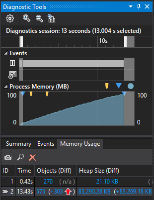
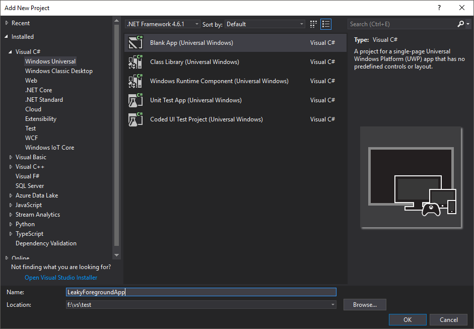
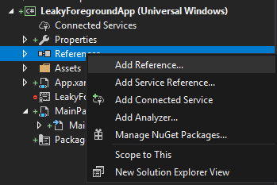
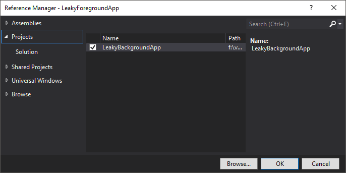
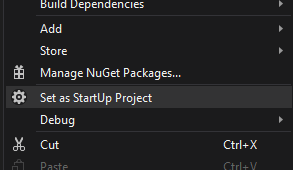

# Investigating Memory Leaks

The best tool for investigating memory leaks on Windows IoT Core with Visual Studio is the integrated [Diagnostic Tools](https://docs.microsoft.com/en-us/visualstudio/profiling/memory-usage)



For foreground applications you can [follow the documentation](https://docs.microsoft.com/en-us/visualstudio/profiling/memory-usage).

However, these tools don't work directly with a Windows IoT Core **Background Application**. One way to profile code used in a background application is to wrap it in a foreground app for analysis:

1. Add a **Blank App** to the **Background App** solution
2. Right-click the **Blank App** references and add a reference to the **Background App**
3. Change the **Background App** Run() method to check if the taskInstance parameter is null and handle those cases differently.
4. From the **BlankApp** call BackgroundApp::Run(null)
5. Set a breakpoint on the call to BackgroundApp::Run
6. When the breakpoint is hit find the **Diagnostic Tools** windows and click the  button.

8. Reproduce the problem
9. Take another snapshot
10. Use the **Diagnostic Tools** window to diagnose the leak.

## Create a test app

Let's start with an application that allocates memory and doesn't free it to simulate a leak.
Begin by creating a new C# Background application: [Developing Background Applications](./BackgroundApplications.md)

Replace the code in StartupTask.cs with this
```C#
using System;
using System.Collections.Generic;
using System.Diagnostics;
using System.Threading;
using Windows.ApplicationModel.Background;
using Windows.System;

namespace LeakyBackgroundApp
{
    public sealed class StartupTask : IBackgroundTask
    {
        private Timer timer;
        private BackgroundTaskDeferral deferral;
        List<byte[]> buffer = new List<byte[]>();
        private const ulong minRemaining = 300 * 1024 * 1024;

        public void Run(IBackgroundTaskInstance taskInstance)
        {
            deferral = taskInstance.GetDeferral();
            timer = new Timer(Timer_Tick, null, 500, 500);
        }

        private void Timer_Tick(object state)
        {
            ulong remaining = (MemoryManager.AppMemoryUsageLimit - MemoryManager.AppMemoryUsage);
            ulong chunkSize = remaining / 100;

            try
            {
                if (remaining > minRemaining)
                {
                    var chunk = new byte[chunkSize];

                    // force virtual memory to be commited by writing to it
                    for (int i = 0; i < chunk.Length; i += 4096)
                    {
                        chunk[i] = 0xDA;
                    }

                    // "leak" memory by adding it to the list
                    buffer.Add(chunk);
                    Debug.WriteLine(String.Format("Allocated {0} chunk(s)", buffer.Count));
                }
                else
                {
                    timer.Change(Timeout.Infinite, Timeout.Infinite);
                }
            }
            catch (OutOfMemoryException ex)
            {
                Debug.Write(ex.Message);
                timer.Change(Timeout.Infinite, Timeout.Infinite);
            }
        }
    }
}
```

At this point if you run the background application on your IoT device it should use up a lot of memory and never free it. If you try to use the diagnostic tools at this point you will see something that looks like this, because using the tools with background apps is currently unsupported.


To work around this we are going to add a foreground app to the solution. In the **Solution Explorer** right-click on the solution folder and then select **Add.New Project**.


Choose **Visual C#>Windows Universal>Blank App** as the project type, name your project and click **OK**.



Right-click on the new foreground app project's **References** node and select **Add Reference...**



In the **Reference Manager** dialog choose **Projects** in the left-hand pane.  In the center pane add a check in the checkbox next to your background application project and click **OK**.



Next right-click the foreground app project and click **Set as StartUp Project**.



Add code to create an instance of your background application object and call Run passing in null as the only parameter.
```C#
public MainPage()
{
    this.InitializeComponent();
    LeakyBackgroundApp.StartupTask task = new LeakyBackgroundApp.StartupTask();
    task.Run(null);
}
```

Then in your background app's Run method check to make sure taskInstance is not null before using it.

```C#
public void Run(IBackgroundTaskInstance taskInstance)
{
    if (taskInstance != null)
    {
        deferral = taskInstance.GetDeferral();
    }

    timer = new Timer(Timer_Tick, null, 500, 500);
}
```

1. Set a breakpoint on the call to task.Run(null).
2. Set another breakpoint on timer.Change(Timeout.Infinite, Timeout.Infinite) in Timer_Tick in StartupTask.cs.
3. Press F5 to begin debugging
4. When you hit the first breakpoint press the snapshot button to set the baseline to compare against


5. Press F5
6. When you hit the second breakpoint press the snapshot button again to capture the current state.

Now the diagnostic tools should show a graph with increasing memory use and 2 snapshot like this:


Look at row 2 in the Heap Size column. Click the second number with the plus sign and up arrow. You should see something like this:


Sort by size diff so that the largest number is at the top, then click the top row. Above the second detail table click **Referenced Types**.  The second table should now show **List\<Byte[]\>** as the source of all the memory usage.


