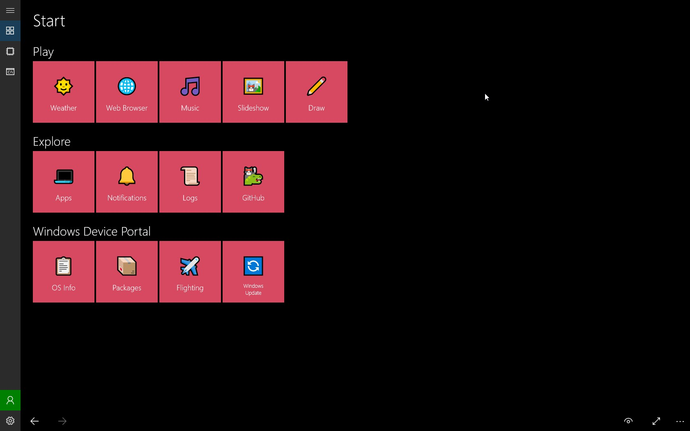
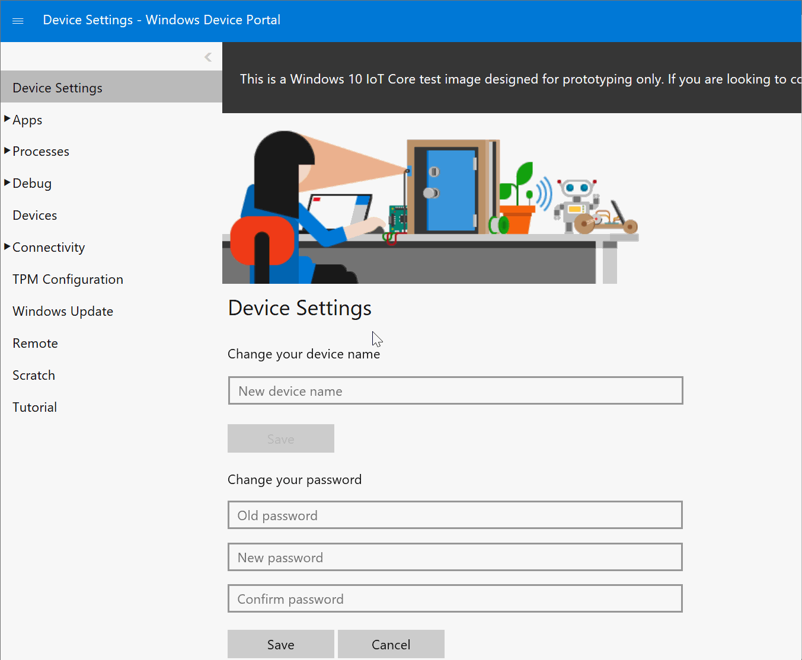
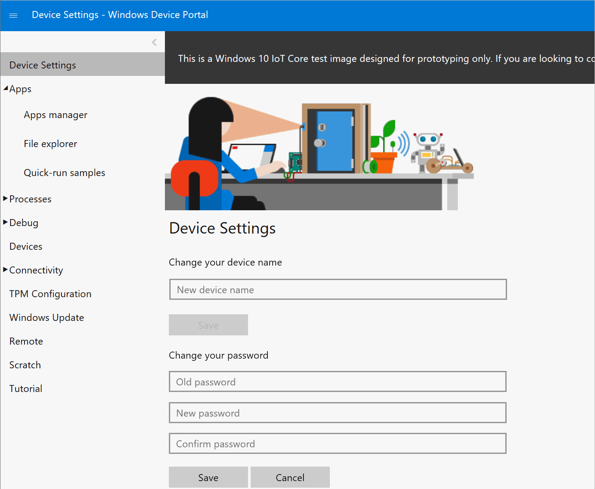
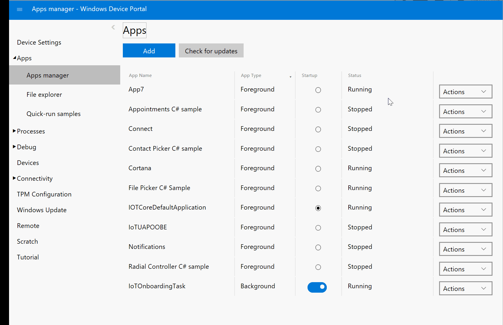

# Windows 10 IoT Core Default App Overview

When you initially flash Windows 10 IoT Core, you will be presented with the Windows 10 IoT Core Default App upon startup, which looks like this:

The purpose of this application is not only to provide you with a friendly shell to interact with when you first boot up Windows 10 IoT Core, but we have open-sourced the code for this application [here](http://github.com/Microsoft/Windows-iotcore-samples/tree/develop/Samples/IoTCoreDefaultApp/CS) so that you can plug and play with these features on your own custom application(s).

This article will give you a rundown of the different features that the Windows 10 IoT Core Default App offers.

## Start Menu - Play

The Start Menu is where most plug and play features live.

### Weather
Using data from forecast.weather.gov, the weather app renders weather information in your current location.

### Web Browser
The web browser allows you to pull up most sites from the web.

### Music
The music player will play any mp3 /*what other files?*/ files from your file explorer in the [Windows Device Portal](../manage-your-device/DevicePortal.md).  To upload files to the music player, you will need to navigate to the Windows Device Portal, click on the "Apps" dropdown, navigate to "File Explorer", select "Music" and upload your files from there.

### Slideshow
The slideshow feature will play any image files (i.e. png, jpg /*any other files I may have missed?*/) from your file explorer in the [Windows Device Portal](../manage-your-device/DevicePortal.md). To upload images to the slideshow, you will need to navigate to the Windows Device Portal, click on the "Apps" dropdown, navigate to "File Explorer", select "Pictures" and upload your files from there.

### Draw
The draw feature allows you to test out Windows 10 IoT Core's inking capabilities.

## Start Menu - Explore 

### Apps 
The apps section showcases a number of different apps that you can launch from Windows 10 IoT Core Default. In order to close out of the app, you will need to navigate to the [Windows Device Portal](../manage-your-device/DevicePortal.md) and restart the Windows 10 IoT Core Default.

/*I will need help here - I am getting blank screens for both Notifications and Logs so I'm not exactly sure what they do here.*/

/*We will also need to add documentation here as to how to leverage app launch feature*/

The GitHub tile will take you to where our open-source code for the Windows 10 IoT Core Default App is.

## Start Menu - Windows Device Portal

All of these features may be accessed when you fill in your Windows Device Portal credentials.

## Device Information

This section allows you to see the different features for your device including Ethernet, OS version, connected devices, and more.

## Command Line

The command line features allows you to send command lines directly to your device.

/*I think this section might need more substance - help?*/

## Settings
You'll be able to configure a number of settings here including wi-fi, bluetooth, power options, and more. 

/*Will need to add documentation for telemetry, including how to turn these things off*/
