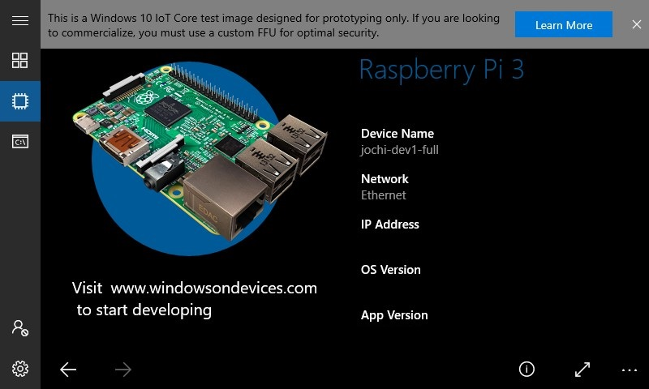

# Windows 10 IoT Core Default App Overview

When you initially flash Windows 10 IoT Core, you will be presented with the Windows 10 IoT Core Default App upon startup, which looks like this:

The purpose of this application is not only to provide you with a friendly shell to interact with when you first boot up Windows 10 IoT Core, but we have open-sourced the code for this application [here](http://github.com/Microsoft/Windows-iotcore-samples/tree/develop/Samples/IoTCoreDefaultApp/CS) so that you can plug and play with these features on your own custom application(s).

This article will give you a rundown of the different features that the Windows 10 IoT Core Default App offers as well as how you can leverage these different features for your own applications.

## Leveraging the IoT Core Default App 

The IoT Core Default App can be customized and extended, or you can use the source code as an example for your own app.

## Start Menu - Play

The Start Menu is where most plug and play features live.

### Weather
Using data from the National Weather Service, the weather app renders weather information in your current location.

### Web Browser
The web browser allows you to pull up most sites from the web.

### Music
The music player will play MP3 and WAV files from the **Music Library**, that can be accessed via the [Windows Device Portal](../manage-your-device/DevicePortal.md).  To upload files to the music player, you will need to navigate to the Windows Device Portal, click on the "Apps" dropdown, navigate to "File Explorer", select "Music" and upload your files from there.

### Slideshow
The slideshow feature will display any PNG or JPEG image files from the **Pictures Library**, that can be accessed via the [Windows Device Portal](../manage-your-device/DevicePortal.md). To upload images to the slideshow, you will need to navigate to the Windows Device Portal, click on the "Apps" dropdown, navigate to "File Explorer", select "Pictures" and upload your files from there.

### Draw
The draw feature allows you to test out Windows 10 IoT Core's inking capabilities.

## Start Menu - Explore 

### Apps 
The apps section showcases a number of different apps that you can launch from Windows 10 IoT Core Default. In order to close out of the app, you will need to navigate to the [Windows Device Portal](../manage-your-device/DevicePortal.md) and restart the Windows 10 IoT Core Default.

The GitHub tile will take you to where our open-source code for the Windows 10 IoT Core Default App is.

## Start Menu - Windows Device Portal

The pages in this section leverage the Windows Device Portal REST APIs, which requires you to sign in using your Windows Device Portal credentials.

## Device Information

This section allows you to see the different features for your device including Ethernet, OS version, connected devices, and more.

## Command Line

The command line features allows you to run commands directly on your device.

To enable this feature you have to set a registry key so that the app can run the commands. The first time you try to run a command you will see a link that allows you to set the registry key using a call to Windows Device Portal. Click the link to enable your device to run commands.

Some commands require administrator access. For security purposes the app uses a non-admin account by default to run commands. If you need to run a command as an admin you can type "RunAsAdmin <your command>" in the command line prompt.

## Settings
You'll be able to configure a number of settings here including Wi-Fi, Bluetooth, power options, and more.

#### App Settings
The **App Settings** section allows you to configure various settings for pages in the app.  

Some of the settings you can customize are:

##### General Settings
* Set the default page that appears when the app is started
* Enable/disable the screensaver

##### Weather Settings
* Change the location
  > This feature is only enabled if you have provided a valid [Bing Map Service Token](https://msdn.microsoft.com/en-us/library/ff428642.aspx).  To pass the token to the app, create a **MapToken.config** file in the LocalState folder of the app (e.g. C:\Data\USERS\\[User Account]\AppData\Packages\\[Package Full Name]\LocalState\MapToken.config) and restart the app.
* Expand the map
* Enable/disable map flipping so that the map and the weather switch places periodically to prevent screen burn-in

##### Web Browser Settings
* Set the home page for the Web Browser

##### Slideshow Settings
* Set the slideshow interval

##### Appearance
* Use MDL2 Assets instead of Emojis for the tile icons
* Set the tile width and height
* Set UI scaling - Automatic scaling is set by default
* Set the tile color

#### System
Change the language, keyboard layout, and time zone.

#### Network & Wi-Fi
View network adapter properties or connect to an available Wi-Fi network.

#### Bluetooth
Pair with a Bluetooth device.

#### App Updates
Check for app updates or change automatic update settings.

#### Power Options
Restart or shutdown the device.

#### Diagnostics
Select the amount of diagnostic data you wish to provide Microsoft.  We encourage users to opt into **Full** diagnostic data so we can diagnose issues quickly and make improvements to the product.

##### Basic 
Send only info about your device, its settings and capabilities, and whether it is performing properly.

##### Full
Send all Basic diagnostic data, along with info about websites you browse and how you use apps and features, plus additional info about device health, device activity, and enhanced error reporting.

#### Location
Allow or deny the app access to your location.
