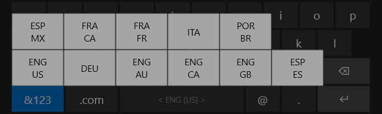
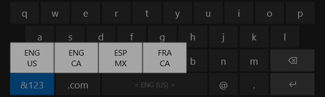

# On-Screen Keyboard Language Layouts

The RS2 and RS3 on-screen keyboard (OSK) supports layouts for the following languages:

| Language Tag  | Description             | Layout Code |
| :------------ | :---------------------- | -----------:|
| en-US         | English (United States) |    00000409 |
| en-AU         | English (Australia)     |    00000C09 |
| en-CA         | English (Canada)        |    00001009 |
| en-GB         | English (Great Britain) |    00000809 |
| es-ES         | Spanish (Spain)         |    0000040A |
| es-MX         | Spanish (Mexico)        |    0000080A |
| de-DE         | German                  |    00000407 |
| fr-CA         | French (Canada)         |    00000C0C |
| fr-FR         | French (France)         |    0000040C |
| it-IT         | Italian                 |    00000410 |
| pt-BR         | Portuguese (Brazil)     |    00000416 |

By pressing and holding the OSK's "&123" button, the user can select which layout they want to use:


 
As an OEM, however, you can limit which layout choices are displayed to the user. To limit which layouts to show the user, first reference the guidance from the [Keyboard Layout doucmentation on TechNet](https://technet.microsoft.com/en-us/library/cc978687.aspx).
 
For a concrete example, if you want to only allow North America language layouts (en-US, en-CA, es-MX, fr-CA), you could add the following to your OEMCustomization.cmd script:

```` batch
call "%~dp0\setKeyboardLanguages.cmd"
````

Where setKeyboardLanguages.cmd is a script in the same directory containing this:
 
```` batch
@echo off

set getDefaultAccountSID="wmic.exe useraccount where name='DefaultAccount' get sid"

for /F "tokens=2 usebackq delims== " %%s in (`%getDefaultAccountSID%`) do (
    set registryKey="HKEY_USERS\%%~s\Keyboard Layout\Preload"
    goto :setRegistry
  )
)
echo Unable to determine SID for DefaultAccount
goto :eof

:setRegistry
  echo on
  REG ADD %registryKey% /v "1" /d "00000409" /f
  REG ADD %registryKey% /v "2" /d "00001009" /f
  REG ADD %registryKey% /v "3" /d "0000080A" /f
  REG ADD %registryKey% /v "4" /d "00000C0C" /f
  @echo off
goto :eof
````

The resulting effect of the above command script will be:



### Some things to note:
*  The value names indicate a decimal sequence.
*  The values are string values (REG_SZ).
*  The script text above, of course, could be added directly into the OEMCustomization.cmd script.
*  **Do not** delete the "Preload" registry key since it has permissions set on it specifically to allow the on-screen keyboard application to read its values.
*  A prerequisite for these instructions to be applicable, is that your image must include the following features*:
   * IOT_SHELL_ONSCREEN_KEYBOARD
   * IOT_SHELL_ONSCREEN_KEYBOARD_FOLLOWFOCUS

For more information about IoT Features, see [IoT Core Feature List](https://docs.microsoft.com/en-us/windows-hardware/manufacture/iot/iot-core-feature-list).
