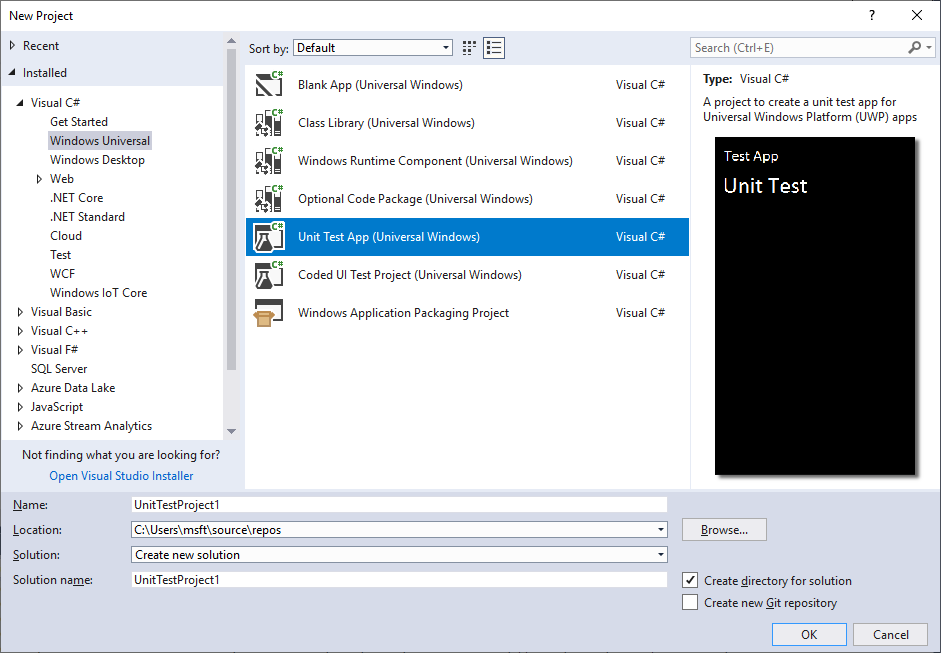
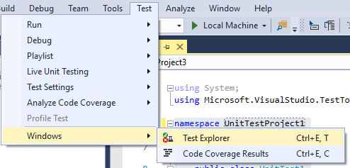
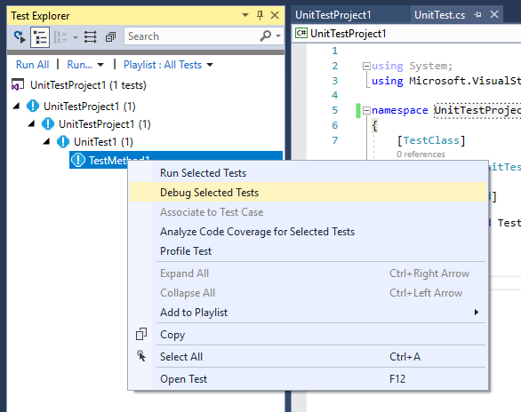
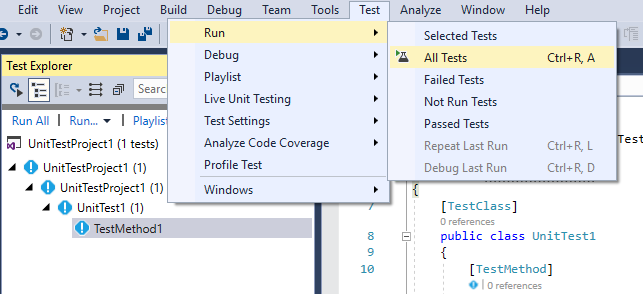
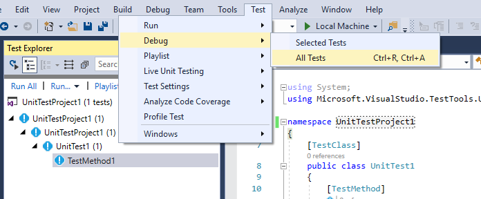

# Developing unit tests
Learn about UWP unit testing supported on Windows 10 IoT Core.

## UWP Unit Tests
___

Unit tests provide vital protection and validation for app developers.  Visual Studio 15.6 added support for Windows 10 IoT Core in its new test platform.  With this new support, it is possible to create unit tests for UWP functionality that can execute as part of a Continuous Integration build or directly from Visual Studio.


### Create new unit test project
___

1. Open Visual Studio

2. Create a new unit test project
   

3. Update UnitTest.cs to include your test code
   ```C#
   namespace UnitTestProject1
   {
    [TestClass]
    public class UnitTest1
    {
        [TestMethod]
        public void TestMethod1()
        {
		    // test code here
        }
    }
   }
   ```


### Remotely run unit test on Windows 10 IoT Core device
___

1. Open the Visual Studio Test Explorer (Test > Windows > Test Explorer).
 

1. For test deployment to work, your project must be configured in the same way UWP apps are configured (specifically using Universal Authentication and Remote Machine).  See [Deploy an App with Visual Studio](../develop-your-app/appdeployment.md) for specifics.

1. To remotely run a unit test, you can use the Test Explorer and right-click the desired TestMethod and selecting Run/Debug Selected Tests
 

1. To remotely run or debug all unit tests, you can use Test > Run or Test > Debug
 
 
   

### Configure unit tests as part of a Continuous Integration build
___

The Visual Studio team has created a great blog post showing how to incorporate Windows 10 IoT Core unit tests into a VSTS build: [DevOps for IoT with Win10 IoT Core, UWP, and VSTS](https://blogs.msdn.microsoft.com/devops/2018/03/07/devops-for-iot-with-win10-iot-core-uwp-and-vsts/)

