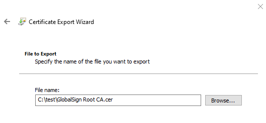

# Python
Python is a scripting language that is popular for system automation and machine learning (ML).
You can learn more about Python at [python.org](https://www.python.org/).

## Using Python on x64 or x86
To install Python on Windows IoT Core:
1. Download the Python NuGet package, and then install the files using [PowerShell](../connect-your-device/powershell.md).

    ```powershell
    $python_zip = "https://globalcdn.nuget.org/packages/python.3.7.4.nupkg"
    if($env:PROCESSOR_ARCHITECTURE -ieq "x86") {
        $python_zip = "https://www.nuget.org/api/v2/package/pythonx86/3.7.4"
    }
    Invoke-WebRequest $python_zip -OutFile c:\data\python.zip
    Expand-Archive C:\data\python.zip -DestinationPath c:\python_temp
    move C:\python_temp\tools c:\python
    rd C:\python_temp -Recurse -Force
    del C:\data\python.zip
    ```

2. Add Python to the system path.

    ```powershell
    cmd /c 'setx PATH "%PATH%";c:\python;c:\python\scripts /M'
    $env:Path += ";c:\python;c:\python\scripts"
    ```

3. Ensure that the current version of pip is installed

    ```powershell
    python -m pip install --upgrade pip
    ```

## Using Python on Windows IoT Core ARM32

To get Python for Windows, you will need to build the binaries yourself.

1. Build Python for ARM32.  The branch must be 3.8 or greater.

    ```cmd
    git clone https://github.com/python/cpython
    cd cpython
    git checkout 3.8
    pcbuild\build.bat -p ARM --no-tkinter
    ```

2. Build Python .zip file for Windows IoT Core ARM32.  The same version of Python must be used to run PC/layout. This step builds Python for x86 and uses it to build the .zip file(s).  If you want the standard library tests in your .zip file add the `--include-tests` parameter.

    ```cmd
    REM Build Python for x86 to use for building the .zip file.
    pcbuild\build.bat
    pcbuild\win32\python.exe PC/layout -vv -s "." -b ".\PCBuild\arm32" -t ".\PCBuild\temp" --preset-iot --include-venv --zip ".\PCBuild\arm32\zip\python.zip"

    net use P: \\[ip address]\c$ /user:administrator

    copy .\PCBuild\arm32\zip\python.zip P:\data
    ```

3. Use [PowerShell](../connect-your-device/PowerShell.md) to extract the .zip file on the device and add Python to the system path.

    ```powershell
    Expand-Archive C:\data\python.zip -DestinationPath c:\python
    cmd /c 'setx PATH "%PATH%";c:\python;c:\python\scripts /M'
    $env:Path += ";c:\python;c:\python\scripts"
    ```

4. Verify that `print('Hello World')` works.

    ```powershell
    python -c "print('Hello World!');quit()"
    ```

## Using Python on Windows IoT Core ARM64

To get Python for Windows, you will need to build the binaries yourself.

1. Clone Python for ARM32 and run `get_externals`.  The branch must be 3.8 or greater.

    ```cmd
    git clone https://github.com/python/cpython
    cd cpython
    git checkout 3.8
    pcbuild\get_externals.bat
    cd ..
    ```

2. Clone and build libffi.

    ```cmd
    git clone https://github.com/libffi/libffi
    set LIBFFI_SOURCE=%CD%\libffi

    REM Visual Studio 2015 or greater with ARM64 tools installed is required to build Python
    REM the location of VCVARSALL may differ on your machine
    set VCVARSALL="C:\Program Files (x86)\Microsoft Visual Studio\2019\Enterprise\VC\Auxiliary\Build\vcvarsall.bat"

    cd cpython
    if exist c:\cygwin\bin\sh.exe (
        call pcbuild\prepare_libffi.bat -arm64
    ) else (
        call pcbuild\prepare_libffi.bat -arm64 --install-cygwin
    )
    if not exist externals\libffi\arm64\libffi-7.dll echo ERROR: libffi not built! & exit /b 1
    ```

3. Build Python for ARM64.

    ```cmd
    pcbuild\build.bat -p ARM64 --no-tkinter
    ```

4. Build Python .zip file for Windows IoT Core ARM64.  The same version of Python must be used to run PC/layout. This step builds Python for x86 and uses it to build the .zip file(s).  If you want the standard library tests in your .zip file add the `--include-tests` parameter.

    ```cmd
    REM Build Python for x86 to use for building the .zip file.
    pcbuild\build.bat

    REM Map drive to device and copy files using PC/layout
    net use P: \\[ip address]\c$ /user:administrator
    pcbuild\win32\python.exe PC/layout -vv -s "." -b ".\PCBuild\arm64" -t ".\PCBuild\temp" --preset-iot --include-venv --copy P:\python
    ```

3. Add Python to the system path.

    ```cmd
    setx PATH "%PATH%";c:\python;c:\python\scripts /M
    set PATH=%PATH%;c:\python;c:\python\scripts
    ```

4. Verify that `print('Hello World')` works.

    ```cmd
    python -c "print('Hello World!');quit()"
    ```

## Try out [Azure IoT Hub Python SDKs v2 - PREVIEW](https://github.com/Azure/azure-iot-sdk-python-preview)

1. First install the SDK.

    ```cmd
    python -m pip install azure-iot-device
    ```

In the output for the `pip install` there may be errors: `Download error on https://pypi.org/simple/pbr/`. If you see this then, otherwise skip to `Set up an IoT Hub and create a Device Identity`:

2. Navigate to `https://pypi.org/simple/pbr/` in your favorite browser. Inspect the web site's certificate and noticed that it issued by `DigiCert`.

3. Create a directory named `c:\test`.

4. Run `certmgr.msc` from a command prompt on a desktop Windows machine.  

5. Navigate to `Trusted Root Certification Authorities` in the treeview.  Expand the node and choose `Certificates`.

6. In the right pane find the `DigiCert High Assurance EV Root`, right-click and select `All Tasks` > `Export`.  Note that there are multiple `DigiCert` certs and I identified this one by trying each one, one at a time.

7. In the dialog that pops up click `Next`.

8. Select `DER encoded binary X.509 (.CER)` (this should be the default) and click `Next`.

9. In the `File name:` edit box type `c:\test\DigiCert High Assurance EV Root.cer`



10. Click `Next`.

11. Click `Finish`.

12. Copy `c:\test\DigiCert High Assurance EV Root.cer` to the device by running the following command on your desktop machine:

    ```cmd
    net use X: \\host\c$ /user:host\administrator
    md X:\test
    copy "c:\test\GlobalSign Root CA.cer" X:\test
    ```

13. On the device, import the certificate into the root store using [PowerShell](../connect-your-device/PowerShell.md).

    ```cmd
    certmgr -add "c:\test\DigiCert High Assurance EV Root.cer" -s root -r localMachine -c
    certmgr -add "c:\test\GlobalSign Root CA.cer" -s root -r localMachine -c
    ```

14. Try to install the `azure-iot-device` again

    ``` cmd
    python -m pip install azure-iot-device --no-color
    ```

15.  In the output for the `pip install` there may be errors: `Download error for https://files.pythonhosted.org/`.  If you don't see this, then skip to `Set up an IoT Hub and create a Device Identity`

16. Navigate to `https://files.pythonhosted.org/` in your favorite browser. Inspect the web site's certificate and noticed that it issued by `GlobalSign`.

17. Repeat the steps to export the `GlobalSign Root CA` certificate from your desktop machine and import it on the device.

18. Try to install the `azure-iot-device` again.

### Set up an IoT Hub and create a Device Identity

19. Install the [Azure CLI](/cli/azure/install-azure-cli?preserve-view=true&view=azure-cli-latest) (or use the [Azure Cloud Shell](https://shell.azure.com/)) and use it to [create an Azure IoT Hub](/cli/azure/iot/hub?preserve-view=true&view=azure-cli-latest#az-iot-hub-create).

    ```powershell
    az iot hub create --resource-group <your resource group> --name <your IoT Hub name>
    ```
    * Note that this operation may take a few minutes.

20. Add the IoT Extension to the Azure CLI, and then [register a device identity](/cli/azure/iot/hub/device-identity)

    ```powershell
    az extension add --name azure-cli-iot-ext
    az iot hub device-identity create --hub-name <your IoT Hub name> --device-id <your device id>
    ```

21. [Retrieve your Device Connection String](/cli/azure/iot/hub/device-identity) using the Azure CLI

    ```powershell
    az iot hub device-identity show-connection-string --device-id <your device id> --hub-name <your IoT Hub name>
    ```

    It should be in the format:
    ```
    HostName=<your IoT Hub name>.azure-devices.net;DeviceId=<your device id>;SharedAccessKey=<some value>
    ```

### Send a simple telemetry message

22. [Begin monitoring for telemetry](/cli/azure/iot/hub) on your IoT Hub using the Azure CLI

    ```powershell
    az iot hub monitor-events --hub-name <your IoT Hub name> --output table
    ```

23. On your device, set the Device Connection String as an environment variable called `IOTHUB_DEVICE_CONNECTION_STRING`.

    ```cmd
    REM NOTE: there are no quotes
    set IOTHUB_DEVICE_CONNECTION_STRING=<your connection string here>
    ```

24. Copy simple_send_d2c_message.py and run it on the device.

    ```cmd
    cmd /c "if not exist c:\test md c:\test"
    REM copy simple_send_d2c_message.py from https://github.com/Azure/azure-iot-sdk-python-preview/blob/master/azure-iot-device/samples/simple_send_d2c_message.py to c:\test on the device
    python c:\test\simple_send_d2c_message.py
    ```

## Using Python in an x64 docker container on Windows IoT Core

1. Download the newest docker, and install files.

    ```powershell
    Invoke-WebRequest https://master.dockerproject.org/windows/x86_64/docker.zip -OutFile c:\data\docker.zip
    Expand-Archive c:\data\docker.zip -DestinationPath c:\data
    move c:\data\docker\docker*exe c:\windows\system32
    Remove-Item c:\data\docker -Recurse -Force
    dockerd --register-service
    net start docker
    ```

2.  Create Dockerfile
    ```
    # escape = `
    FROM mcr.microsoft.com/windows/nanoserver:1809-amd64

    # Get Python
    ADD "https://globalcdn.nuget.org/packages/python.3.7.4.nupkg" .\temp\py.zip

    COPY test test
    COPY certmgr.exe c:\windows\system32

    # need admin for setx and certmgr
    USER ContainerAdministrator

    # Extract Python
    RUN tar -xf c:\temp\py.zip -C c:\temp && `
        move c:\temp\tools c:\ && `
        ren tools python && `
        RD c:\temp /s/q && `
        setx PATH "%PATH%";c:\python;c:\python\scripts /M

    RUN dir c:\test\*.cer /s/b > c:\test\certs.txt && `
        for /f "delims==" %i in (c:\test\certs.txt) do certmgr -add "%i" -s root -r localMachine -c < c:\test\1.txt

    USER ContainerUser

    RUN python -m pip install --upgrade pip && `
        python -m pip install azure-iot-device

    CMD cmd /k c:\test\start.cmd
    ```

3. Copy Dockerfile to c:\docker on device. Also copy any certificates to P:\docker\test.  1.txt is a file with the number 1 and a carriage return.

    ```cmd
    net use P: \\[device IP address]\c$ /user:administrator
    md P:\docker\test
    copy Dockerfile P:\docker
    copy AppCertificates\*.cer P:\docker\test
    copy 1.txt P:\docker\test
    ```

4.  Connect to the device using SSH.  Remote PowerShell will not work for an interactive docker session.

    ```powershell
    docker build --isolation==process . -t python
    docker run --isolation==process python
    ```

5. Print hello world

    ```
    python -c "print('Hello Python in Containers!')"
    ```

6. See Azure IoT SDK directions above to test cloud to device messages.

## Additional Python Developer Resources
- [Python Developer's Guide](https://devguide.python.org/setup/#setup)
- [Build CPython on Windows](https://cpython-core-tutorial.readthedocs.io/en/latest/build_cpython_windows.html)