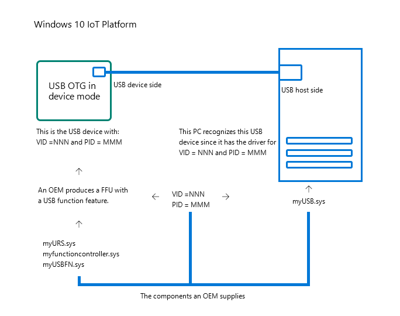
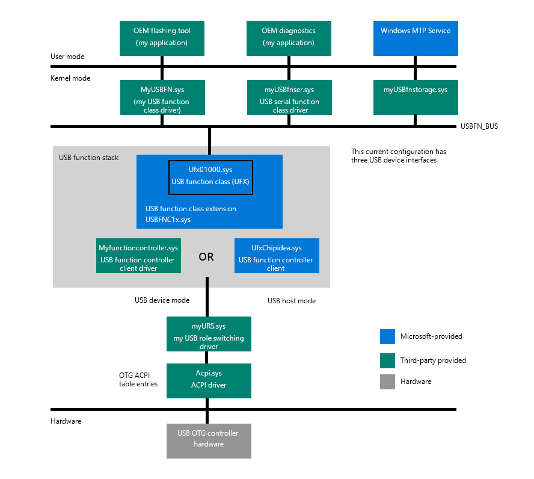
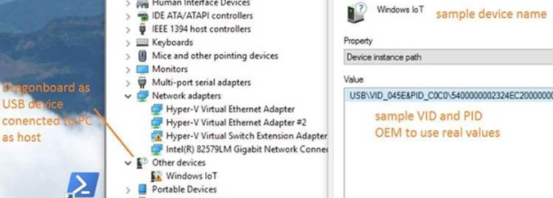

# Overview of USB Support and Dual Role

A Universal Serial Bus (USB) provides an expandable, hot-pluggable Plug and Play serial interface that ensures a standard, low-cost connection for peripheral devices such as keyboards, mice, joysticks, printers, scanners, storage devices, modems, and video conferencing cameras.  
When we talk about USB devices, the USB function stack refers to a group of drivers that are enumerated and loaded by the Plug and Play Manager, and a composite USB device can support multiple interfaces in a single configuration. 
While most of what we talk about in this article relates to the dual role for USB 2.0, more commonly known as USB On-The-Go or USB OTG or OTG, it is also helpful to know about USB 3.0 and how it differs from USB 2.0. 
The USB OTG defines two roles for devices: OTG A-device and OTG B-device, specifying which side supplies power to the link and which is the host initially. Since every OTG controller supports both roles, they are often called "Dual-Role" controllers rather than "OTG controllers." 
USB 3.0, on the other hand, can make devices into either hosts or peripherals. Some devices can take either role depending on what kind is detected on the other end. These types of ports are called Dual-Role-Data (DRD). When two such devices are connected, the roles are randomly assigned but a swap can be commanded from either end. 

## Architecture of USB Function in Windows 10 IoT Core

When the Windows 10 IoT platform acts as USB device, it will use one of several configurations. Each configuration has one or more USB interfaces. 
To properly support USB OTG on Windows 10 IoT, several things need to be taken care of.  

## Components OEMs have to supply

OEMs need to supply components on both sides – for the USB device-side and possibly for the USB host-side.  



### OEMs support for both sides

Every USB device has unique VID and PID, which identify it. An OEM, as the manufacturer of a Windows IoT-based USB device, needs to supply those.  OEMs can apply to the USB Consortium and obtain their company VID (if they don't have one already) and then choose a PID that will be unique for that product. When Windows 10 IoT with USBFN functionality is connected to a PC it will act as USB device (of whatever functionality to choose as set in myUSBFN.sys), with those "VID_nnn" and "PID_NNN". This VID and PID combination is then used by the host PC to find the appropriate drivers to load (myUSB.sys). 



### Supporting from the device side

_Features to include in FFU for image generation with USBFN enabled_
* The IoT image must have the necessary packages in it, namely ufx01000.sys and usbfnclx.sys. They both come with the following package `Microsoft-IoTUAP-USBFN-Class-Extension-Package.cab`. OEMs must use a proper "feature" tag in their XML file, which lists all features included in the FFU. For example, in the BoardTestOEMInput.xml file there will be the following entry <Feature>IOT_USBFN</Feature>  included under <Microsoft> features section. 

_USB Role Switching driver_
* For the USB OTG, OEMs have to supply the correct ACPI table entry (*myOTGacpi*) for the USB role-switching driver and the driver itself (*myURS.sys).

_USB Function Controller Driver_
* This depends on the hardware used by OEMs. Microsoft supplies USB Function Controller drivers for two popular USB OTG chipsets - Synopsys and ChipIdea.
* If an OEM chooses to use another USB OTG chipset, then the OEM must supply their own USB function controller hardware (*myfunctioncontroller.sys*).

_USB Function Class drivers_
* At least one USB function class driver must be supplied.
* This driver implements specific USB device functionality. It determines what the device will appear as on the host side as well as what it will do.
For example, it may appear as a serial communications device or as a mass storage device or a completely custom type device (*myUSBFN.sys*).

_Configuring USB Function Device_
* When the IoT platform is in USB device mode, it can operate under one or more configurations. Each configuration in use must be added and have its properties specified.

_Common Properties_
* There are common properties for all USB function configurations of the IoT platform. It is ultimately up to the OEM to specify standard USB descriptor
entries such as VID, PID, DeviceClass, DeviceProtocol, Manufacturerer string, serial number, etc.
* These common properties are set in registry in the following location: `HKLM\System\ControlSet001\Control\USBFN\default`

```
BcdDevice=0x1 
bDeviceClass=0x0 
bDeviceProtocol=0x0 
bDeviceSubClass= 0x0 
idProduct= 0xc0c0 
idVendor=0x045e 
iManufacturer=1 
iSerialNumber=3 
ManufacturerString=OEMname 
ProductString="Windows IOT" 
SerialNumberString=0x123 
```
> [!IMPORTANT]
> The values above are for demonstration purposes only and cannot be used in any product. The OEM must replace these placeholder fields with *actual values* in each entry above.

_Per configuration properties_

Configurations are stored in a registry under the following key: `HKLM\SYSTEM\ControlSet001\Control\USBFN\Configurations`

By default, there is an empty default USB function configuration included in the FFU, as set in: `HKLM\SYSTEM\ControlSet001\Control\USBFN\Configurations\default`

This empty default configuration results in the IoT platform appearing as a Windows IoT device for which there is no driver on the host side installed.



Each configuration must specify certain properties, such as the Interface List. The IoT platform can operate as a USB device with different configurations, whic hare defined by USB interfaces
that are exposed from USB device to USB host.

`HKLM\System\CurrentControlSet\Control\USBFN\Configurations\Default`

```
bmAttributes=0xC0
bMaxPower=0xFA
InterfaceList =
InterfaceDescriptor =
InterfaceGUIDE =
```

Currently, the selected configuration is the one that will be in effect when connecting to the USB hot: `HKLM\SYSTEM\ControlSet001\Control\USBFN`

_Examples of configurations_

1. Single configuration
   1. Must contain at least one interface
   2. Can be a default configuration
   3. When connected to a PC, the IoT platform will appear as that type of USB device (e.g. modem or storage).
   4. `HKLM\SYSTEM\ControlSet001\Control\USBFN\Configurations\default`, `InterfaceList = "MODEM\0MTP"`

2. Composite configuration
   1. Contains a list of interfaces with additional parameters
   2. When connected to a PC, the IoT platform will appear as a composite USB device with multiple units in it (i.e. MTP device, serial device, custom device).
   3. `HKLM\SYSTEM\ControlSet001\Control\USBFN\Configurations\mycfg`, `InterfaceList = "MODEM\0MTP"`

USBFN Interfaces are enumerated in registry under the following key:
`HKEY_LOCAL_MACHINE\SYSTEM\ControlSet001\Control\USBFN\Interfaces`

Each USB interface entry must contain an interface descriptor value and an interface GUID.

### Supporting from the host side

If an OEM chooses to implement any standard USB interface (e.g.  mass storage) on the device side, then a host PC can use in-box Windows drivers for that type of USB device. 
If an OEM implements any custom USB interface on device side, then it is necessary for the OEM to develop a Windows host driver for that custom USB Function device. 
