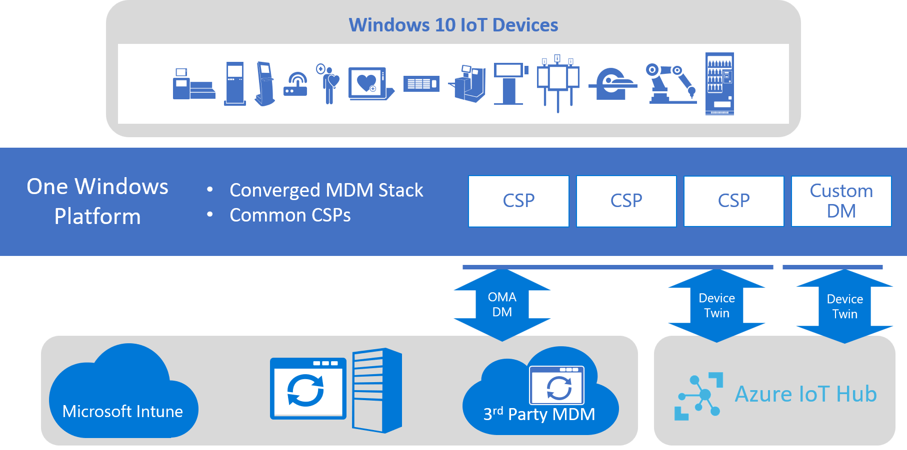

# Azure IoT Device Agent

When it comes to connected devices, remote device management is one of the key features that system operators need. It enables operators to configure properties and update software on the device remotely, without the need to have local or physical access to the device. With Windows IoT Core and Windows IoT Enterprise running on devices such as home appliances, HVAC systems and others, there is a need for a customizable, light weight device management solution. While Windows 10 versions already offers Mobile Device Management (MDM) based on [OMA DM](https://en.wikipedia.org/wiki/OMA_Device_Management), this is mainly utilized in enterprise solutions with management tools such as SCCM or Intune. While those solutions are well suited for devices placed in an enterprise setting, it has challenges in the more diverse settings that we see in IoT solutions. IoT devices also require a lightweight, small footprint device management solution which can be a challenge. Microsoft also offers device management capabilities using [Azure IoT Hub](https://docs.microsoft.com/azure/iot-hub/iot-hub-device-management-overview) and its [SDK](https://docs.microsoft.com/azure/iot-hub/iot-hub-devguide-sdks).The [Azure IoT Device Agent](https://github.com/ms-iot/azure-client-tools/blob/master/docs/device-agent/device-agent.md) brings both these capabilities together: device management capabilities in the cloud via the IoT Hub which works with the same standard [Configuration Service Providers(CSP)](https://docs.microsoft.com/windows/client-management/mdm/configuration-service-provider-reference) as used by Mobile Device Management. With the Azure Device Agent, OEMs can build devices that offer these device management capabilities without writing any code. 

The Azure Device Agent is a ready-to-build open-source package that enables remote device management capabilities. The Azure Device Agent is supported on Windows 10 IoT Core and Windows 10 IoT Enterprise and works on devices connected via the IoT Hub. OEMs can now build devices that support SCCM, Intune or Azure IoT Hub for device management and leave it up to their customers to select the device management solution that fits them best.   

## How does it work?

The [Azure IoT Device Agent](https://aka.ms/iot-core-azure-dm-client) consists of 2 core components. 

The Device Provisioning Service Client (DPS Client) automates device provisioning. It connects to the Azure Device Provisioning Service with the device's Enrollment Key and DPS ScopeID. The Azure DPS service identifies the device and provisions it in the configured IoT Hub and returns a connection string back to the device. The DPS client then uses this connection string to connect the device to the right IoT Hub.  

The Device Management Client enables remote device management capabilities using the [Configuration Service Providers](https://msdn.microsoft.com/windows/hardware/commercialize/customize/mdm/configuration-service-provider-reference), CSP) The Azure Device Agent's remote management capabilities supports a plug-in model which allows you to select only the capabilities you need. In addition to that, the plug-in architecture is extendable. You can write your own plug-in for a device management capability that you need and add it to the Azure Device Agent. All the device management capabilities are remotely accessible using the Device Twin or Module Twin properties and commands, thereby enabling a single-pane-of-glass management approach for all your Windows IoT devices. For a complete list of device management capabilities available refer to [this](https://github.com/ms-iot/azure-client-tools/blob/master/docs/device-agent/reference.md)

In addition to this, the Azure Device Agent also creates and manages SAS tokens for other UWP applications running on the device. The Azure Device Agent can provision other UWP apps as either a Device Twin or as a Module Twin and add their connection strings to the respective TPM slots. The UWP app leverages the [UWP Bridge](https://github.com/ms-iot/azure-client-tools/blob/master/docs/device-agent/uwp-bridge.md) to read their connection string from the TPM slot and can use that to connect to the IoT Hub. 

## How to get started?

The Azure IoT Device Agent is available on GitHub. The project also includes samples to get started quickly. For more information, check out our GitHub [repo](https://github.com/ms-iot/azure-client-tools/blob/master/docs/device-agent/device-agent.md)

## Migrating from Azure Device Agent V1 to V2
If you are currently using the v1 version of the Device Agent, one significant change between V1 and V2 is that in the V2 version, the Azure Device Agent no longer shares the connection with an UWP app. With enhancements to the IoT Hub you can now have both the UWP app and the Azure Device Agent have independent connection strings and still be associated with the same device in IoT Hub. Refer [here](https://github.com/ms-iot/azure-client-tools/blob/master/docs/device-agent/migration-from-old-client.md) for more details.

For more information on the Azure Device Agent V1, refer [here](https://docs.microsoft.com/windows/iot-core/manage-your-device/azureiotdm).

## Other Useful Tools 
### DM Mock Portal
[DM Mock Portal](https://github.com/ms-iot/azure-client-tools/blob/master/docs/dm-mock-portal/dm-mock-portal.md) is an application which can be used to set Device Twin or Module Twin properties on an individual device or across multiple devices, using the IoT Hub’s Automatic Device Management capabilities. 

### TPM Tool - Limpet.exe
The Azure Device Provisioning Service allows customers to automatically associate and configure a device with an IoT Hub post-production. For this process, Device Provisioning Service will need a unique and challengeable device ID to help configure the device securely when the device is put in operation. Device Provisioning Service uses the TPM’s public Endorsement Key (EKeyPub) for this purpose. To register the device with DPS, the EKeyPub needs to be harvested from the device. The preferred time for this step is during production (during end-of-line testing of the device). However, the process can also be done post-production if needed.  

Microsoft provides the Limpet tool to streamline the Device Provisioning Service registration process. Depending on your manufacturing setup, if there is an online connection available, the device can be registered using Limpet directly with Device Provisioning Service, or Limpet can harvest the EKeyPub for a later, offline registration of the device with Device Provisioning Service.

For more details on the Device Provisioning Service registration process with Limpet, see this [repo](https://github.com/ms-iot/azure-client-tools/blob/master/docs/limpet/limpet.md).

License: Limpet is licensed under the MIT open source license. 
