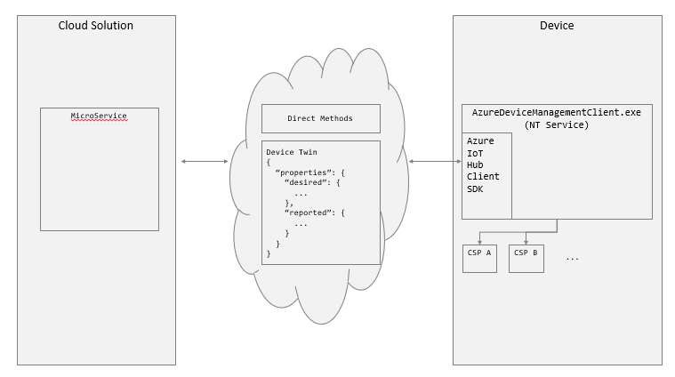

---	
title: Azure IoT Device Management		
ms.date: 08/28/2017	
ms.topic: article	
ms.prod: windows-iot
ms.technology: iot
description: Learn about how to manage your devices using Azure IoT Device Management and Windows IoT.	
keywords: windows iot, Azure IoT, Azure Device Management, device management	
---	

# Azure IoT Device Management	

When it comes to connected devices, remote device management is one of the key features used by system operators. It enables operators to reconfigure and update software and parameters of the device remotely without the need to have local, physical access to the device. With Windows 10 IoT Core, OEMs can build devices that offer these capabilities out-of-the box. Windows 10 IoT Core, as well as other Windows 10 versions, already offers Mobile Device Management (MDM) based on [OMA DM](https://en.wikipedia.org/wiki/OMA_Device_Management). This is mainly utilized in enterprise solutions with management tools such as SCCM or Intune. While those solutions are well suited for devices placed in an enterprise setting, it has challenges in the more diverse settings that we see in IoT solutions. Those challenges are also seen in IoT devices requiring light weight device management. For those devices, Microsoft offers [device management through Azure IoT Hub](https://docs.microsoft.com/azure/iot-hub/iot-hub-device-management-overview).	

## Scalable device management with Windows IoT	

With Windows IoT Core running in devices such as home appliances, HVAC systems and others, there is a need for a customizable, light weight device management solution. In the Windows Creator Edition, Microsoft enables [Azure IoT Hub device management](https://docs.microsoft.com/azure/iot-hub/iot-hub-device-management-overview). OEMs can use the [Windows IoT Azure DM client library](https://aka.ms/iot-core-azure-dm-client) to add device management capabilities to their Azure IoT hub connected devices. This library will access the standard Windows device management components ([Configuration Service Providers](https://msdn.microsoft.com/windows/hardware/commercialize/customize/mdm/configuration-service-provider-reference), CSP).  OEMs can now build devices that support SCCM, Intune and Azure IoT Hub for device management and leave it up to their customers to select the type DM solution that fits them best. 	

	

## How does it work?	

The [Windows IoT Azure DM client library](https://aka.ms/iot-core-azure-dm-client) is linked in the host application. It shares the Azure IoT Hub connection with the host app. Thus making additional enrollment to enable device management unnecessary. The picture below shows the architecture for an Azure IoT Hub DM solution using the Windows IoT Azure DM client library. 	

	

Microsoft provides two system components, CommProxy.exe and SystemConfigurator.exe, which the OEM needs to include in the device image. These components give access to the CSPs. The IoTDMClientLib maps the CSP interface to functions that can be consumed by Azure IoT Hub device management. It also provides DM functions that don’t use a CSP, e.g. set time zone. The IoTDMClientLib is provided as an open source component. OEMs can extend it to add DM capabilities that are specific to their device such as configurations for sensors or actuators. 	

## Device Health Attestation	
For a secure operation of IoT devices it is essential to assess if a device is booted to a trusted and compliant state. With [Windows IoT Device Health Attestation (DHA)](https://github.com/ms-iot/iot-core-azure-dm-client/blob/master/docs/device-health-attestation.md) operators can verify the secure state of a device, and take appropriate remedial actions if necessary through [Azure IoT Hub Device Management](https://github.com/ms-iot/iot-core-azure-dm-client/blob/master/README.md). DHA is part of the Windows IoT Core Azure Device Management Client. To use the DHA capability in your solution it requires access to the Microsoft DHA service. A subscription to the service is available through the [Windows 10 IoT Core Services](https://docs.microsoft.com/windows-hardware/manufacture/iot/iotcoreservicesoverview).	

### Reference	
[Device Health Attestation for Azure IoT DM](https://github.com/ms-iot/iot-core-azure-dm-client/blob/master/docs/device-health-attestation.md)	

[Deploy Azure Resources for Device Health Attestation](https://github.com/ms-iot/iot-core-azure-dm-client/blob/master/docs/dha-deploy.md#deploy-azure-resources-for-device-health-attestation)	

## How to get started?	

Windows IoT Azure DM client library is available on GitHub. Beside the IoTDMClientLib project it also includes samples to get started quickly. For more information see the links below.	

### Project GitHub page	

[Windows IoT Azure DM client library](https://aka.ms/iot-core-azure-dm-client) is available on GitHub.	

### DM Dashboard	

[DM Dashboard](https://aka.ms/iot-core-azure-dm-client-dashboard) is an application to test the DM function on a device. The app connects to the device via Azure IoT Hub. The app can be used to validate the DM capabilities of the device. It can be extended to test any third-party DM functions that were added to the IoTDMClientLib.	

### DM background application	

The [DM background application](https://aka.ms/iot-core-azure-dm-client-backgroundapp) shows how the IoTDMClientLib can be used in an application that connects to Azure IoT Hub and needs to run as background app on Windows IoT Core. 	

### Toaster Application	

The [Toaster application](https://aka.ms/iot-core-azure-dm-client-toasterapp), as the device management background app above, will enable Azure DM capabilities for a device. This app will run in the foreground and allow access to DM parameters and functions via the devices UI. 	

### Registering your device with the Azure Device Provision Service (DPS) 	

The Azure Device Provisioning Service allows customers to automatically associate and configure a device with an IoT Hub post-production. For this process Device Provisioning Service will need a unique and challengeable device ID to help configure the device securely when the device is put in operation. Device Provisioning Service uses the TPM’s public Endorsement Key (EKeyPub) for this purpose. To register the device with DPS, the EKeyPub needs to be harvested from the device. The preferred time for this step is during production (during end-of-line testing of the device). However, the process can also be done post-production if needed.  	

Microsoft provides the Limpet tool to streamline the Device Provisioning Service registration process. Depending on your manufacturing setup, if there is an online connection available, the device can be registered using Limpet directly with Device Provisioning Service, or Limpet can harvest the EKeyPub for a later, offline registration of the device with Device Provisioning Service.	

For more details on the Device Provisioning Service registration process with Limpet, see the [Enroll the device in Device Provisioning Service](https://github.com/ms-iot/azure-dm-client/blob/master/docs/limpet.md#setup-azure-cloud-resources)  section in the [Limpet documentation](https://github.com/ms-iot/azure-dm-client/blob/master/docs/limpet.md). 	

Project repository: [Limpet project repository](https://github.com/ms-iot/azure-dm-client/) 	

License: Limpet is licensed under the MIT open source license 	

