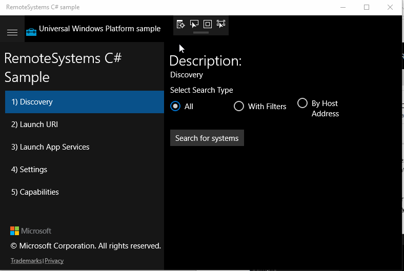
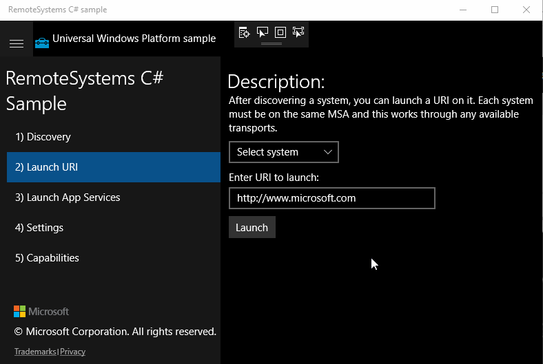
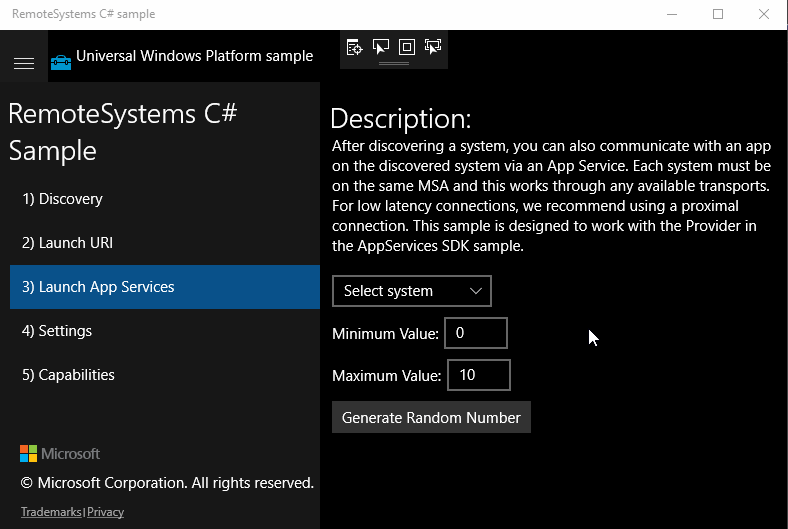

# Using Project Rome with Windows 10 IoT Core

[Project Rome](https://developer.microsoft.com/windows/project-rome) allows you to work remotely with devices running Windows 10 IoT Core using the RemoteSystems and AppServiceProvider APIs.

In this article, we'll go through how to discover, control, and connect to devices running Windows 10 IoT Core with Project Rome.  

## Discovering IoT Core devices with the RemoteSystem APIs

*Setup:*

* Run the RemoteSystems sample on a Desktop while signed into your Microsoft account.  
* With no app running on IoT Core, sign into your Microsoft account by going to Cortana to login.

**Steps:**

1. Run the RemoteSystems sample on your desktop
1. Under "1) Discovery," click "Search for systems"

## Control IoT Core devices with RemoteSystems.LaunchUri

**Setup:**

* Run the [RemoteSystems sample](https://github.com/Microsoft/Windows-universal-samples/tree/dev/Samples/RemoteSystems) on a Desktop while [signed into your Microsoft account](https://github.com/Microsoft/Windows-universal-samples/tree/master/Samples/WebAccountManagement).

* With no app running on IoT Core, sign into your Microsoft account by going to Cortana to login.

**Steps:**

1. Turn on the IoT Core virtual machine with Cortana and sign into your Microsoft account from Cortana.
1. Run the RemoteSystems sample on Desktop.
1. Under "1) Discovery", click "Search for systems".
1. Under "2) Launch URI", select the IoT Core device that is running Cortana.
1. Enter this URI and launch.

## Connecting to the Remote App Service running on IoT Core

**Setup:**

* Run the [RemoteSystems sample](https://github.com/Microsoft/Windows-universal-samples/tree/dev/Samples/RemoteSystems) on a Desktop while [signed into your Microsoft account](https://github.com/Microsoft/Windows-universal-samples/tree/master/Samples/WebAccountManagement).
* Make sure to have the [AppServiceProvider app](https://github.com/Microsoft/Windows-universal-samples/tree/dev/Samples/AppServices) deployed and running on at least one IoT Core device.

**Steps:**

1. Turn on the IoT Core Virtual Machine with Cortana, and sign into your Microsoft account from Cortana. Deploy the AppServiceProvider app, run it once, then shut it down.
1. Run the RemoteSystems sample on desktop.
1. Under "1) Discovery", click "Search for systems".
1. Under "3) Launch App Services," select the IoT core device that has the AppServiceProvider app deployed and has been run previously.
1. Generate a random number.  

## Controlling other devices and app services from an IoT Core device

**Setup:**

* Run the [RemoteSystems sample](https://github.com/Microsoft/Windows-universal-samples/tree/dev/Samples/RemoteSystems) deployed on an IoT Core device while [signed into your Microsoft account](https://github.com/Microsoft/Windows-universal-samples/tree/master/Samples/WebAccountManagement) from the Cortana app.
* Have a desktop machine with the [AppServiceProvider app](https://github.com/Microsoft/Windows-universal-samples/tree/dev/Samples/AppServices) deployed and having been run at least once.

**Steps:**

1. Run the RemoteSystems sample.
1. Under "1) Discovery", click on "Search for systems".
1. Under "2) Launch URI", select the Desktop machine and launch.
1. Under "3) Launch App Services", select the desktop machine.  

> [!NOTE]
> On first attempt, this may take a long time. Try this again for a much quicker response.

### Helpful links

* [Project Rome documentation on MSDN](https://developer.microsoft.com/windows/project-rome)
* [Using Project Rome for UWP](/windows/uwp/launch-resume/connected-apps-and-devices)
