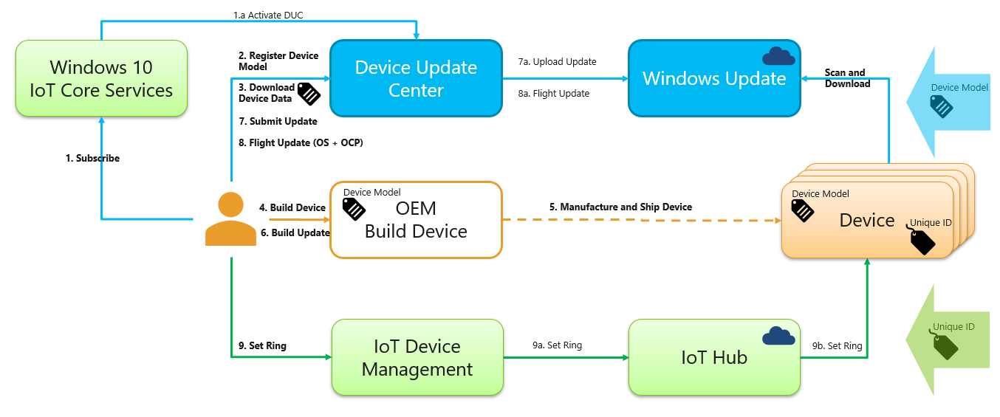

# Windows 10 IoT Core Services

Windows 10 IoT Core Services is a new cloud services subscription that provides the essential services needed to commercialize a device on Windows 10 IoT Core. Through this subscription, OEMs have access to long term support on [Windows 10 IoT Core Long Term Servicing Channel (LTSC) releases](/lifecycle/products/windows-10-iot-core) along with services to publish device updates and assess device health.

## What's included with Windows 10 IoT Core Services?

A subscription to Windows 10 IoT Core Services comes with three main benefits:

> | _Benefit_  |  _Description_  |
> |----------|---------|
> | [Long Term Support](/windows/deployment/update/waas-overview#long-term-servicing-channel) | Access to Windows 10 IoT Core LTSC releases with security and reliability updates only (no new features). |
> | [Update control with Device Update Center](/windows-hardware/service/iot/using-device-update-center) | Create and publish device updates at scale using cloud-side controls. |
> | [Device Health Attestation (DHA)](https://github.com/ms-iot/iot-core-azure-dm-client/blob/master/docs/dha-architecture.md) | Rights to commercialize a device with DHA to affirm device health remotely. |

## Long Term Support
OEMs get long term support on Windows 10 IoT Core via access to monthly updates from the [Windows Long-Term Servicing Channel (LTSC)](/windows/deployment/update/waas-overview#long-term-servicing-channel) releases. This includes security and reliability updates for the operating system to keep device security up to date. Devices using LTSC releases won’t receive feature updates, enabling OEMs to focus updates on stability by minimizing changes to the base operating system.

## Update Control with Device Update Center

Update control with the newly announced [Device Update Center](/windows-hardware/service/iot/using-device-update-center) (DUC) provides the ability to create, customize, and publish device updates. These updates are distributed by the same content distribution network (CDN) as Windows Update which is used daily by millions of Windows customers around the world. Updates can be applied to the operating system and device drivers as well as OEM-specific applications and files. Updates can be flighted to test devices prior to broader distribution.

Here's a diagram of the update flow in Device Update Center:

## Commercialize with Device Health Attestation

[Device Health Attestation (DHA)](https://github.com/ms-iot/iot-core-azure-dm-client/blob/master/docs/dha-architecture.md) enables enterprises and OEMs to raise the security bar of their organization's assets with hardware-attested security. Evaluating the trustworthiness of a device at boot time is essential for a trusted IoT system. However, a device cannot attest to its own trustworthiness - this must be done by an external entity such as the [DHA cloud service](/windows-server/security/device-health-attestation). This service evaluates device health and can be combined with a device management system, such as Azure IoT Device Management. Based on DHA report data, the device management system can take corrective actions such as re-imaging the device, denying network access, or creating a service ticket.

## Is this for me?

If you work with IoT devices, you might be wondering if Windows 10 IoT Core Services is right for you or your organization. The answer depends on how you use and obtain Windows 10 IoT devices. The following information will help you decide whether this subscription service is right for you.
  1. If you are creating a device and you control the update and maintenance of the full software image on the device, this service is for you. If you only install apps on the device and someone else updates the full software image, such as the operating system and drivers, this service isn't for you. If you're not sure, contact your supplier and ask if they maintain the operating system, drivers, and other parts of the system image on the device or whether you are expected to maintain the system image. This service is designed for the party that maintains the system image for the device which is typically the ODM or OEM of the device, not the end customer purchasing or using the device.
  2. Your devices should be running Windows 10 IoT Core. If they are running Windows 10 IoT Enterprise, another version of Windows, or another operating system, this service isn't for you. Services such as [Azure IoT Device Management](/azure/iot-hub/iot-hub-device-management-overview) and [Microsoft Intune](https://www.microsoft.com/cloud-platform/microsoft-intune) offer cross-platform support which may be useful ingredients in configuring alternate solutions for those operating systems.
  3. If you want to build a device with the [Long Term Servicing Channel (LTSC)](/windows/deployment/update/waas-overview#servicing-channels) releases of Windows 10 IoT Core, this service is for you. You must subscribe to Windows 10 IoT Core Services to commercialize a device with an LTSC release of Windows 10 IoT Core. If you only want to run Semi-Annual Channel releases of Windows 10 IoT Core, you aren't required to subscribe to this service.
  4. If you want to use any one of the three services included in Windows 10 IoT Core Services on your devices, this service is for you. Even if you only need one of the three services included in the subscription, you need to purchase the subscription for your devices. The services are only sold together as a single product - they are not available for purchase separately.

## Getting started

Windows 10 IoT Core Services is available through Cloud Solutions Provider and OEM channels. If you already meet the below requirements, then reach out to one of our [Windows IoT distributors](https://aka.ms/IoTDistributorList) to sign up. Otherwise, get started on the three items below.

### Prerequisites

  1. Create or use an existing [Azure Active Directory](/azure/active-directory/fundamentals/get-started-azure-ad) domain for registering with Windows Hardware Dev Center. You will need to sign in with an account with administrator rights to your AAD tenant domain to sign legal agreements during the registration process.
  2. You must have an [Extended Validation (EV) code signing certificate](/windows-hardware/drivers/dashboard/get-a-code-signing-certificate). Please check whether your company already has an EV code signing certificate. If your company already has an EV code signing certificate, have the certificate available during the registration process. If your company doesn't have a certificate, you will need to purchase a certificate from an [authorized partner](/windows-hardware/drivers/dashboard/get-a-code-signing-certificate#code-signing-faq) as part of the registration process.
  3. Register for a [Windows Hardware Dev Center account](https://aka.ms/ducregister) to get access to Device Update Center. Make sure you sign in as an administrator with the Azure Active Directory domain you will use for Device Update Center and have your Extended Validation (EV) code signing certificate available.

### Using Device Update Center

As a device manufacturer, you can maintain the security and reliability of your device by regularly updating the device image. This is accomplished by using Device Update Center to create and publish updates specific to your device model which will be offered by Windows Update when the device scans for applicable updates.
1. Before creating updates, start by creating a baseline image which is applied to the device during manufacturing as described in the [Build Your Image](/windows/iot-core/build-your-image/createinstallpackage) section of the Windows IoT Core docs.
2. It's critical that you correctly [populate the SMBIOS fields](/windows/iot-core/commercialize-your-device/oemlicenserequirements#smbios-support) of your device and that your build environment is set up with the [same corresponding values](/windows-hardware/service/iot/using-device-update-center#step-2-create-a-new-product).
3. Ensure that you've registered for a [Windows Hardware Dev Center account](https://aka.ms/ducregister) to get access to Device Update Center. Make sure you sign in as an administrator with the Azure Active Directory domain you will use for Device Update Center and have your Extended Validation (EV) code signing certificate available.
4. Log into [Device Update Center](https://developer.microsoft.com/dashboard/hardware/iot) using the same AAD account you used when registering with Windows Hardware Dev Center. The AAD domain name on this account should also match the Admin AAD domain name specified when creating the resource in the Azure Portal.
5. Follow the instructions in the [Device Update Center User Guide](/windows-hardware/service/iot/using-device-update-center) to create and publish updates for your device.
