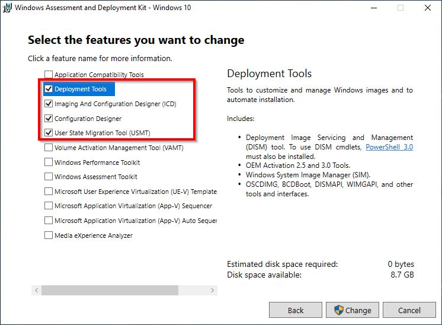
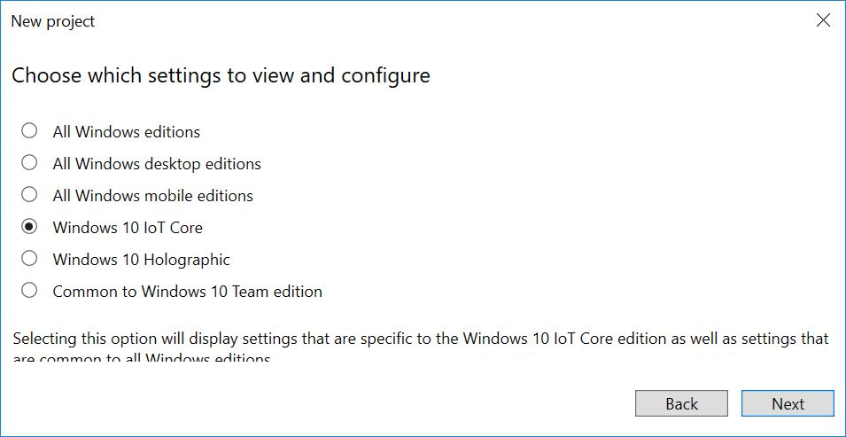

---

description: 'We''ll create a provisioning package that contains some sample Wi-Fi settings.'
ms.assetid: d9a50f87-e8c0-48da-89e7-0cdd542ce053
MSHAttr: 'PreferredLib:/library'
title: 'Lab 1d: Add networking and other provisioning package settings to an image'

ms.date: 10/15/2018
ms.topic: article


---

# Lab 1d: Add networking and other provisioning package settings to an image

A provisioning package allows you to apply customization settings over an existing Windows IoT Core installation image. We will describe the steps required to create a provisioning package that you can apply to your Windows 10 IoT Core FFU images.

> [!NOTE]
> To test WiFi, your board will need WiFi support. You can use a WiFi adapter/dongle or a board like the Raspberry Pi 3 that has Wi-Fi built-in.

For this lab, we'll use the ProductB, that includes the default app (Bertha), which shows network status.

## Prerequisites

Make sure you've created an image with your custom app from [Add an app to an image](./deploy-your-app-with-a-standard-board.md) previously. 

You will need the following tools installed to complete this section:

* Windows Assessment and Deployment Kit (Windows ADK)
* Windows Configuration Designer
* IoT Core PowerShell Environment
* A text editor like Notepad or VS Code

## Install Windows Configuration Designer

We will be using **Windows Configuration Designer (WCD)** to create a provisioning package for our IoT Core image. Windows Configuration Designer allows you to create provisioning packages, which are used to configure devices running Windows 10 IoT Core.

Windows Configuration Designer comes with the **Windows ADK Toolkit** and should have been installed to the Technician PC previously. If not, please run the install for the Windows ADK Toolkit and make sure you have the **Configuration Designer** selection checked for installation.



## Create WCD Project for a Provisioning Package

In order to create a provisioning package for your device, we need to create a project in **Windows Configuration Designer**. Once we have this project, we can specify the configuration customizations we want included in our FFU image.

1. From your IoT Core imaging PC (technician PC), run **Windows Imaging and configuration Designer**.

2. Create a new project by clicking **File > New Project**. For our example, we created a project called _TestProvPackage_.

3. Select **Provisioning Package** and click **Next**.

4. On the **Choose which settings to view and configure** page, select **Windows 10 IoT Core**. Click **Next**.



5. At the **Import a provisioning package (optional)** page, leave the entry blank and click **Finish**.

6. Add a sample setting: 

a. Expand **Runtime settings > Connectivity Profiles > WLAN > WLANSetting > SSID**. 

b. Type in the name of a Wi-Fi network name, for example, ContosoWiFi, and click Add. 

c. Expand the **SSID > WLANXmlSettings > SecurityType** and choose a setting such as Open. 

d. Expand the **SSID > WLANXmlSettings > AutoConnect** and choose a setting such as **TRUE**. 

e. Optional: To add more than one WLAN network, go back to WLANSetting, and repeat the process.

7. Optional: Add other apps, drivers, and settings through the UI. To learn more, see [Configure customizations using Windows ICD](/windows/configuration/provisioning-packages/provisioning-create-package#configure-settings).

8.  Export the provisioning package. For example, click **Export > Provisioning Package > Next > (Uncheck the Encrypt Package box) > Next >  Build**. (To learn more, see [Export a provisioning package](/windows/configuration/provisioning-packages/provisioning-create-package#build-package).)

> [!IMPORTANT]
> When you make any changes to a provisioning package, Windows Configuration Designer increments the version number in the provisioning file (customizations.xml). Starting with **Windows 10 release 1709**, the version number for provisioning package is also a four part number, same as the regular packaging version. In previous releases (prior to release 1709), the version number is not major.minor, it is a number with a decimal point. For example, 1.19 is a lower version than 1.2.

> [!NOTE]
> As an alternative, you can update customizations.xml in the `C:\MyWorkspace\Source-<arch>\Products\ProductB\prov` with any desired changes, including the above wifi settings. In such case, you will not need a new package. Make sure you increment the version number if you make changes. See [Windows provisioning answer file](/windows-hardware/drivers/) for more information.

9. Open **IoTCorePShell.cmd** file from your workspace and execute the following powershell commands. 

```powershell
Add-IoTProvisioningPackage Prov.WiFiSettings "C:\IoT\Provisioning\WiFiSettings\WiFiSettings.ppkg"
(or) newprovpkg Prov.WiFiSettings "C:\IoT\Provisioning\WiFiSettings\WiFiSettings.ppkg"
```

This creates a new folder at `C:\MyWorkspace\Common\Packages\Prov.WifiSettings`.

This also adds a FeatureID **PROV_WIFISETTINGS** to the `C:\MyWorkspace\Common\Packages\OEMCOMMONFM.xml` file.

10. Build a cab file for provisioning.

    ``` powershell
    New-IoTCabPackage Prov.WifiSettings
    (or) buildpkg Prov.WifiSettings
    ```

## <span id="Update_the_project_s_configuration_files"></span><span id="update_the_project_s_configuration_files"></span><span id="UPDATE_THE_PROJECT_S_CONFIGURATION_FILES"></span>Update the project's configuration files

1.  Update the product test configuration file using [Add-IoTProductFeature](https://github.com/ms-iot/iot-adk-addonkit/blob/master/Tools/IoTCoreImaging/Docs/Add-IoTProductFeature.md)

    ``` powershell
    Add-IoTProductFeature ProductB Test PROV_WIFISETTINGS -OEM
    (or) addfid ProductB Test PROV_WIFISETTINGS -OEM
    ```

## Build and Test Image

Build the FFU image again, as specified in [Create a basic image](./create-a-basic-image.md#flash-a-windows-iot-core-image). You should only have to run the [New-IoTFFUImage](https://github.com/ms-iot/iot-adk-addonkit/blob/master/Tools/IoTCoreImaging/Docs/New-IoTFFUImage.md) command:

```powershell
New-IoTFFUImage ProductX Test
(or)buildimage ProductX Test 
```

Once the FFU file has been built and you flash it to your hardware device as specified in [Flash a Windows IoT Core Image](./create-a-basic-image.md#flash-a-windows-iot-core-image), your provisioning package customizations should be applied when you power up the device. In our example, the default app is the [IoT Core Default app](https://github.com/Microsoft/Windows-iotcore-samples/tree/master/Samples/IoTCoreDefaultApp), which will show basic info about the image when the device is booted up.


**Test to see if your provisioning settings were applied**

1.  Unplug any network cables from your IoT device.

2.  Select the defaults. At the **Let's get connected** screen, select **Skip this step**.

3.  If your wireless network is in range, this screen should show the network successfully connected, and show an IP address for the network.

## Test network connections and upload apps

You can connect to your device's portal page to troubleshoot network connections, upload apps, or see more details about your device.

1.  Connect both your technician PC and the device to the same network. 

    For example, to connect over a wired network, plug in a ethernet cable.  To connect over wireless, make sure both your technician computer and IoT Core device are connected to the same wireless network.    

2.  On your technician PC, open Internet Explorer, and type in the device's IP address with an http:// prefix and :8080 suffix. 

    ```
    http://10.123.45.67:8080
    ```

3.  When prompted, enter your device's default username and password. (Default is: Administrator \ p@ssw0rd)

    This opens the [Windows Device Portal](/windows/iot-core/manage-your-device/DevicePortal). From here, you can upload app packages, see what apps are installed, and switch between them.

4.  Click **Networking** > **Profiles**.  You should see the Wi-Fi profile you created. 
    
	If the device is able to automatically connect to the WiFi network, then under **Available Networks**, you should see a checkmark next to the network you configured.

    If your network requires steps such as accepting license terms, the device may not auto-connect.

## Troubleshooting

**Check your Wi-Fi broadcast frequency (2.4GHz vs 5GHz)**. Some Wi-Fi adapters, such as the built-in Wi-Fi adapter on the Raspberry Pi 3, only support 2.4GHz Wi-Fi networks. While this is the most common Wi-Fi broadcast frequency, many Wi-Fi networks broadcast at frequencies of 5GHz. Either change the broadcast frequency or use a different adapter.

**Confirm that the provisioning package settings work on your network**. Use a laptop PC to test:

1.	Disconnect the laptop from the network: Click on the network icon in the system tray, select the wireless network, and click **Disconnect**. 

2.	Confirm that the network is no longer connected.

3.	Install the provisioning package by double-clicking ProductAProv.ppkg. The wireless network should connect automatically.

**Check to see if the profile has been added to the device**

1.  Connect using an ethernet connection to the device.

2.  Connect using an SSH client, such as [PuTTY](https://the.earth.li/~sgtatham/putty/latest/x86/putty.exe).

3.  When connected, check to see what profiles have been installed:

    ```
    netsh wlan show profiles
    ``` 

    The network should appear in the list of User profiles.

**Use a different device name for each device.** This can help prevent network conflicts. Set this name while creating media for the device.

## Next steps

[Lab 1e: Add a driver to an image](add-a-driver-to-an-image.md)