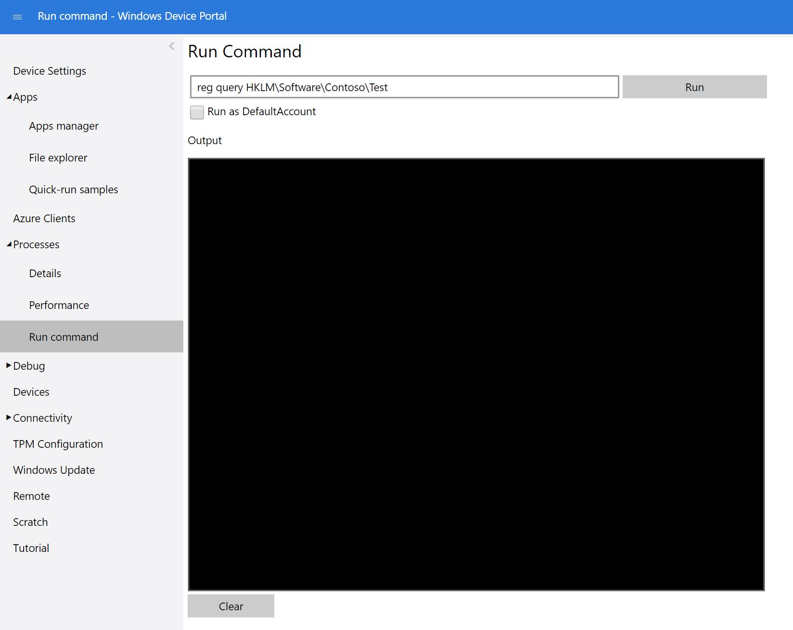

---

description: 'We''ll create some test files and registry keys to the image, again packaging them up so that they can be serviced after they reach your customers.'
ms.assetid: 7ca2b835-4d36-43d9-b46f-d5d5d8410335
MSHAttr: 'PreferredLib:/library'
title: 'Lab 1c: Add a file and a registry setting to an image'

ms.date: 10/15/2018
ms.topic: article


---

# Lab 1c: Adding file(s) and registry settings to an image

We will create some test files and registry keys to a Windows IoT Core image, and package them up so that they can be serviced after they are distributed to your customers. Since files and registry keys that you add to your image are often not specific to an architecture, we recommend creating a common package that you can use across all of your device architectures.

## <span id="Goals"></span><span id="goals"></span><span id="GOALS"></span>Goals

* Create a package that contains registry and file settings for your device
* Package the registry/file settings package so it can be included in an FFU image
* Modify IoT Addon Kit project configuration files to include your registry/file settings package
* Build and deploy an FFU image that contains your registry/file settings package
 
We'll create some test files and registry keys to the image, and again package them up so that they can be serviced after they reach your customers.

We'll add these to the common feature manifest (OEMCommonFM.xml), which is used in x86, x64, and Arm builds.

For this lab, we'll start an new product, ProductB, so that later we can use the IoT sample app to get the IP address of our device and verify that our files and reg keys have made it. 

## <span id="Prerequisites"></span><span id="prerequisites"></span><span id="PREREQUISITES"></span>Prerequisites

Please make sure that you've created a basic image from [Create a basic image](./create-a-basic-image.md) previously.

You will need the following tools installed to copmlete this action:
* Windows Assessment and Deployment KiT (Windows ADK)
* IoT Core Powershell Environment
* Windows 10 IoT Core Packages
* IoT Core ADK Add-Ons
* A text editor like Notepad or VS Code.

## <span id="Create_your_test_files"></span><span id="create_your_test_files"></span><span id="CREATE_YOUR_TEST_FILES"></span>Create your test files

Create a few sample text files using Notepad and add some random text so that these files are not empty. For our example, we have created two files titled **TestFile1.txt** and **TestFile2.txt**.

## <span id="Build_a_package_for_your_test_files"></span><span id="build_a_package_for_your_test_files"></span><span id="BUILD_A_PACKAGE_FOR_YOUR_TEST_FILES"></span>Build a package for Test Files

1.  Open the **IoT Core PowerShell Environment**: run `C:\MyWorkspace\IoTCorePShell.cmd` as an administrator and create a File package using [Add-IoTFilePackage](https://github.com/ms-iot/iot-adk-addonkit/blob/master/Tools/IoTCoreImaging/Docs/Add-IoTFilePackage.md):

    ``` powershell
    # Array of files with destinationDir, Source and destinationFilename
    $myfiles = @(
        ("`$(runtime.system32)","C:\Temp\TestFile1.txt", ""),        
        ("`$(runtime.bootDrive)\OEMInstall","C:\Temp\TestFile2.txt", "TestFile2.txt")
        )
    Add-IoTFilePackage Files.Configs $myfiles
    ```

    This creates a new folder at `C:\MyWorkspace\Common\Packages\Files.Configs`.

    This also adds a FeatureID **FILES_CONFIGS** to the `C:\MyWorkspace\Common\Packages\OEMCOMMONFM.xml` file.

    Variables like `$(runtime.system32)` are defined in `C:\Program Files (x86)\Windows Kits\10\Tools\bin\i386\pkggen.cfg.xml`.

2. Create a **Registry package** using [Add-IoTRegistryPackage](https://github.com/ms-iot/iot-adk-addonkit/blob/master/Tools/IoTCoreImaging/Docs/Add-IoTRegistryPackage.md):

    ``` powershell
    # Array of files with destinationDir, Source and destinationFilename
    $myregkeys = @(
        ("`$(hklm.software)\`$(OEMNAME)\Test","StringValue", "REG_SZ", "Test string"),
        ("`$(hklm.software)\`$(OEMNAME)\Test","DWordValue", "REG_DWORD", "0x12AB34CD")
        )
    Add-IoTRegistryPackage Registry.Settings $myregkeys
    ```

    This creates a new folder at `C:\MyWorkspace\Common\Packages\Registry.Settings`.

    This also adds a FeatureID **REGISTRY_SETTINGS** to the `C:\MyWorkspace\Common\Packages\OEMCOMMONFM.xml` file.

3.  Build the packages using [New-IoTCabPackage](https://github.com/ms-iot/iot-adk-addonkit/blob/master/Tools/IoTCoreImaging/Docs/New-IoTCabPackage.md):

    ``` powershell
    New-IoTCabPackage Files.Configs
    (or) buildpkg Files.Configs
    New-IoTCabPackage Registry.Settings
    (or) buildpkg Registry.Settings
    ```

    The package is built and is available at  `C:\MyWorkspace\Build\<arch>\pkgs`.


## <span id="Create_a_new_product"></span><span id="create_a_basic_image"></span><span id="CREATE_A_BASIC_IMAGE"></span>Create a new product

1.  Create a new product folder. 

    ``` powershell
    Add-IoTProduct ProductB RPi2
    (or) newproduct ProductB RPi2
    ```
    This will prompt you to enter **SMBIOS** values.

## <span id="Update_the_project_s_configuration_files"></span><span id="update_the_project_s_configuration_files"></span><span id="UPDATE_THE_PROJECT_S_CONFIGURATION_FILES"></span>Update the project's configuration files

Update the product test configuration to include the features using [Add-IoTProductFeature](https://github.com/ms-iot/iot-adk-addonkit/blob/master/Tools/IoTCoreImaging/Docs/Add-IoTProductFeature.md):

```powershell
Add-IoTProductFeature ProductX Test FILES_CONFIGS -OEM
(or) addfid ProductX Test FILES_CONFIGS -OEM
Add-IoTProductFeature ProductX Test REGISTRY_SETTINGS -OEM
(or) addfid ProductX Test REGISTRY_SETTINGS -OEM
```

## <span id="Build_and_test_the_image"></span><span id="build_and_test_the_image"></span><span id="BUILD_AND_TEST_THE_IMAGE"></span>Build and test the image

Build the FFU image again, as specified in [Create a basic image](create-a-basic-image.md). You should only have to run the [New-IoTFFUImage](https://github.com/ms-iot/iot-adk-addonkit/blob/master/Tools/IoTCoreImaging/Docs/New-IoTFFUImage.md) command:


```powershell
New-IoTFFUImage ProductX Test
(or)buildimage ProductX Test 
```

Once the FFu file has been built, you can flash it to your hardware device as specified in [Flashing a Windows IoT Core image](./create-a-basic-image.md#flash-a-windows-iot-core-image).

## Verify Files and Registry Keys added

In order to verify that the files were added on the device, do the following:

1.  Connect both your technician PC and the device to the same ethernet network. 

    For example, to connect over a wired network, plug in an ethernet cable. To connect directly to the device, plug a network cable directly from your technician PC to the device.   

2.  On the test app, note the IP address of the device. For example, 10.100.0.100. 

3.  On the technician PC, open File Explorer and type in the IP address of the device with a \\ prefix and \c$ suffix:

    ```
    \\10.100.0.100\c$
    ```

Use the devicename, the default Administrator account, and password to log on. (Default is: minwinpc\\Administrator / p@ssw0rd)

4.  Check to see if the files exist on the device. For our example, look for:

    \\\\10.100.0.100\c$\\Windows\\system32\\TestFile1.txt

    \\\\10.100.0.100\c$\\OEMInstall\\TestFile2.txt

## Verify registry keys

1.  On the technician PC, connect your device using an SSH client, such as [PuTTY](https://the.earth.li/~sgtatham/putty/latest/x86/putty.exe). For example, use the IP address and port 22 to connect to the device. Then log in using the Administrator account and password. (To learn more, see [SSH](/windows/iot-core/connect-your-device/SSH)).

2.  From the command line in the SSH client, query the system for the registry key. In our example, this command was executed to check the existence of the registry key:

    ```
    reg query HKLM\Software\Fabrikam\Test
    ```

    The SSH client should display your test values. 
    
    Alternatively, you can use the **Run Command** in the Windows Device Portal fo ryour connceted device to run the `reg query` command.
    
    
    
The output window should display your test values.

## <span id="Next_steps"></span><span id="next_steps"></span><span id="NEXT_STEPS"></span>Next steps

[Lab 1d: Add a provisioning package to an image](add-a-provisioning-package-to-an-image.md)