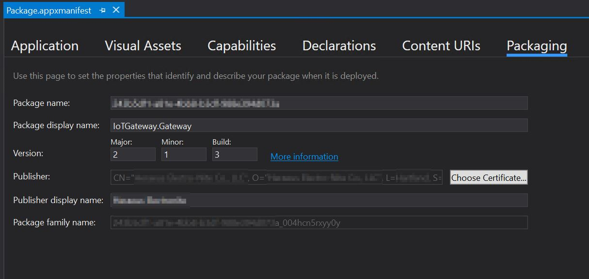
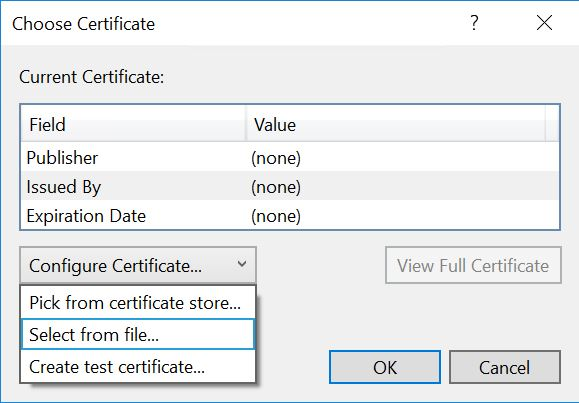

---

description: 'Convert our test image to a retail build.'
MS-HAID: 'p\_iot\_core.build\_retail\_image'
MSHAttr: 'PreferredLib:/library'
title: 'Lab 1f: Build a retail image'

ms.date: 10/15/2018
ms.topic: article


---

# Lab 1g: Build a retail image

We will detail the steps needed to create a retail Windows IoT Core image and flash it onto a specific hardware device.

## <span id="Prerequisites"></span><span id="prerequisites"></span><span id="PREREQUISITES"></span>Prerequisites/Requirements

Make sure you've created a basic image from  [Create a basic image](create-a-basic-image.md), as well as completed all of the previous labs.

You will need the following tools installed to complete this section:

* A retail code-signing certificate
* A cross-signing certificate
* Visual Studio
* Windows Assessment and Deployment KiT (Windows ADK)
* IoT Core PowerShell Environment
* A text editor like Notepad or VS Code

## Modify project configuration files

Follow the steps below to add any custom applications or provisioning packages you want to add to the retail image.

1. To add a custom application, you should follow the instructions listed in [Add an app to an image](./deploy-your-app-with-a-standard-board.md). However, you would specify `Retail` instead of `Test` when executing the [Add-IoTProductFeature](https://github.com/ms-iot/iot-adk-addonkit/blob/master/Tools/IoTCoreImaging/Docs/Add-IoTProductFeature.md) command, as shown here:

``` powershell
Add-IoTProductFeature ProductX Retail APPX_HELLOWORLDAPP -OEM
or addfid ProductX Retail APPX_HELLOWORLDAPP -OEM
```

This adds a FeatureID called **APPX_HELLOWORLDAPP** to the specified product's Retail OEMInput XML file.

2. Minimize the included Windows IoT Core features. You also want to remove any test applications that are included (by default) with test images for Windows IoT Core. This includes the IoT Core default application along with any other developer tools or testing features. You can do this by using [Remove-IoTProductFeature](https://github.com/ms-iot/iot-adk-addonkit/blob/master/Tools/IoTCoreImaging/Docs/Remove-IoTProductFeature.md):

```powershell
Remove-IoTProductFeature ProductX Test IOT_BERTHA
or removefid ProductX Test IOT_BERTHA
```

## Properly signing and including your applications

If you have one or more custom applications that you want to include in your Windows IoT Core retail image, you need to verify that these applications are signed properly when including them in your retail image. Follow these steps for each application you want to include in your image. Please note that you can skip Steps 8 and 9 if you only have one application to include.

1. Install your retail code-signing certificate on your technician PC.

2. Open your custom application in **Visual Studio** and open the **Package.appxmanifest** file.

3. Click on the **Packaging** tab and click on the **Choose Certificate...** button.



4. The dialog displayed will show what certificate is being used for code-signing. Click on the **Configure Certificate...** dropdown and select **Pick from certificate store...**:



5. Choose your retail code-signing certificate when prompted and click **OK**.

6. Save your project in **Visual Studio** and then build your Appx package. Please note that you should be prompted for your password for your retail code-signing certificate when building this package.

7. Once the Appx file is built, run the following command in **IoT Core Powershell Environment**:

``` powershell
Add-IoTAppxPackage "C:\Dev\OpenSource\ContosoApp\ContosoApp\AppPackages\ContosoApp_1.0.0.0_ARM_Debug_Test\ContosoApp_1.0.0.0_ARM_Debug.appx" fga Appx.ContosoApp
 (or) newAppxPkg "C:\Dev\OpenSource\ContosoApp\ContosoApp\AppPackages\ContosoApp_1.0.0.0_ARM_Debug_Test\ContosoApp_1.0.0.0_ARM_Debug.appx" fga Appx.ContosoApp
```

## Build the retail image files

Once we have all the custom application packages signed properly, we can now build the Windows IoT Core retail image. Please verify that you have the retail code-signing certificate installed on your PC prior to following these steps:

1. Set the IoT signature to include details about your certificate and cross-certificate. This is done by modifying the `IoTWorkspace.xml` file, located in your workspace (e.g. C:\MyWorkspace):

``` xml
<!--Specify the retail signing certificate details, Format given below -->
<RetailSignToolParam>/s my /sha1 "thumbprint" /fd SHA256 /ac "c:\DownloadedCrossCert.crt"</RetailSignToolParam>
```

2. Run **IoT Core PowerShell Environment** as an administrator.

3. Set the environment for retail signing. this is done with [Set-IoTRetailSign](https://github.com/ms-iot/iot-adk-addonkit/blob/master/Tools/IoTCoreImaging/Docs/Set-IoTRetailSign.md):

``` powershell
Set-IoTRetailSign On
(or) retailsign on 
```

4. Build the packages:

``` powershell
New-IoTCabPackage All
(or) buildpkg all 
```

Once all the package .CAB files are built, you should verify that each of these files is properly signed with the retail certificate. If some are still signed with the test certificates (this usually happens if you use your technician PC for building both test and retail images), you can re-sign these files using the [Redo-IoTCabSignature](https://github.com/ms-iot/iot-adk-addonkit/blob/master/Tools/IoTCoreImaging/Docs/Redo-IoTCabSignature.md):

``` powershell
Redo-IoTCabSignature  C:\BSP.IN C:\BSP.OUT
(or) re-sign.cmd C:\BSP.IN C:\BSP.OUT 
```

This takes the .CAB files from `c:\BSP.IN`, re-signs them with the retail certificate and copies them to the `c:\BSP.OUT` directory.

6. If you re-signed the .CAB files from Step 5, copy the re-signed .CAB files to the `C:\IoT\Workspaces\ContosoWS\Build\<arch>\pkgs`, overwriting the existing files. In our example, these files are copied to `C:\IoT\Workspaces\ContosoWS\Build\arm\pkgs`.

7. Build yoru retail image by running the following command:

``` powershell
New-IoTFFUImage ProductX Retail
(or)buildimage ProductX Retail 
```

8. You can then flash the retail image as described in [Flash an image](./create-a-basic-image.md#flash-a-windows-iot-core-image).

## Commands used

Listed here are the commands (in order) for creating a retail IoT Core image. Please note that your retail code-signing certificate should be installed first, and it may prompt you for the certificate password when re-signing the .CAB files.

``` powershell
Set-IoTRetailSign On
New-IoTCabPackage All
Redo-IoTCabSignature  C:\BSP.IN C:\BSP.OUT
xcopy C:\BSP.OUT\*.cab C:\IoT\Workspaces\ContosoWS\Build\arm\pkgs\*.cab
New-IoTFFUImage ProductX Retail
```

## <span id="Add_your_features_to_the_retail_configuration_file"></span><span id="add_your_features_to_the_retail_configuration_file"></span><span id="ADD_YOUR_FEATURES_TO_THE_RETAIL_CONFIGURATION_FILE"></span>Add your features to the retail configuration

1.  Update the product retail configuration file using [Add-IoTProductFeature](https://github.com/ms-iot/iot-adk-addonkit/blob/master/Tools/IoTCoreImaging/Docs/Add-IoTProductFeature.md)

    ``` powershell
    # Add application features
    Add-IoTProductFeature ProductA Test APPX_MYUWPAPP -OEM
    Remove-IoTProductFeature ProductA Test IOT_BERTHA
    # Add registry and file features
    Add-IoTProductFeature ProductA Retail FILES_CONFIGS -OEM
    Add-IoTProductFeature ProductA Retail REGISTRY_SETTINGS -OEM
    # Add provisioning feature
    Add-IoTProductFeature ProductA Retail PROV_WIFISETTINGS -OEM
    # Add driver
    Add-IoTProductFeature ProductA Retail DRIVERS_HELLOBLINKY -OEM
    ```

## Verify retail image

A user can easily verify a custom test image for Windows IoT Core just by turning on a device with the image flashed on the device. Once the device is running, you can run through various checks to verify that the device is truly functional. The ease of these tests depends on the levels of security factors baked into the image. Since there are no security protocols built-in on a test image, you can use all available development tools to test the IoT device.

The task of testing becomes harder for a custom retail image for Windows IoT Core, as you can include security protocols as part of the image installed into the device. Due to the nature of these security protocols, you may not be able to use available test tools to verify the device, so you may want to write a test application that can run on the IoT device. This application would then perform the verification tests of the various areas and functions of the IoT device.

Testing of a custom retail image for Windows IoT Core can be done by one of the following ways:

### Clean retail image

If you truly want to have a clean retail image, you will need to create two retail images for your device. These two images will be identical except that one image will include your testing application (configured as a foreground application), while the other "clean" image will not. You would flash the first image (with the test application included) and perform the testing validations on your IoT device. Once verified, you can then re-flash your IoT device with the second "clean" retail image, for distribution.

**Pros**: Final retail image will be totally clean and only the items that are deemed necessary are included in the image.

**Cons**: Including a test application to the retail image could introduce some potential issues with the provisioning package(s), as well as potential user errors in the test application. This would make this retail image different than the final retail image.

### One-Time Passthrough Test

Only one final retail image is created, and would also include the test application. You would configure the image such that once the out-of-box-experience (OOBE) application is launched, your test application is launched (as a foreground application). A conditional statement within the test application would be triggered so that the application is aware that it ran once before (preventing it from running after the first time the device is powered on).

``` csharp
// Declare variable
Windows.Storage.ApplicationDataContainer localSettings = 
    Windows.Storage.ApplicationData.Current.LocalSettings;
    
// Set variable as boolean, numbers, or string values as needed at approperiate location within the test app
localSettings.Values["appRanOnce"] = false;    

// Read variable and verify value to check and apply logic
Object value = localSettings.Values["appRanOnce"];
```

> [!NOTE]
> For best results, only use `localSettings` to store the variables to store the settings value. There is a possible chance of undesirable results from using `roamingSettings` features. `localSettings` can only hold 64k of data at the time of this writing. Learn more about Application Settings [here](/windows/uwp/design/app-settings/store-and-retrieve-app-data).

Using the code block above, you can apply the logic on launch of your test application so that on subsequent launches, the application takes appropriate actions.

So what types of actions can I take?

* Launch another FGA app
* Edit the Registry to modify the boot sequence

#### Launching another FGA application from your test application

If you are launching a Microsoft store app, you can use the following code snippet to launch apps installed and updated through the store. Additional information on URI schemes can be found [here](/windows/uwp/launch-resume/launch-store-app).

``` csharp
// Following will launch the Microsoft store app and navigate to the Games section
bool result = await Windows.System.Launcher.LaunchUriAsync(new Uri
    ("ms-windows-store://navigatetopage/?Id=Games"));

// Following will launch the One Note app using the package family name (PFN)
bool result = await Windows.System.Launcher.LaunchUriAsync(new Uri
    ("ms-windows-store://pdp/?PFN= Microsoft.Office.OneNote_8wekyb3d8bbwe"));
```
If you are launching a custom (non-Microsoft store) app, you can use `AppServiceConnection` to launch an app using package family name (PFN).

First, you must register the final app (com.concurrency.lwinsapp) with app services within the system. You will need to modify the `Package.appxmanifest file` to include the following code block in the `<Applications>` section of the manifest.

``` xaml
<Application Id="App" Executable="$targetnametoken$.exe" EntryPoint="AppServiceProvider.App">
      <Extensions>
        <uap:Extension Category="windows.appService" EntryPoint="MyAppService.AppLaunchService">
          <uap3:AppService Name="com.concurrency.lwinsapp" uap4:SupportsMultipleInstances="true" />
        </uap:Extension>
      </Extensions>
      ...
</Application>
```
Following code segment will launch a custom application:

``` csharp
private AppServiceConnection appLaunchService;
...
this.appLaunchService = new AppServiceConnection();
this.appLaunchService.AppServiceName = "com.concurrency.lwinsapp";
this.appLaunchService.PackageFamilyName = "f3a114f7-e099-4773-8c93-77abcba14f62_004hcn5rxyy0y";
var status = await this.appLaunchService.OpenAsync();
```

By combining logic between `localSettings` and `AppServiceConnection`, you can bypass your test application on every boot of the device. In essence, your test application will run on every boot but "passthrough" to the final application on boot. If needed, you can set your logic in such a way that device will not continue to the final application if tests fails on your test application. This might be helpful if you need to verify that the device is fully tested and functional on every boot.

**Pros**: You can test the device automatically on every boot to ensure that certain conditions are set correctly and the device is fully tested (and secure).

**Cons**: Your test application is included with the retail image. There is the potential of your application having security holes. Please make sure that your test app is locked down as needed. Due to the nature of your test application, you may be able to modify features of the device.


## <span id="Next_steps"></span><span id="next_steps"></span><span id="NEXT_STEPS"></span>Next steps

- [Lab 2: Creating your own board support package](create-a-new-bsp.md)