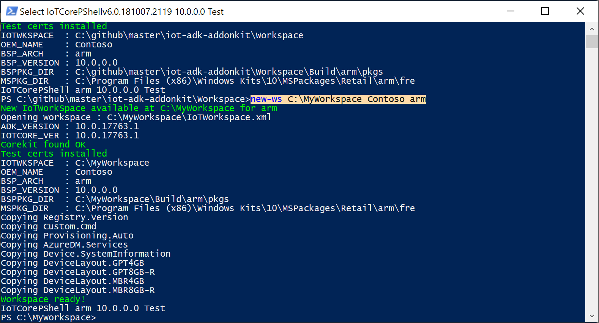
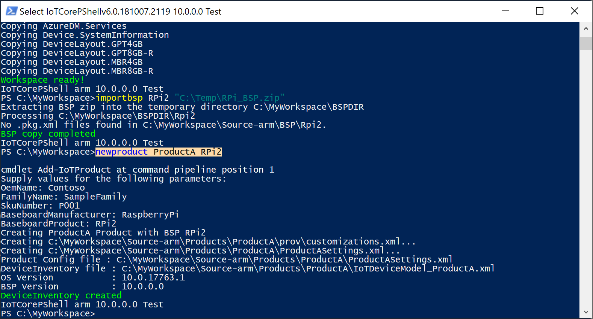
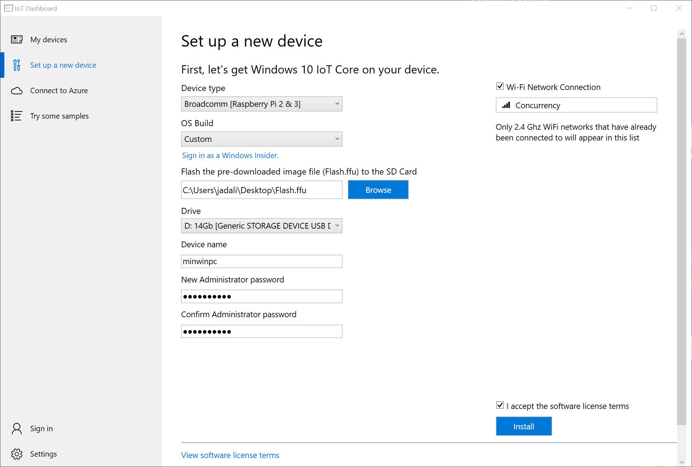
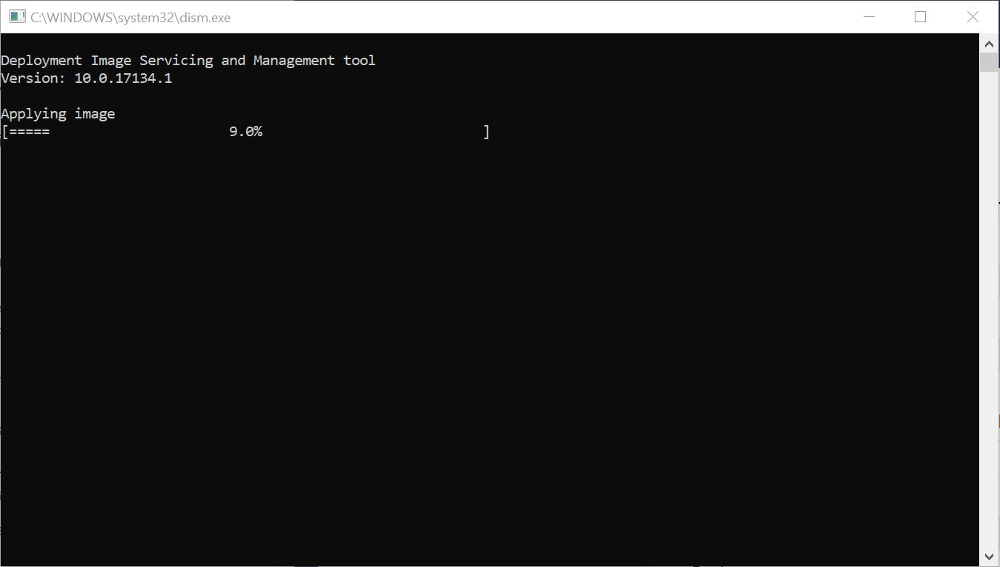
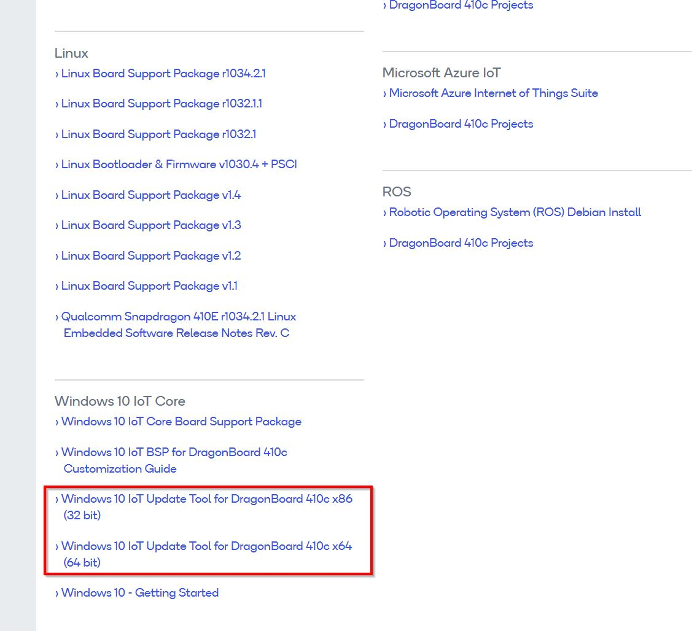
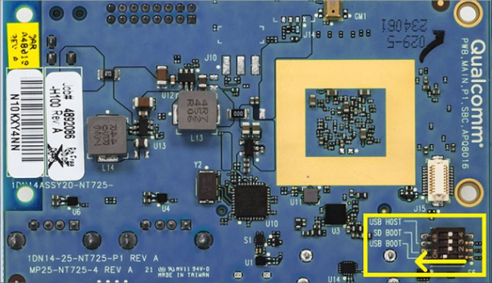
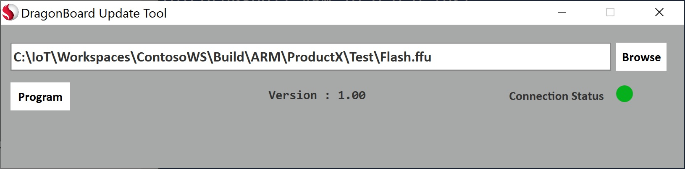
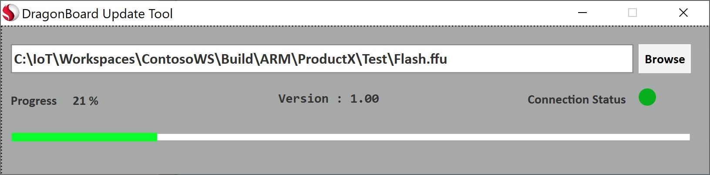
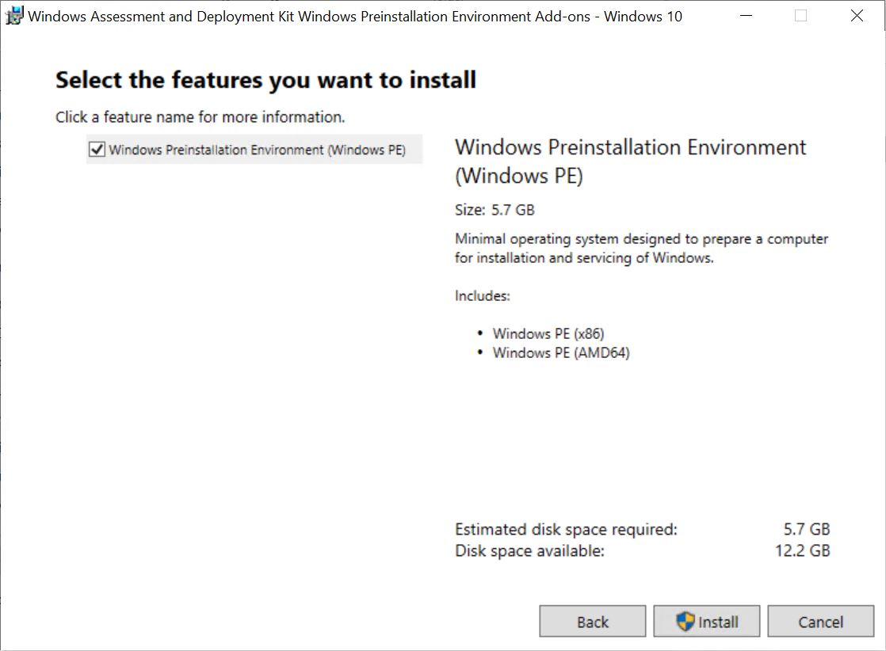

# Lab 1a: Create a basic image (create-a-basic-image)

To get started, we'll create a basic Windows 10 IoT Core (IoT Core) image and flash it onto a specific hardware device.

We'll create a product folder that represents our first design. For our first product design, we'll customize just enough for the IoT core device to boot up and run the built-in OOBE app, which we should be able to see on an HDMI-compatible monitor.

To make running these commands easier, we'll install and use the IoT Core shell, which presets several frequently-used paths and variables.

## Prerequisites

make sure your technician PC has the necessary tools installed prior to creating an IoT Core image.

See [Get the tools needed to customize Windows IoT Core](set-up-your-pc-to-customize-iot-core.md) to get your technician PC ready.

> [!IMPORTANT]
> The version of ADK used must match the version of IoT Core Packages used below.

You will need the following tools installed to complete this section:
-   Windows Assessment and Deployment KiT (Windows ADK)
-   Windows 10 IoT Core packages
-   IoT Core ADK Add-Ons
-   IoT Core PowerShell environment
-   A text editor like Notepad or VS Code

## Create a Basic Image

### Create a Workspace

1.  In Windows Explorer, go to the folder where you installed the IoT Core ADK Add-Ons, for example, **C:\\IoT-ADK-AddonKit**, and open **IoTCorePShell.cmd**. It should prompt you to run as an administrator.

This will load the PowerShell module and also check the versions of the ADK, IoT Core kit. This will also check for the test certificates in the certificate store and if not present, install them automatically.

Troubleshooting: Error: "The system cannot find the path specified". If you get this, right-click the icon and modify the path in "Target" to the location you've chosen to install the tools.

2.  In the IoTCorePShell, create a new workspace say `C:\MyWorkspace` with an OEM name `Contoso` for the architecture `arm` using [New-IoTWorkspace](https://github.com/ms-iot/iot-adk-addonkit/blob/master/Tools/IoTCoreImaging/Docs/New-IoTWorkspace.md)
``` powershell
New-IoTWorkspace C:\MyWorkspace Contoso arm
(or) new-ws C:\MyWorkspace Contoso arm
```

IoT Core supports four architectures, x64,x86,arm and arm64.

Only alphanumeric characters are supported in the OEM name as this is used as a prefix for various generated file names.

This generates the IoTWorkspace.xml and sets a version number for the design, which you can use for future updates. The first version number defaults to 10.0.0.0.

The required packages such as Registry.Version, Custom.Cmd and Provisioning.Auto will be imported into the workspace automatically.



3. Import sample packages into the workspace. You may choose to import the packages selectively or import all.
``` powershell
# Importing Recovery packages from sample workspace (create-a-basic-image)
Import-IoTOEMPackage Recovery.*
(or) importpkg Recovery.*
# Below example imports all packages from the sample workspace (create-a-basic-image)
Import-IoTOEMPackage *
(or) importpkg *
```

### Import a Raspberry Pi BSP 

This next step is to take the Board Support Package files and extra/build their .CAB files to include in the FFU file. 

1. Download [RPi_BSP.zip](https://github.com/ms-iot/iot-adk-addonkit/releases/download/17134_v5.3/RPi_BSP.zip) to a local directory, say `C:\Downloads\RPi_BSP.zip`.

2. Import the bsp using [Import-IoTBSP](https://github.com/ms-iot/iot-adk-addonkit/blob/master/Tools/IoTCoreImaging/Docs/Import-IoTBSP.md)
``` powershell
Import-IoTBSP RPi2 C:\Downloads\RPi_BSP.zip
(or) importbsp RPi2 C:\Downloads\RPi_BSP.zip
```

For more information on available BSPs, see [Windows 10 IoT Core BSPs](/windows/iot-core/build-your-image/createbsps).

### <span id="Create_a_test_project"></span>Create a test project

From the **IoT Core Shell Environment**, create a new product folder that uses the Raspberry Pi 2 BSP. This folder represents a new device we want to build, and contains sample customization files that we can use to start our project. Create a new product using [Add-IoTProduct](https://github.com/ms-iot/iot-adk-addonkit/blob/master/Tools/IoTCoreImaging/Docs/Add-IoTProduct.md)

``` powershell
Add-IoTProduct ProductA RPi2
(or) newproduct ProductA RPi2
```
You will be prompted to enter the **SMBIOS** information such as Manufacturer name (OEM name), Family, SKU, BaseboardManufacturer and BaseboardProduct. Here are some example values:

-   **System OEM Name:** Fabricam
-   **System Family Name:** FabricamHub
-   **System SKU Number:** AI-001
-   **Baseboard Manufacturer** Arrow
-   **Baseboard Product:** Raspberry Pi 2

The BSP name is the same as the folder name for the BSP. You can see which BSPs are available by looking in the `C:\MyWorkspace\Source-<arch>\BSP` folders.

This creates the folder: `C:\MyWorkspace\Source-<arch>\Products\\ProductA`.



### <span id="Build_an_image"></span>OemCustomization.cmd File

Every image includes a file `oemcustomization.cmd` which will run on every boot up of your device. You have the ability to modify this file to customize what executes on boot up. This file is located under  `C:\MyWorkspace\Source-<arch>\Products\\ProductA` in this example. The contents of the file is as follows:

```
@echo off
REM OEM Customization Script file
REM This script if included in the image, is called everytime the system boots.

reg query HKLM\Software\IoT /v FirstBootDone >nul 2>&1

if %errorlevel% == 1 (
    REM Enable Administrator User
    net user Administrator p@ssw0rd /active:yes
    if exist C:\Data\oobe (
        call folderpermissions.exe 'C:\Data\oobe -e'
    )
REM - Enable the below if you need secure boot/bitlocker
REM Enable Secureboot
REM if exist c:\IoTSec\setup.secureboot.cmd  (
REM    call c:\IoTSec\setup.secureboot.cmd
REM )

REM Enable Bitlocker
REM if exist c:\IoTSec\setup.bitlocker.cmd  (
REM    call c:\IoTSec\setup.bitlocker.cmd
REM )
    reg add HKLM\Software\IoT /v FirstBootDone /t REG_DWORD /d 1 /f >nul 2>&1
)

REM The below should be called on every boot
if exist C:\RecoveryConfig\Recovery.BcdEdit.cmd (
    call C:\RecoveryConfig\Recovery.BcdEdit.cmd
)

REM Set the crashdump file locations to data partition, set on every boot.
reg add "HKEY_LOCAL_MACHINE\SYSTEM\CurrentControlSet\Control\CrashControl" /v DedicatedDumpFile /t REG_SZ /d C:\Data\DedicatedDumpFile.sys /f
reg add "HKEY_LOCAL_MACHINE\SYSTEM\CurrentControlSet\Control\CrashControl" /v DumpFile /t REG_SZ /d C:\Data\MEMORY.DMP /f
```

> [!NOTE]
> Please be aware that security features like BitLocker and SecureBoot are disabled by default for a custom test image. If you wish to include these features (in a retail image) you can uncomment out the appropriate lines in the file, prior to building your image.

> [!NOTE]
> Please be aware that the commands in this file run with local system privilege.

### Build Packages

From the IoT Core Shell, get your environment ready to create products by building all of the packages in the working folders using [New-IoTCabPackage](https://github.com/ms-iot/iot-adk-addonkit/blob/master/Tools/IoTCoreImaging/Docs/New-IoTCabPackage.md):

``` powershell
New-IoTCabPackage All
(or) buildpkg All
```

> [!NOTE]
> If you get SignTool errors when building the packages in Test mode, please run `installoemcerts.cmd` to install the test certificates on your Technician PC.

### <span id="Build_an_image"></span>Build an image

1.  Eject any removable storage drives, including the Micro SD card and any USB flash drives.

2. Build the FFU image file by entering the following command in the IoT Core PowerShell Environment using [New-IoTFFUImage](https://github.com/ms-iot/iot-adk-addonkit/blob/master/Tools/IoTCoreImaging/Docs/New-IoTFFUImage.md):

``` powershell
New-IoTFFUImage ProductA Test
(or) buildimage ProductA Test
```

This builds an FFU file with your basic image at `C:\MyWorkspace\Build\<arch>\ProductA\Test`. This test image will include additional tools that can be used for debugging purposes. Building the final FFU file will take around 10 to 30 minutes to complete.

To direct all output to console instead of log file, add `-Verbose` flag, such as the one below.

```powershell
new-IoTFFUImage -Verbose ProductX Test
```
> [!NOTE]
> If you get either 0x80070005 or 0x800705b4 as an error code,  unplug all external drives (including micro SD cards and USB thumb drives), and try again. If this doesn't work, go back to [Set up your PC and download the samples](set-up-your-pc-to-customize-iot-core.md) and make sure everything's installed.

## <span id="Flash_an_image"></span>Flash a Windows IoT Core image

Now that your FFU image file is built, you can ues this file to flash and deploy th eimage to your device. Listed below ar ethe steps to flash the FFU image file to specific manufacturer devices. 

### <span id="Flash_an_image"></span>Prerequisites/Requirements

You will need the following tools installed to complete this section:
-   Windows IoT Core Dashboard (Raspberry Pi only)
-   Dragonboard Update Tool (Qualcomm DragonBorad only)
-   Deployment Imaging and Servicing and management (DICM) tool (Intel devices only)

Since we're using Raspberry Pi here, we'll start with Raspberry Pi but also explain how to flash images on other devices.

#### <span id="Flash_an_image"></span>Raspberry Pi

1.  Start the **Windows IoT Core Dashboard**.

2.  Plug your micro SD card into your technician PC, and select it in the tool.

3.  From the **Setup a new device** section, select **Broadcomm [Raspberry Pi 2 & 3]** under **Device Type**.

4. Select **Custom** under OS Build.

5. Click **Browse** and navigate and select the FFU file you created earlier. In this case, your FFU file is located at  `C:\MyWorkspace\Build\<arch>\ProductA\Test\Flash.ffu`. Then click **Next**.

6. Verify that your microSD card is listed under the **Drive** selection.

7. Optionally, you can set the **Device Name** and **Administrator Password** selections for your device.

8. Check the **I accept the software license terms** checkbox (lower right) and click **Install**.



Windows IoT Core Dashboard will now open a command window and use DISM (Deployment Image Servicing and Management Tool) to flash the FFU file to your microSD card.



> [!NOTE]
> Alternatively, you can also use the **DISM** command to manually flash the image:
> `dism.exe /Apply-Image /ImageFile:"D:\flash.ffu" /ApplyDrive:\\.\PhysicalDrive0 /SkipPlatformCheck`

Once the flashing process is complete, eject the microSD card from the technician PC and insert it into the Raspberry Pi. Reconnect the power to boot Windows IoT Core. You should see the [IoT Core Default app](/windows/iot-core/develop-your-app/iotcoredefaultapp), which shows basic information about the image.

#### <span id="Flash_an_image"></span>Qualcomm
##### <span id="Flash_an_image"></span>DragonBoard 410c

Qualcomm has provided the [Dragonboard Update Tool](https://developer.qualcomm.com/hardware/dragonboard-410c/software) application, which we will use to flash the FFU image file to the Dragonboard 410c. You can download either the x86 or x64 version (we recommend x64).



Once you have installed the **DragonBoard Update Tool**, you must first place the DragonBoard device in programming mode. This is done by setting dipswitch #1 (on the backside of the device) to the **ON** position:



Connect the DragonBoard device to your technician PC with a microUSB cable and power on the board.

Run the **DragonBoard Update Tool**, browse for the FFU image file you are deploying, and press the **Program** button. You should see a green **Connection Status**, and a progress bar when the device is flashing the FFU file.

Once the flashing process is complete, disconnect power from the board, as well as the microUSB cable. You then need to flip the dipswitch #1 back to the **OFF** position. Reconnect the power to boot Windows IoT Core.




#### <span id="Flash_an_image"></span>Intel
##### <span id="Flash_an_image"></span>Apollo Lake/Braswell/Cherry Trail

We will be using the DISM (Deployment Image and Servicing Management Tool) and a bootable USB stick to flash the FFU image file to the specified Intel device (Apollo Lake/Braswell/Cherry Trail). Addition information on DISM can be found [here](/windows-hardware/manufacture/desktop/dism---deployment-image-servicing-and-management-technical-reference-for-windows.md).

##### <span id="Flash_an_image"></span>Creating a USB Bootable Drive
We first need to create a bootable USB drive that we can use to boot on the specified Intel hardware device. We can use Window PE (WinPE) for this (addition info on WinPE is [here](/windows-hardware/manufacture/desktop/winpe-intro.md)).

1. Install WinPE from the [Windows ADK Windows Preinstallation Environment Add-ons](/windows-hardware/get-started/adk-install#winADK).



2. Prepare USB Drive

The USB drive you wish to use must be properly formatted before we can load WinPE on it. Follow these teps to properly format your USB drive:

-   Run the `diskpart` tool from an administrative command prompt
-   Run `list disk` to see the list of available disks
-   Run `select disk X`, where X corresponds to the disk number of your USB drive
-   Run `clean` to clean the selected disk

> [!NOTE]
> If you encounter the following error, run `convert mbr`:

```
ERROR: Failed to format "F:"; DiskPart errorlevel -2147212244
```

-   Run `create partition primary` to create a primary partition on the disk
-   Run `format fs=fat32 quick` to format the drive
-   Run `assign` to assign the drive
-   Exit `diskpart`. Your USB drive is now formatted and ready to have WinPE installed.

3. Create WinPE working files

We now need to create a working copy of the Windows PE files on the technician PC. This can be done using the **Deployment and Imaging Tools Environment** command line program. The easiest way to start the `Deployment and Imaging Tools Environment` is to search for deploy via Start Menu.

Run the **Deployment and Imaging Tools Environment** command line program as an administrator, and run the following command:

```
copype amd64 C:\WinPE_amd64
```

This will create the working copy of Windows PE files at **C:\WinPE_amd64**.

Insert your USB drive on he technician PC and run this command to install Windows PE on the USB drive. Make sure you can replace X with the drive letter of your USB drive:

```
MakeWinPEMedia /UFD C:\WinPE_amd64 X:
```
4. Copy your FFU file to the root drive of your USB drive.
5. Insert your USB drive into your Intel hardware device and boot from the USB drive. You may have to enter the BIOS (or Boot Menu) of the hardware device to specify to boot from a USB drive.
6. Once the Windows PE environment boots up, you will see a command window. Change the drive and current directory to the location of your FFU file (depending on drive enumeration, it could be in C: or D: ..etc.) and run the following command to flash the FFU image file:

```
dism.exe /Apply-Image /ImageFile:"C:\IoT\Workspaces\ContosoWS\Build\ARM\ProductX\Test\flash.ffu" /ApplyDrive:\\.\PhysicalDrive0 /SkipPlatformCheck
```

> [!NOTE]
> Most of the time, the on-board storage target to be flashed is enumerated as `PhysicalDrive0`, however, if there are multiple storage devices, it can enumerate as other drive number. You can use the `list disk` command in `diskpart` to verify the drive number.

8. Once the flashing process is complete, power down the hardware device and remove the USB drive. Reconnect power to the hardware device to boot up Windows IoT Core.

##### <span id="Flash_an_image"></span>Diskpart Commands

```
C:\>diskpart
 Microsoft DiskPart version 10.0.17134.1
 Copyright (C) Microsoft Corporation.
 On computer: LWIN-CNCY-BUILD

 DISKPART> list disk

 Disk ###  Status         Size     Free     Dyn  Gpt
 --------  -------------  -------  -------  ---  ---
 Disk 0    Online          447 GB  1024 KB        *
 Disk 1    Online          167 GB  1024 KB        *
 Disk 2    Online           14 GB      0 B        *

 DISKPART> select disk 2
 Disk 2 is now the selected disk.

 DISKPART> clean
 DiskPart succeeded in cleaning the disk.

 DISKPART> convert mbr
 DiskPart successfully converted the selected disk to MBR format.

 DISKPART> create partition primary
 DiskPart succeeded in creating the specified partition.

 DISKPART> format fs=fat32 quick
   100 percent completed

 DiskPart successfully formatted the volume.

 DISKPART> assign
 DiskPart successfully assigned the drive letter or mount point.

 DISKPART> exit
 ```
 
 ##### <span id="Flash_an_image"></span>WinPE Commands
 
 ```
 copype amd64 C:\WinPE_amd64
 MakeWinPEMedia /UFD C:\WinPE_amd64 X:
 ```
 
  ##### <span id="Flash_an_image"></span>DISM Command (via WinPE on the Intel hardware device)
  
  ```
  X:\WinPE>d:

 D:\>dism.exe /Apply-Image /ImageFile:"C:\IoT\Workspaces\ContosoWS\Build\ARM\ProductX\Test\flash.ffu" /ApplyDrive:\\.\PhysicalDrive0 /SkipPlatformCheck
 ```

## <span id="Next_steps"></span><span id="next_steps"></span><span id="NEXT_STEPS"></span>Next steps

Leave the device on for now, and continue to [Lab 1b: Add an app to your image](deploy-your-app-with-a-standard-board.md).
