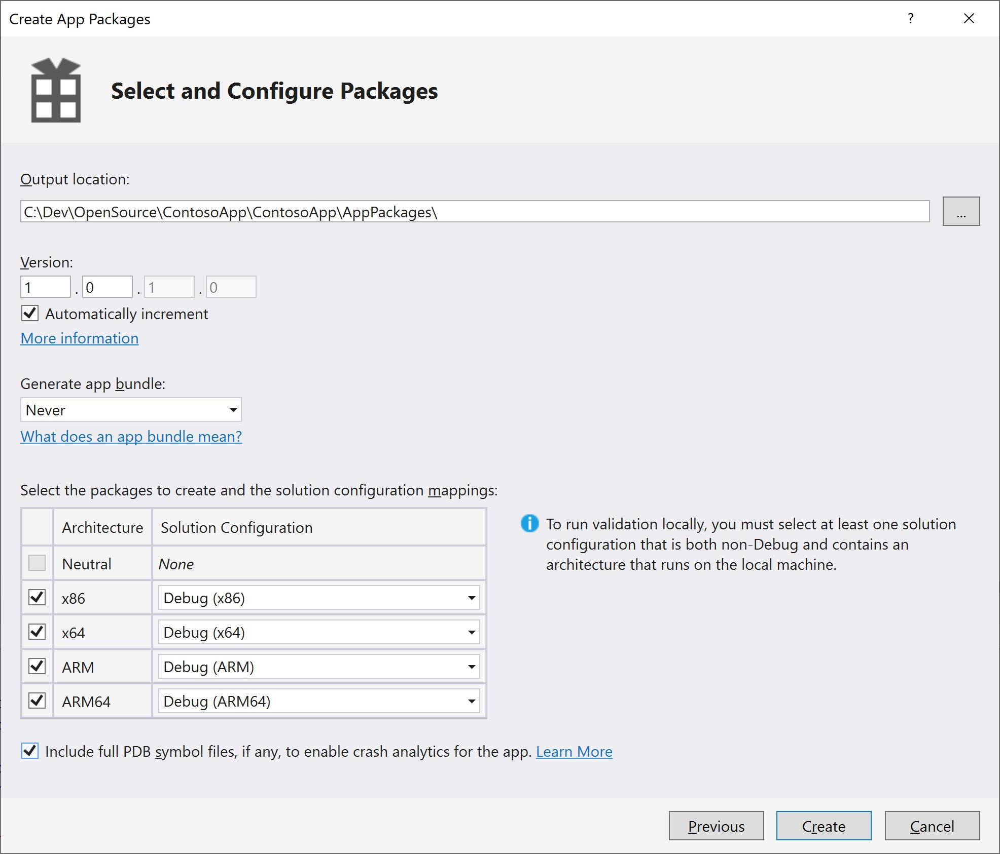

---

description: 'We''re now going to take an app (like the sample Hello, World! app), and package it up so that it can be serviced after it reaches your customers.'
ms.assetid: a801d768-0397-4f85-b68f-bd85ddcc3f1f
MSHAttr: 'PreferredLib:/library'
title: 'Lab 1b: Add an app to your image'

ms.date: 10/15/2018
ms.topic: article


---

# Lab 1b: Add an app to your image

We are now going to take an app (like the [IoT Core Default](https://github.com/ms-iot/samples/tree/develop/IoTCoreDefaultApp) app), package it up, and create a new Windows IoT Core image you can load onto your device. 

> [!NOTE]
> This process is identical for both background and foreground apps. The only difference to be aware of is that only one foreground app can be selected as the startup app, and all other installed aps will run as background apps.

## <span id="Prerequisites"></span><span id="prerequisites"></span><span id="PREREQUISITES"></span>Prerequisites/Requirements

> [!NOTE]
> As you go through this manufacturing guide, ProjectA will start to resemble the SampleA image that's in C:\\IoT-ADK-AddonKit\\Source-arm\\Products\\SampleA.

We'll use the ProjectA image we created from [Lab 1a: Create a basic image](create-a-basic-image.md).

You will also need the following tools to complete this section:
-  Visual Studio
-  Windows Assessment and Deployment Kit (Windows ADK)
-  Windows IoT Core Packages
-  IoT Core ADK Add-Ons
-  IoT Core Powershell Environment
-  A text editor like Notepad or VS Code

## Supported Application Types

### Universal Windows Platform (UWP) Apps

IoT Core is a UWP centric OS and UWP apps are its primary app type.

Universal Windows Platform (UWP) is a common app platform across all version of Windows 10, including Windows 10 IoT Core. UWP is an evolution of Windows Runtime (WinRT). You can find more information and an overview to UWP [here](/windows/uwp/get-started/universal-application-platform-guide).

### Traditional UWP Apps

UWP apps just work on IoT Core, just as they do on other Windows 10 editions. A simple, blank Xaml app in Visual Studio will properly deploy to your IoT Core device just as it would on a phone or Windows 10 PC. All of the standard UWP languages and project templates are fully supported on IoT Core.

There are a few additions to the traditional UWP app-model to support IoT scenarios and any UWP app that takes advantage of them will need the corresponding information added to their manifest. In particular the "iot" namespace needs to be added to the manifest of these standard UWP apps.

Inside the attribute of the manifest, you need to define the iot xmlns and add it to the IgnorableNamespaces list. The final xml should look like this:

``` xml
<Package
  xmlns="http://schemas.microsoft.com/appx/manifest/foundation/windows10"
  xmlns:mp="http://schemas.microsoft.com/appx/2014/phone/manifest"
  xmlns:uap="http://schemas.microsoft.com/appx/manifest/uap/windows10"
  xmlns:iot="http://schemas.microsoft.com/appx/manifest/iot/windows10"
  IgnorableNamespaces="uap mp iot">
```

### Background Apps

In addition to the traditional UI apps, IoT Core has added a new UWP app type called "Background Applications". These applications do not have a UI component, but instead have a class that implements the "IBackgroundTask" interface. They then register that class as a "StartupTask" to run at system boot. Since they are still UWP apps, they have access to the same set of APIs and are supported from the same language. The only difference is that there is no UI entry point.

Each type of IBackgroundTask gets its own resource policy. This is usually restrictive to improve battery life and machine resources on devices where these background apps are secondary components of foreground UI apps. On IoT devices, Background Apps are often the primary function of the device and so these StartupTasks get a resource policy that mirrors foreground UI apps on other devices.

You can find in-depth information on Background apps on [MSDN](/windows/iot-core/develop-your-app/backgroundapplications).

### Non-UWP (Win32) Apps

IoT Core supports certain traditional Win32 app types such as Win32 Console Apps and NT Services. These apps are built and run the same way as on Windows 10 Desktop. Additionally, there is an IoT Core C++ Console project template to make it easy to build such apps using Visual Studio.

There are two main limitations on these non-UWP applications:

1. No legacy Win32 UI support: IoT Core does not contain APIs to create classic (HWND) Windows. Legacy methods such as CreateWindow() and CreateWindowEx() or any other methods that deal with Windows handles (HWNDs) are not available. Subsequently, frameworks that depend on such APIs including MFC, Windows Forms and WPF, are not supported on IoT Core.
2. C++ Apps Only: Currently, only C++ is supported for developing Win32 apps on IoT Core.

### App Service

App services are UWP apps that provide services to other UWP apps. They are analogous to web services, on a device. An app service runs as a background task in the host app and can provide its service to other apps. For example, an app service might provide a bar code scanner service that other apps could use. App services let you create UI-less services that apps can call on the same device, and starting with Windows 10, version 1607, on remote devices. Starting in Windows 10, version 1607, you can create app services that run in the same process as the host app.

Additional information regarding creating a background app service as well as consuming the service from a uwp apps (as well as background tasks/services) can be found [here](/windows/uwp/launch-resume/how-to-create-and-consume-an-app-service).

## Extend your app with services, extensions, and packages

There are many technologies in Windows 10 for extending and componentizing your app. This table should help you determine which technology you should use depending on requirements. It is followed by a brief description of the scenarios and technologies.

| Scenario                           | Resource package   | Asset package      | Optional package   | Flat bundle        | App Extension      | App service        | Streaming Install  |
|------------------------------------|:------------------:|:------------------:|:------------------:|:------------------:|:------------------:|:------------------:|:------------------:|
| Third-party code plug-ins            |                    |                    |                    |                    | :heavy_check_mark: |                    |                    |
| In-proc code plug-ins              |                    |                    | :heavy_check_mark: |                    |                    |                    |                    |
| UX Assets (strings/images)         | :heavy_check_mark: | :heavy_check_mark: | :heavy_check_mark: |                    | :heavy_check_mark: |                    | :heavy_check_mark: |
| On demand content <br/> (e.g. additional Levels) |      |                    | :heavy_check_mark: |                    | :heavy_check_mark: |                    | :heavy_check_mark: |
| Separate licensing and acquisition |                    |                    | :heavy_check_mark: |                    | :heavy_check_mark: | :heavy_check_mark: |                    |
| In-app acquisition                 |                    |                    | :heavy_check_mark: |                    | :heavy_check_mark: |                    |                    |
| Optimize install time              | :heavy_check_mark: |                    | :heavy_check_mark: |                    | :heavy_check_mark: |                    | :heavy_check_mark: |
| Reduce disk footprint              | :heavy_check_mark: |                    | :heavy_check_mark: |                    |                    |                    |                    |
| Optimize packaging                 |                    | :heavy_check_mark: | :heavy_check_mark: | :heavy_check_mark: |                    |                    |                    |
| Reduce publishing time             | :heavy_check_mark: | :heavy_check_mark: | :heavy_check_mark: | :heavy_check_mark: |                    |                    |                    |

## Create an appx package

The first step is to create a Universal Windows Platform (UWP) application that will run on the IoT device. You may skip this section if you've already created and tested your UWP application

1.  Create a UWP app. This can be any app designed for IoT Core, saved as an Appx Package. For our example, we are using the [IoT Core Default](https://github.com/ms-iot/samples/tree/develop/IoTCoreDefaultApp) app.

2.  In Visual Studio, save your application as an Appx package. This is done by clicking **Project > Store > Create App Packages** > **I want to Create Packages for Sideloading** > **Next**

3.  Select **Output location** as C:\DefaultApp (or any other path that doesn't include spaces.)
    
4.  Select **Generate app bundle:** Never
    
5.  Click **Create**.



Visual Studio creates the Appx files in your specifed location for the architecture(s) you selected (Arm, x86, x64). In our example, this file is: 
C:\DefaultApp\IoTCoreDefaultApp_1.2.0.0_ARM_Debug_Test 

6.  Optional: [Test the app](test-the-app.md). Note, you may have already tested the app as part of building the project. 


## <span id="Package_the_app"></span><span id="package_the_app"></span><span id="PACKAGE_THE_APP"></span>Package the Appx

The next step is to package the Appx file, which will allow you to customize it and build it using the Windows ADK (when you build the FFU image).


1.  Open `IoTCorePShell.cmd`. It should prompt you to run as an administrator.
2. Create the package for your Appx by using [New-IoTAppxPackage](https://github.com/ms-iot/iot-adk-addonkit/blob/master/Tools/IoTCoreImaging/Docs/Add-IoTAppxPackage.md). Replace the file path location and package name with your Appx package. In our example, the command is as follows:

    ``` powershell
    Add-IoTAppxPackage "C:\DefaultApp\IoTCoreDefaultApp_1.2.0.0_ARM_Debug_Test\IoTCoreDefaultApp_1.2.0.0_ARM_Debug_Test.appx" fga Appx.MyUWPApp

    (or) newappxpkg "C:\DefaultApp\IoTCoreDefaultApp_1.2.0.0_ARM_Debug_Test\IoTCoreDefaultApp_1.2.0.0_ARM_Debug_Test.appx" fga Appx.MyUWPApp
    ```

   > [!NOTE]
   > The fga parameter indicates the Appx file is a foreground application. If you specify your package as a background application (with the bga parameter) and have no other foreground applications in the image, the system will get stuck when booting up (displays a spinner indefinitely).
   
   This creates a new folder at `C:\MyWorkspace\Source-<arch>\Packages\Appx.MyUWPApp`, copies the appx files and its dependencies and generates a customizations.xml file as well as a package xml file that is used to build the package.
   
   Be aware that if your Appx has dependencies you will need the Dependencies subdirectory to be present in the same location as your Appx when you run this command. Failure to include this will result in errors when you build your FFU image.

    This also adds a FeatureID **APPX_MYUWPAPP** to the `C:\MyWorkspace\Source-<arch>\Packages\OEMFM.xml` file.

3.  From the IoT Core Shell Environment, you can now build the package into a .CAB fileusing [New-IoTCabPackage](https://github.com/ms-iot/iot-adk-addonkit/blob/master/Tools/IoTCoreImaging/Docs/New-IoTCabPackage.md).

    ``` powershell
    New-IoTCabPackage Appx.MyUWPApp
    (or) buildpkg Appx.MyUWPApp
    ```

    This will build the package into a .CAB file under `C:\MyWorkspace\Build\<arch>\pkgs\<oemname>.Appx.MyUWPApp.cab`.


## <span id="Update_the_project_s_configuration_files"></span><span id="update_the_project_s_configuration_files"></span><span id="UPDATE_THE_PROJECT_S_CONFIGURATION_FILES"></span>Update the project's configuration files

You can now update your project configuration files to include your app in the FFU image biuld.

1.  Add the FeatureID for our app package using [Add-IoTProductFeature](https://github.com/ms-iot/iot-adk-addonkit/blob/master/Tools/IoTCoreImaging/Docs/Add-IoTProductFeature.md):

    ``` powershell
    Add-IoTProductFeature ProductA Test APPX_MYUWPAPP -OEM
    (or) addfid ProductA Test APPX_MYUWPAPP -OEM
    ```
    
    This adds a FeatureID called **APPX_HELLOWOLRDAPP** to the specified product's Test OEMInput XML file (`C:\IoT\Workspaces\ContosoWS\Source-arm\<product name>\TestOEMInput.xml` file).

2. Remove the sample test apps IOT_BERTHA using [Remove-IoTProductFeature](https://github.com/ms-iot/iot-adk-addonkit/blob/master/Tools/IoTCoreImaging/Docs/Remove-IoTProductFeature.md)

    ``` powershell
    Remove-IoTProductFeature ProductA Test IOT_BERTHA
    (or) removefid ProductA Test IOT_BERTHA
    ```

## <span id="Build_and_test_the_image"></span><span id="build_and_test_the_image"></span><span id="BUILD_AND_TEST_THE_IMAGE"></span>Build and test the image

From the IoT Core PowerShell Environment, get your environment ready to create products by building all of the packages in the working folders (using New-IoTCabPackage):

``` powershell
New-IoTCabPackage All
(or) buildpkg all
```
Build the FFU image again, as specified in [Lab 1a: Create a basic image](create-a-basic-image.md). You can use this command:

``` powershell
New-IoTFFUImage ProductX Test
(or)buildimage ProductX Test 
```

Once the FFU file has been build (it should now include your app), you can flash it to your hardware device as specified in
[Lab 1a](./create-a-basic-image.md#flash-a-windows-iot-core-image).

To learn how to install an appx file on an IoT device, view the [Install your app](/windows/iot-core/develop-your-app/appinstaller) documentation for more information.

## <span id="Related_topics"></span> Related topics

[Update apps on your IoT Core devices](/windows-hardware/service/iot/updating-iot-core-apps)

## <span id="Next_steps"></span><span id="next_steps"></span><span id="NEXT_STEPS"></span>Next steps

[Lab 1c: Add a file and a registry setting to an image](add-a-registry-setting-to-an-image.md)