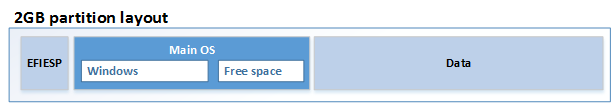
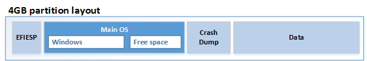

---

description: 'IoT Device Layout'
title: 'IoT Device Layout'

ms.date: 05/02/2017
ms.topic: article


---

# IoT Device Layout

When modifying an IoT Core board support package (BSP), you can change the drive partitions and layout by modifying the DeviceLayout files.

## Partition layout

IoT Core supports UEFI (GPT) and legacy BIOS (MBR) partition layouts. Most IoT Core devices use UEFI and GPT-style partitions, though Raspberry Pi 2 uses MBR-style partitions. To learn more about UEFI, read [Boot and UEFI](/windows-hardware/drivers/bringup/boot-and-uefi) and the [Windows and GPT FAQ](/windows-hardware/manufacture/desktop/windows-and-gpt-faq).  

Sample partition layouts included in the ADK Add-Ons:
-  \iot-adk-addonkit\Common\Packages\DeviceLayout.GPT4GB\devicelayout.xml
-  \iot-adk-addonkit\Common\Packages\DeviceLayout.GPT4GB-R\devicelayout.xml
-  \iot-adk-addonkit\Common\Packages\DeviceLayout.MBR4GB\devicelayout.xml
-  \iot-adk-addonkit\Common\Packages\DeviceLayout.MBR4GB-R\devicelayout.xml

These files use three component files:
-  **DeviceLayout.\<Name>\.pkg.xml**: Package file, creates packages for DeviceLayout and OEMDevicePlatform.xml.
-  **DeviceLayout.xml**: Specifies the device partition layout
-  **OEMDevicePlatform.xml**: Specifies the amount of free blocks available in the device and which partitions are compressed.

### Partition layout (DeviceLayout.xml)

IoT Core requires 3 mandatory partitions (EFIESP, MainOS and Data).  You can optionally include other partitions, for example, a CrashDump partition. 
Sizes are calculated in sectors, the default sector is 512 bytes. 

Supported properties:

**EFI**: Fixed-size partition with the boot manager, boot configuration database. This partition is required for both MBR/GPT-style devices.

- Name: `EFIESP`
	
- Type: For MBR, use `0x0C`. For GPT, use `{c12a7328-f81f-11d2-ba4b-00a0c93ec93b}`
	
- FileSystem: `FAT`
	
- TotalSectors: `65536`  (= 32MB)
	
- Bootable: `true`
	
- RequiredToFlash: `true`
	
**MainOS**: OS and OEM-preloaded apps. This partition requires a minimum number of free sectors (MinFreeSectors) for normal operations. 

- Name: `MainOS`

- Type: For MBR, use `0x07`. For GPT, use `{ebd0a0a2-b9e5-4433-87c0-68b6b72699c7}`
	
- FileSystem: `NTFS`
	
- MinFreeSectors: `1048576`  (= 512MB)
	
- ByteAlignment: `0x800000`
	
- ClusterSize: `0x1000`  (This size is recommended to keep the partition size manageable.)
	
**Data**: User data partition, user registry hives, apps, apps data. This partition is typically set to use the remainder of the storage space on the device. (UseAllSpace: True)
    
- Name: `Data`
    
- Type: For MBR, use `0x07`. For GPT, use `{ebd0a0a2-b9e5-4433-87c0-68b6b72699c7}`
	
- FileSystem: `NTFS`
	
- UseAllSpace: `true`
	
- ByteAlignment: `0x800000`
	
- ClusterSize: `0x4000`  (This partition tends to be larger, so 0x4000 is recommended. 0x1000 is also OK.)

**Crash dump partition**: Optional partition, used to collect data from crash dumps. When used, size is given in total sectors.

-    Name: `CrashDump`
   
-    Type: For MBR, use `0x07`. For GPT, use `{ebd0a0a2-b9e5-4433-87c0-68b6b72699c7}`
	
-    FileSystem: `FAT32`
   
-    TotalSectors: `1228800`  (= 600 MB)

### Required fields

These fields are required, the following values are supported for IoTCore: 

-    Version: `IoTUAP`

-	SectorSize: `512`

-	ChunkSize: `128`

-	DefaultPartitionByteAlignment: `0x200000`
	
### Storage Size Estimations 

The following diagrams provide an overview of two configurations. 

**2GB Configuration**  (2048MB, typically has 1843MB for storage)



|Partition    |Contents   |MB   |Sectors |Remarks                    |
|-------------|-----------|-----|--------|---------------------------|
|EFIESP       |EFIESP     |32   |65536   |EFIESP size                |
|Main OS      |Main OS    |800  |1638400 |MainOS (estimate)          |
|Main OS      |Free space |128  |262144  |MainOS Headroom            |
|Data         |Data       |883  |1808384 |Expands to fill free space |
|**TOTAL**        |           |**1843** |**3774464** |                           |


**4GB Configuration:**  (4096MB, typically has 3600MB available for storage)



|Partition    |Contents   |MB   |Sectors |Remarks                    |
|-------------|-----------|-----|--------|---------------------------|
|EFIESP       |EFIESP     |32   |65536   |EFIESP size                |
|Main OS      |Main OS    |800  |1638400 |MainOS (estimate)          |
|Main OS      |Free space |512  |1048576 |MainOS Headroom            |
|CrashDump    |Crash Dump |600  |1228800 |CrashDump Size             |
|Data         |Data       |1656 |3391488 |Expands to fill free space |
|**TOTAL**        |           |**3600** |**7372800** |         |


### Device platform layout (OEMDevicePlatform.xml)

OEMDevicePlatform.xml specifies the amount of free blocks available in the device and which partitions are compressed. Example:

``` xml
   <?xml version="1.0" encoding="utf-8"?>
   <OEMDevicePlatform xmlns:xsi="http://www.w3.org/2001/XMLSchema-instance" xmlns:xsd="http://www.w3.org/2001/XMLSchema" xmlns="http://schemas.microsoft.com/embedded/2004/10/ImageUpdate">
      <MinSectorCount>7372800</MinSectorCount>
      <DevicePlatformIDs>
        <ID>*</ID>
      </DevicePlatformIDs>
     <CompressedPartitions>
       <Name>MainOS</Name>
     </CompressedPartitions>
   </OEMDevicePlatform>
```

## Related topics

- [Windows 10 IoT Core BSPs](/windows/iot-core/build-your-image/createbsps)
- [Creating your own board support package (BSP)](create-a-new-bsp.md)
- [Boot and UEFI](/windows-hardware/drivers/bringup/boot-and-uefi)
- [Windows and GPT FAQ](/windows-hardware/manufacture/desktop/windows-and-gpt-faq)
