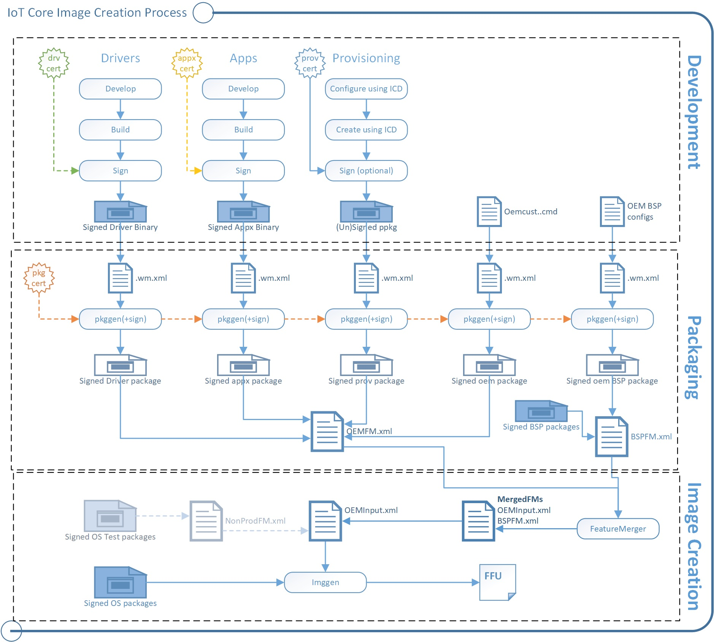

# IoT Core manufacturing guide

> [!NOTE]
> For the previous version, see [
IoT Core manufacturing guide for v5.x](https://github.com/ms-iot/iot-adk-addonkit/blob/17134/Docs/iot-core-manufacturing-guide.md#iot-core-manufacturing-guide-for-v5x).

Thinking about mass-producing devices running Windows 10 IoT Core? Use the [Windows ADK IoT Core Add-ons](iot-core-adk-addons.md) to create images that you can quickly flash onto new devices.

You can create **test images**, which include tools for quickly accessing and modifying devices. Test images are great for:

- Developers, hardware vendors, and manufacturers (OEMs) who are trying out new device designs.
- Hobbyists and organizations that are creating devices designed to run in non-networked or controlled network environments.

You can create **retail images**, which can be made more secure for public or corporate networks while still receiving updates.

You can add customizations, including apps, settings, hardware configurations, and board support packages (BSPs).

For OEM-style images, you’ll wrap your customizations into package (.cab) files. Packages let OEMs, ODMs, developers, and Microsoft work together to help deliver security and feature updates to your devices without stomping on each other's work.

Your IoT Core device with Windows 10 location service tells your apps and services where you are or where you’ve been.

From the Windows 10 IoTCore RS5 November 2019 "11 B" release (OS version 17763.865) onwards, location services for IoT Core will be configured to be set to “off”  by default. If you are an OEM and would like to turn the location services to on, please follow the below steps. This only applies to IoT Core.

Under the registry key `HKEY_LOCAL_MACHINESOFTWAREMicrosoftWindowsCurrentVersionCapabilityAccessManagerCapabilitieslocationedition`,Set the following values:

- name=`InitSystemGlobalConsentDenied`  value="0" valueType=`REG_DWORD`
- name=`InitUserGlobalConsentDenied` value="0" valueType=`REG_DWORD`

Kit builders should refer to [Lab 1c: Adding file(s) and registry settings to an image](./add-a-registry-setting-to-an-image.md) for instructions on building a custom image with these registry settings

## Scenarios

- [Get the tools needed to customize Windows IoT Core](set-up-your-pc-to-customize-iot-core.md)
- [Lab 1a: Create a basic image](create-a-basic-image.md)
- [Lab 1b: Add an app to your image](deploy-your-app-with-a-standard-board.md)
- [Lab 1c: Add file(s) and registry settings to an image](add-a-registry-setting-to-an-image.md)
- [Lab 1d: Add networking and other provisioning package settings to an image](add-a-provisioning-package-to-an-image.md)
- [Lab 1e: Add a driver to an image](add-a-driver-to-an-image.md)
- [Lab 1f: Build a retail image](build-retail-image.md)
- [Lab 2: Creating your own board support package](create-a-new-bsp.md)
- [Lab 3: Update your apps](/windows-hardware/service/iot/updating-iot-core-apps)

## Concepts

In order to clearly understand the process to create and deploy Windows IoT Core images, a few concepts and terminology must be defined first.

The process to create a Windows IoT Core image involves a number of steps, listed here:

1. Test any customization to include in the image to verify they work properly. These include apps, settings, drivers or Board support Packages (BSPs).
2. Install test certificates on your PC, and package your customizations into .CAB files.
3. Create a test Windows 10 IoT Core image that includes your customizations, along with the IoT Core package and any updates from your hardware manufacturer.
4. Flash the image to a device and test that it works. You can use the test tools built into the test image to troubleshoot any issues that may arise.
5. Once you've verified that everything works properly, obtain a valid retail certificate and sign your customizations with your retail certificate. You then should repackage the customization into new .CAB files.
6. Create a retail image with your signed .CAB files, and flash the image onto your devices.

## Terminology

### Packages

Packages (.cab files) are the logical building blocks of IoT Core. They contain all the files, libraries, registry settings, executables, and data on the device. From device drivers to system files, every component must be contained in a package. This modular architecture allows for precise control of updates: a package is the smallest serviceable unit on the device.

Each package contains:

- The contents of the package, such as a signed driver binary or a signed appx binary.
- A package definition (.wm.xml) file specifies the contents of the package and where they should be placed in the final image. See %SRC\_DIR%\\Packages\\ directory from the [Windows ADK IoT Core Add-On](./iot-core-adk-addons.md) kit for various samples of package files. As an example, take a look at [Appx.IoTCoreDefaultApp.wm.xml](https://github.com/ms-iot/iot-adk-addonkit/blob/master/Workspace/Source-arm/Packages/Appx.IoTCoreDefaultApp/Appx.IoTCoreDefaultApp.wm.xml).
- A signature. A package can be signed with a test or retail certificate.

The `pkggen` tool combines these items into signed packages. Our samples include scripts: `createpkg`, and `createprovpkg`, which call pkggen to create packages for our drivers, apps, and settings.

### Feature manifests (FMs)

After you've put everything into packages, you'll use Feature Manifest (FM files) to list which of your packages belong in the final image.

You can use as many FMs into an image as you want. In this guide, we refer to the following FMs:

- **OEMFM.xml** includes features an OEM might add to a device, such as the app and a provisioning package.
- **BSPFM.xml** includes features that a hardware manufacturer might use to define a board. For example, OEM\_RPi2FM.xml includes all of the features used for the Raspberry Pi 2.

You'll list which of the features to add by using these tags:

- &lt;BasePackages&gt;: Packages that you always included in your images, for example, your base app.
- &lt;Features&gt;\\&lt;OEM&gt;: Other individual packages that might be specific to a particular product design.

The Feature Merger tool generates the required feature identifier packages that are required for servicing the device. Run this tool whenever any changes are made to the FM files. After you change the OEM FM or OEM COMMON FM files, run `buildfm oem`. After you change the BSPFM file, run `buildfm bsp <bspname>`. These commands are run from the IoT Core shell.

### Board Support Packages (BSPs)

Board Support Packages contain a set of software, drivers, and boot configurations for a particular board, typically supplied by a board manufacturer. The board manufacturer may periodically provide updates for the board, which your devices can receive and apply. You can also create your own BSP if the board manufacturer does not provide one, and you have the corresponding set of software and driver files. Supported BSPs are listed [here](./bsphardware.md).

### Full Flash Update Image Files

Full Flash Update (FFU) files are image files that can be deployed (aka. "flashed") to a specific hardware device. When you flash a FFU file onto a device, all required software is installed on that device at the same time. An FFU image file bundles boot loaders, the Windows Operating System, drivers, peripheral images and any other required files into a single package.

### Foreground and Background Apps

There are two types of applications that can run on Windows IoT Core.

- Foreground apps - these apps have a UI. Only one app can be running on an IoT device as the foreground apps. If multiple foreground app is included in the image, only one should be set as auto start on boot.
- Background apps - these apps do not have a UI. Multiple apps can be running on an IoT device as background apps. You can configure any number of background apps to auto start.

For more information, please see [Foreground Apps](/windows/iot-core/develop-your-app/buildingappsforiotcore) or [Background Apps](/windows/iot-core/develop-your-app/backgroundapplications).

## Creating the image: ImgGen and the image configuration file (OEMInput.xml)

To create the final image, you'll use the `imggen` tool with an image configuration file, **OEMInput.xml file**.

The image configuration file lists:

- The feature manifests (FMs) and the packages that you want to install from each one.

- An **SoC** chip identifier, which is used to help set up the device partitions. The supported values for **soc** are defined in the corresponding bspfm.xml, under \<devicelayoutpackages>.

- A **Device** identifier, which is used to select the device layout. The supported values for **device** are defined in the corresponding bspfm.xml, under \<oemdeviceplatformpackages>.

- The ReleaseType (either **Production** or **Test**).

    **Retail builds**: We recommend creating retail images early on in your development process to verify that everything will work when you are ready to ship.

    These builds contain all of the security features enabled.

    To use this build type, all of your code must be signed using retail (not test) code signing certificates.

    For a sample, see %SRC\_DIR%\\Products\\SampleA\\RetailOEMInput.xml.

    **Test builds**: Use these to try out new versions of your apps and drivers created by you and your hardware manufacturer partners.

    These builds have some security features disabled, which allows you to use either test-signed or production-signed packages.

    These builds also include developer tools such as debug transport, SSH, and PowerShell, that you can use to help troubleshoot issues.

    For a sample, see %SRC\_DIR%\\Products\\SampleA\\TestOEMInput.xml.

|Area|  Retail builds | Test builds |
| --- | -------------- | ----------- |
| Image release type   | ReleaseType: **Production** | ReleaseType: **Test** |
| Package release type | Only Production Type packages are supported | Both Production Type or Test Type are supported |
| Test-signed packages | Not supported | Supported   IOT_ENABLE_TESTSIGNING feature must be included. |
| Code integrity check | Supported. By default, this is enabled. | Supported. By default, no policy is enforced |

## OK, let's try it

Start here: [Get the tools needed to customize Windows IoT Core](set-up-your-pc-to-customize-iot-core.md).