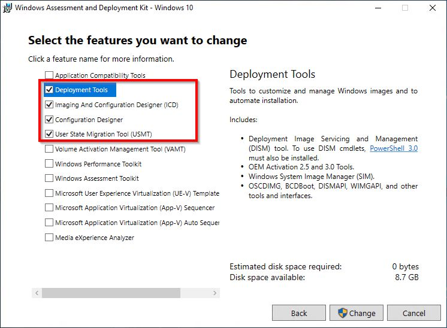
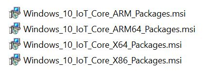
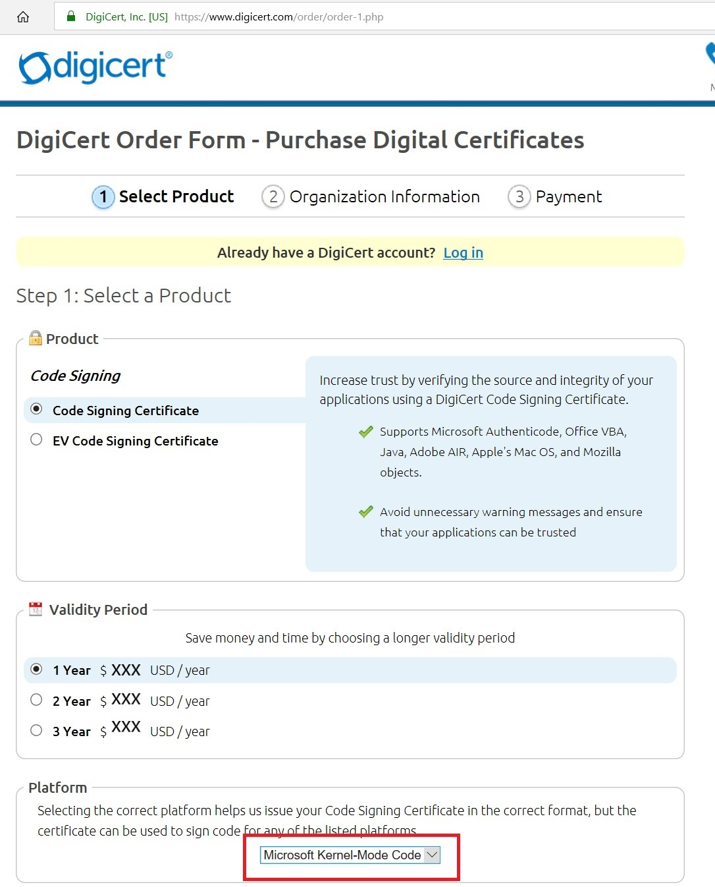

---

ms.assetid: a6243b16-54fd-4a3d-8901-4b15cebdaf40
MSHAttr: 'PreferredLib:/library'
title: Get the tools needed to customize Windows IoT Core
description: This article describes the tools needed to customize IoT Core.
ms.date: 10/15/2018
ms.topic: article
ms.description: This article describes the tools needed to customize IoT Core.

---

# Get the tools needed to customize Windows IoT Core

Here's the hardware you'll need to create OEM images using the Windows 10 IoT Core (IoT Core) ADK Add-Ons:

## PCs and devices

-   **Technician PC**: This is the PC you will be building your images on. A dedicated PC is recommended for this. This PC should have at least 15 GB of free space for installing the software and for modifying IoT Core images.

    We recommend either Windows 10 or Windows 8.1 with the latest updates. The minimum requirement is Windows 7 SP1, though this may require additional tools or workarounds for tasks such as mounting .ISO images.

-   **IoT device**: A test device or board that represents all of the devices in a single model line.

    For our labs, you'll need a Raspberry Pi 3. For a list of support devices, see [SoCs and Custom Boards](/windows/iot-core/learn-about-hardware/socsandcustomboards).

-   An **HDMI cable**, and a **monitor or TV** with a dedicated HDMI input. We'll use this to verify that the image is loaded and that our sample apps are running.

## Storage

-   A **MicroSD card**. Note that this is dependent on the device you are using. Some devices require a microSD card while others have onboard storage. For these labs, we ill use a microSD card. If your technician PC doesn't include a microSD slot, you may also need an adapter.Learn more about existing [supported storage](/windows/iot-core/learn-about-hardware/HardwareCompatList#other-hardware-peripherals) options.

## Software

Here's the software you'll need to create OEM images using the Windows 10 IoT Core (IoT Core) ADK Add-Ons:

**Install the following tools on your technician PC**

1.  [Windows Assessment and Deployment Kit (Windows ADK) for Windows 10, version 1089](https://go.microsoft.com/fwlink/?linkid=2026036) - Including at least the **Deployment Tools** and **Imaging and Configuration Designer (ICD)** features, shown below. You'll use these tools to create images and provision packages.
 **NOTE** - The version of ADK and the version of IoT Core Packages used **must** match.

2. [Windows PE add-on for the ADK for Windows 10, version 1809](https://go.microsoft.com/fwlink/?linkid=2022233) - `optional`, required only if you are adding [recovery mechanism](recovery-mechanism.md).

3.  [Windows Driver Kit (WDK)](https://developer.microsoft.com/windows/hardware/windows-driver-kit) - `optional`, required only if you are compiling drivers from source code.

4.  [Windows 10 IoT Core Packages](https://www.microsoft.com/en-us/software-download/windows10iotcore) - The .iso package adds the IoT Core packages and feature manifests used to create IoT Core images. By default, these packages are installed to **C:\\Program Files (x86)\\Windows Kits\\10\\MSPackages\\Retail**. Install one or more of the IoT Core packages, depending on the architecutre you are building an image for (Arm, Arm64, x86, x64).

5.  [IoT Core ADK Add-Ons](https://github.com/ms-iot/iot-adk-addonkit/) -  Click **Clone** or **Download** > **Download ZIP**, and extract it to a folder on the technician PC (for example, **C:\\IoT-ADK-AddonKit**). This kit includes the sample scripts and base structures you'll use to create your image. To learn about the contents, see [What's in the Windows ADK IoT Core Add-ons](iot-core-adk-addons.md)).

5.  [Windows 10 IoT Core Dashboard](https://go.microsoft.com/fwlink/p/?LinkId=708576)

6.  [The Raspberry Pi BSP](https://github.com/ms-iot/iot-adk-addonkit/releases/download/17134_v5.3/RPi_BSP.zip). Since this lab uses a Raspberry Pi, you'll need to download the Raspberry Pi BSP. If you're working with a device other than Raspberry Pi, visit the [Windows 10 IoT Core BSP](/windows/iot-core/build-your-image/createbsps) page to download other BSPs.

7. If you are buliding a Retail image, you will need to get a [code-signing certificate](/windows-hardware/drivers/dashboard/get-a-code-signing-certificate). For kernel driver signing, a Standard Code signing certificate is sufficient. You will require an EV cert to access the [Device Update Center](/windows-hardware/service/iot/using-device-update-center) in the Hardware Dev Center portal.

> [!IMPORTANT]
> Starting Windows 10 IoT Core version 1809 November 10, 2020 update(17763.1577), OEM kernel driver signing is supported. With this, the code signing certificate does not require to be chained to cross-signed root. The Cross-signed root certificates are SHA1 and will be supported till [their expiry dates](/windows-hardware/drivers/install/cross-certificates-for-kernel-mode-code-signing#cross-certificate-list). This expiry does not impact the already signed drivers in the image and impacts signing of new drivers after the expiry date. OEM signing requires secure boot and device guard features to be enabled for both retail and test images. See [IoT-ADK-AddonKit 17763-v7](https://github.com/ms-iot/iot-adk-addonkit/tree/17763-v7#17763-v7-branch) branch for the tooling updates and sample certificates.

We recommend that you purchase your code signing certificate from a Certificate Authority listed from the link above. Building Windows 10 IoT Core **retail image** or image with Secure Boot enabled requires that all kernel drivers (including all drivers in the BSP that's included in the retail image) are signed with a code signing certificate with Cross Signed root. See [Cross-Certificates for Kernel Model Code Signing](/windows-hardware/drivers/install/cross-certificates-for-kernel-mode-code-signing) and the FAQ section "Cross-Signing and SHA-256 Certificates" in [code-signing certificate](/windows-hardware/drivers/dashboard/get-a-code-signing-certificate).

As an example, if you chooes to purchase through [Digicert](https://www.digicert.com/friends/sysdev/), you must choose the "Microsoft Kernel-Mode Code" option in the Platform section:

Other helpful software:

-   **A text editor such as Notepad++**. You can also use the Notepad tool, though for some files, you won't see the line breaks unless you open each file as a UTF-8 file.

-   **A compression program such as 7-Zip**, which can uncompress Windows app packages.

-   [Visual Studio 2017](https://go.microsoft.com/fwlink/?LinkId=715695), used to create an app in [Lab 1b: Add an app to your image](deploy-your-app-with-a-standard-board.md).

## Other software

-   **An app built for IoT Core**. Our samples use the [IoT Core Default](https://github.com/Microsoft/Windows-iotcore-samples/tree/master/Samples/IoTCoreDefaultApp) app, though you can use your own.

-   **A driver built for IoT Core**. Our samples use the [GPIO KMDF demo](https://github.com/ms-iot/samples/tree/master/DriverSamples/gpiokmdfdemo) driver, though you can use your own.

## Next steps

[Lab 1a: Create a basic image](create-a-basic-image.md)