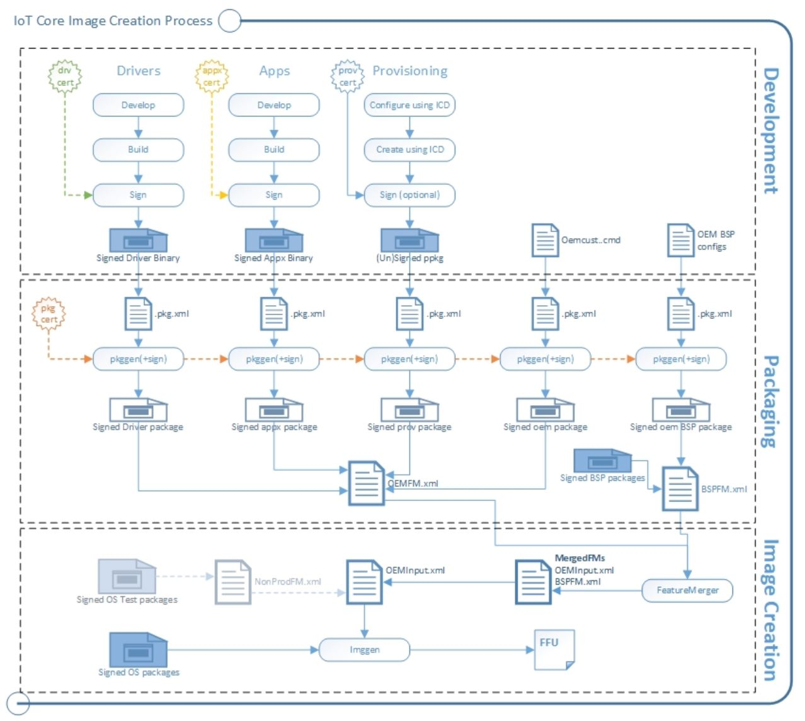

--- 
title: Concepts and Terminology
author: John Adali, Lwin Maung, Concurrency
ms.author: John Adali, Lwin Maung, Concurrency
ms.date: 09/14/2018 
ms.topic: article 
description: Concepts and Terminology definitions for Windows IoT Core Manufacturing Guide.
keywords: Windows 10 IoT Core, 
--- 

# Concepts and Terminology
In order to clearly understand the process to create and deploy Windows IoT Core images, a few concepts and terminology must be defined first.

## Concepts
The process to create a Windows IoT Core image involves a number of steps, listed here:

1. Test any customization to include in the image to verify they work properly. These include apps, settings, drivers or Board Support Packages (BSPs).
2. Install test certificates on the Technician PC and package your customizations into .CAB files.
3. Create a test Windows IoT Core image that includes your customizations, along with the IoT Core package and any updates from your hardware manufacturer.
4. Flash the image onto a device and test that it works. You can use the test tools built into the test image to troubleshoot any issues that may arise.
5. Once you've verified that everything works properly, obtain a valid retail certificate and sign your customizations with your retail certificate. You then should repackage the customizations into new .CAB files.
6. Create a retail image with your signed .CAB files and flash the image onto your devices.

## Terminology

### Packages
Packages are the logical building blocks of IoT Core. They contain all the files, libraries, registry settings, executables, and data on the device. From device drivers to system files, every component must be contained in a package. This modular architecture allows for precise control of updates: a package is the smallest serviceable unit on the device.

Each package contains:

* The contents of the package, such as a signed driver binary or a signed appx binary.
* A package definition (.pkg.xml) file specifies the contents of the package and where they should be placed in the final image. See `%SRC_DIR%\Packages` directory from the [Windows ADK IoT Core Add-On](https://docs.microsoft.com/en-us/windows-hardware/manufacture/iot/iot-core-adk-addons) kit for various samples of package files.
* A signature. This can be a test or retail certificate.

The `pkggen` tool combines these items into signed packages. Our samples include scripts: `createpkg`, and `createprovpkg`, which call `pkggen` to create packages for our drivers, apps, and settings.

The process is similar to that used by Windows 10 Mobile. To learn more about creating packages, see [Creating mobile packages](https://docs.microsoft.com/en-us/windows-hardware/manufacture/mobile/creating-mobile-packages).

### Feature Manifests (FMs)
After you've put everything into packages, you'll use FM files to list which of your packages belong in the final image.

You can use as many FMs into an image as you want. In this guide, we refer to the following FMs:

* **OEMFM.xml** includes features an OEM might add to a device, such as the app and a provisioning package.
* **BSPFM.xml** includes features that a hardware manufacturer might use to define a board. For example, OEM_RPi2FM.xml includes all of the features used for the Raspberry Pi 2.

The process is similar to that used by Windows 10 Mobile. To learn more, see [Feature manifest file contents](https://docs.microsoft.com/en-us/windows-hardware/manufacture/mobile/feature-manifest-file-contents).

You'll list which of the features to add by using these tags:

* \<BasePackages>: Packages that you always include in your images (for example, your base app).
* \<Features>\\\<OEM>: Other individual packages that might be specific to a particular product design.

The Feature Merger tool generates the required feature identifier packages that are required for servicing the device. Run this tool whenever any changes are made to the FM files. After you change the OEM FM or OEM COMMON FM files, run `buildfm oem`. After you change the BSPFM file, run `buildfm bsp <bspname>`. These commands are run from the IoT Core shell.

### Board Support Packages (BSPs)

Board Support Packages contain a set of software, drivers, and boot configurations for a particular board, typically supplied by a board manufacturer. The board manufacturer may periodically provide updates for the board, which your devices can receive and apply. You can also create your own BSP if the board manufacturer does not provide one, and you have the corresponding set of software and driver files. Supported BSPs are listed [here](04a-BoardSupportPackages.md "Board Support Packages").

### Full Flash Update Image Files
Full Flash Update (FFU) files are image files that can be deployed (aka "flashed") to a specific hardware device. When you flash a FFU file onto a device, all required software is installed on that device at the same time. An FFU image file bundles boot loaders, the Windows Operating System, drivers, peripheral images and any other required files into a single package.

### Foreground and Background Apps
There are two types of applications that can run on Windows IoT Core.
* Foreground apps - these apps have a UI. Only one app can be running on an IoT device as the foreground app
* Background apps - these apps do not have a UI. Multiple apps can be running on an IoT device as background apps

For more information, please see [Foreground Apps](../develop-your-app/BuildingAppsForIoTCore.md) or [Background Apps](../develop-your-app/BackgroundApplications.md).

## Next Steps
[Get the tools needed to create Windows IoT Core Images](03-ToolsNeeded.md)

