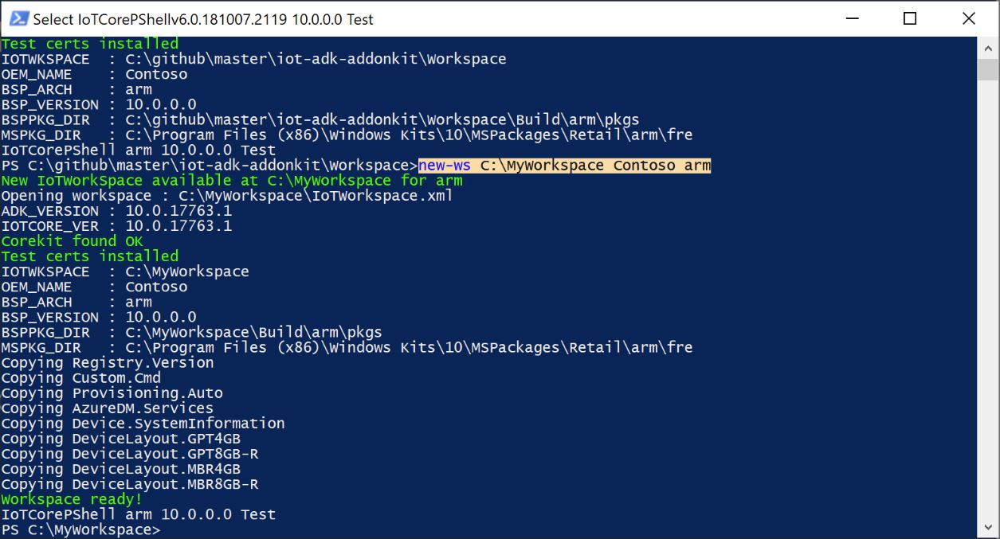
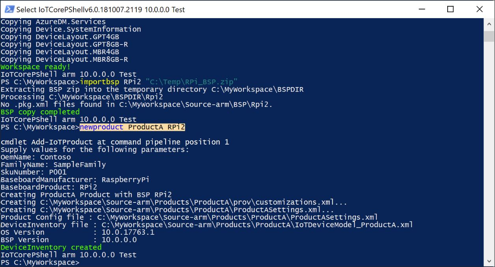

# Creating a Basic IoT Core Image
To get started, we will detail the steps needed to create a basic Windows IoT Core image and flash it onto a specific hardware device.

## Goals
* Create a project using Windows ADK Toolkit that can be used to create Windows IoT Core images
* Build a Full Flashable Update (FFU) file for a Windows IoT Core test image

## Prerequisites/Requirements
Make sure your technician PC has the necessary tools installed prior to creating an IoT Core image. See [Get the tools needed to create Windows IoT Core images](03-ToolsNeeded.md) for details.

You will need the following tools installed to complete this section:
* **[Windows Assessment and Deployment Kit (Windows ADK)](https://docs.microsoft.com/en-us/windows-hardware/get-started/adk-install#winADK)**. This provides the OEM-specific tooling and files to create and customize images for Windows IoT Core.
* **[Windows 10 IoT Core Packages](https://www.microsoft.com/en-us/software-download/windows10iotcore)** for your specific architecture. These provide the IoT Core packages and feature manifest files needed to build custom Windows IoT images for the specific architecture (ARM, ARM64, x86, x64).
* **[IoT Core ADK Add-Ons](https://github.com/ms-iot/iot-adk-addonkit/)**. These provide the sample scripts and base structure for building custom Windows IoT Core images.
* **Iot Core Shell**. This is included with the Windows ADK and is the commandline window interface where you execute commands to build custom FFU images for Windows IoT Core.
* A text editor like **Notepad** or **VS Code**.

## Create a Workspace
1. In Windows Explorer, go to the folder where you installed the IoT Core ADK Add-Ons, for example, C:\IoT-ADK-AddonKit, and open IoTCorePShell.cmd. It should prompt you to run as an administrator.

   This will load the powershell module and also check the versions of the ADK, IoT Core kit. This will also check for the test certificates in the certificate store and if not present, install them automatically.

   If you receive the error "The system cannot find the path specified", right-click the icon and modify the path in "Target" to the location you've chosen to install the tools.

2. In the IoTCorePShell, create a new workspace (for example, `C:\Myworkspace`) with an OEM name of `Contoso` for the architecture `arm` using [New-IoTWorkspace](https://github.com/ms-iot/iot-adk-addonkit/blob/master/Tools/IoTCoreImaging/Docs/New-IoTWorkspace.md)

    ```powershell
    New-IoTWorkspace C:\MyWorkspace Contoso arm
    (or) new-ws C:\MyWorkspace Contoso arm
    ```

   IoT Core supports four architects, x64, x86, arm and arm64.

   Only alphanumeric characters are supports in the OEM name as this is used as a prefix for various generated file names.

   This generates the IoTWorkspace.xml and sets a version number for the design, which you can use for future updates. The first version number defaults to 10.0.0.0. (Why a four-part version number? Learn about versioning schemes in [Update requirements](https://docs.microsoft.com/windows-hardware/service/mobile/update-requirements)).

   The required packages such as Registry.Version, Custom.Cmd and Provisioning.Auto will be imported into the workspace automatically.

   

## Building BSPs 
The next step is to take the Board Support Package files and extract/build their .CAB files to include in the FFU file. There are some differences in the steps to do this for the different BSPs, so please visit the appropriate section for the hardware device you are working with.

[Selecting a Board Support Package](04a-BoardSupportPackages.md)

## Build Packages 
From IoT Core Shell, get your environment ready to create products by building all of the packages in the working folders (using [New-IoTCabPackage](https://github.com/ms-iot/iot-adk-addonkit/blob/master/Tools/IoTCoreImaging/Docs/New-IoTCabPackage.md)): 
    
    ```powershell
    New-IoTCabPackage All
    (or) buildpkg all 
    ```

## Create a test project 
From IoT Core Shell, create a new product folder that uses the BSP you are working with. This folder represents a new device we want to build an image for, and contains sample customization files that we can use to start our project. For example, to create a product folder called `MyRPiProduct` that uses the Raspberry Pi 2 or 3 BSP files, execute the following command (using [Add-IoTProduct](https://github.com/ms-iot/iot-adk-addonkit/blob/master/Tools/IoTCoreImaging/Docs/Add-IoTProduct.md)):

    ```powershell
    Add-IoTProduct MyRPiProduct RPi2
    (or) newproduct MyRPiProduct RPi2 
    ```

You will be prompted to enter the **SMBIOS** information, such as Manufacturer Name (OEM Name), Family, SKU, BaseboardManufacturer, and BaseboardProduct.

The BSP name is the same as the folder name for the BSP. You can see which BSPs are available by looking in the **C:\MyWorkspace\Source-\< arch >\BSP** folders. 

This creates the folder: **C:\MyWorkspace\Source-< arch >\Products\\MyRPiProduct**. 

   

## Build an image 
Eject any removable storage drives, including the microSD card and any USB flash drives. 

Build the FFU image file by entering the following command in IoT Core Shell (using [New-IoTFFUImage](https://github.com/ms-iot/iot-adk-addonkit/blob/master/Tools/IoTCoreImaging/Docs/New-IoTFFUImage.md)):

    ```powershell
    New-IoTFFUImage <product name> Test
    (or)buildimage <product name> Test 
    ```

This builds an FFU image file with your basic image at **C:\MyWorkspace\Build\\< arch >\\< product name >\Test**. This test image will include additional tools that can be used for debugging purposes. Building the final FFU file will take around 10-30 minutes to complete.

## Commands Used
Listed here are the commands (in order) for creating a basic IoT Core image. 

    ```powershell
    New-IoTWorkspace C:\MyWorkspace Contoso arm
    New-IoTCabPackage All
    Add-IoTProduct <product name> <BSP type>
    New-IoTFFUImage <product name> Test
    ```

## Examples 
### Raspberry Pi 2 or 3
The following is assumed in these steps:

1. OEM Name is **Contoso**.
2. Workspace is created at C:\MyWorkspace.
3. Product name is **MyIoTDevice**.
4. BSP files for the Raspberry Pi are located at **C:\BSPs\RPi3**.

    ```powershell
    New-IoTWorkspace C:\MyWorkspace Contoso arm
    New-IoTCabPackage All
    Add-IoTProduct MyIoTDevice RPi2
    New-IoTFFUImage MyIoTDevice Test
    ```
      
### DragonBoard 410C
The following is assumed in these steps:

1. OEM Name is **Contoso**.
2. Product name is **MyIoTDevice**.
3. BSP files for the DragonBoard 410c are located at **C:\BSPs\DB410c_BSP**.

    ```powershell
    New-IoTWorkspace C:\MyWorkspace Contoso arm
    New-IoTCabPackage All
    Add-IoTProduct MyIoTDevice QCDB410C
    New-IoTFFUImage MyIoTDevice Test
    ```
      
### Apollo Lake / Braswell / Cherry Trail
The following is assumed in these steps:

1. OEM Name is **Fabrikam**.
2. Product name is **MyIoTDevice**.
3. Architecture is set to **x64**.
4. BSP files for Apollo Lake / Braswell / Cherry Trail are located at **C:\iot-adk-addonkit\Source-x64\BSP**.
5. These are the commands for Braswell. Replace with **APLx64** or **CHTx64** for Apollo Lake or Cherry Trail, respectively.

    ```powershell
    New-IoTWorkspace C:\MyWorkspace Contoso x64
    New-IoTCabPackage All
    Add-IoTProduct MyIoTDevice BSWx64
    New-IoTFFUImage MyIoTDevice Test
    ```

## Next Steps
[Flashing a Windows IoT Core Image](05-FlashingImage.md)

