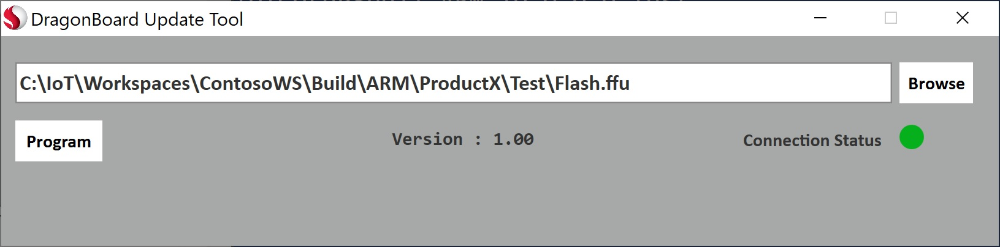

--- 
title: Flashing a Windows IoT Core Image
author: John Adali, Lwin Maung, Concurrency
ms.author: John Adali, Lwin Maung, Concurrency
ms.date: 09/05/2018 
ms.topic: article 
description: Steps on how to flash an FFU image file to a device
keywords: Windows 10 IoT Core, 
--- 

# Flashing a Windows IoT Core Image

Once you have an FFU image file built, you can use this file to flash and deploy the image to your device.

Listed below are the steps to flash the FFU image file to specific manufacturer devices. 

## Goals
* Deploy the Full Flash Update (FFU) test image previously created to a device

## Prerequisites/Requirements
You will need the following tools installed to complete this section:
* **[Windows 10 IoT Core Dashboard](http://go.microsoft.com/fwlink/p/?LinkId=708576) (Raspberry Pi only)**. This tool is used to perform the flashing of the FFU file to the Raspberry Pi device.
* **[Dragonboard Update Tool](https://developer.qualcomm.com/hardware/dragonboard-410c/software) (Qualcomm DragonBoard only)**. This tool is used to perform the flashing of the FFU file to the DragonBoard device.
* **Deployment Imaging and Servicing and Management (DISM) tool (Intel devices only)**. Part of the [Windows Assessment and Deployment Kit (Windows ADK)](https://docs.microsoft.com/en-us/windows-hardware/get-started/adk-install#winADK), this tool is used to perform the flashing of the FFU file to the Intel device.

## Qualcomm
### DragonBoard 410c
Qualcomm has provided the [DragonboardUpdateTool](https://developer.qualcomm.com/hardware/dragonboard-410c/software) application, which we will use to flash the FFU image file to the Dragonboard 410c. You can download either the x86 or x64 version (we recommend x64).

Once you have installed the **DragonBoard Update Tool**, you must first place the DragonBoard device in programming mode. This is done by setting dipswitch #1 (on the backside of the device) to the **ON** position:

Connect the DragonBoard device to your technician PC with a microUSB cable and power on the board.

Run the **DragonBoard Update Tool**, browse for the FFU image file you are deploying, and press the **Program** button. You should see a green **Connection Status**, and a progress bar when the device is flashing the FFU file.

Once the flashing process is complete, disconnect power from the board, as well as the microUSB cable. You then need to flip the dipswitch #1 back to the **OFF** position. Reconnect the power to boot Windows IoT Core.

## Raspberry Pi
Since Raspberry Pi devices require a microSD card, you will need to flash the FFU file using Windows IoT Core Dashboard.

1. Start **Windows IoT Core Dashboard**
2. Plug your microSD card into the technician PC, and select it in the tool
3. From the **Setup a New Device** section, select **Broadcomm [Raspberry Pi 2 & 3]** under **Device Type**
4. Select **Custom** under **OS Build**
5. Click **Browse** and navigate and select the FFU file you created earlier
6. Verify your microSD card is listed under the **Drive** selection
7. Optionally you can set the **Device Name** and **Administrator Password** selections for your device
8. Check the **I accept the software license terms** checkbox (lower right) and click **Install**

Windows IoT Core Dashboard will now open a command window and use **DISM (Deployment Image Servicing and Management Tool)** to flash the FFU file to your microSD card.

Once the flashing process is complete, eject the microSD card from the technician PC and insert it into the Raspberry Pi. Reconnect the power to boot Windows IoT Core.

## Intel
### Apollo Lake / Braswell / Cherry Trail
We will be using the **DISM (Deployment Image and Servicing Management Tool)** and a bootable USB stick to flash the FFU image file to the specified Intel device (Apollo Lake/Braswell/Cherry Trail). Additional information on **DISM** can be found [here](https://docs.microsoft.com/en-us/windows-hardware/manufacture/desktop/dism---deployment-image-servicing-and-management-technical-reference-for-windows).

### Creating a USB Bootable Drive
We first need to create a bootable USB drive that we can use to boot on the specified Intel hardware device. We can use **Window PE** (WinPE) for this (additional info on WinPE is [here](https://docs.microsoft.com/en-us/windows-hardware/manufacture/desktop/winpe-intro)).

1. Install WinPE from the **Windows ADK Windows Preinstallation Environment Add-ons**

   

2. Prepare USB Drive

   The USB drive you wish to use must be properly formatted before we can load WinPE on it. Follow these steps to properly format your USB drive:

   * Run the `diskpart` tool from and administrative command prompt
   * Run `list disk` to see the list of available disks
   * Run `Select Disk X`, where **X** corresponds to the disk number of your USB drive
   * Run `Clean` to clean the selected disk 
        * If you encounter the following error, run `convert mbr`:

                ERROR: Failed to format "F:"; DiskPart errorlevel -2147212244.

   * Run `Create Partition Primary` to create a primary partition on the disk
   * Run `Format FS=fat32` to format the drive
   * Run `Assign` to assign the drive
   * Exit `diskpart`. Your USB drive is now formatted and ready to have WinPE installed.

3. Create WinPE working files
   
   We now need to create a working copy of the Windows PE files on the technician PC. This can be done using the **Deployment and Imaging Tools Environment** command line program.

   Run the **Deployment and Imaging Tools Environment** command line program as an administrator, and run the following command:

        copype amd64 C:\WinPE_amd64

   This will create the working copy of Windows PE files at **C:\WinPE_amd64**.

   Insert your USB drive on the technician PC and run this command to install Windows PE on the USB drive. Make sure you replace **X** with the drive letter of your USB drive:

        MakeWinPEMedia /UFD C:\WinPE_amd64 X:

4. Copy your FFU file to the root drive of your USB drive
5. Insert your USB drive into your Intel hardware device and boot from the USB drive. YOu may have to enter the BIOS (or Boot Menu) of the hardware device to specify to boot from a USB drive.
6. Once the Windows PE environment boots up, you will see a command window. Change the drive and current directory to the location of your FFU file and run the following command to flash the FFU image file:

        dism.exe /Apply-Image /ImageFile:"D:\flash.ffu" /ApplyDrive:\\.\PhysicalDrive0 /SkipPlatformCheck

7. Once the flashing process is complete, power down the hardware device and remove the USB drive. Reconnect power to the hardware device to boot up Windows IoT Core.

   #### Diskpart Commands

        C:\>diskpart
        Microsoft DiskPart version 10.0.17134.1
        Copyright (C) Microsoft Corporation.
        On computer: LM-CNCY-BUILD
        
        DISKPART> list disk
        
        Disk ###  Status         Size     Free     Dyn  Gpt
        --------  -------------  -------  -------  ---  ---
        Disk 0    Online          447 GB  1024 KB        *
        Disk 1    Online          167 GB  1024 KB        *
        Disk 2    Online           14 GB      0 B        *

        DISKPART> select disk 2
        Disk 2 is now the selected disk.
        
        DISKPART> clean
        DiskPart succeeded in cleaning the disk.

        DISKPART> convert mbr
        DiskPart successfully converted the selected disk to MBR format.

        DISKPART> create partition primary
        DiskPart succeeded in creating the specified partition.

        DISKPART> format fs=fat32
          100 percent completed

        DiskPart successfully formatted the volume.

        DISKPART> assign
        DiskPart successfully assigned the drive letter or mount point.

        DISKPART> exit

   #### WinPE Commands
        copype amd64 C:\WinPE_amd64
        MakeWinPEMedia /UFD C:\WinPE_amd64 X:

   #### DISM Command (via WinPE on the Intel hardware device)
        X:\WinPE>d:\
        
        D:\>dism.exe /Apply-Image /ImageFile:"D:\flash.ffu" /ApplyDrive:\\.\PhysicalDrive0 /SkipPlatformCheck

## Next Steps
[Customizing a Windows IoT Core Image](06-CustomizeImageOverview.md)
