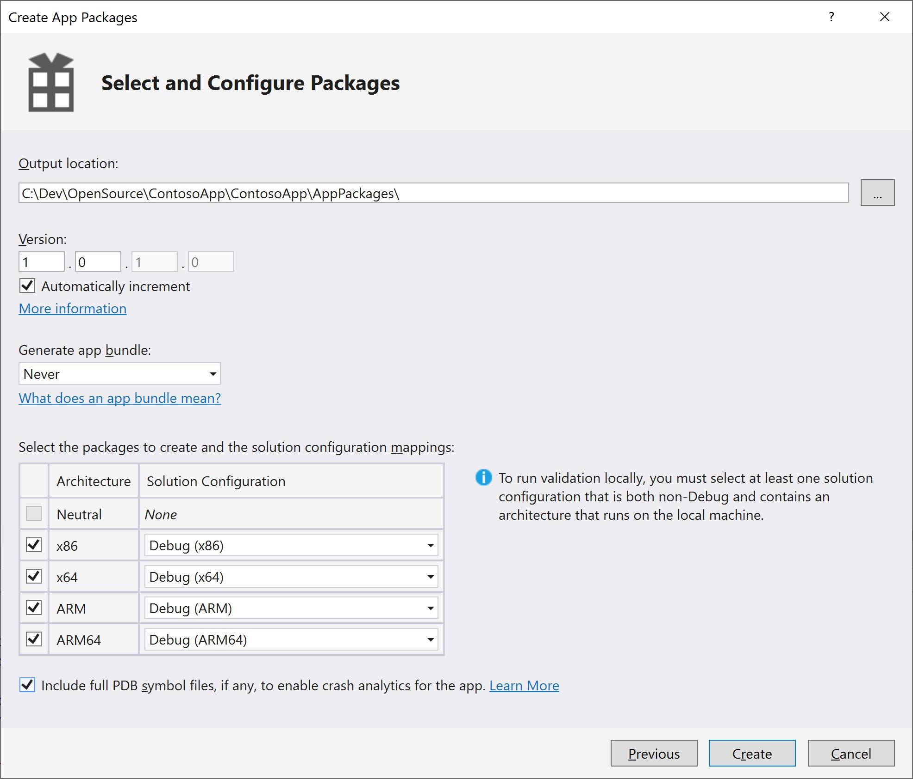

--- 
title: Adding an App to a Windows IoT Core Image
author: johnadali
ms.author: johnadali
ms.date: 09/20/2018 
ms.topic: article 
description: Description on how to add an App to a Windows IoT Core Image
keywords: Windows 10 IoT Core, 
--- 

# Adding an App to a Windows IoT Core Image
We are now going to take an app (like the IoT Core sample [Hello World!](https://github.com/Microsoft/Windows-iotcore-samples/tree/master/Samples/HelloWorld) app), package it up and create a new Windows IoT Core image that you can load onto your device. 

Please note that this process is identical for both background and foreground apps. The only difference to be aware of is that only one foreground app can be selected as the startup app, and all other installed apps will run as background apps.

## Prerequisites
Please make sure you've created a basic image from [Creating a Basic IoT Core Image](04-CreateBasicImage.md) previously. For this example, we have created a basic image with the Qualcomm DragonBoard called *TestDragonBoardProduct*.

## Create an Appx Package
The first step is to create a **Universal Windows Platform (UWP)** application that will run on the IoT device. You may skip this section if you've already created and tested your UWP application.

1. Create a UWP application. This can be any app designed for IoT Core and saved as an Appx package. For our example, we are using the IoT Core sample [Hello World!](https://github.com/Microsoft/Windows-iotcore-samples/tree/master/Samples/HelloWorld) app
2. In Visual Studio, save your application as an Appx package. This is done by clicking **Project > Store > Create App Packages > I want to Create Packages for Sideloading > Next** 
3. Select **Output Location** as C:\DefaultApp (or any other local filepath that doesn't include spaces)
4. Select **Generate app bundle:** Never
5. Click **Create**



   Visual Studio creates the Appx package files in your specified location, for the architecture(s) you selected (ARM, x86, x64). In our example, this file is *C:\Users\jadali\Desktop\HelloWorld\CS\AppPackages\HelloWorld_1.0.0.0_ARM_Debug.appx* (for ARM architecture).
   

## Package the Appx
The next step is to package the Appx file, which will allow you to customize it and build it using the Windows ADK (when you build the FFU image).

1. Open **IoT Core Shell** as an administrator
2. Create the package for your Appx by running the following command. Replace the file path location and package name with your Appx package. In our example, the command is as follows:

        newAppxPkg "C:\Users\jadali\Desktop\HelloWorld\CS\AppPackages\HelloWorld_1.0.0.0_ARM_Debug.appx" fga Appx.HelloWorldApp

    Please note that the *fga* parameter indicates the Appx file is a foreground application. Also, the *Appx.HelloWorldApp* is the name of the Appx file for referencing in the Windows ADK XML files when building the FFU image (you can call this whatever is appropriate for your scenario).

    Also be aware that if your Appx has dependencies you will need the *Dependencies* subdirectory to be present in the same location as your Appx when you run this command. Failure to include this will result in errors when you build your FFU image.

3. From **IoT Core Shell**, you can now build the package into a .CAB file

        buildpkg Appx.HelloWorldApp

    This will build the package into a .CAB file under the **Build\\< arch >\pkgs** subdirectory in the ADK Toolkit files. In our example, this file is located in *C:\IoT-ADK-AddOnToolkit\Build\ARM\pkgs\Contoso.Appx.HelloWorldApp.cab*

## Update the Feature Manifest file
Now that we have a .CAB file for our app, we need to add it into the feature manifest file for building the FFU image. This is done by following these steps:

1. Open the **OEMFM.XML** file, located in the Windows ADK files. For our example, this file is location at *C:\IoT-ADK-AddOnToolkit\Source-ARM\Packages\OEMFM.XML*. Please note that you should look under the proper **Source-< arch >** subdirectory depending on what architecture you are working with (ARM, x86, x64).
2. Create a new **PackageFile** section with your package file listed. Give it a new **FeatureID**, such as *App_HelloWorld*.

```XML
<?xml version="1.0" encoding="utf-8"?>
<FeatureManifest
  xmlns:xsi="http://www.w3.org/2001/XMLSchema-instance"
  xmlns:xsd="http://www.w3.org/2001/XMLSchema"
  xmlns="http://schemas.microsoft.com/embedded/2004/10/ImageUpdate">
  <BasePackages/>
  <Features>
    <OEM>
      <!-- Feature definitions below -->
      <PackageFile Path="%PKGBLD_DIR%" Name="%OEM_NAME%.Appx.IoTCoreDefaultApp.cab">
        <FeatureIDs>
          <FeatureID>APP_IOTCOREDEFAULTAPP</FeatureID>
          <FeatureID>OEM_IoTCoreDefaultApp</FeatureID> <!-- keeping old id for compatibility, dropping OEM prefix -->
        </FeatureIDs>
      </PackageFile>
      <PackageFile Path="%PKGBLD_DIR%" Name="%OEM_NAME%.Appx.IoTOnboardingTask.cab">
        <FeatureIDs>
          <FeatureID>APP_IOTONBOARDINGTASK</FeatureID>
          <FeatureID>OEM_IoTOnboardingTask</FeatureID> <!-- keeping old id for compatibility, dropping OEM prefix -->
        </FeatureIDs>
      </PackageFile>
      <PackageFile Path="%PKGBLD_DIR%" Name="%OEM_NAME%.AzureDM.Services.cab">
        <FeatureIDs>
          <FeatureID>AZUREDM_SERVICES</FeatureID>
        </FeatureIDs>
      </PackageFile>
      <PackageFile Path="%PKGBLD_DIR%" Name="%OEM_NAME%.Appx.HelloWorldApp.cab">
        <FeatureIDs>
          <FeatureID>App_HelloWorld</FeatureID>
        </FeatureIDs>
      </PackageFile>
    </OEM>
    <OEMFeatureGroups/>
  </Features>
</FeatureManifest>
```
This will allow you to add your app to any of your products by adding a reference to this feature manifest and Feature ID.

## Update Project Configuration Files
You can now update your product configuration files to include your app in the FFU image build. 

1. Open your product configuration file for test builds. In our example, this file is located at *C:\IoT-ADK-AddOnToolkit\Source-ARM\Products\TestDragonBoardProduct\TestOEMInput.xml*.
2. Verify that there are entries for both the **OEMFM.XML** and **OEMCOMMON.XML** feature manifest files, in the **AdditionalFMs** section.

```XML
  <AdditionalFMs>
    <!-- Including BSP feature manifest -->
    <AdditionalFM>%BLD_DIR%\MergedFMs\QCDB410CFM.xml</AdditionalFM>
    <AdditionalFM>%BLD_DIR%\MergedFMs\QCDB410CTestFM.xml</AdditionalFM>
    <!-- Including OEM feature manifest -->
    <AdditionalFM>%BLD_DIR%\MergedFMs\OEMCommonFM.xml</AdditionalFM>
    <AdditionalFM>%BLD_DIR%\MergedFMs\OEMFM.xml</AdditionalFM>
    <!-- Including the test features -->
    <AdditionalFM>%AKROOT%\FMFiles\arm\IoTUAPNonProductionPartnerShareFM.xml</AdditionalFM>
  </AdditionalFMs>
```
   You will notice that the entries for these two FM files reference the **MergedFMs** subdirectory, which may not exist on your technician PC. The build process will create this subdirectory and copy the FM files to it (overwriting them if they already exist) when you build the FFU image. 

3. Add your app feature to the **Features\\OEM** section. 

    a. Also verify that the **CUSTOM_CMD** and **PROV_AUTO** feature entries are present under **Features\\OEM**. 

    b. It is also recommended to remove (or comment) the IoT Core Default application (**IOT_BERTHA**), since your application is a foreground application.

```XML
  <Features>
    <Microsoft>
      <Feature>IOT_EFIESP_TEST</Feature>
      <Feature>IOT_KDUSB_SETTINGS</Feature>
      <Feature>IOT_EFIESP_BCD</Feature>
      <Feature>IOT_DISABLEBASICDISPLAYFALLBACK</Feature>
      <Feature>IOT_USBFN_CLASS_EXTENSION</Feature>
      <Feature>IOT_GENERIC_POP</Feature> 
      <Feature>IOT_APPLICATIONS</Feature>
      <Feature>IOT_UAP_OOBE</Feature>
      <Feature>IOT_TOOLKIT</Feature>
      <Feature>IOT_WDTF</Feature>
      <Feature>IOT_SSH</Feature>
      <Feature>IOT_SIREP</Feature>
      <Feature>IOT_WEBB_EXTN</Feature>
      <Feature>IOT_UMDFDBG_SETTINGS</Feature>
      
      <Feature>IOT_POWERSHELL</Feature>
      <Feature>IOT_DIRECTX_TOOLS</Feature>
      <Feature>IOT_ALLJOYN_APP</Feature>
      <Feature>IOT_ENABLE_TESTSIGNING</Feature>
      <Feature>IOT_CRT140</Feature>
      <!-- <Feature>IOT_BERTHA</Feature> -->
      <Feature>IOT_APP_TOOLKIT</Feature>
      <Feature>IOT_CP210x_MAKERDRIVER</Feature>
      <Feature>IOT_FTSER2K_MAKERDRIVER</Feature>
      <Feature>IOT_POWER_SETTINGS</Feature>
    </Microsoft>
    <OEM>
      <Feature>QC_UEFI_TEST</Feature>
      <Feature>SBC</Feature>
      <!-- Include OEM features -->
      <Feature>CUSTOM_CMD</Feature>
      <Feature>PROV_AUTO</Feature>
      <Feature>CUSTOM_SMBIOS</Feature>
      <Feature>App_HelloWorld</Feature>
    </OEM>
  </Features>
```

## Build and Test Image
Build the FFU image again, as specified in [Creating a Basic IoT Core Image](04-CreateBasicImage.md). You should only have to run the **buildimage** command:

    buildimage <product name> test 

Once the FFU file has been built (it should now include your app), you can flash it to your hardware device as specified in [Flashing a Windows IoT Core Image](05-FlashingImage.md).

## Next Steps
[06b-Creating a Provisioning Package](06b-CreateProvisioningPackage.md)

