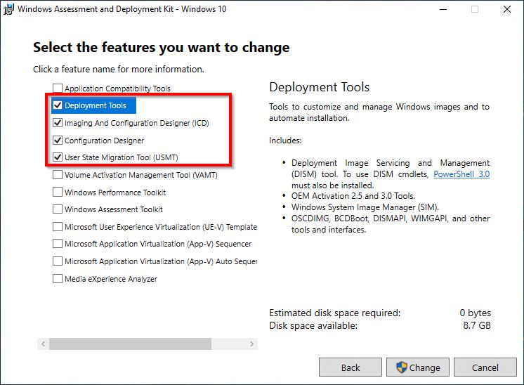
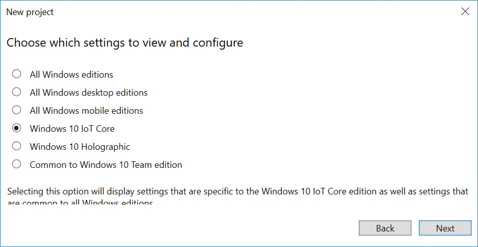
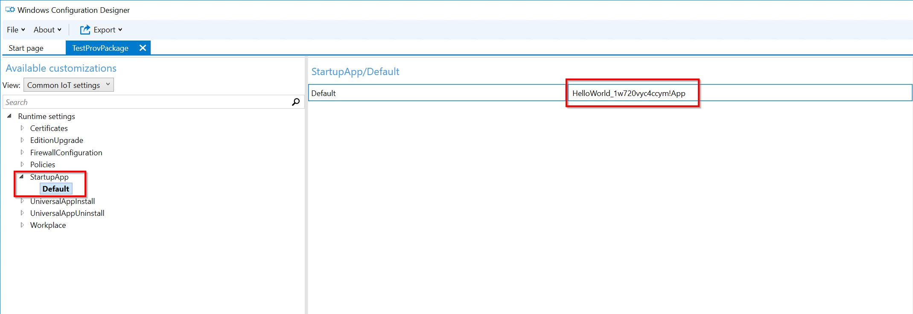

--- 
title: Creating a Provisioning Package for a Windows IoT Core Image
author: jadali,lmaung
ms.author: jadali, lmaung
ms.date: 09/20/2018 
ms.topic: article 
description: Description on how to create a provisioning package for a Windows IoT Core Image
keywords: Windows 10 IoT Core, 
--- 

# Creating a Provisioning Package for a Windows IoT Core Image
A provisioning package allows you to apply customization settings over an existing Windows IoT Core installation image. We will describe the steps required to create a provisioning package that you can apply to your Windows 10 IoT Core FFU images.


## Prerequisites
Please make sure you've created an image with your custom App from [06a-Adding an App to an image](06a-AddingApps.md) previously. For this example, we have created an image with the Qualcomm DragonBoard called *TestDragonBoardProduct* that contains the sample app [Hello World!](https://github.com/Microsoft/Windows-iotcore-samples/tree/master/Samples/HelloWorld).

## Install Windows Configuration Designer
We will be using **Windows Configuration Designer (WCD)** to create a provisioning package for our IoT Core image. Windows Configuration Designer allows you to create provisioning packages, which are used to configure devices running Windows 10 IoT Core.

Windows Configuration Designer comes with the **Windows ADK Toolkit** and should have been installed to the Technician PC previously. If not, please run the install for the Windows ADK Toolkit and make sure you have the **Configuration Designer** selection checked for installation.



## Create WCD Project for a Provisioning Package
In order to create a provisioning package for your device, we need to create a project in **Windows Configuration Designer**. Once we have this project, we can specify the configuration customizations we want included in our FFU image.

1. From your Technician PC, run **Windows Imaging and Configuration Designer**.
2. Create a new project by clicking **File > New Project**. For our example, we created a project called *TestProvPackage*.
3. Select **Provisioning Package** and click **Next**.
4. On the **Choose which settings to view and configure** page, select **Windows 10 IoT Core**. Click **Next**.

   

5. At the **Import a provisioning package(optional)** page, leave the entry blank and click **Finish**.
6. Add a sample setting. For our example, we will specify a default startup app that executes when the IoT Core device is booted up.
   
   a. Change the **View** dropdown under **Available Customizations** to *Common IoT Settings*.

   b. Expand the **Runtime settings > Startup App > Default** node.

   c. Enter the [Application User Model ID (AUMID)](https://docs.microsoft.com/en-us/windows/configuration/find-the-application-user-model-id-of-an-installed-app) of the app you want to be the default startup app. For our example, this value is *HelloWorld_1w720vyc4ccym!App*.

   
   
   d. Save the project.

7. Export the provisioning package.

   a. Click **Export > Provisioning Package**. An export dialog will appear. You can modify the **Name**, **Version** and **Rank** field, as well as the **Owner**. Select *OEM* for **Owner** and click **Next**.

   

   b. Under **Select security details for the provisioning package**, uncheck the **Encrypt package** and **Sign package** checkboxes. Click **Next**.

   c. Click **Build** to build the provisioning package. A dialog listing the output location will appear when the export is complete. Click **Finish**.

8. Copy the exported provisioning package to your product's **prov** directory. For our example, this folder is located in *C:\IoT-ADK-Toolkit\Source-ARM\Products\TestDragonBoardProduct\prov*.

9. Verify that the **OEMCommonFM.xml** from the **Windows ADK Toolkit** include the following package definition file and feature ID. These are needed to process provisioning packages.

   ```XML
      <PackageFile Path="%PKGBLD_DIR%" Name="%OEM_NAME%.Provisioning.Auto.cab">
        <FeatureIDs>
          <FeatureID>OEM_ProvAuto</FeatureID>
          <FeatureID>PROV_AUTO</FeatureID>
        </FeatureIDs>
      </PackageFile>
   ```
10. Verify that the **TestOEMInput.xml** file contains an entry to the **OEMCommonFM.xml** file, along with the **PROV_AUTO** feature ID in the **OEM** section.

```XML
  <AdditionalFMs>
    <!-- Including BSP feature manifest -->
    <AdditionalFM>%BLD_DIR%\MergedFMs\QCDB410CFM.xml</AdditionalFM>
    <AdditionalFM>%BLD_DIR%\MergedFMs\QCDB410CTestFM.xml</AdditionalFM>
    <!-- Including OEM feature manifest -->
    <AdditionalFM>%BLD_DIR%\MergedFMs\OEMCommonFM.xml</AdditionalFM>
    <AdditionalFM>%BLD_DIR%\MergedFMs\OEMFM.xml</AdditionalFM>
    <!-- Including the test features -->
    <AdditionalFM>%AKROOT%\FMFiles\arm\IoTUAPNonProductionPartnerShareFM.xml</AdditionalFM>
  </AdditionalFMs>
```

```XML
    <OEM>
      <Feature>QC_UEFI_TEST</Feature>
      <Feature>SBC</Feature>
      <!-- Include OEM features -->
      <Feature>CUSTOM_CMD</Feature>
      <Feature>PROV_AUTO</Feature>
      <Feature>CUSTOM_SMBIOS</Feature>
      <Feature>App_HelloWorld</Feature>
    </OEM>
```

## Build and Test Image
Build the FFU image again, as specified in [Creating a Basic IoT Core Image](04-CreateImage.md). You should only have to run the **buildimage** command:


    buildimage <product name> test 

Once the FFU file has been built and you flash it to your hardware device as specified in [Flashing a Windows IoT Core Image](05-FlashingImage.md), your provisioning package customizations should be applied when you power up the device. In our example, the default app is the [Hello World!](https://github.com/Microsoft/Windows-iotcore-samples/tree/master/Samples/HelloWorld) app and will run when the device is booted up.


## Next Steps
[06c-Adding file(s) and registry settings to an image](06c-AddFileRegistrySettings.md)

