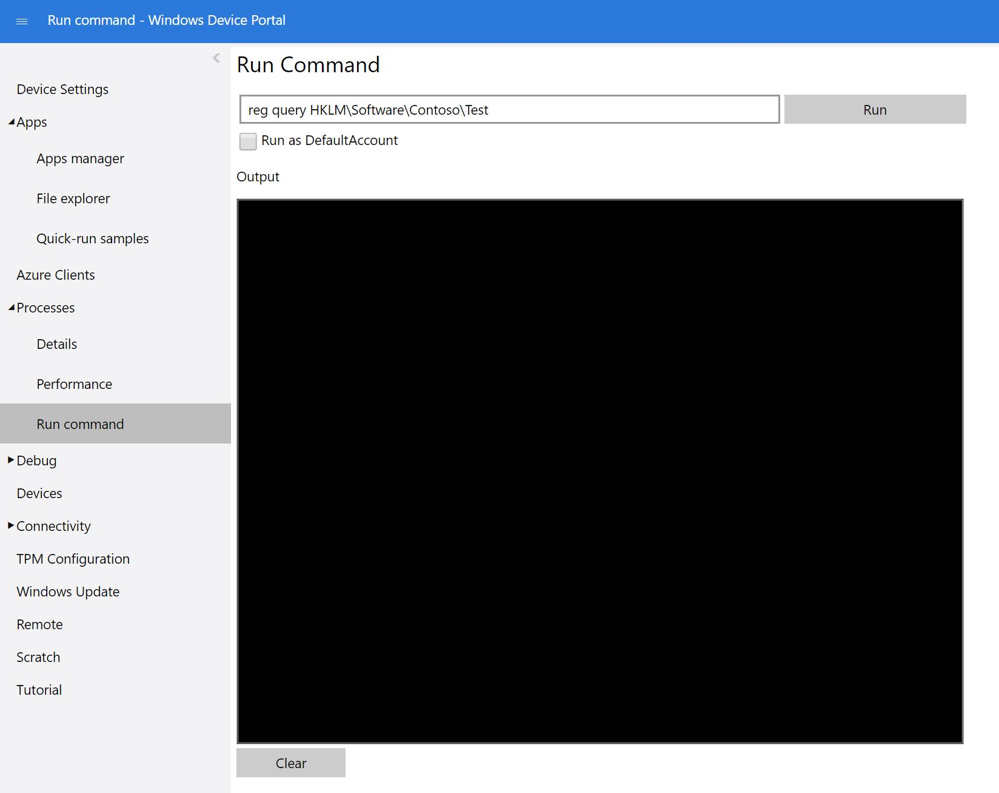

--- 
title: Adding files and registry settings to a Windows IoT Core Image
author: johnadali
ms.author: johnadali
ms.date: 09/26/2018 
ms.topic: article 
description: Description on how to add files and registry settings to a Windows IoT Core Image
keywords: Windows 10 IoT Core, 
--- 

# Adding file(s) and registry settings to a Windows IoT Core Image
We will create some test files and registry keys to a Windows IoT Core image, and package them up so that they can be serviced after they are distributed to your customers. Since files and registry keys that you add to your image are often not specific to an architecture, we recommend creating a common package that you can use across all of your device architectures.

## Prerequisites
Please make sure you've created a basic image from [Creating a Basic IoT Core Image](04-CreateBasicImage.md) previously. For this example, we have created a basic image with the Qualcomm DragonBoard called *TestDragonBoardProduct*.

## Create your test files
Create a few sample text files using Notepad and add some random text so that these files are not empty. For our example, we have created two files titled **TestFile1.txt** and **TestFile2.txt**.

## Build a package for your test files
We must now create a package so that your test files can be included when building our image. We will create a new common package file which can be used across all architectures:

1. Open **IoT Core Shell** as an administrator.
2. From IoT Core Shell, create a working folder for the registry keys and test files:

        newcommonpkg Registry.FilesAndRegKeys

   In our example, this will create a new folder at **C:\IoT-ADK-Toolkit\Common\Packages\Registry.FilesAndRegKeys**

3. Copy your sample files (in our example, **TestFile1.txt** and **TestFile2.txt**) into the new folder at **C:\IoT-ADK-Toolkit\Common\Packages\Registry.FilesAndRegKeys**.
4. Update the package definition file.

   a. This file is located at **C:\IoT-ADK-Toolkit\Common\Packages\Registry.FilesAndRegKeys\Registry.FilesAndRegKeys.wm.xml**

   b. Remove the comment marks and instructions.

   > [!NOTE]
   > If you get an error "*The elementRegKeys in namespace urn:Microsoft.WindowsPhone/PackageSchema.v8.00 has incomplete content*", this is due to not removing the comments and instructions. If you have other XML elements that are commented out, you will need to remove these elements.

   c. Update the values of **RegKey** to include a new **KeyName**, **Name**, and **Value**.

    ```XML
    <onecorePackageInfo
        targetPartition="MainOS"
        releaseType="Production"
        ownerType="OEM" />
    <regKeys>
        <regKey
            keyName="$(hklm.software)\$(OEMNAME)\Test">
            <regValue name="StringValue" type="REG_SZ" value="Test string" />
            <regValue name="DWordValue"  type="REG_DWORD" value="0x12AB34CD" />
            <regValue name="BinaryValue" type="REG_BINARY" value="12ABCDEF" />
        </regKey>
        <regKey
            keyName="$(hklm.software)\$(OEMNAME)\EmptyKey" />
    </regKeys>
    <files>
        <file destinationDir="$(runtime.system32)" source="TestFile1.txt" />
        <file
            destinationDir="$(runtime.bootDrive)\OEMInstall" source="TestFile2.txt"
            name="TestFile2.txt" />
    </files>
    ```
   Please note that variables like *$(runtime.root)* and *$(runtime.system32)* are defined in **C:\Program Files(x86)\Windows Kits\10\Tools\bin\i386\pkggen.cfg.xml**.
5. Build the package by running the following command:

        buildpkg Registry.FilesAndRegKeys

   This will build the **Registry.FilesAndRegKeys.cab** file under the **C:\IoT-ADK-Toolkit\Build\\< arch>\pkgs\\< your OEM name>** directory. In our example, this file is located in the **C:\IoT-ADK-Toolkit\Build\ARM\pkgs\Contoso** directory.

> [!TIP]
> To quickly rebuild for another architecture, use **setenv < arch>**, the run `buildpkg all` to rebuild everything for the other architecture. 

## Update your Feature Manifest File
You will need to modify the **OEMCommonFM.xml** file (located at **C:\IoT-ADK-AddonKit\Common\Packages**) to include the Registry.FilesAndRegKeys.cab package file you built previously.

1. Open the common feature manifest file **C:\IoT-ADK-AddonKit\Common\Packages\OEMCommonFM.xml**.
2. Create a new **PackageFile** section with your package file listed, and give it a new FeatureID. In our example, we named the FeatureID **CUSTOM_FilesAndRegKeys**.

    ```XML
          <PackageFile Path="%PKGBLD_DIR%" Name="%OEM_NAME%.Registry.FilesAndRegKeys.cab">
            <FeatureIDs>
              <FeatureID>CUSTOM_FilesAndRegKeys</FeatureID>
            </FeatureIDs>
          </PackageFile>
    ```

3. Run `buildfm oem` to generate updated files in the **MergedFMs** folder. This should be done every time you modify a feature manifest file.

## Update your Product Configuration File
Add the FeatureID you just created into the **TestOEMInput.xml** file, located at **C:\IoT-ADK-AddonKit\Source-< arch>\Products\\< your product name>**. In our example, this is located at **C:\\IoT-ADK-AddonKit\Source-ARM\Products\TestDragonBoardProduct**.

```XML
  <Features>
    <OEM>
      <Feature>QC_UEFI_TEST</Feature>
      <Feature>SBC</Feature>
      <!-- Include OEM features -->
      <Feature>CUSTOM_CMD</Feature>
      <Feature>PROV_AUTO</Feature>
      <Feature>CUSTOM_SMBIOS</Feature>
      <Feature>CUSTOM_FilesAndRegKeys</Feature>
    </OEM>
  </Features>
```

## Build and Test Image
Build the FFU image again, as specified in [Creating a Basic IoT Core Image](04-CreateBasicImage.md). You should only have to run the **buildimage** command:

    buildimage <product name> test 

Once the FFU file has been built, you can flash it to your hardware device as specified in [Flashing a Windows IoT Core Image](05-FlashingImage.md).

## Verify Files and Registry Keys Added
In order to verify that the files were added on the device, do the following:

1. Connect both your technician PC and the device to the same ethernet network.

   For our example, the Qualcomm DragonBoard has wireless capability, so we connected to a wireless access point that has internet access, and was on the same network as the technician PC. For devices that have an ethernet jack, plug an ethernet cable into that jack and into the technician PC (or a router switch that is on the same network as the technician PC). 

2. On the test app note the IP address of the device. For example, 10.100.0.100.
3. On the technician PC, open File Explorer and type in the IP address of the device with a \\\ prefix and \c$ suffix.

        \\10.100.0.100\c$

4. Check that the files exist on the device. for our example, look for:

        \\10.100.0.100\c$\Windows\system32\TestFile1.txt
        \\10.100.0.100\c$\OEMInstall\TestFile2.txt

For verifying registry keys, follow these steps:

1. On the technician PC, connect to your device using an SSH client such as [PuTTY](https://www.putty.org/). For example, use the IP address and port 22 to connect to the device. Then login using the Administrator account and password. (To learn more, see [SSH](https://docs.microsoft.com/en-us/windows/iot-core/connect-your-device/SSH)).

2. From the command line in the SSH client, query the system for the registry key. In our example, this command was executed to check the existence of the registry key:

        reg query HKLM\Software\Contoso\Test

   The SSH client should display your test values.

   a. Alternatively, you can use the **Run Command** in Windows Device Portal for your connected device to run the `reg query` command.

   

   The Output window should display your test values.

## Next Steps
[06d-Adding a driver to an image](06d-AddingDrivers.md)

