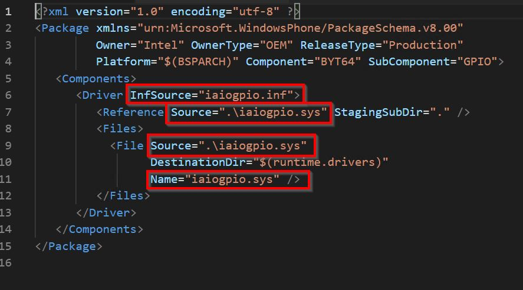

# Adding a driver to a Windows IoT Core Image
We will add a custom driver to a Windows IoT Core image, and deploy it to our device.

## Goals
* Create a package that contains a custom driver for your device
* Modify IoT Addon Kit project configuration files to include your custom driver package
* Build and deploy an FFU image that contains your custom driver package
* Import an alternative driver for a BSP

## Prerequisites/Requirements
Please make sure you've created a basic image from [Creating a Basic IoT Core Image](04-CreateBasicImage.md) previously. For this example, we have created a basic image with the Qualcomm DragonBoard called *TestDragonBoardProduct*.

You will need the following tools installed to complete this section:
* **[Windows Assessment and Deployment Kit (Windows ADK)](https://docs.microsoft.com/windows-hardware/get-started/adk-install#winADK)**. This provides the OEM-specific tooling and files to create and customize images for Windows IoT Core.
* **IoT Core Powershell Environment**. This is included with the Windows ADK and is the Powershell commandline window interface where you execute commands to build custom FFU images for Windows IoT Core.
* **[Windows 10 IoT Core Packages](https://www.microsoft.com/en-us/software-download/windows10iotcore)** for your specific architecture. These provide the IoT Core packages and feature manifest files needed to build custom Windows IoT images for the specific architecture (ARM, ARM64, x86, x64).
* **[IoT Core ADK Add-Ons](https://github.com/ms-iot/iot-adk-addonkit/)**. These provide the sample scripts and base structure for building custom Windows IoT Core images.
* A text editor like **Notepad** or **VS Code**.

## Create your driver files
You will need to build your driver files to include in the IoT Core image. We will be using the **gpiokmdfdemo** sample driver project from the [Windows IoT Core code samples](https://github.com/Microsoft/Windows-iotcore-samples).

* Using Visual Studio, compile the **gpiokmdfdemo** project, located at *Samples\gpiokmdfdemo* 
* Copy the following files into a test folder (for example, c:\gpiokmdfdemo):

    * gpiokmdfdemo.sys
    * gpiokmdfdemo.inf

## Build a Package for your driver
Once the driver files are created, we need to create a package that includes them, and then add that package to our Windows IoT Core image.

1. Run **IoT Core Powershell Environment** as an administrator. Select your appropriate architecture.
2. Create a **driver package** using [New-IoTDriverPackage](https://github.com/ms-iot/iot-adk-addonkit/blob/master/Tools/IoTCoreImaging/Docs/Add-IoTDriverPackage.md):

```powershell
Add-IoTDriverPackage C:\gpiokmdfdemo\gpiokmdfdemo.inf Drivers.TestDriver
(or) newdrvpkg C:\gpiokmdfdemo\gpiokmdfdemo.inf Drivers.TestDriver
```
This creates a new folder at `C:\MyWorkspace\Source-<arch>\Packages\Drivers.TestDriver`.
This also adds a FeatureID called **DRIVERS_TESTDRIVER** to the `C:\MyWorkspace\Source-<arch>\Packages\OEMFM.xml` file.

3. Build the package using [New-IoTCabPackage](https://github.com/ms-iot/iot-adk-addonkit/blob/master/Tools/IoTCoreImaging/Docs/New-IoTCabPackage.md):

```powershell
New-IoTCabPackage Drivers.TestDriver
(or) buildpkg Drivers.TestDriver
```

## Update your Product Configuration File
Update the product test configuration file using [Add-IoTProductFeature](https://github.com/ms-iot/iot-adk-addonkit/blob/master/Tools/IoTCoreImaging/Docs/Add-IoTProductFeature.md):

```powershell
Add-IoTProductFeature <product name> Test DRIVERS_TESTDRIVER -OEM
(or) addfid <product name> Test DRIVERS_TESTDRIVER -OEM
```

## Build and Test Image
Build the FFU image again, as specified in [Creating a Basic IoT Core Image](04-CreateBasicImage.md). You should only have to run the [New-IoTFFUImage](https://github.com/ms-iot/iot-adk-addonkit/blob/master/Tools/IoTCoreImaging/Docs/New-IoTFFUImage.md) command:

    ```powershell
    New-IoTFFUImage <product name> Test
    (or)buildimage <product name> Test 
    ```
Once the FFU file has been built, you can flash it to your hardware device as specified in [Flashing a Windows IoT Core Image](05-FlashingImage.md).

## Verify Driver is Installed Properly
You can verify that the test driver was installed properly by following these steps:

1. Boot up your Windows IoT Core device and make note of its IP address.
2. On your technician PC, open **File Explorer** and in the address bar type in `\\<TARGET_DEVICE_IP>\c$` and press Enter. **TARGET_DEVICE_IP** will correspond to the IP address of your device.

If you are prompted for credentials, please enter these and click **OK**. If you have not changed the default credentials use the following:

            User ID: Administrator
            Password: p@ssw0rd

3. Once your credentials are accepted and **File Explorer** displays the c$ directory of your device, navigate to **c:\Windows\System32\Drivers** and look for the **gpiokmdfdemo.sys** file. If present, this validates that your driver has been properly installed on your device.

## Importing an Alternative BSP Driver
If you wish to import a different driver for a Board Support Package (BSP) that your device manufacturer provides, here are the steps to do that. For our example, we are using an Intel Bay Trail x64 device.

1. Obtain the alternative driver files you wish to import.
2. Navigate to the file folder that contains the BSP files for your device and copy your alternative driver files to the appropriate subdirectory. For our example, we are using alternative GPIO drivers so we copied these files to the **c:\iot-adk-addonkit\Source-x64\BSP\BYTx64\Packages\BYT64.GPIO** subdirectory.

   Please note that if your alternative files have the same name as the existing BSP drivers, you should save the existing file to a different location before overwrite the existing driver files.

3. Edit the XML files for the BSP driver you are using alternative files for, to include the new driver filenames. For our example, we are editing the **BYT64.GPIO._pkg.xml** and **BYT64.GPIO.wm.xml** files.

   **BYT64.GPIO.wm.xml**

   

   **BYT64.GPIO._pkg.xml**

   

4. Run **IoT Core Shell** as an administrator.
5. Build all the packages by running the following command:

```powershell
    New-IoTCabPackage All
    (or) buildpkg all 
```

6.  Build the FFU image again, as specified in [Creating a Basic IoT Core Image](04-CreateBasicImage.md). You should only have to run the **buildimage** command:

    ```powershell
    New-IoTFFUImage <product name> Test
    (or)buildimage <product name> Test 
    ```
    Once the FFU file has been built, you can flash it to your hardware device as specified in [Flashing a Windows IoT Core Image](05-FlashingImage.md).


## Next Steps
[Adding Win32 Services to an image](06e-AddingWin32Services.md)
