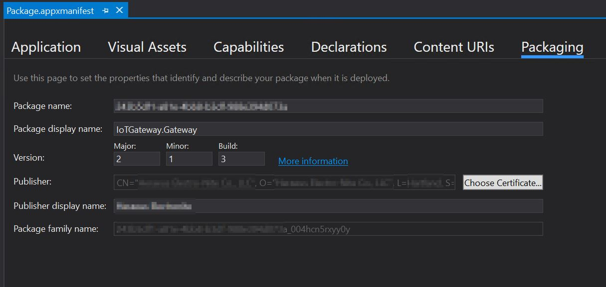
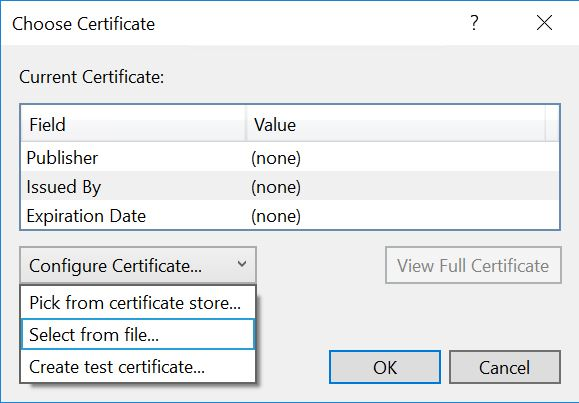

# Creating a Retail IoT Core Image
We will detail the steps needed to create a retail Windows IoT Core image and flash it onto a specific hardware device.

## Goals
* Create a project using Windows ADK Toolkit that can be used to create Windows IoT Core images
* Add a custom application to a Windows IoT Core retail image
* Build a Full Flashable Update (FFU) file for a Windows IoT Core retail image

## Prerequisites/Requirements
Please make sure you've created a basic test image from [Creating a Basic IoT Core Image](04-CreateBasicImage.md) previously. For this example, we have created a basic image with the Qualcomm DragonBoard called *TestDragonBoardProduct*.

You will need the following tools installed to complete this section:
* A retail [code-signing](https://docs.microsoft.com/windows-hardware/drivers/dashboard/get-a-code-signing-certificate) certificate. For the kernel driver signing, a Standard code-signing certificate is sufficient. You will require an EV certificate to access the Device Update Center in Hardware Dev Center portal.
* A [Cross-Signing certificate](https://docs.microsoft.com/windows-hardware/drivers/install/cross-certificates-for-kernel-mode-code-signing) that matches the CA of your retail code-signing certificate.
* **Visual Studio**. This is needed to create the UWP application that will be added to the custom FFU image, as well as properly signing the application with your retail code-signing certificate.
* **[Windows Assessment and Deployment Kit (Windows ADK)](https://docs.microsoft.com/windows-hardware/get-started/adk-install#winADK)**. This provides the OEM-specific tooling and files to create and customize images for Windows IoT Core.
* **Iot Core Shell**. This is included with the Windows ADK and is the commandline window interface where you execute commands to build custom FFU images for Windows IoT Core.
* A text editor like **Notepad** or **VS Code**.


## Modify Project Configuration Files
We need to modify the Windows ADK Toolkit project files before we can build a Windows IoT Core retail image. Follow the steps below to add any custom applications or provisioning packages you want to add to the retail image. For our example, we are modifying the project files for our Qualcomm DragonBoard project called *TestDragonBoardProduct*.

1. To add a custom application, you should follow the instructions listed in [Adding an App to an image](06a-AddingApps.md). However, instead of modifying the product configuration file *TestOEMInput.xml* file, you would edit the *RetailOEMInput.xml* file. In our example, this file is located at *C:\IoT-ADK-AddOnToolkit\Source-ARM\Products\TestDragonBoardProduct\RetailOEMInput.xml*.

2. Add the Feature ID for your custom application to the **OEM** section.

   ```XML
   <OEM>
      <!-- Include BSP Features -->
      <Feature>QC_UEFI_PRODUCTION</Feature>
      <Feature>SBC</Feature>
      <!-- Include OEM features -->
      <Feature>CUSTOM_CMD</Feature>
      <Feature>PROV_AUTO</Feature>
      <Feature>CUSTOM_SMBIOS</Feature>
      <Feature>App_HelloWorld</Feature>
    </OEM>
   ```

> [!IMPORTANT]
> If you have more than one custom application that you are including in your retail image, signing them individually with your retail certificate will cause verification collisions when you boot up your retail image on your device. This will prevent your apps from running properly. Follow the steps in the **Properly Signing and Including Your Applications** section to create a separate Feature .CAB file that contains your retail certificate, to include in your retail image.

3. Minimize the included Windows IoT Core features. You also want to remove any test applications that are included (by default) with test images for Windows IoT Core. This includes the IoT Core default application (aka. Bertha), along with any other developer tools or testing features.

## Properly Signing and Including Your Applications
If you have one or more custom applications that you want to include in your Windows IoT Core retail image, you need to verify that these applications are signed properly when including them in your retail image. Follow these steps for each application you want to include in your image. Please note that you can skip Steps 8 and 9 if you only have one application to include.

1. Install your retail code-signing certificate on your technician PC.
2. Open your custom application **in Visual Studio** and open the **Package.appxmanifest** file.
3. Click on the **Packaging** tab and click on **Choose Certificate...** button.

   

4. The dialog displayed will show what certificate is being used for code-signing. Click on the **Configure Certificate...** dropdown and select **Pick from certificate store...**:

   


5. Choose your retail code-signing certificate when prompted and click **OK**.
6. Save your project in **Visual Studio** and then build your Appx package. Please note that you should be prompted for your password for your retail code-signing certificate when building this package.
7. Once the Appx file is built, run the following command in **IoT Core Shell**:

        newAppxPkg "C:\Users\jadali\Desktop\HelloWorld\CS\AppPackages\HelloWorld_1.0.0.0_ARM_Debug.appx" fga Appx.HelloWorldApp

8. Navigate to the directory in Windows ADK Toolkit for your Appx package, and edit the **customizations.xml** file. In our example, this directory is located at **C:\iot-adk-addonkit\Source-arm\Packages\Appx.HelloWorldApp**.
9. Delete the **Certificates** section (under **Customizations**) and save the file.

   ```XML
        <Certificates>
          <RootCertificates>
            <RootCertificate CertificateName="HelloWorld" Name="HelloWorld">
              <CertificatePath>HelloWorld.cer</CertificatePath>
            </RootCertificate>
          </RootCertificates>
        </Certificates>
   ```

## Creating a Package for Including your Retail Certificate
If you have more than one application that you signed with the same certificate, you need to create a dedicated .CAB file that contains only your retail certificate file. Including this in your retail image *once* (instead of in each application CAB file) ensures that Windows IoT Core properly installs your retail certificate on your device.

> [!NOTE]
> You can skip this section if you only have one application to include in your retail image.

1. Create a new folder called **Appx.Certificates** under the **C:\iot-adk-addonkit\Source-< arch>\Packages\\** directory. In our example, we created this folder under **C:\iot-adk-addonkit\Source-arm\Packages\\**.
2. Create a **customizations.xml** file and edit it to look like below, replacing **HelloWorld.cer** with the name of your retail certificate:

   ```XML
   <?xml version="1.0" encoding="utf-8" ?>
      <WindowsCustomizations>
        <PackageConfig xmlns="urn:schemas-Microsoft-com:Windows-ICD-Package-Config.v1.0">
          <ID>{c3b3273a-1aef-4367-a8d9-228fe15cce84}</ID>
          <Name>Certificates</Name>
          <Version>1.1.0.0</Version>
          <OwnerType>OEM</OwnerType>
          <Rank>0</Rank>
        </PackageConfig>
        <Settings xmlns="urn:schemas-microsoft-com:windows-provisioning">
          <Customizations>
            <Common>
              <Certificates>
                <RootCertificates>
                  <RootCertificate CertificateName="HelloWorld" Name="HelloWorld">
                    <CertificatePath>HelloWorld.cer</CertificatePath>
                  </RootCertificate>
                </RootCertificates>
              </Certificates>
            </Common>
          </Customizations>
        </Settings>
      </WindowsCustomizations>
   ```

3. Copy your retail certificate .CER file to this directory.
4. Create a **Appx.Certificates.wm.xml** file and edit it to look like this:

   ```XML
   <?xml version="1.0" encoding="utf-8"?>
   <identity xmlns:xsd="http://www.w3.org/2001/XMLSchema" xmlns:xsi="http://www.w3.org/2001/XMLSchema-instance"
    name="Certificates"
    namespace="Appx"
    owner="$(OEMNAME)"
    legacyName="$(OEMNAME).Appx.Certificates" xmlns="urn:Microsoft.CompPlat/ManifestSchema.v1.00">
       <onecorePackageInfo
        targetPartition="MainOS"
        releaseType="Production"
        ownerType="OEM" />
       <files>
           <file
            destinationDir="$(runtime.windows)\Provisioning\Packages"
            source="$(BLDDIR)\ppkgs\Appx.Certificates.ppkg"
            name="Appx.Certificates.ppkg" />
       </files>
   </identity>
   ```

5. Modify the **OEMFM.xml** file, located at **C:\iot-adk-addonkit\Source-< arch>\Packages\\** to add a Feature ID for your certificate package.

   ```XML
   <PackageFile Path="%PKGBLD_DIR%" Name="%OEM_NAME%.Appx.Certificates.cab">
       <FeatureIDs>
         <FeatureID>APP_CERTIFICATES</FeatureID>
       </FeatureIDs>
   </PackageFile>
   ```

6. Edit the *RetailOEMInput.xml* file to add the Feature ID to the **OEM** section.

   ```XML
   <OEM>
      <!-- Include BSP Features -->
      <Feature>QC_UEFI_PRODUCTION</Feature>
      <Feature>SBC</Feature>
      <!-- Include OEM features -->
      <Feature>CUSTOM_CMD</Feature>
      <Feature>PROV_AUTO</Feature>
      <Feature>CUSTOM_SMBIOS</Feature>
      <Feature>App_HelloWorld</Feature>
      <Feature>APP_CERTIFICATES</Feature>
    </OEM>
   ```

7. In **IoT Core Shell**, run the following command to build the package files for our custom certificate package:

        buildfm oem

## Build the Retail Image Files
Once we have all the custom application packages signed properly, we can now build the Windows IoT Core retail image. Please verify that you have the retail code-signing certificate installed on your PC prior to following these steps:

1. Edit the **setsignature.cmd** file from Windows ADK Toolkit to include details of your retail and cross-root certificates. This file is located at **C:\IoT-ADK-AddOnToolkit\\Tools**.

        set SIGNTOOL_OEM_SIGN=/s my /i "Issuer" /n "Subject" /ac "CrossCertRoot" /fd SHA256

   Here is an example. Please note the .CRT file is the cross-root certificate file.

        set SIGNTOOL_OEM_SIGN=/s my /i "DigiCert EV Code Signing CA (SHA2)" /n "MySubjectText" /ac "C:\Certs\DigiCert High Assurance EV Root CA.crt" /fd SHA256

2. Run **IoT Core Shell** as an administrator.
3. Enable retail signing:

        retailsign on

4. Build the packages:

        buildpkg all

5. Once all the package .CAB files are built, you should verify that each of these files is properly signed with the retail certificate. If some are still signed with the test certificates (this usually happens if you use your technician PC for building both test and retail images), you can re-sign these files by running this command:

        re-sign.cmd <srccabdir> <destcabdir>

   For example, run the following command to re-sign the .CAB files. This takes the .CAB files from **c:\BSP.IN**, re-signs them with the retail certificate and copies them to the **c:\BSP.OUT** directory.

        re-sign.cmd C:\BSP.IN C:\BSP.OUT

6. If you re-signed the .CAB files from Step 5, copy the re-signed .CAB files to the **C:\IoT-ADK-AddOnToolkit\\Build\< arch>\pkgs**, overwriting the existing files. In our example, these files are copied to **C:\IoT-ADK-AddOnToolkit\\Build\arm\pkgs**.
7. Build your retail image by running the following command:

        buildimage <product name> retail 

8. You can then flash the retail image as described in [Flashing a Windows IoT Core Image](05-FlashingImage.md).

## Commands Used
Listed here are the commands (in order) for creating a retail IoT Core image. Please note that your retail code-signing certificate should be installed first, and it may prompt you for the certificate password when re-signing the .CAB files. 

      buildpkg all
      retailsign on
      re-sign.cmd C:\BSP.IN C:\BSP.OUT
      xcopy C:\BSP.OUT\*.cab C:\IoT-ADK-AddOnToolkit\Build\arm\pkgs\*.cab
      buildimage <product name> Retail

