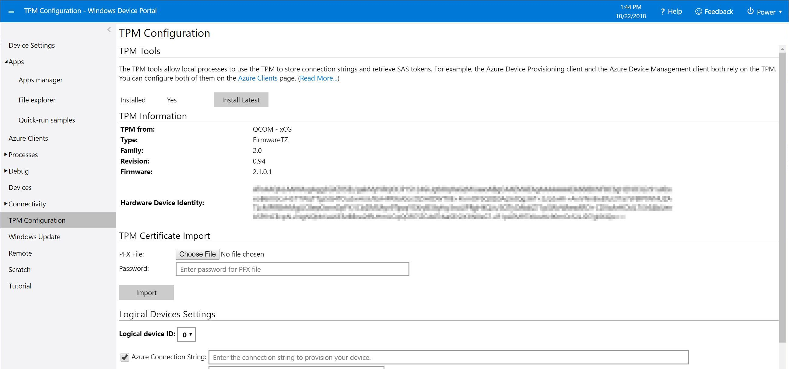

# Implementing a Trusted Platform Module on Windows 10 IoT Core

## What is TPM?
A Trusted Platform Module (TPM) is a cryptographic coprocessor including capabilities for random number generation, secure generation of cryptographic keys and limitation of their use. It also includes capabilities such as remote attestation and sealed storage.
The TPM technical specification is publicly available, driven by the Trusted Computing Group (TCG). The latest version TPM 2.0 (released October 2014), is a major redesign of the specification which adds new functionality and fixes weaknesses of the former TPM 1.2.

## Why TPM?  
Computers that incorporate a TPM can create cryptographic keys and encrypt them so that they can only be decrypted by the TPM. This process, often called **"wrapping"** or **"binding"** a key, can help protect the key from disclosure. Each TPM has a master "wrapping" key, called the storage root key, which is stored within the TPM itself. The private portion of a key created in a TPM is never exposed to any other component, software, process, or person.  

Computers that incorporate a TPM can also create a key that has not only been wrapped but is also tied to certain platform measurements. This type of key can only be unwrapped when those platform measurements have the same values that they had when the key was created. This process is called **"sealing"** the key to the TPM. Decrypting the key is called **"unsealing"**. The TPM can also seal and unseal data generated outside of the TPM. With this sealed key and software such as BitLocker Drive Encryption, you can lock data until specific hardware or software conditions are met.  

With a TPM, private portions of key pairs are kept separate from the memory controlled by the operating system. Keys can be sealed to the TPM, and certain assurances about the state of a system (assurances that define the "trustworthiness" of a system) can be made before the keys are unsealed and released for use. Because the TPM uses its own internal firmware and logic circuits for processing instructions, it does not rely on the operating system and is not exposed to vulnerabilities that might exist in the operating system or application software.

## TPM Architecture
_Difference between TPM 1.2 and TPM 2.0._  
The TPM specification has been developed twice. The first time, it developed from 1.1b to 1.2, incorporating  new capabilities requested/identified by the specification committee. This feature-creep form of evolution made the final TPM 1.2 specification very complicated. Eventually, cryptographic weaknesses of SHA-1 (which was the strongest commercial algorithm in TPM 1.2) were revealed which caused the need for a change. The TPM architecture was redesigned from scratch, resulting in the much more integrated and unified design of TPM 2.0.  

The changes and enhancements compared to the previous TPM 1.2 include:

* Support for additional cryptographic algorithms
* Enhancements to the availability of the TPM to applications
* Enhanced authorization mechanisms
* Simplified TPM management
* Additional capabilities to enhance the security of platform services

Note that Windows IoT Core supports only TPM 2.0 and does not support the outdated TPM 1.2.

## What is TBS? 
The TPM Base Services (TBS) feature is a system service that allows transparent sharing of the TPM resources. It shares the TPM resources among multiple applications on the same physical machine through remote procedure calls (RPC). It centralizes TPM access across applications using priorities specified by the calling applications.  

The TPM provides cryptographic functions designed to provide trust in the platform. Because the TPM is implemented in hardware, it has finite resources. The TCG defines a TPM Software Stack (TSS) that makes use of these resources to provide trusted operations for application software. However, no provision is made for running a TSS implementation side-by-side with operating system software that may also be using TPM resources. The TBS feature solves this problem by enabling each software stack that communicates with TBS to use TPM resources checking for any other software stacks that may be running on the machine.

## TPM solutions available on Windows IoT Core  

### Firmware TPM (fTPM)  
Firmware TPM (fTPM) requires special Processor/SoC support that is not currently implemented on Raspberry Pi 2 or 3. MinnowBoard Max needs firmware version 0.80 or higher. DragonBoard410c provides fTPM capabilities out of the box enabled by default.  

### Discrete TPM (dTPM)  
Discrete TPM (dTPM) is considered the utmost trustworthy solution by all means.  
There are several manufacturers of dTPM chips and PCB modules that are supported on Windows IoT Core:

> | Manufacturer | Web Page | Modul Type | TPM Chip |
> |-------------|----------|----------|----------| 
> | Infineon | [Infineon TPM](https://www.infineon.com/cms/en/product/evaluation-boards/iridium9670-tpm2.0-linux/)| Evalboard | [Infineon SLB9670 TPM 2.0](https://www.infineon.com/cms/de/product/security-smart-card-solutions/optiga-embedded-security-solutions/optiga-tpm/slb-9670vq2.0/) |
> | Pi3g | [Pi3g.com](https://pi3g.com/eigene-produkte/)| Mass Product & Evalboard | [Infineon SLB9670 TPM 2.0](https://www.infineon.com/cms/de/product/security-smart-card-solutions/optiga-embedded-security-solutions/optiga-tpm/slb-9670vq2.0/) |

### Software TPM (sTPM)  
Software TPM (sTPM) is also referred to as TPM Simulator. It is platform-independent, supported on Windows IoT Core.  

> [!NOTE]
> sTPM is intended for development purposes only and does not provide any real security benefits.  

## Samples  
<!--
* [TBSSample project C++](https://developer.microsoft.com/en-us/windows/iot/samples/tbssample)
  This tutorial demonstrates how to create a basic C++ application that uses TBS to poll the TPM.  -->
* [Urchin Library Sample](https://github.com/ms-iot/security/tree/master/Urchin/Lib) This tutorial demonstrates how to create a sample C++ application that exercises the TPM functionality using the [Urchin library](https://github.com/ms-iot/security). Urchin is a spec-compliant library derived from the TPM 2.0 reference implementation. It provides to the client the functionality to marshal/unmarshal all data structures, properly calculate authorizations, perform parameter encryption and do auditing.

## Setting Up a TPM
Here are the steps to setup a TPM on suggested platform devices.

### Firmware TPM (fTPM)
Firmware TPM (fTPM) requires special Processor/SoC support and whence fTPM is not currently implemented on Raspberry Pi2.

For Qualcomm Dragonboard, follow these steps:

1. Power on your device and open IoT Core Dashboard.
2. Access your device via Windows Device Portal and navigate to the **TPM Configuration** section.

    

3. Click on **Install Latest** to install the latest fTPM to the device.

    

For Minnowboard Max, follow these steps:

1. You must have MBM with UEFI version 0.80 or above.
2. Enable fTPM by changing the following UEFI settings:

        Device Manager -> System Setup -> Security Configuration -> PTT = <Enable>

3. Ensure you do not have C:\Windows\System32\ACPITABL.dat for sTPM/dTPM (resolve the conflict/delete the file if not needed).
4. Verify you have the right TPM version enabled - run the [TPM 2.0 Tool](https://github.com/ms-iot/security/tree/master/Urchin/T2T) on the Windows IoT Core device.

        C:\>t2t.exe -cap

        TBS detected 2.0 firmware TPM (fTPM) using Intel TEE.
        Capabilities:
        PT_FIXED:
        TPM_PT_FAMILY_INDICATOR = '2.0'
        TPM_PT_LEVEL = 0 (0x00000000)
        TPM_PT_REVISION = 0.93
        TPM_PT_DAY_OF_YEAR = 283 (0x0000011b)
        TPM_PT_YEAR = 2012 (0x000007dc)
        TPM_PT_MANUFACTURER = 'INTC'
        TPM_PT_VENDOR_STRING = 'Intel'
        TPM_PT_VENDOR_TPM_TYPE = 3 (0x00000003)
        TPM_PT_FIRMWARE_VERSION_1 = 1.0 (0x1.0x0)
        TPM_PT_FIRMWARE_VERSION_2 = 2.1060 (0x2.0x424)
        TPM_PT_INPUT_BUFFER = 1024 (0x00000400)
        TPM_PT_HR_TRANSIENT_MIN = 3 (0x00000003)
        TPM_PT_HR_PERSISTENT_MIN = 2 (0x00000002)
        TPM_PT_HR_LOADED_MIN = 3 (0x00000003)
        TPM_PT_ACTIVE_SESSIONS_MAX = 64 (0x00000040)
        TPM_PT_PCR_COUNT = 24 (0x00000018)
        TPM_PT_PCR_SELECT_MIN = 3 (0x00000003)
        TPM_PT_CONTEXT_GAP_MAX = 65535 (0x0000ffff)
        TPM_PT_NV_COUNTERS_MAX = 16 (0x00000010)
        TPM_PT_NV_INDEX_MAX = 2048 (0x00000800)
        TPM_PT_MEMORY = sharedNV objectCopiedToRam
        TPM_PT_CLOCK_UPDATE = 4096ms
        TPM_PT_CONTEXT_HASH = TPM_ALG_SHA256
        TPM_PT_CONTEXT_SYM = TPM_ALG_AES
        TPM_PT_CONTEXT_SYM_SIZE = 128 (0x00000080)
        TPM_PT_ORDERLY_COUNT = 255 (0x000000ff)
        TPM_PT_MAX_COMMAND_SIZE = 3968 (0x00000f80)
        TPM_PT_MAX_RESPONSE_SIZE = 3968 (0x00000f80)
        TPM_PT_MAX_DIGEST = 32 (0x00000020)
        TPM_PT_MAX_OBJECT_CONTEXT = 924 (0x0000039c)
        TPM_PT_MAX_SESSION_CONTEXT = 244 (0x000000f4)
        TPM_PT_PS_FAMILY_INDICATOR = TPM_PS_MAIN
        TPM_PT_PS_LEVEL = 0 (0x00000000)
        TPM_PT_PS_REVISION = 0
        TPM_PT_PS_DAY_OF_YEAR = 0 (0x00000000)
        TPM_PT_PS_YEAR = 0 (0x00000000)
        TPM_PT_SPLIT_MAX = 0 (0x00000000)
        TPM_PT_TOTAL_COMMANDS = 70 (0x00000046)
        TPM_PT_LIBRARY_COMMANDS = 70 (0x00000046)
        TPM_PT_VENDOR_COMMANDS = 0 (0x00000000)

        PT_VAR:
        TPM_PT_PERMANENT = lockoutAuthSet tpmGeneratedEPS
        TPM_PT_STARTUP_CLEAR = phEnable shEnable ehEnable
        TPM_PT_HR_NV_INDEX = 2 (0x00000002)
        TPM_PT_HR_LOADED = 0 (0x00000000)
        TPM_PT_HR_LOADED_AVAIL = 3 (0x00000003)
        TPM_PT_HR_ACTIVE = 0 (0x00000000)
        TPM_PT_HR_ACTIVE_AVAIL = 64 (0x00000040)
        TPM_PT_HR_TRANSIENT_AVAIL = 3 (0x00000003)
        TPM_PT_HR_PERSISTENT = 3 (0x00000003)
        TPM_PT_HR_PERSISTENT_AVAIL = 18 (0x00000012)
        TPM_PT_NV_COUNTERS = 2 (0x00000002)
        TPM_PT_NV_COUNTERS_AVAIL = 14 (0x0000000e)
        TPM_PT_ALGORITHM_SET = 0 (0x00000000)
        TPM_PT_LOADED_CURVES = 0 (0x00000000)
        TPM_PT_LOCKOUT_COUNTER = 0 (0x00000000)
        TPM_PT_MAX_AUTH_FAIL = 10 (0x0000000a)
        TPM_PT_LOCKOUT_INTERVAL = 2h 0" 0'
        TPM_PT_LOCKOUT_RECOVERY = 2h 0" 0'
        TPM_PT_AUDIT_COUNTER = 0

        c:\>

5. Verify fTPM is functioning - run the [Urchin Unit Tests](https://github.com/ms-iot/security/tree/master/Urchin/UrchinTest) on the Windows IoT Core device.  
   You should see several PASS tests (note that some of the functionality is not supported by the fTPM, so a few error codes are expected):

        C:\>urchintest.exe
        ---SETUP----------------------------------------
        PASS...........CreateAuthorities()
        PASS...........CreateEkObject()
        PASS...........CreateSrkObject()
        (0x80280400)...CreateAndLoadAikObject()
        PASS...........CreateAndLoadKeyObject()

        ---TESTS----------------------------------------
        PASS...........TestGetCapability()
        PASS...........TestGetEntropy()
        PASS...........TestPolicySession()
        PASS...........TestSignWithPW()
        PASS...........TestSignHMAC()
        PASS...........TestSignBound()
        PASS...........TestSignSalted()
        PASS...........TestSignSaltedAndBound()
        PASS...........TestSignParameterEncryption()
        PASS...........TestSignParameterDecryption()
        PASS...........TestReadPcrWithEkSeededSession()
        (0x80280400)...TestCreateHashAndHMAC()
        (0x80280400)...TestCreateHashAndHMACSequence()
        (0x80280400)...TestSymKeyImport()
        PASS...........TestRsaKeyImport()
        (0x00000184)...TestCredentialActivation()
        PASS...........TestKeyExport()
        (0x80280400)...TestSymEncryption()
        (0x80280400)...TestCertifiedMigration()
        (0x0000014b)...TestNVIndexReadWrite()
        (0x80280400)...TestVirtualization()
        PASS...........TestObjectChangeAuth()
        PASS...........TestUnseal()
        PASS...........TestDynamicPolicies()
        (0x80280400)...TestRSADecrypt()
        (0x000002ca)...TestECDSASign()
        (0x00000184)...TestKeyAttestation()
        (0x00000184)...TestPlatformAttestation()

        ---CLEANUP--------------------------------------
        (0x000001c4)...UnloadKeyObjects()

        C:\>

### Discrete TPM (dTPM)
These instructions are applicable for any dTPM module supported on MBM, RPi2, or RPi3.

1. Get a discrete TPM module and attach it to the MBM/RPi2/RPi3.
2. (Applies to MBM) Disable fTPM by changing the following UEFI settings:

        Device Manager -> System Setup -> Security Configuration -> PTT = <Disable>

3. (Applies to MBM) Enable dTPM by changing the following UEFI settings:

        Device Manager -> System Setup -> Security Configuration -> Discrete TPM = <Enable>

4. Based on your discrete TPM module of choice, identify its matching ACPI table [here](https://github.com/ms-iot/security/tree/master/TPM-ACPITABL).
5. Copy that ACPI table to MBM/RPi2/RPi3 _C:\Windows\System32\ACPITABL.dat_.
6. Enable testsigning on the device:

        bcdedit /set {current} integrityservices disable
        bcdedit /set testsigning on

7. Reboot the device.
8. Verify you have the right TPM version enabled - run the [TPM 2.0 Tool](https://github.com/ms-iot/security/tree/master/Urchin/T2T) on the Windows IoT Core device.

        C:\>t2t.exe -cap

        TBS detected 2.0 discrete TPM (dTPM) using TIS on SPB.
        Capabilities:
        PT_FIXED:
        TPM_PT_FAMILY_INDICATOR = '2.0'
        TPM_PT_LEVEL = 0 (0x00000000)
        TPM_PT_REVISION = 1.16
        TPM_PT_DAY_OF_YEAR = 303 (0x0000012f)
        TPM_PT_YEAR = 2014 (0x000007de)
        TPM_PT_MANUFACTURER = 'NTZ'
        TPM_PT_VENDOR_STRING = 'NTZ'
        TPM_PT_VENDOR_TPM_TYPE = 17 (0x00000011)
        TPM_PT_FIRMWARE_VERSION_1 = 4.31 (0x4.0x1f)
        TPM_PT_FIRMWARE_VERSION_2 = 5378.4617 (0x1502.0x1209)
        TPM_PT_INPUT_BUFFER = 2220 (0x000008ac)
        TPM_PT_HR_TRANSIENT_MIN = 4 (0x00000004)
        TPM_PT_HR_PERSISTENT_MIN = 7 (0x00000007)
        TPM_PT_HR_LOADED_MIN = 4 (0x00000004)
        TPM_PT_ACTIVE_SESSIONS_MAX = 64 (0x00000040)
        TPM_PT_PCR_COUNT = 24 (0x00000018)
        TPM_PT_PCR_SELECT_MIN = 3 (0x00000003)
        TPM_PT_CONTEXT_GAP_MAX = 65535 (0x0000ffff)
        TPM_PT_NV_COUNTERS_MAX = 0 (0x00000000)
        TPM_PT_NV_INDEX_MAX = 1639 (0x00000667)
        TPM_PT_MEMORY = objectCopiedToRam
        TPM_PT_CLOCK_UPDATE = 4096000ms
        TPM_PT_CONTEXT_HASH = TPM_ALG_SHA256
        TPM_PT_CONTEXT_SYM = TPM_ALG_AES
        TPM_PT_CONTEXT_SYM_SIZE = 128 (0x00000080)
        TPM_PT_ORDERLY_COUNT = 255 (0x000000ff)
        TPM_PT_MAX_COMMAND_SIZE = 2220 (0x000008ac)
        TPM_PT_MAX_RESPONSE_SIZE = 2220 (0x000008ac)
        TPM_PT_MAX_DIGEST = 32 (0x00000020)
        TPM_PT_MAX_SESSION_CONTEXT = 244 (0x000000f4)
        TPM_PT_PS_FAMILY_INDICATOR = TPM_PS_PDA
        TPM_PT_PS_LEVEL = 0 (0x00000000)
        TPM_PT_PS_REVISION = 25600
        TPM_PT_PS_DAY_OF_YEAR = 0 (0x00000000)
        TPM_PT_PS_YEAR = 0 (0x00000000)
        TPM_PT_SPLIT_MAX = 128 (0x00000080)
        TPM_PT_TOTAL_COMMANDS = 101 (0x00000065)
        TPM_PT_LIBRARY_COMMANDS = 99 (0x00000063)
        TPM_PT_VENDOR_COMMANDS = 2 (0x00000002)
        TPM_PT_NV_BUFFER_MAX = 1639 (0x00000667)

        PT_VAR:
        TPM_PT_STARTUP_CLEAR = phEnable shEnable ehEnable ehEnableNV
        TPM_PT_HR_NV_INDEX = 2 (0x00000002)
        TPM_PT_HR_LOADED = 0 (0x00000000)
        TPM_PT_HR_LOADED_AVAIL = 4 (0x00000004)
        TPM_PT_HR_ACTIVE = 0 (0x00000000)
        TPM_PT_HR_ACTIVE_AVAIL = 64 (0x00000040)
        TPM_PT_HR_TRANSIENT_AVAIL = 4 (0x00000004)
        TPM_PT_HR_PERSISTENT = 3 (0x00000003)
        TPM_PT_HR_PERSISTENT_AVAIL = 4 (0x00000004)
        TPM_PT_NV_COUNTERS = 2 (0x00000002)
        TPM_PT_NV_COUNTERS_AVAIL = 30 (0x0000001e)
        TPM_PT_ALGORITHM_SET = 0 (0x00000000)
        TPM_PT_LOADED_CURVES = 3 (0x00000003)
        TPM_PT_LOCKOUT_COUNTER = 0 (0x00000000)
        TPM_PT_MAX_AUTH_FAIL = 32 (0x00000020)
        TPM_PT_LOCKOUT_INTERVAL = 2h 0" 0'
        TPM_PT_LOCKOUT_RECOVERY = 24h 0" 0'
        TPM_PT_NV_WRITE_RECOVERY = 0ms
        TPM_PT_AUDIT_COUNTER = 0

        C:\>

9. Verify dTPM is functioning - run the [Urchin Unit Tests](https://github.com/ms-iot/security/tree/master/Urchin/UrchinTest) on the Windows IoT Core device.  
    You should see several PASS tests (note that some of the functionality may not be supported by the dTPM, so a few error codes are expected):

        C:\>urchintest.exe

        ---SETUP----------------------------------------
        PASS...........CreateAuthorities()
        PASS...........CreateEkObject()
        PASS...........CreateSrkObject()
        PASS...........CreateAndLoadAikObject()
        PASS...........CreateAndLoadKeyObject()

        ---TESTS----------------------------------------
        PASS...........TestGetCapability()
        PASS...........TestGetEntropy()
        PASS...........TestPolicySession()
        PASS...........TestSignWithPW()
        PASS...........TestSignHMAC()
        PASS...........TestSignBound()
        PASS...........TestSignSalted()
        PASS...........TestSignSaltedAndBound()
        (0xc000000d)...TestSignParameterEncryption()
        PASS...........TestSignParameterDecryption()
        PASS...........TestReadPcrWithEkSeededSession()
        PASS...........TestCreateHashAndHMAC()
        PASS...........TestCreateHashAndHMACSequence()
        PASS...........TestSymKeyImport()
        (0xc000000d)...TestRsaKeyImport()
        PASS...........TestCredentialActivation()
        PASS...........TestKeyExport()
        (0x00000182)...TestSymEncryption()
        PASS...........TestCertifiedMigration()
        PASS...........TestNVIndexReadWrite()
        (0x80280400)...TestVirtualization()
        PASS...........TestObjectChangeAuth()
        PASS...........TestUnseal()
        PASS...........TestDynamicPolicies()
        PASS...........TestRSADecrypt()
        PASS...........TestECDSASign()
        (0xc000000d)...TestKeyAttestation()
        (0xc000000d)...TestPlatformAttestation()

        ---CLEANUP--------------------------------------
        PASS...........UnloadKeyObjects()

        C:\>

### Software TPM (sTPM)  
Note that **sTPM is intended for development purposes only and does not provide any real security benefits**.

1. (Applies to MBM) Disable fTPM by changing the following UEFI settings:

        Device Manager -> System Setup -> Security Configuration -> PTT = <Disable>

2. (Applies to MBM) Enable dTPM by changing the following UEFI settings:

        Device Manager -> System Setup -> Security Configuration -> Discrete TPM = <Enable>

3. Enable testsigning on the device:

        bcdedit /set {current} integrityservices disable
        bcdedit /set testsigning on

4. Copy the ACPI table from [here](https://github.com/ms-iot/security/tree/master/TPM-ACPITABL/fTPMSim) to MBM/RPi2/RPi3 _C:\Windows\System32\ACPITABL.dat_.
5. Reboot the device.
6. Verify you have the right TPM version enabled - run the [TPM 2.0 Tool](https://github.com/ms-iot/security/tree/master/Urchin/T2T) on the Windows IoT Core device.

        C:\>t2t.exe -cap
        TBS detected 2.0 simulated TPM (sTPM).
        Capabilities:
        PT_FIXED:
        TPM_PT_FAMILY_INDICATOR = '2.0'
        TPM_PT_LEVEL = 0 (0x00000000)  
        TPM_PT_REVISION = 1.15
        TPM_PT_DAY_OF_YEAR = 163 (0x000000a3)
        TPM_PT_YEAR = 2014 (0x000007de)
        TPM_PT_MANUFACTURER = 'MSFT'
        TPM_PT_VENDOR_STRING = 'IoT Software TPM'
        TPM_PT_VENDOR_TPM_TYPE = 1 (0x00000001)
        TPM_PT_FIRMWARE_VERSION_1 = 8213.275 (0x2015.0x113)
        TPM_PT_FIRMWARE_VERSION_2 = 21.18466 (0x15.0x4822)
        TPM_PT_INPUT_BUFFER = 1024 (0x00000400)
        TPM_PT_HR_TRANSIENT_MIN = 3 (0x00000003)
        TPM_PT_HR_PERSISTENT_MIN = 2 (0x00000002)
        TPM_PT_HR_LOADED_MIN = 3 (0x00000003)
        TPM_PT_ACTIVE_SESSIONS_MAX = 64 (0x00000040)
        TPM_PT_PCR_COUNT = 24 (0x00000018)
        TPM_PT_PCR_SELECT_MIN = 3 (0x00000003)
        TPM_PT_CONTEXT_GAP_MAX = 65535 (0x0000ffff)
        TPM_PT_NV_COUNTERS_MAX = 0 (0x00000000)
        TPM_PT_NV_INDEX_MAX = 2048 (0x00000800)
        TPM_PT_MEMORY = sharedNV objectCopiedToRam
        TPM_PT_CLOCK_UPDATE = 4096ms
        TPM_PT_CONTEXT_HASH = TPM_ALG_SHA256
        TPM_PT_CONTEXT_SYM = TPM_ALG_AES
        TPM_PT_CONTEXT_SYM_SIZE = 256 (0x00000100)
        TPM_PT_ORDERLY_COUNT = 255 (0x000000ff)
        TPM_PT_MAX_COMMAND_SIZE = 4096 (0x00001000)
        TPM_PT_MAX_RESPONSE_SIZE = 4096 (0x00001000)
        TPM_PT_MAX_DIGEST = 48 (0x00000030)
        TPM_PT_MAX_OBJECT_CONTEXT = 1520 (0x000005f0)
        TPM_PT_MAX_SESSION_CONTEXT = 308 (0x00000134)
        TPM_PT_PS_FAMILY_INDICATOR = TPM_PS_MAIN
        TPM_PT_PS_LEVEL = 0 (0x00000000)
        TPM_PT_PS_REVISION = 0
        TPM_PT_PS_DAY_OF_YEAR = 0 (0x00000000)
        TPM_PT_PS_YEAR = 0 (0x00000000)
        TPM_PT_SPLIT_MAX = 128 (0x00000080)
        TPM_PT_TOTAL_COMMANDS = 106 (0x0000006a)
        TPM_PT_LIBRARY_COMMANDS = 105 (0x00000069)
        TPM_PT_VENDOR_COMMANDS = 1 (0x00000001)

        PT_VAR:
        TPM_PT_PERMANENT = lockoutAuthSet tpmGeneratedEPS
        TPM_PT_STARTUP_CLEAR = phEnable shEnable ehEnable ehEnableNV
        TPM_PT_HR_NV_INDEX = 2 (0x00000002)
        TPM_PT_HR_LOADED = 0 (0x00000000)
        TPM_PT_HR_LOADED_AVAIL = 3 (0x00000003)
        TPM_PT_HR_ACTIVE = 0 (0x00000000)
        TPM_PT_HR_ACTIVE_AVAIL = 64 (0x00000040)
        TPM_PT_HR_TRANSIENT_AVAIL = 3 (0x00000003)
        TPM_PT_HR_PERSISTENT = 3 (0x00000003)
        TPM_PT_HR_PERSISTENT_AVAIL = 5 (0x00000005)
        TPM_PT_NV_COUNTERS = 2 (0x00000002)
        TPM_PT_NV_COUNTERS_AVAIL = 31 (0x0000001f)
        TPM_PT_ALGORITHM_SET = 0 (0x00000000)
        TPM_PT_LOADED_CURVES = 3 (0x00000003)
        TPM_PT_LOCKOUT_COUNTER = 3 (0x00000003)
        TPM_PT_MAX_AUTH_FAIL = 32 (0x00000020)
        TPM_PT_LOCKOUT_INTERVAL = 2h 0" 0'
        TPM_PT_LOCKOUT_RECOVERY = 24h 0" 0'
        TPM_PT_AUDIT_COUNTER = 0

        C:\>

7. Verify sTPM is functioning - run the [Urchin Unit Tests](https://github.com/ms-iot/security/tree/master/Urchin/UrchinTest) on the Windows IoT Core device.  
   You should see several PASS tests (note that some of the functionality is not supported by the sTPM, so a few error codes are expected):

        C:\>urchintest.exe
        ---SETUP----------------------------------------
        PASS...........CreateAuthorities()
        PASS...........CreateEkObject()
        PASS...........CreateSrkObject()
        PASS...........CreateAndLoadAikObject()
        PASS...........CreateAndLoadKeyObject()

        ---TESTS----------------------------------------
        PASS...........TestGetCapability()
        PASS...........TestGetEntropy()
        PASS...........TestPolicySession()
        PASS...........TestSignWithPW()
        PASS...........TestSignHMAC()
        PASS...........TestSignBound()
        PASS...........TestSignSalted()
        PASS...........TestSignSaltedAndBound()
        (0xc000000d)...TestSignParameterEncryption()
        PASS...........TestSignParameterDecryption()
        PASS...........TestReadPcrWithEkSeededSession()
        PASS...........TestCreateHashAndHMAC()
        PASS...........TestCreateHashAndHMACSequence()
        PASS...........TestSymKeyImport()
        (0xc000000d)...TestRsaKeyImport()
        PASS...........TestCredentialActivation()
        PASS...........TestKeyExport()
        (0x00000182)...TestSymEncryption()
        PASS...........TestCertifiedMigration()
        PASS...........TestNVIndexReadWrite()
        (0x80280400)...TestVirtualization()
        PASS...........TestObjectChangeAuth()
        PASS...........TestUnseal()
        PASS...........TestDynamicPolicies()
        PASS...........TestECDSASign())
        PASS........
        (0xc000000d)...TestKeyAttestation()
        (0xc000000d)...TestPlatformAttestation()

        ---CLEANUP--------------------------------------
        PASS...........UnloadKeyObjects()

        C:\>

## Additional Resources  
* [Trusted Platform Module (TPM) Specifications](http://www.trustedcomputinggroup.org/developers/trusted_platform_module) 
* [TCG TPM 2.0 Library Specification](http://www.trustedcomputinggroup.org/resources/tpm_library_specification)
* [TPM Base Services](https://msdn.microsoft.com/en-us/library/windows/desktop/aa446796(v=vs.85).aspx) 
* [Enabling Secure Boot and BitLocker](08a-SecureBootBitLockerDeviceGuard.md)

