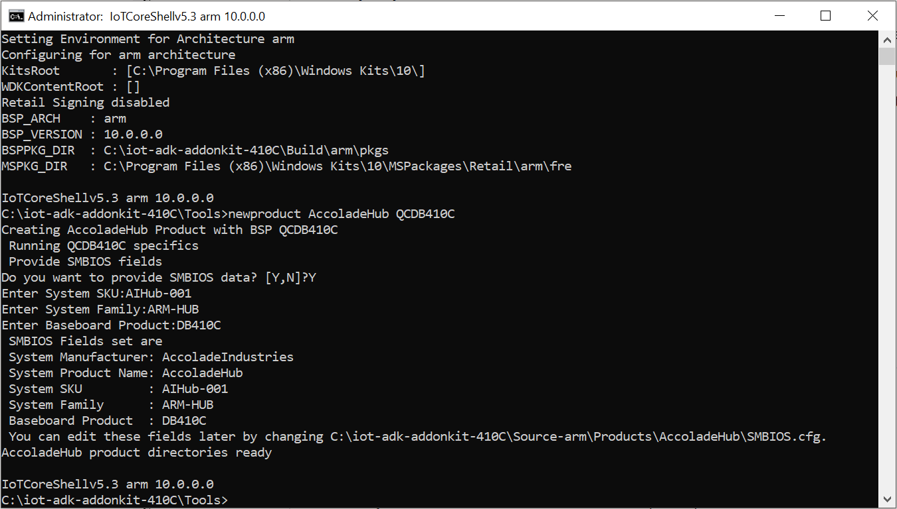
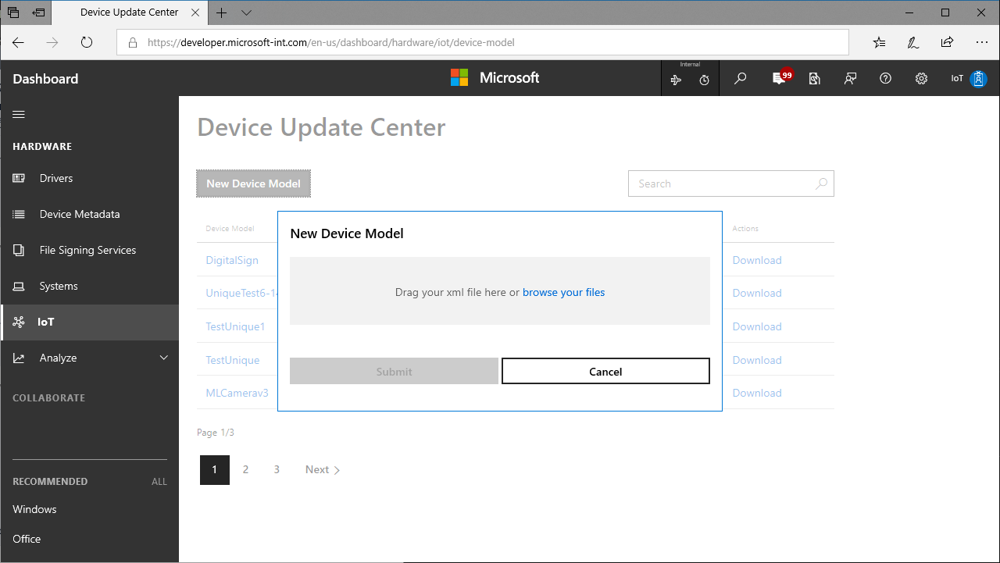
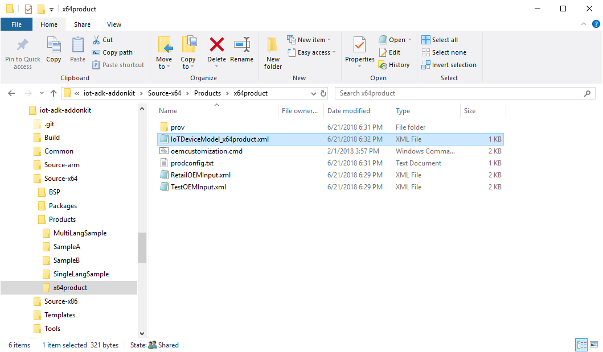
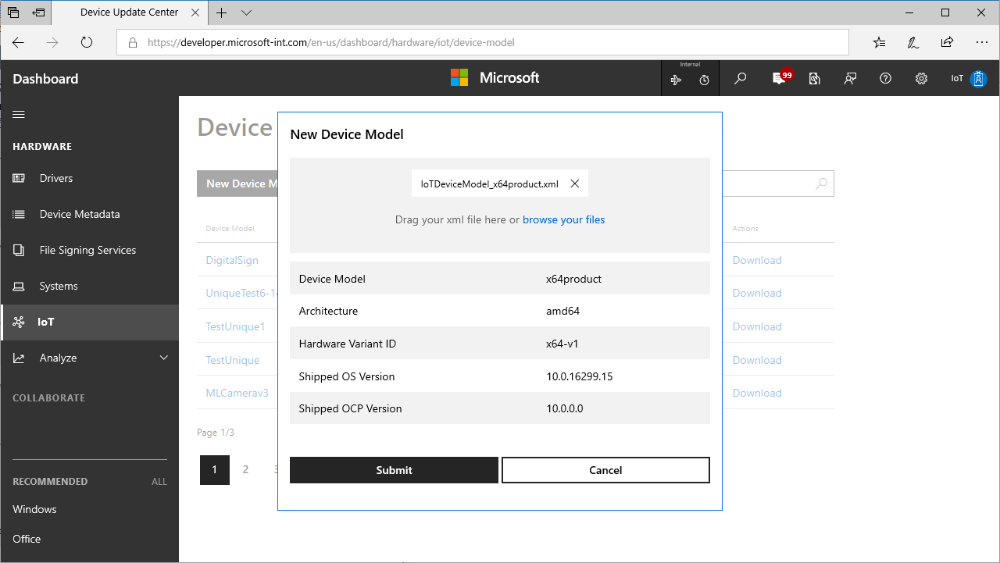
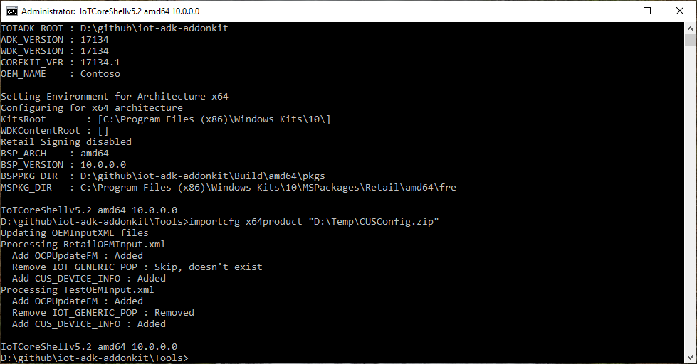

# Device Update Center
Device Update Center portal provides OEMs a way to:

- Publish OEM custom packages(OCP) to Windows Update Cloud
- Flight OEM custom packages to their devices based on flight ring
- Flight OS updates to their devices based on flight rings

## Prerequisit for Device Update Center
Please review the following requirements before you start the registration process:

- **You must have an Extended Validation (EV) code signing certificate.** Please check whether your company already has a code signing certificate. **If your company already has a certificate, have the certificate available. You will need the certificate to sign files.** If your company does not have a certificate, you will need to buy one as part of the registration process.
- **You will need to sign in as a global administrator in your organization's Azure Active Directory.** If you do not know whether your organization has an Azure Active Directory, contact your IT department. **If your organization does not have an Azure Active Directory, you will be able to create one for free.**
- You **must** have the authority to sign legal agreements on behalf of your organization.

## Step 1: Set up Device Update Center
### Sign up
1. Create a [Windows Harware Dev Center](http://aka.ms/ducregister) account to access the Device Update Center(DUC). You will need:

   - **An Extended Validation (EV) code signing certificate:** Used to validate the update cab file submitted for updates
   - **An Azure Active Directory (AAD) account with administrator rights:** Used to sign legal agreements
   See Register for the Hardware Program for the detailed instructions on the registration process.

2. Sign up for [Windows 10 IoT Core Services](http://aka.ms/iotcoreservices)

3. Login to Hardware Dev Center with the administrator role and specify roles for other users in your organisation. You will need:

- **Driver Submitter role** for update submission
- **Shipping Label Owner** role for update flighting

## Step 2: Create a *new* product

1. Create a new product: `newproduct <productname> <bspname>`

2. Configure the SMBIOS fields based on the format defined by the BSP (for Qualcomm, this is defined in a SMBIOS.cfg file). The key fields used in the update are:

   - **System Product Name**, referred in the update portal as **Device Model**.

   - **Base Board Product**, referred in the update portal as **Hardware Variant ID**.

3. Set initial version of the packages: `setversion 10.0.0.0`.

4. Create the IoTDeviceModel xml file: `exportidm <productname>` . This will prompt to enter the required SMBIOS fields.

   
 
   ## Step 3: Register Device Model in Device Update Center
   In the Device Update Center portal, select **New Device Model**.

   

Browse your files and select the `IoTDeviceModel_<productname>.xml` from the iot-adk-addonkit folder.

 

Confirm the device model specification and press **Submit**.

 

A new device model entry will be added to device model table. You will also see a **download** link in that table.

Download the zip file **(CUSConfig.zip)**

### Build a base image for the device
1. In the IoTCoreShell, import the config file: 'importcfg <productname> <CUSConfig.zip>' This will also edit the OEMInputXML files for the inclusion of proper feature IDs.

2. Sign all required binaries with the code signing certificate using 'signbinaries.cmd' and for the bsp packages: 're-signcabs <src dir> <dst dir>'

3. Build the base image using the below commands

    a. Build the packages: 'buildpkg all'

    b. Build the image:' buildimage <productname> <retail/test>'

    This gives you the base image with the OCP version 10.0.0.0.

    c. Optional: add a recovery image: 'buildrecovery <productname> <retail/test>'

4. Validate this image on the device.
