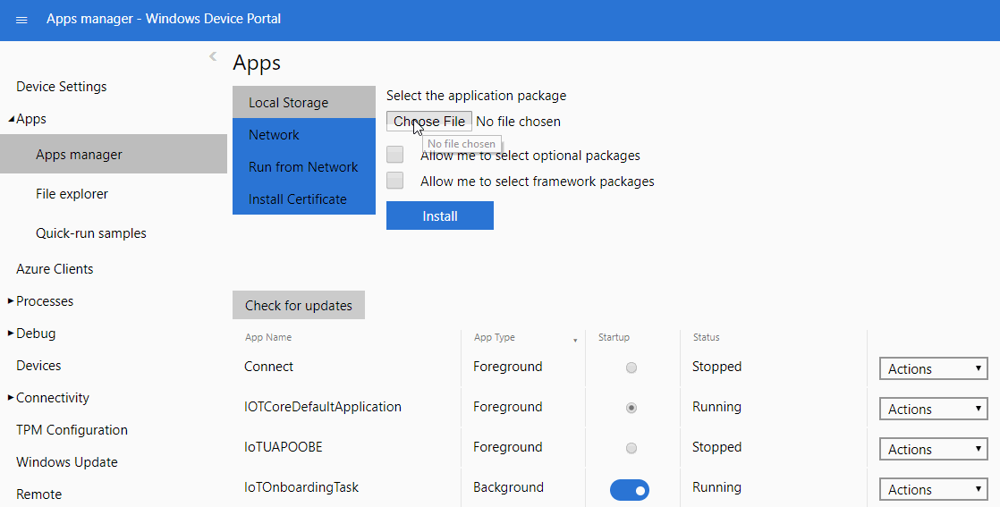

# Install your app on an IoT Core device
You can install your precomplied appx package using one of the two methods that are listed below.

> [!NOTE]
> The method using the Windows Device Portal is only for developer scenarios. The other two methods are for production scenarios.

## Using Windows Device Portal

For this method, you will need to ensure that you are connected to the internet. If you do not have access to the internet, you can also have a peer-to-peer ethernet connection between the device and a client machine that doesn't include a path to access the open internet. However, going about the latter way will install the app but will fail to launch if the app is store-signed.

To install your application on the device please do the following:

1. Open the [Windows Device Portal](https://docs.microsoft.com/windows/iot-core/manage-your-device/deviceportal) for your IoT device.

2. In the *Apps* menu, install your app by uploading the app package.
 

3. Deploy the app.

4. The application will now be visible on the list of applications on your device.
 

## Using provisioning package from WCD
You can create a provisioning package with the app and install the provisioning package on the device. This method works even on devices that do not have internet connection, and is the preferred method for installing the store license file. For example, this enables factory scenarios where the device is not connected to the internet but the primary app is a store-signed UWP app.

> [!NOTE]
> The Package Family Name (PFN) can be found in the Windows Dev Center under **App Management > App Identity**

1. Open [Windows Configuration Designer (WICD)](https://docs.microsoft.com/windows/configuration/provisioning-packages/provisioning-install-icd)

2. Select **Advanced Provisioning**, Enter the project name and a description

3. Choose Windows 10 IoT Core for the project settings and skip the provisioning package import

4. On the left hand side expand **Runtime Settings** and click on **Universal App Install > User Context App**

5. Enter the Package Family Name of your app and click **Add**

6. Under the newly added PFN
    - add the Appx and its dependencies
    - set the DeploymentOptions to "Force target application shutdown"

7. For Store signed apps, you will need to specify the license. Under UserContextAppLicense,
    - add LicenseProductID (available as LicenseID in the license XML file)
    - change the license xml extension to *.ms-windows-store-license*.
    - select your License Product ID on the left hand side and browse your license file to assign LicenseInstall field

8. For non-store signed apps, you will need to add the app.cer file under **Certificates > RootCertificates** 

9. Export the package

10. Copy the exported .ppkg file to _C:\Windows\Provisioning\Packages_ on the IoT device using [SSH](../connect-your-device/SSH.md) or [Powershell](../connect-your-device/powershell.md)) and reboot. When the device reboots, the provisioning package is processed and the app is installed.

## Add to the IoT core image(.ffu)   
You can add the app to be part of the IoT Core image itself. This is the widely used mechanism for OEMs. 

See how to [add an app to your image](https://docs.microsoft.com/windows-hardware/manufacture/iot/deploy-your-app-with-a-standard-board) and a [sample app package](https://github.com/ms-iot/iot-adk-addonkit/tree/master/Workspace/Source-arm/Packages/Appx.IoTCoreDefaultApp).

  ## Outline
* [10a-Debug and Deploy Apps Via Visual Studio](10a-DebugAndDeployApps.md)
* [10b-Installing Appx Packages](10b-InstallApp.md)
* [10c-Types of Applications for IoT Core](10c-AppTypes.md)
* [10d-Default App Overview](10d-defaultapp.md)
* [10e-Setting Appx as default application](10e-SettingDefaultApps.md)
* [10f-UWP Loopback debugging](10f-uwploopback.md)
