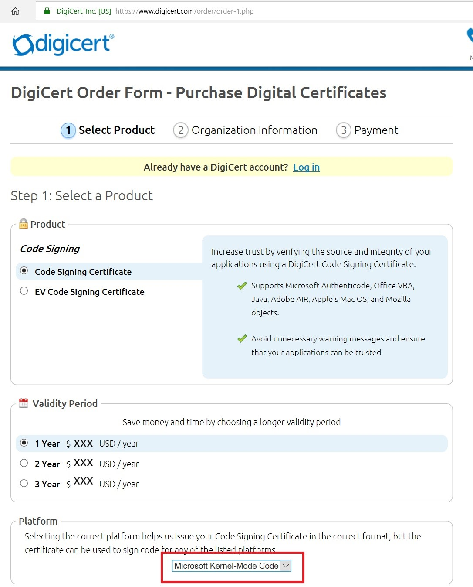

# Get the tools needed to create Windows IoT Core images

## Goals
* Download and install all the tools needed to build Windows IoT Core OEM images

## PCs and devices

* **Technician PC**: This is the PC you will be building your images on. A dedicated PC is recommended for this. This PC should have at least 15GB of free space for installing the software and for modifying IoT Core images. 
We recommend either Windows 10 or Windows 8.1 with the latest updates. The minimum requirement is Windows 7 SP1, though this may require additional tools or workarounds for tasks such as mounting .ISO images.

* **IoT device:** A test device or board that represents all of the devices in a single model line. 
Please see [SoCs and Custom Boards](../learn-about-hardware/SoCsAndCustomBoards.md) for a list of supported devices.

* An **HDMI cable**, and a **monitor or TV** with a dedicated HDMI input. This will be used to verify that the image is loaded and that your apps are running properly.

## Storage
* A **microSD card**. Please note that this is dependent on the device you are using. Some devices require a microSD card, while others have onboard storage. Learn more about existing [supported storage](../learn-about-hardware/HardwareCompatList.md#other-hardware-peripherals) options.

## Software
Here's the software you'll need to create custom OEM images using the Windows 10 IoT Core ADK Add-Ons:

**Install the following tools on your Technician PC:**

1. [Windows Assessment and Deployment Kit (Windows ADK)](https://docs.microsoft.com/windows-hardware/get-started/adk-install#winADK) including at least the features shown below. You'll use these tools to create images and provisioning packages. 
**NOTE - The version of ADK used must match the version of IoT Core Packages used below**

2. [Windows PE add-on for the ADK](https://docs.microsoft.com/windows-hardware/get-started/adk-install#winADK) - If you need to build image with Recovery capabilities, you will also need to separately download and install the `Windows PE add-on for the ADK`.  In previous releases, this was part of the ADK.  

3. [Windows Driver Kit (WDK) 10](https://docs.microsoft.com/windows-hardware/drivers/download-the-wdk) - `OPTIONAL`, required only if you are compiling drivers from source code.

4. [Windows 10 IoT Core Packages](https://www.microsoft.com/en-us/software-download/windows10iotcore). The .iso package adds the IoT Core packages and feature manifests used to create IoT Core images. By default, these packages are installed to **C:\Program Files (x86)\Windows Kits\10\MSPackages\Retail**. Install one or more of the IoT Core packages, depending on the architecture you are building an image for (ARM, ARM64, x86, x64).  
You can also install the pre-built images (FFUs) for development use.  The prebuilt image is installed to **C:\Program Files (x86)\Microsoft IoT\FFU**.

5. [IoT Core ADK Add-Ons](https://github.com/ms-iot/iot-adk-addonkit/). Click **[Clone** or **Download] > Download ZIP**, and extract it to a folder on the Technician PC (for example, **C:\IoT-ADK-AddonKit**). This kit includes the sample scripts and base structures you'll use to create your image. To learn about the contents, see [What's in the Windows ADK IoT Core Add-ons](https://docs.microsoft.com/windows-hardware/manufacture/iot/iot-core-adk-addons).

6. [Windows 10 IoT Core Dashboard](http://go.microsoft.com/fwlink/p/?LinkId=708576)

7. The Board Support Package from the device manufacturer you are working with. For example, if you are using a Raspberry Pi, the BSP is located [here](https://github.com/ms-iot/iot-adk-addonkit/releases/download/v4.4/rpibsp-wm.zip). For other devices, please visit the [Windows 10 IoT Core BSP](https://docs.microsoft.com/windows/iot-core/build-your-image/createbsps) page to download other BSPs.

8. Get a [code-signing certificate](https://docs.microsoft.com/windows-hardware/drivers/dashboard/get-a-code-signing-certificate). For  kernel driver signing, Standard Code signing certificate is sufficient.  You will require an EV cert to access the [Device Update Center](https://docs.microsoft.com/windows-hardware/service/iot/using-device-update-center) in Hardware Dev Center portal.
 

    **Important Note**

    We recommend that you purchase your code signing certificate from a Certificate Authority listed from the link above.  Building Windows 10 IoT Core **Retail image** or image with Secure Boot enabled requires that all kernel drivers (including all drivers in the BSP that's included in the retail image) are signed with a code signing certificate with Cross Signed root.  See [Cross-Certificates for Kernel Model Code Signing](https://docs.microsoft.com/windows-hardware/drivers/install/cross-certificates-for-kernel-mode-code-signing) and the FAQ section "Cross-Signing and SHA-256 Certificates" in [code-signing certificate](https://docs.microsoft.com/windows-hardware/drivers/dashboard/get-a-code-signing-certificate).  
 
    As a example, if you choose to purchase through [Digicert](https://www.digicert.com/friends/sysdev/), you must choose the "Microsoft Kernel-Model Code" option in the Platform section : 
     
    

Other helpful software:
    
* **A text editor** such as [Visual Studio Code](https://code.visualstudio.com/).

* **A compression program** such as [7-Zip](https://www.7-zip.org/), which can uncompress Windows app packages.

* **[Visual Studio 2017](https://visualstudio.microsoft.com/vs/)**, which can be used to create apps in [Adding an App to an image](06a-AddingApps.md).

## Other software
* **An app built for IoT Core**. This walkthrough uses the [IoT Core Default](https://github.com/ms-iot/samples/tree/develop/IoTCoreDefaultApp) app, though you can use your own.

## Next Steps
[Creating a Basic Windows IoT Core Image](CreateBasicImage.md)
