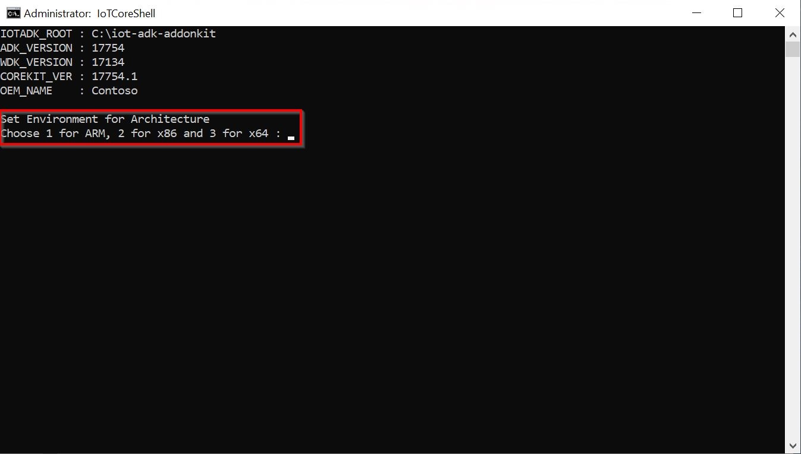
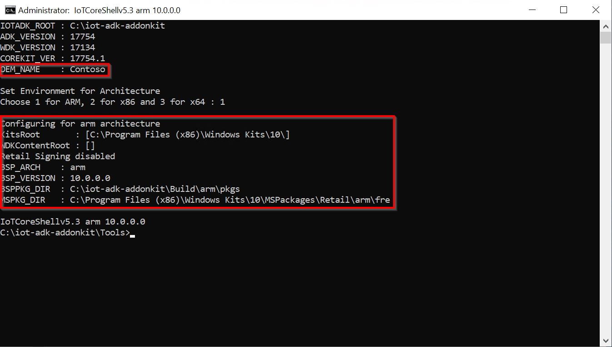
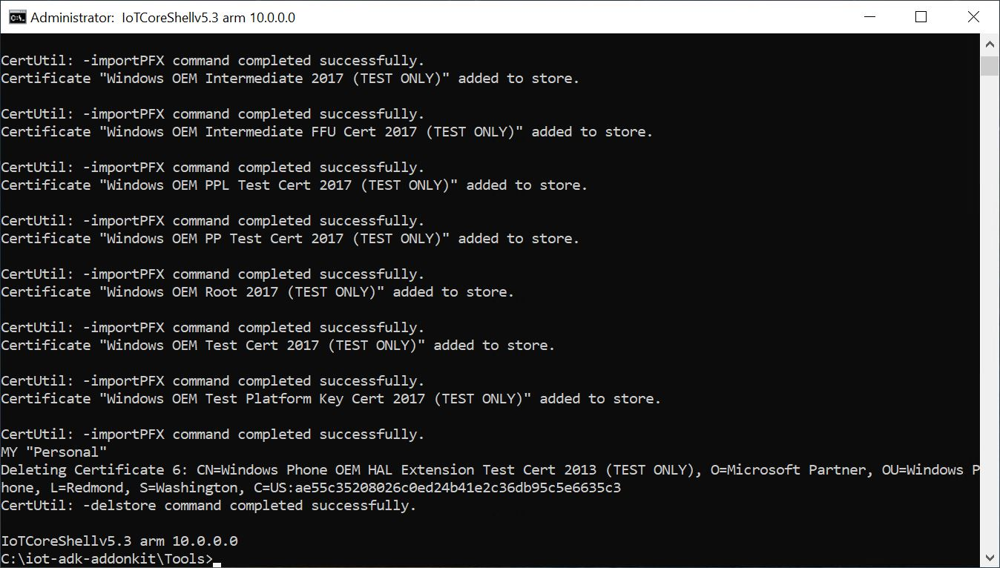
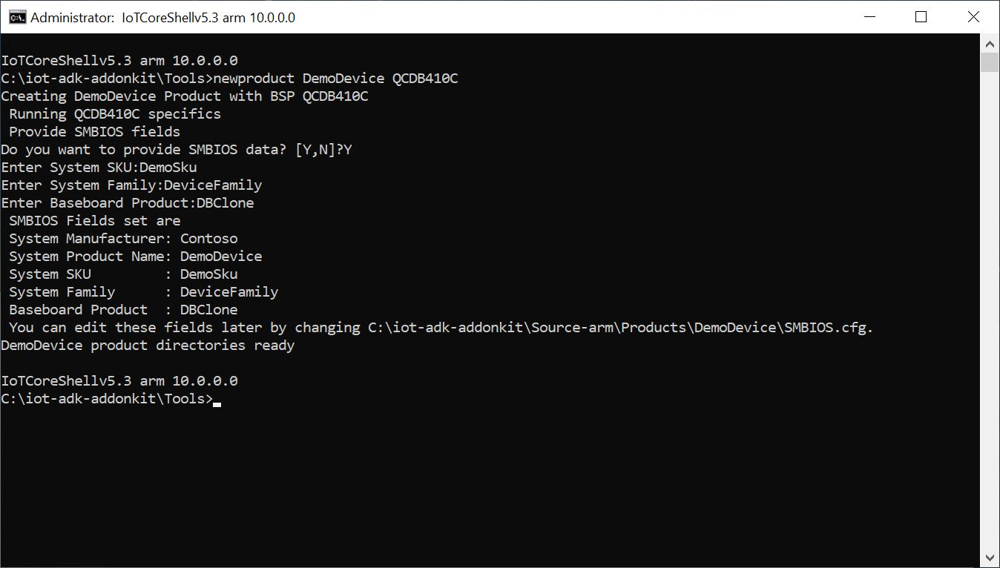

--- 
title: Creating a Basic IoT Core Image
author: jadali, lmaung
ms.author: jadali, lmaung
ms.date: 09/05/2018 
ms.topic: article 
description: Steps to create a basic Windows IoT Core image
keywords: Windows 10 IoT Core, 
--- 

# Creating a Basic IoT Core Image
To get started, we will detail the steps needed to create a basic Windows IoT Core image and flash it onto a specific hardware device.

## Prerequisites
Make sure your technician PC has the necessary tools installed prior to creating an IoT Core image. See [Get the tools needed to create Windows IoT Core images](ToolsNeeded.md) for details.

## Set your OEM Name (one-time only)
Edit the file **C:\IoT-ADK-AddonKit\Tools\setOEM.cmd**, and modify it with your company name. We've added this variable to help you create packages with names that are easy to differentiate from those provided from other manufacturers you're working with. Only alphanumeric characters are supported in the OEM_NAME variable, as this is used as a prefix for various generated file names.

    set OEM_NAME=Fabrikam

## Choose your Architecture and Install Test Certificates
You will need to select the appropriate architecture for the device you are working with (ARM, x86, x64). 

1. Navigate to the folder where you installed the IoT Core ADK Add-Ons (for example, **C:\IoT-ADK-AddonKit**) and run the `IoTCoreShell.cmd` file as an administrator (select *Yes* when prompted). A command window will open and ask you to select the target architecture. Select an option that matches the architecture you are working with (For example, select *1* for Raspberry Pi or DragonBoard, or select *2* for Minnowboard Max).

    

    The command window should now display the selected architecture and the OEM_NAME you previously set. A default version is also set for the design (10.0.0.0), which you can use for future updates.

    

2. Install Test Certificates on the PC. Since all files includes in the FFU must be signed, we need to install test certificates on the technician PC. This only needs to be done once, and is done by running the `installoemcerts.cmd` file from the **IoTCoreShell** shell program.

    

## Building BSPs 
The next step is to take the Board Support Package files and extract their .CAB files to include in the FFU file. There are some differences in the steps to do this for the different BSPs, so please visit the appropriate section for the hardware device you are working with.

[Selecting a Board Support Package](BoardSupportPackages.md)

## Build Packages 
From IoT Core Shell, get your environment ready to create products by building all of the packages in the working folders: 
    
    buildpkg all 

## Create a test project 
From IoT Core Shell, create a new product folder that uses the BSP you are working with. This folder represents a new device we want to build an image for, and contains sample customization files that we can use to start our project. For example, to create a product folder called `MyRPiProduct` that uses the Raspberry Pi 3 BSP files, execute the following command:

    newproduct MyRPiProduct rpi3 

The BSP name is the same as the folder name for the BSP. You can see which BSPs are available by looking in the **C:\IoT-ADK-AddonKit\Source-\< arch >\BSP** folders. 

This creates the folder: **C:\IoT-ADK-AddonKit\Source-< arch >\Products\\MyRPiProduct**. 

Please note that for the DragonBoard 410c, the `newproduct.cmd` command will ask you to enter SMBIOS data. Pleas answer YES and enter values for `System SKU`, `Family` and `Baseboard Product`:

## Build an image 
Eject any removable storage drives, including the microSD card and any USB flash drives. 

Build the FFU image file by entering the following command in IoT Core Shell:

    buildimage <fill in with product name> test 

This builds an FFU image file with your basic image at **C:\IoT-ADK-AddonKit\Build\\< arch >\\< fill in with product name >\Test**. This test image will include additional tools that can be used for debugging purposes. Building the final FFU file will take around 10-30 minutes to complete.

## Commands Used
Listed here are the commands (in order) for creating a basic IoT Core image. Please keep in mind that you only need to run `installoemcerts` once. 

      installoemcerts 
      buildpkg all
      newproduct <fill in with product name> <fill in with BSP type>
      buildimage <fill in with product name> Test

## Examples 
### Raspberry Pi 2 or 3
The following is assumed in these steps:

1. OEM Name is **Fabrikam**.
2. Product name is **MyIoTDevice**.
3. BSP for the Raspberry Pi is unzipped to **C:\BSPs\RPi3**.

        installoemcerts
        C:\iot-adk-addonkit\Tools\buildbsp.cmd rpi3
        newproduct MyIoTDevice rpi3
        buildpkg all
        buildimage MyIoTDevice Test
      
### DragonBoard 410C
The following is assumed in these steps:

1. OEM Name is **Fabrikam**.
2. Product name is **MyIoTDevice**.
3. BSP for the DragonBoard 410c is unzipped to **C:\BSPs\DB410c_BSP**.

        installoemcerts
        C:\iot-adk-addonkit\Tools\bsptools\QCDB410C\export.cmd C:\BSPs\DB410c_BSP
        newproduct MyIoTDevice QCDB410C
        buildpkg all
        buildimage MyIoTDevice Test
      
### Apollo Lake / Braswell / Cherry trail
The BSP supporting Apollo Lake is available at Apollo Lake BSP.

The BSP supporting Braswell/Cherry trail are available at Braswell BSP.
Following commands creates a Test image for Braswell/Cherry trail boards. Replace the BSWxXX with your own board information.
1. OEM Name is **Fabrikam**.
2. Product name is **MyIoTDevice**.
3. BPS for Braswell / Cherry trail board is unzipped to **C:\iot-adk-addonkit\Source-x64\BSP**.

        set OEM_Name=Fabrikam
        installoemcerts
        C:\iot-adk-addonkit\Tools\bsptools\BSWx64\convert
        newproduct MyIoTDevice BSWx64
        buildpkg all
        CreateImage MyIoTDevice Test

## Next Steps
[Flashing a Windows IoT Core Image](FlashingImage.md)

