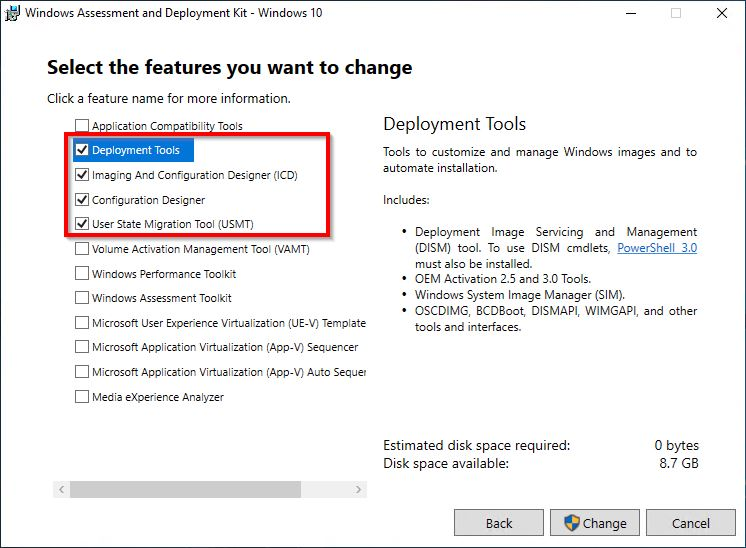
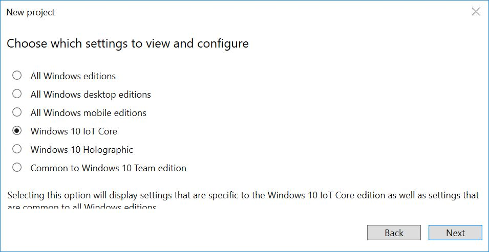

# Creating a Provisioning Package for a Windows IoT Core Image
A provisioning package allows you to apply customization settings over an existing Windows IoT Core installation image. We will describe the steps required to create a provisioning package that you can apply to your Windows 10 IoT Core FFU images.

## Goals
* Create a provisioning package that contains customizations for your device
* Package the provisioning package so it can be included in an FFU image
* Modify IoT Addon Kit project configuration files to include your provisioning package customizations
* Build and deploy an FFU image that contains your provisioning package customizations

## Prerequisites/Requirements
Please make sure you've created an image with your custom App from [Adding an App to an image](AddingApps.md) previously. For this example, we have created an image with the Qualcomm DragonBoard which will connect to a network via Wifi on boot.

You will need the following tools installed to complete this section:
* **[Windows Assessment and Deployment Kit (Windows ADK)](https://docs.microsoft.com/windows-hardware/get-started/adk-install#winADK)**. This provides the OEM-specific tooling and files to create and customize images for Windows IoT Core.
* **Windows Configuration Designer**. Part of the Windows ADK, this provides tooling to create custom provisioning packages for Windows IoT Core devices.
* **IoT Core Powershell Environment**. This is included with the Windows ADK and is the Powershell commandline window interface where you execute commands to build custom FFU images for Windows IoT Core.
* A text editor like **Notepad** or **VS Code**.

## Install Windows Configuration Designer
We will be using **Windows Configuration Designer (WCD)** to create a provisioning package for our IoT Core image. Windows Configuration Designer allows you to create provisioning packages, which are used to configure devices running Windows 10 IoT Core.

Windows Configuration Designer comes with the **Windows ADK Toolkit** and should have been installed to the Technician PC previously. If not, please run the install for the Windows ADK Toolkit and make sure you have the **Configuration Designer** selection checked for installation.



## Create WCD Project for a Provisioning Package
In order to create a provisioning package for your device, we need to create a project in **Windows Configuration Designer**. Once we have this project, we can specify the configuration customizations we want included in our FFU image.

1. From your IoT Core imaging PC(Technician PC), run **Windows Imaging and Configuration Designer**.
2. Create a new project by clicking **File > New Project**. For our example, we created a project called *TestProvPackage*.
3. Select **Provisioning Package** and click **Next**.
4. On the **Choose which settings to view and configure** page, select **Windows 10 IoT Core**. Click **Next**.

   

5. At the **Import a provisioning package(optional)** page, leave the entry blank and click **Finish**.
6. Add a sample setting:
   a. Expand **Runtime settings > Connectivity Profiles > WLAN > WLANSetting > SSID.**
   b. Type in the name of a Wi-Fi network name, for example, ContosoWiFi, and click Add.
   c. Expand the **SSID > WLANXmlSettings > SecurityType** and choose a setting such as **Open**.
   d. Expand the **SSID > WLANXmlSettings > AutoConnect** and choose a setting such as **TRUE**.
   e. Optional: to add more than one WLAN network, go back to WLANSetting, and repeat the process.

7. Optional: add other apps, drivers, and settings through the UI. To learn more, [see Configure customizations using Windows ICD](https://docs.microsoft.com/windows/configuration/provisioning-packages/provisioning-create-package#configure-settings).

8. Export the provisioning package. For example, click Export > Provisioning Package > Next > (Uncheck the Encrypt Package box) > Next > Build. (To learn more, see [Export a provisioning package.](https://docs.microsoft.com/windows/configuration/provisioning-packages/provisioning-create-package#build-package) ) **Note** in the example we have exported to C:\IoT\Provisioning\WiFiSettings

9. Open **IoTCorePShell.cmd** file from your workspace and execute the following powershell commands.

```powershell
Add-IoTProvisioningPackage Prov.WiFiSettings "C:\IoT\Provisioning\WiFiSettings\WiFiSettings.ppkg"
(or) newprovpkg Prov.WiFiSettings "C:\IoT\Provisioning\WiFiSettings\WiFiSettings.ppkg"
```
This creates a new folder at `C:\IoT\Workspaces\ContosoWS\Common\Packages\Prov.WiFiSettings`.
This also adds a FeatureID called **PROV_TESTPROVPACKAGE** to the `C:\IoT\Workspaces\ContosoWS\Common\Packages\OEMCOMMONFM.xml` file.

10. Build cab file for provisioning. 

```powershell
New-IoTCabPackage Prov.WifiSettings
(or) buildpkg Prov.WifiSettings
```

## Update the project's configuration files
Update the product test configuration to include the features using [Add-IoTProductFeature](https://github.com/ms-iot/iot-adk-addonkit/blob/master/Tools/IoTCoreImaging/Docs/Add-IoTProductFeature.md):

```powershell
Add-IoTProductFeature ProductX Test PROV_WIFISETTINGS -oem
(or) addfid ProductX Test PROV_WIFISETTINGS -oem
```


## Build and Test Image
Rebuild the packages:

```powershell
New-IoTCabPackage All
(or) buildpkg all 
```

Build the FFU image again, as specified in [Creating a Basic IoT Core Image](../Create-IoT-Image/CreateBasicImage.md). You should only have to run the [New-IoTFFUImage](https://github.com/ms-iot/iot-adk-addonkit/blob/master/Tools/IoTCoreImaging/Docs/New-IoTFFUImage.md) command:

```powershell
New-IoTFFUImage ProductX Test
(or)buildimage ProductX Test 
```
Once the FFU file has been built and you flash it to your hardware device as specified in [Flashing a Windows IoT Core Image](../Create-IoT-Image/FlashingImage.md), your provisioning package customizations should be applied when you power up the device. In our example, the default app is the [Hello World!](https://github.com/Microsoft/Windows-iotcore-samples/tree/master/Samples/HelloWorld) app and will run when the device is booted up.


## Next Steps
[Adding file(s) and registry settings to an image](AddFileRegistrySettings.md)

