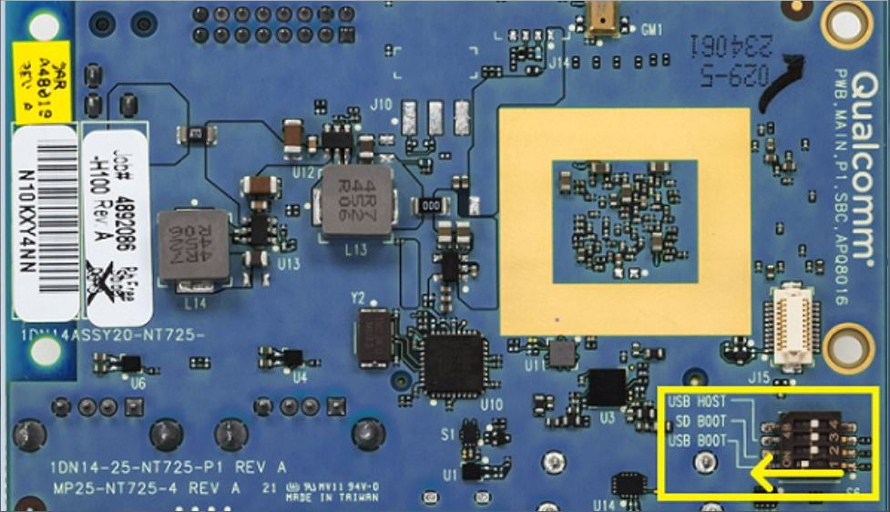
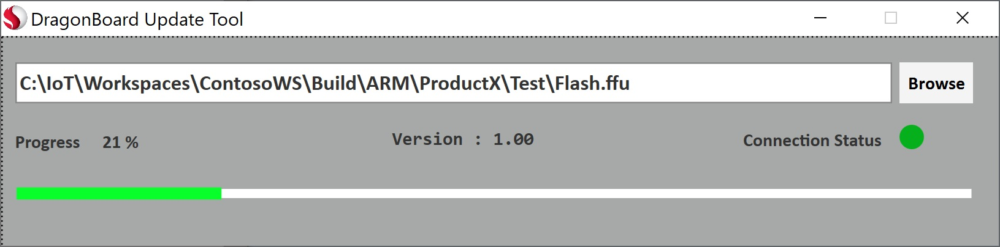
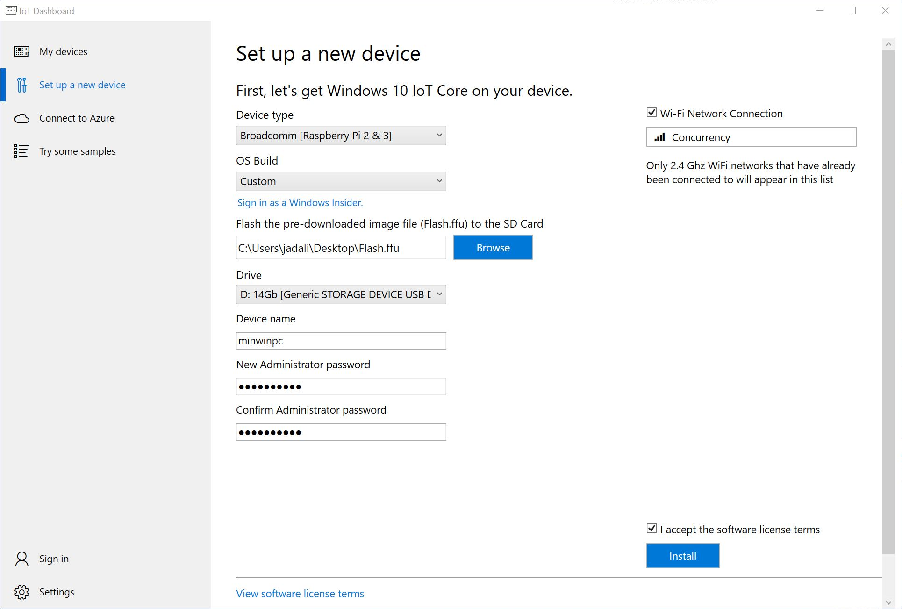

--- 
title: Flashing a Windows IoT Core Image
author: jadali, lmaung
ms.author: jadali, lmaung
ms.date: 09/05/2018 
ms.topic: article 
description: Steps on how to flash an FFU image file to a device
keywords: Windows 10 IoT Core, 
--- 

# Flashing a Windows IoT Core Image

Once you have an FFU image file built, you can use that to flash and deploy the image to your device.

Listed below are the steps to flash the FFU image file to specific manufacturer devices. 

## Qualcomm
### DragonBoard 410c
Qualcomm has provided the [DragonboardUpdateTool](https://developer.qualcomm.com/hardware/dragonboard-410c/software) application, which we will use to flash the FFU image file to the Dragonboard 410c. You can download either the x86 or x64 version (we recommend x64).

Once you have installed the DragonBoard Update Tool, you must first place the DragonBoard device in programming mode. This is done by setting dipswitch #1 (on the backside of the device) to the ON position:

Connect the DragonBoard device to your technician PC with a microUSB cable and power on the board.

Run the DragonBoard Update Tool, browse for the FFU image file you are deploying, and press the Program button. You should see a green Connection Status, and a progress bar when the device is flashing the FFU file.

Once the flashing process is complete, disconnect power from the board as well as the microUSB cable. You then need to flip the dipswitch #1 back to the OFF position. Reconnect the power to boot Windows IoT Core.

## Raspberry Pi
Since Raspberry Pi devices require a microSD card, you will need to flash the FFU file to this using Windows IoT Core Dashboard.

1. Start **Windows IoT Core Dashboard**
2. Plug your microSD card into the technician PC, and select it in the tool
3. From the **Setup a New Device** section, select **Broadcomm [Raspberry Pi 2 & 3]** uner Device Type
4. Select **Custom** under **OS Build**
5. Click **Browse** and navigate and select the FFU file you created earlier
6. Verify your microSD card is listed under the **Drive** selection
7. Optionally you can set the **Device Name** and **Administrator Password** selections for your device
8. Check the **I accept the software license terms** checkbox (lower right) and click **Install**

Windows IoT Core Dashboard will now open a command window and use DISM (Deployment Image Servicing and Management Tool) to flash the FFU file to your microSD card.

Once the flashing process is complete, eject the microSD card from the technician PC and insert it into the Raspberry Pi. Reconnect the power to boot Windows IoT Core.

## Intel
### Apollo Lake / Braswell / Cherry trail

You can flash and deploy the image in number of ways. Raspberry Pi devices can only run on SD cards and should be only be deployed by flashing the image as follows:

## Flash the image to a memory card
Start the Windows IoT Core Dashboard.

Plug your micro SD card into your technician PC, and select it in the tool.

From Setup a new device, select Device Type: Custom.

From Flash the pre-downloaded file (Flash.ffu) to the SD card, click Browse, browse to your FFU file 
**\(C:\IoT-ADK-AddonKit\Build\<arch>\ProductA\Test\Flash.ffu)**, then click Next.

Optional: Change the default device name (Default is minwinpc.)

Enter your device password.

Accept the license terms, and then click Install. The Windows IoT Core Dashboard formats the micro SD card and installs 
the new image.

## Create a bootable USB Drive to flash image.
Some devices will require that you have a bootable USB drive as a flashing media. We will have to create a WinPE bootable USB drive for such instances. 

### Create bootable WinPE media

The Windows Assessment and Deployment Kit (ADK) includes the **CopyPE** and **MakeWinPEMedia** command line utilities. When run from the Deployment and Imaging Tools Environment, CopyPE creates a working set of WinPE files, that MakeWinPEMedia can use to create bootable WinPE media. MakeWinPEMedia can create bootable WinPE USB drives, virtual hard disks, or ISOs that allow you to boot a VHD or burn to a DVD or CD.

#### Step 1: Getting drive ready    
We have to create a bootable USB and format it so that it is WinPE ready.

1. Start by running **diskpart** tool from administrative command prompt
2. Run **Select DiskX** to select the right disk you want to format. 
3. Run **Clean** command.
> If you encounter the error below, run **convert mbr**.

    ERROR: Failed to format "F:"; DiskPart errorlevel -2147212244.
4. Run **Create Partition Primary** command.
5. Run **Format FS=fat32 /quick** command to format the drive
6. Run **Assign** command to assign the drive. Your drive is ready to go.

#### Step 2: Create working files
No matter what type of media you're going to create, the first thing to do is create a working set of WinPE files on your technician PC.

1. Start the Deployment and Imaging Tools Environment as an administrator.
2. Run **copype** to create a working copy of the Windows PE files. For more information about copype, see Copype command line options.

        copype amd64 C:\WinPE_amd64

3. Prepare the drive by using MakeWinPEMedia \(*replace X with drive letter for the USB drive*):

        MakeWinPEMedia /UFD C:\WinPE_amd64 X:

#### Step 3: Copy the FFU file
Copy the FFU file from **\(C:\IoT-ADK-AddonKit\Build\<arch>\ProductA\Test\Flash.ffu)** to the root of the USB drive.

#### Step 4: Boot and Flash FFU
Boot into the USB drive. You may have to access bios to change the boot drive order. Once device is booted, change directory to **D** drive.

Run the following DISM command:

        dism.exe /Apply-Image /ImageFile:"D\flash.ffu" /ApplyDrive:\\.\PhysicalDrive0 /SkipPlatformCheck

Reboot once complete and continue through the OOBE app from IoT Core device.

### Diskpart Commands

        C:\>diskpart
        Microsoft DiskPart version 10.0.17134.1
        Copyright (C) Microsoft Corporation.
        On computer: LM-CNCY-BUILD
        
        DISKPART> list disk
        
        Disk ###  Status         Size     Free     Dyn  Gpt
        --------  -------------  -------  -------  ---  ---
        Disk 0    Online          447 GB  1024 KB        *
        Disk 1    Online          167 GB  1024 KB        *
        Disk 2    Online           14 GB      0 B        *

        DISKPART> select disk 2
        Disk 2 is now the selected disk.
        
        DISKPART> clean
        DiskPart succeeded in cleaning the disk.

        DISKPART> convert mbr
        DiskPart successfully converted the selected disk to MBR format.

        DISKPART> create partition primary
        DiskPart succeeded in creating the specified partition.

        DISKPART> format fs=fat32
          100 percent completed

        DiskPart successfully formatted the volume.

        DISKPART> assign
        DiskPart successfully assigned the drive letter or mount point.

        DISKPART> exit

### WinPE Commands
        C:\Program Files (x86)\Windows Kits\10\Assessment and Deployment Kit\Deployment Tools>
        
        copype amd64 C:\WinPE_amd64
        
        MakeWinPEMedia /UFD C:\WinPE_amd64 X:

### DISM Command
        X:\WinPE>cd d:\
        
        D:\>dism.exe /Apply-Image /ImageFile:"D\flash.ffu" /ApplyDrive:\\.\PhysicalDrive0 /SkipPlatformCheck