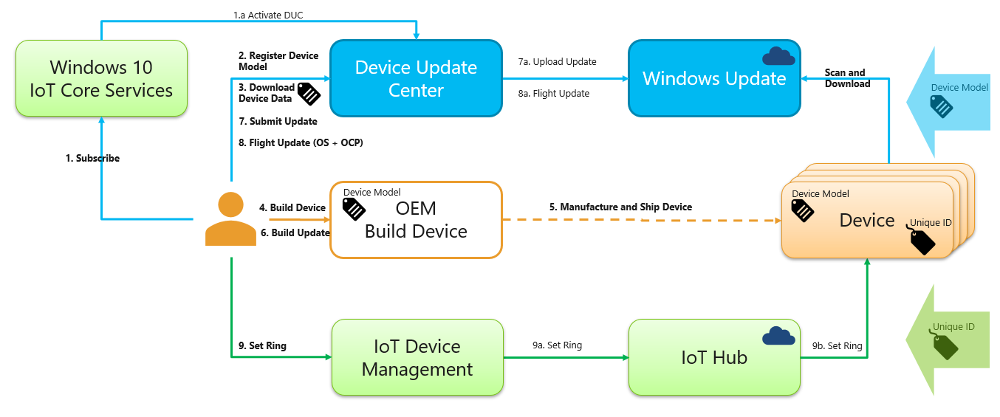

# Windows 10 IoT Core Services
Windows 10 IoT Core Services is a new cloud services subscription that provides the essential services needed to commercialize a device on Windows 10 IoT Core. Through this subscription, OEMs have access to 10 years of support on Windows 10 IoT Core Long Term Servicing Channel (LTSC) releases along with services to manage device updates and assess device health.

## What is included with Windows 10 IoT Core Services?
A subscription to Windows 10 IoT Core Services comes with three main benefits:

  Benifit        | Description           
  ------------- |:-------------
  10 years of support      | Access to Windows 10 IoT Core LTSC releases with security and quality updates only (no new features).
  Update control with Device Update Center      | Create and manage device updates at scale using cloud-side controls.      
  Device Health Attestation (DHA) | Rights to commercialize a device with DHA to affirm device health remotely.     

## 10 Years of Support
OEMs get 10 years of support on Windows 10 IoT Core via access to monthly updates from the Windows Long-Term Servicing Channel (LTSC) releases. This includes security and quality updates for the operating system to keep device security up to date. Devices using LTSC releases won’t receive feature updates, enabling OEMs to focus updates on stability by minimizing changes to the base operating system. Microsoft typically offers new LTSC releases every 2-3 years, with each release supported over a 10-year lifecycle.

## Update Control with Device Update Center
Device Update Center (DUC) provides the ability to create, customize, and control device updates. These updates are distributed by the same content distribution network (CDN) as Windows Update which is used daily by millions of Windows customers around the world. Updates can be applied to the operating system and device drivers as well as OEM-specific applications and files. Updates can be flighted to test devices prior to broader distribution.

Here's a diagram of the update flow in Device Update Center:

## Commercialize with Device Health Attestation
Device Health Attestation (DHA) enables enterprises and OEMs to raise the security bar of their organization's assets with hardware-attested security. Evaluating the trustworthiness of a device at boot time is essential for a trusted IoT system. However, a device cannot attest to its own trustworthiness - this must be done by an external entity such as the DHA cloud service. This service evaluates device health and can be combined with a device management system, such as Azure IoT Device Management. Based on DHA report data, the device management system can take corrective actions such as re-imaging the device, denying network access, or creating a service ticket.

## Outline
* [Setting up Device Center](SettingUpDeviceCenter.md)
