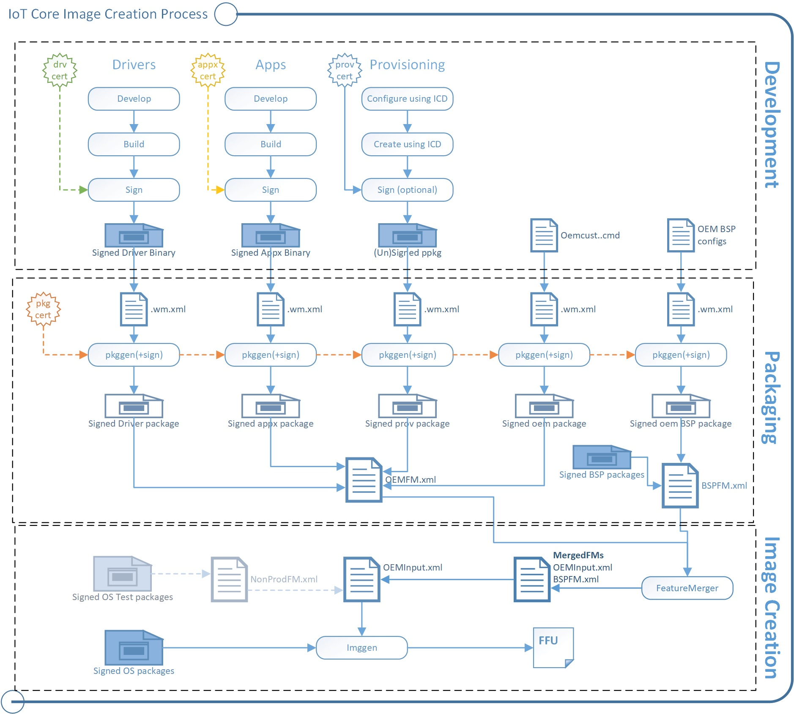

--- 
title: Get Started Overview
author: jadali 
ms.author: jadali 
ms.date: 09/05/2018 
ms.topic: article 
description: Overview for Windows IoT Core Manufacturing Guide.
keywords: Windows 10 IoT Core, 
--- 

# IoT Core Manufacturing Guide

Thinking about mass-producing devices running Windows 10 IoT Core? Use this guide and the [Windows ADK IoT Core Add-ons](https://docs.microsoft.com/en-us/windows-hardware/manufacture/iot/iot-core-adk-addons) to create images that you can quickly flash onto new devices.

You can create <b>test images</b> which include tools for quickly accessing and modifying devices. Test images are great for:

* Developers, hardware vendors and manufacturers (OEMs) who are trying out new device designs.
* Hobbyists and organizations that are creating devices designed to run in non-networked or controlled network environments.

You can create <b>retail images</b>, which can be made more secure for public or corporate networks while still receiving updates.

You can add customizations, including apps, settings, hardware configurations and board support packages (BSPs).

For OEM-style images, you'll wrap your customizations into package (.cab) files. Packages let OEMs, ODMs (Original Device Manufacturers), developers, and Microsoft work together to help deliver security and feature updates to your devices without stomping on each other's work.

## Scenarios
* [Get the tools needed to customize Windows IoT Core](manufacturing-guide/ToolsNeeded.md)
* [Lab 1a: Create a basic image](manufacturing-guide/CreateBasicImage.md)
* [Lab 1b: Add an app to your image](manufacturing-guide/AddApps.md)
* [Lab 1c: Add a file and a registry setting to an image](manufacturing-guide/AddFileOrRegistrySetting.md)
* [Lab 1d: Add networking and other provisioning package settings to an image](manufacturing-guide/AddNetworkingOrProvPackage.md)
* [Lab 1e: Add a driver to an image](manufacturing-guide/AddDriver.md)
* [Lab 1f: Build a retail image](manufacturing-guide/BuildRetailImage.md)
* [Lab 2: Creating your own board support package](manufacturing-guide/CreateBSP.md)
* [Lab 3: Updating your apps](manufacturing-guide/UpdatingApps.md)

## Concepts
You can use the walkthrough as a guide to build both your test and retail images. In general terms:

1. Test your customizations, including apps, settings, drivers, and BSPs, to make sure they work.
2. Install test certificates on your PC and package your customizations into .CAB files.
3. Create a test image that includes your customizations, along with the IoT Core package, and any updates from your hardware manufacturer.
4. Flash the image to a device and test it. Use the test tools built into the test images to troubleshoot any new issues.
5. If it works, sign your customizations with a valid retail certificate, and repackage them into new .CAB files.
6. Create a retail image with your signed files and use it to manufacture new devices.

### Packages
Packages are the logical building blocks of IoT Core. They contain all the files, libraries, registry settings, executables, and data on the device. From device drivers to system files, every component must be contained in a package. This modular architecture allows for precise control of updates: a package is the smallest serviceable unit on the device.

Each package contains:

* The contents of the package, such as a signed driver binary or a signed appx binary.
* A package definition (.pkg.xml) file specifies the contents of the package and where they should be placed in the final image. See %SRC_DIR%\Packages\ directory from the Windows ADK IoT Core Add-On kit for various samples of package files.
* A signature. This can be a test or retail certificate.

The `pkggen` tool combines these items into signed packages. Our samples include scripts: `createpkg`, and `createprovpkg`, which call pkggen to create packages for our drivers, apps, and settings.

The process is similar to that used by Windows 10 Mobile. To learn more about creating packages, see [Creating mobile packages](https://docs.microsoft.com/en-us/windows-hardware/manufacture/mobile/creating-mobile-packages).

### Feature Manifests (FMs)
After you've put everything into packages, you'll use FM files to list which of your packages belong in the final image.

You can use as many FMs into an image as you want. In this guide, we refer to the following FMs:

* <b>OEMFM.xml</b> includes features an OEM might add to a device, such as the app and a provisioning package.
* <b>BSPFM.xml</b> includes features that a hardware manufacturer might use to define a board. For example, OEM_RPi2FM.xml includes all of the features used for the Raspberry Pi 2.

The process is similar to that used by Windows 10 Mobile. To learn more, see [Feature manifest file contents](https://docs.microsoft.com/en-us/windows-hardware/manufacture/mobile/feature-manifest-file-contents).

You'll list which of the features to add by using these tags:

* \<BasePackages>: Packages that you always included in your images, for example, your base app.
* \<Features>\\\<OEM>: Other individual packages that might be specific to a particular product design.

The Feature Merger tool generates the required feature identifier packages that are required for servicing the device. Run this tool whenever any changes are made to the FM files. After you change OEM FM or OEM COMMON FM files, run `buildfm oem`. After you change bspfm files, run `buildfm bsp <bspname>`. These commands are run from the IoT Core shell.

### Creating the image: ImgGen and the image configuration fiel (OEMInput.xml)
To create the final image, you'll use the `imggen` tool with an image configuration file, <b>OEMInput.xml</b> file.

These are the same tools used to create Windows 10 Mobile images. To learn more, see [OEMInput file contents](https://docs.microsoft.com/en-us/windows-hardware/manufacture/mobile/oeminput-file-contents).

The image configuration file lists:
* The feature manifests (FMs) and the packages that you want to install from each one.
* An <b>SoC</b> chip identifier, which is used to help set up the device partitions. The supported values for soc are defined in the corresponding bspfm.xml, under \<devicelayoutpackages>.
* A <b>Device</b> identifier, which is used to select the device layout. The supported values for <b>device</b> are defined in the corresponding bspfm.xml, under \<oemdeviceplatformpackages>.
* The ReleaseType (either <b>Production</b> or <b>Test</b>).

<b>Retail builds:</b> We recommend creating retail images early on in your development process to verify that everything will work when you are ready to ship.

These builds contain all of the security features enabled.

To use this build type, all of your code must be signed using retail (not test) code signing certificates.

For a sample, see %SRC_DIR%\Products\SampleA\RetailOEMInput.xml from the Windows ADK IoT Core Add-On kit.

<b>Test builds:</b> Use these to try out new versions of your apps and drivers created by you and your hardware manufacturer partners.

These builds have some security features disabled, which allows you to use either test-signed or production-signed packages.

These builds also include developer tools such as debug transport, SSH, and PowerShell, that you can use to help troubleshoot issues.

For a sample, see %SRC_DIR%\Products\SampleA\TestOEMInput.xml from the Windows ADK IoT Core Add-On kit.

> |             | Retail Builds  |  Test Builds  |
> |-------------|----------|---------|
> | Image Release Type | ReleaseType: <b>Production</b> | ReleaseType: <b>Test</b>
> | Package Release Type | Only Production Type packages are supported | Both Production Type or Test Type are supported
> | Test-signed packages | Not supported | Supported
IOT_ENABLE_TESTSIGNING feature must be included
> | Code integrity check | Supported. By default, this is enabled. | Supported. By default, no policy is enforced.

### Board Support Packages (BSPs)
Board Support Packages contain a set of software, drivers, and boot configurations for a particular board, typically supplied by a board manufacturer. The board manufacturer may periodically provide updates for the board, which your devices can receive and apply.

## OK, let's try it!
Start here: [Get the tools needed to customize Windows IoT Core](manufacturing-guide/ToolsNeeded.md)

## Related Topics

* [Build a prototype](../GetStarted.md)
* [Learn about Windows IoT Core](https://developer.microsoft.com/en-us/windows/iotcore)
* [IoT Core Developer Resources](https://developer.microsoft.com/en-us/windows/iot)
* [What's in the Windows ADK IoT Core Add-ons](https://docs.microsoft.com/en-us/windows-hardware/manufacture/iot/iot-core-adk-addons)
* [IoT Core feature list](https://docs.microsoft.com/en-us/windows-hardware/manufacture/iot/iot-core-feature-list)
* [IoT Core Add-ons command-line options](https://docs.microsoft.com/en-us/windows-hardware/manufacture/iot/iot-core-adk-addons-command-line-options)
