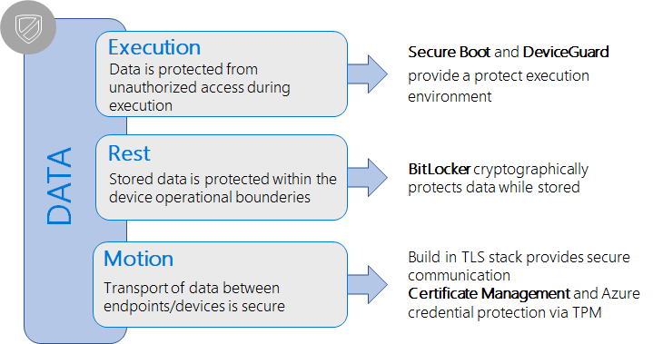
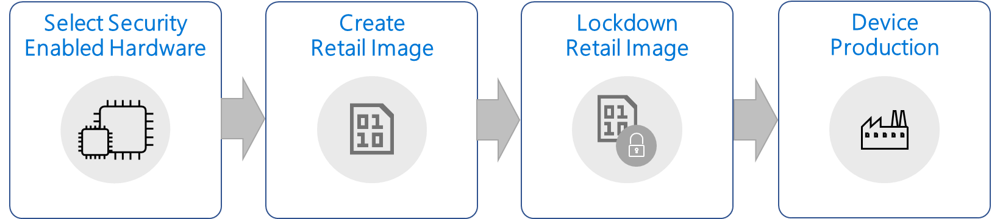

# Building more secure devices with Windows 10 IoT Core

## Introduction  

Windows 10 IoT Core provides strong, enterprise-grade security features that can be leveraged on smaller, resource-constrained classes of IoT devices. For these security features to offer tangible benefits, the hardware platform must also provide a means to anchor them. This article provides high-level guidance to OEM device builders and security conscious makers who want to select appropriate hardware and build, configure, and ship a more secure IoT device to their customers.

## Building a more secure IoT device  
The process for building more secure IoT devices with IoT Core includes the selection of hardware to support platform security features, as well as the production of security-enabled IoT devices.

## Choosing security-enabled hardware
While IoT Core has security capabilities built in to the platform to protect customer data, it relies on hardware security features to fully utilize these capabilities. In fact, software cannot protect itself because memory can be manipulated, and there is no trust anchor or immutable device identity that can be provided through software alone. There are several ways to provide hardware-based security, such as smart cards, trusted platform module (TPMs), or security features built into the SoC. 

For more information about supported hardware platforms, see [SoCs and custom boards](/windows/iot-core/learn-about-hardware/socsandcustomboards). 

### Trusted Platform Module
IoT Core uses Trusted Platform Module 2.0 (TPM 2.0) as hardware security platform. We recommended that OEMs use a hardware platform that provides TPM 2.0 to fully leverage the IoT Core security features, such as BitLocker, Secure Boot, Azure credential storage, and others. There are two options for production devices to implement a TPM: as discreet TPM (dTPM) or as firmware TPM (fTPM). Discrete TPMs are available from several manufacturers, such as Infineon, NazionZ, and others. Some SoC manufacturers provide fTPM implementations as part of a board support package (BSP). 

For more information about TPMs, see [TPM Overview](/windows/iot-core/secure-your-device/tpm) and [How to setup a TPM](/windows/iot-core/secure-your-device/setuptpm).

### Storage options
Development boards, like the popular Raspberry Pi 3, offer flexibility and allow developers to easily boot any platform via a removable SD card. For most industry IoT devices, this flexibility is not desirable and can make devices an easy target for attacks. Instead, when designing your hardware, consider using an eMMC storage for your smaller, low-cost IoT devices. Embedded storage makes it significantly more difficult to separate the content from the device and, in turn, reduces the potential of data theft or the introduction of malware onto the device.

## Create a retail image 
When [Creating a Windows IoT Core retail image](/windows-hardware/manufacture/iot/iot-core-manufacturing-guide), ensure that no developer tools that allow remote access and debug are present on production systems as these can potentially open your device to attacks. If you're using developer tools like [Windows Device Portal](/windows/iot-core/manage-your-device/remotedisplay), [FTP Server](/windows/iot-core/connect-your-device/ftp), [SSH](/windows/iot-core/connect-your-device/ssh), or [PowerShell](/windows/iot-core/connect-your-device/powershell) in your images during development, make sure that you test and validate your scenarios on retail IoT Core images that do not include these tools.

### User accounts
Most users are familiar with the notion of taking *ownership* of devices like PCs and phones: the idea of personalizing a device when it's unboxed and of setting up credentials to access the device. Unlike consumer PCs and phones, IoT devices are not intended to serve as general purpose computing devices. Instead, they are usually single-app, fixed purpose devices. Though Windows supports the notion of device administrators that can remotely connect to devices during a development cycle, such support on industry IoT devices can pose a threat, especially when weak passwords are used. In general, we recommend that no default accounts or passwords be created on IoT Core devices.

## Lockdown a retail image
On general purpose computing devices, such as PCs, users can install applications and change settings, including for security features, to ensure the device best suits their needs. The majority of the IoT devices are fixed-function-devices that will not change their purpose over the device lifetime. They receive software updates or enable functional updates within their operational boundaries, such as an improved UI or temperature regulation on a smart thermostat. This information can be used to fully lockdown an IoT device by only allowing execution of known and trusted code. Device Guard on Windows 10 IoT Core can help protect IoT devices by ensuring that unknown or untrusted executable code cannot be run on locked-down devices.

Microsoft is providing the [Turnkey Security Package](https://github.com/ms-iot/security/tree/master/TurnkeySecurity) to facilitate the enablement of key security features on IoT Core devices. This lets device builders create fully locked down IoT devices. The package will help with:

* Provisioning Secure Boot keys and enabling the feature on supported IoT platforms.
* Setup and configuration of device encryption using BitLocker. 
* Initiating device lockdown to only allow execution of signed applications and drivers.

Step-by-step guidance is described in the [Enabling Secure Boot, BitLocker, and Device Guard](/windows/iot-core/secure-your-device/securebootandbitlocker) section.

## Device production
Once the lockdown image is validated, it can be used for manufacturing. For more information, see [IoT Core manufacturing](/windows-hardware/manufacture/iot/).