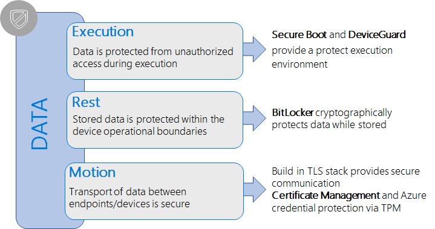
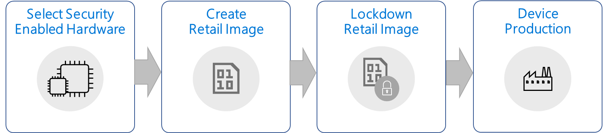

# Building Secure Devices with Windows 10 IoT Core

## Introduction  
With Windows 10 IoT Core, Microsoft is bringing strong enterprise grade security features that can be leveraged on smaller, resource constrained classes of IoT devices. For these security features to offer tangible benefits, the hardware platform must also provide a means to anchor them. This document provides high-level guidance to OEM device builders and security conscious 'Makers' who are looking to select appropriate hardware and build, configure, and ship a secure IoT device to their customers.

## Building a secure IoT devices  
This section will help developers and OEMs through the process of building secure IoT devices with Windows IoT Core. We will address the selection of hardware to support platform security features as well as the production of security enabled IoT devices.

## Choosing security enabled hardware
While Windows IoT Core has security capabilities build in to the platform to protect customer data, it relies on hardware security features to fully utilize these capabilities. In fact, software cannot protect itself as memory can be manipulated and there is no trust anchor or unmutable device identity that can be provided through software alone. There are several ways to provide hardware-based security, e.g. smart cards, trusted platform modules (TPM) or security features build into the SoC. 

### Trusted Platform Module
Windows IoT Core uses TPM 2.0 as hardware security platform. OEMs are recommended to use a hardware platform that provides TPM 2.0 to fully take advantage of the Windows IoT Core security features such as BitLocker, Secure Boot, Azure credential storage and others. There are two options for production devices to implements a TPM, as discreet TPM or as firmware TPM (fTPM). Discrete TPMs are available from several manufactures such as Infineon, NazionZ and others. Some SoC manufactures provided fTPM implementations as part of the BSP. For more information about TPMs look the TPM Overview section <link>.

### Onboard Storage Options
Development boards, like the popular Raspberry Pi 3, offer flexibility and allow developers to easily boot any platform via a removable SD card. For most industry IoT devices, such flexibility is not desirable and can make such devices an easy target for attacks. Instead, when designing your hardware, consider using an eMMC storage for your smaller, low cost IoT devices. Embedded storage makes it significantly more difficult to separate the content from the device and in turn, reduces the potential of introducing malware onto the device or data theft.

## Creating a retail image 
When building the Windows 10 IoT Core for your retail device using ICD (Image Configuration Designer), ensure that no developer tools are included. Tools that allows developers to remotely access and debug IoT Core devices should not be present on production systems as these can potentially open your device to attacks. Make sure that if you're using our developer tools like [Windows Device Portal](https://docs.microsoft.com/en-us/windows/iot-core/manage-your-device/remotedisplay), [FTP Server](https://docs.microsoft.com/en-us/windows/iot-core/connect-your-device/ftp), [SSH](https://docs.microsoft.com/en-us/windows/iot-core/connect-your-device/ssh), or [PowerShell](https://docs.microsoft.com/en-us/windows/iot-core/connect-your-device/powershell) in your images during development, that you test and validate your scenarios on retail IoT Core images that do not include these tools.

For more information on how to create a retail image see section [Creating a Windows IoT Core retail image](https://TBD).

## Lockdown a retail image
On general purpose computing devices, such as PCs, users can install applications, change settings, including for security features, to define the function of the device to suite best their operational needs. The majority of the IoT devices are fixed-function-devices that will not change the purpose over the device life time. These devices will still receive software updates or enable functional updates within their operational boundaries, e.g. improved the user interface or temperature regulation on a smart thermostat. This information can be used to fully lockdown an IoT device by only allowing execution of known and trusted code. Device Guard on Windows 10 IoT Core can help protect IoT devices by ensuring that unknown or untrusted executable code cannot be run on locked-down devices.

To facilitate easy enablement of key security features on IoT Core devices, Microsoft is providing a turnkey 'Security Package' that allows device builders to build fully locked down IoT devices.  This package will help with:

* Provisioning Secure Boot keys and enabling the feature on supported IoT platforms
* Setup and configuration of device encryption using BitLocker 
* Initiating device lockdown to only allow execution of signed applications and drivers
This section will guide you through the process of creating a lockdown retail image. All scripts and tools are can be found at the TrunKeySecurity repository.    
