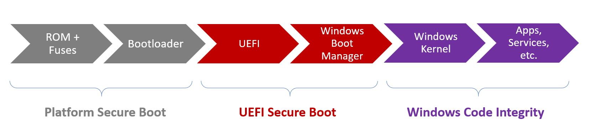

# Enabling Secure Boot, BitLocker, and Device Guard on Windows 10 IoT Core

Windows 10 IoT Core includes security feature offerings such as UEFI Secure Boot, BitLocker Device Encryption and Device Guard.  These will assist device builders in creating fully locked down Windows IoT devices that are resilient to many different types of attacks.  Together, these features provide the optimal protection that ensures that a platform will launch in a defined way, while locking out unknown binaries and protecting user data through the use of device encryption.

## Boot Order

An understanding of the boot order on a Windows 10 IoT Core device is needed before we can delve into the individual components that provide a secure platform for the IoT device.

There are three main areas that occur from when an IoT device is powered on, all the way through to the OS kernel loading and execution of installed application.

* Platform Secure Boot
* Unified Extensible Firmware Interface (UEFI) Secure Boot
* Windows Code Integrity



Additional information on the Windows 10 boot process can be found [here](/windows/security/information-protection/secure-the-windows-10-boot-process).

## Locking-down IoT Devices

In order to lockdown a Windows IoT device, the following considerations must be made.

### Platform Secure Boot

When the device is first powered on, the first step in the overall boot process is to load and run firmware boot loaders, which initialize the hardware on the devies and provide emergency flashing functionality. The UEFI environment is then loaded and control is handed over.

These firmware boot loaders are SoC-specific, so you will need to work with the appropriate device manufacturer to have these boot loaders created on the device.

### UEFI Secure Boot

UEFI Secure Boot is the first policy enforcement point, and is located in UEFI.  It restricts the system to only allow execution of binaries signed by a specified authority, such as firmware drivers, option ROMs, UEFI drivers or applications, and UEFI boot loaders. This feature prevents unknown code from being executed on the platform and potentially weakening the security posture of it. Secure Boot reduces the risk of pre-boot malware attacks to the device, such as rootkits.

As the OEM, you need to store the UEFI Secure Boot databases on the IoT device at manufacture time. These databases include the Signature database (db), Revoked Signature database (dbx), and the Key Enrollment Key database (KEK). These databases are stored on the firmware nonvolatile RAM (NV-RAM) of the device.

* **Signature Database (db):** This lists the signers or image hashes of operating system loaders, UEFI applications, and UEFI drivers that are allowed to be loaded on the device

* **Revoked Signature Database (dbx):** This lists the signers or image hashes of operating system loaders, UEFI applications and UEFI drivers that are no longer trusted, and are *NOT* allowed to be loaded on the device

* **Key Enrollment Key database (KEK):** Contains a list of signing keys that can be used to update the signature and revoked signature databases.

Once these databases are created and added to the device, the OEM locks the firmware from editing, and generates a platform signing key (PK). This key can be used to sign updates to the KEK or to disable UEFI Secure Boot.

Here are the steps taken by UEFI Secure Boot:

1. After the device is powered on, the signature databases are each checked against the platform signing key (PK).
2. If the firmware isn't trusted, UEFI firmware initiates OEM-specific recovery to restore trusted firmware.
3. If Windows Boot Manager cannot be loaded, the firmware will attempt to boot a backup copy of Windows Boot Manager. If this also fails, the UEFI firmware initiates OEM-specific remediation.
4. Windows Boot Manager runs and verifies the digital signature of the Windows Kernel. If trusted, Windows Boot Manager passes control to the Windows Kernel.

Additional details on Secure Boot, along with key creation and management guidance, is available [here](/previous-versions/windows/it-pro/windows-8.1-and-8/dn747883(v=win.10)).

### Windows Code Integrity

Windows Code Integrity (WCI) improves the security of the operating system by validating the integrity of a driver or application each time it is loaded into memory. CI contains two main components - Kernel Mode Code Integrity (KMCI) and User Mode Code Integrity (UMCI).

Configurable Code Integrity (CCI) is a feature in Windows 10 that allows device builders to lockdown a device and only allow it to run and execute code that is signed and trusted.  To do so, device builders can create a code integrity policy on a 'golden' device (final release version of hardware and software) and then secure and apply this policy on all devices on the factory floor.

To learn more about deploying code integrity policies, auditing and enforcement, check out the latest technet documentation [here](/windows/security/threat-protection/windows-defender-application-control/create-initial-default-policy).

Here are the steps taken by Windows Code Integrity:

1. Windows Kernel will verify all other components against the signature database before loading. This includes drivers, startup files, and ELAM (Early Launch Anti-Malware).
2. Windows Kernel will load the trusted components in the startup process, and prohibit loading of the untrusted components.
3. Windows 10 IoT Core operating system loads, along with any installed applications.

### BitLocker Device Encryption

Windows 10 IoT Core also implements a lightweight version of BitLocker Device Encryption, protecting IoT devices against offline attacks. This capability has a strong dependency on the presence of a TPM on the platform, including the necessary pre-OS protocol in UEFI that conducts the necessary measurements. These pre-OS measurements ensure that the OS later has a definitive record of how the OS was launched; however, it does not enforce any execution restrictions.

> [!TIP]
> BitLocker functionality on Windows 10 IoT Core allows for automatic encryption of NTFS-based OS volume while binding all available NTFS data volumes to it. For this, it’s necessary to ensure that the EFIESP volume GUID is set to _C12A7328-F81F-11D2-BA4B-00A0C93EC93B_.

### Device Guard on Windows IoT Core

Most IoT devices are built as fixed-function devices. This implies that device builders know exactly which firmware, operating system, drivers, and applications should be running on a given device. In turn, this information can be used to fully lockdown an IoT device by only allowing execution of known and trusted code. Device Guard on Windows 10 IoT Core can help protect IoT devices by ensuring that unknown or untrusted executable code cannot be run on locked-down devices.


## Turnkey Security on IoT Core

To facilitate easy enablement of key security features on IoT Core devices, Microsoft is providing a [Turnkey Security Package]( https://github.com/ms-iot/security/tree/master/TurnkeySecurity) that allows device builders to build fully locked down IoT devices. This package will help with:

* Provisioning Secure Boot keys and enabling the feature on supported IoT platforms
* Setup and configuration of device encryption using BitLocker
* Initiating device lockdown to only allow execution of signed applications and drivers

The following steps will lead through the process to create a lockdown image using the [Turnkey Security Package]( https://github.com/ms-iot/security/tree/master/TurnkeySecurity)


### Prerequisites

* A PC running Windows 10 Enterprise (other Windows versions are **not** supported by the provided scripts)
* [Windows 10 SDK](https://developer.microsoft.com/windows/downloads/windows-10-sdk) - Required for Certificate Generation
* [Windows 10 ADK](https://developer.microsoft.com/windows/hardware/windows-assessment-deployment-kit) - Required for CAB generation
* Reference platform - release hardware with shipping firmware, OS, drivers, and applications will be required for final lockdown

### Development IoT Devices

Windows 10 IoT Core works with various silicons that are utilized in hundreds of devices. Of the [suggested IoT development devices](../learn-about-hardware/SoCsAndCustomBoards.md), the following provide firmware TPM functionality out of the box, along with Secure Boot, Measured Boot, BitLocker, and Device Guard capabilities:

* Qualcomm DragonBoard 410c

    In order to enable Secure Boot, it may be necessary to provision RPMB. Once the eMMC has been flashed with Windows 10 IoT Core (as per instructions [here](../tutorials/quickstarter/devicesetup.md#using-the-iot-dashboard-dragonboard-410c), press [Power] + [Vol+] + [Vol-] simultaneously on the device when powering up and select "Provision RPMB" from the BDS menu. *Please note that this is an irreversible step.*

* Intel MinnowBoardMax

    For Intel's MinnowBoard Max, firmware version must be 0.82 or higher (get the [latest firmware](https://firmware.intel.com/projects/minnowboard-max)). To enable TPM capabilities, power up board with a keyboard & display attached and press F2 to enter UEFI setup. Go to _Device Manager -> System Setup -> Security Configuration -> PTT_ and set it to _&lt;Enable&gt;_. Press F10 to save changes and proceed with a reboot of the platform.

> [!NOTE]
> Raspberry Pi 2 nor 3 do not support TPM and so we cannot configure Lockdown scenarios.

### Generate Lockdown Packages

Follow the instructions in the following two links:

 * [Adding Security Packages](https://github.com/ms-iot/iot-adk-addonkit/blob/17763-v7/Tools/README.md#adding-security-packages)

 * [Lab 1a Create a basic image](/windows-hardware/manufacture/iot/create-a-basic-image?view=windows-11)


### Test Lockdown packages
You can test the security packages generated here <YOUR_IOT_ADD_ON_WORKSPACE>\Build\<ARCH>\<OEM_NAME>.Security.* .cab> by manually installing them on a unlocked device by the following steps

1. Flash the device with the unlocked image (image used for scanning in earlier step).
2. Connect to the device ([using SSH](../connect-your-device/SSH.md) or using [PowerShell](../connect-your-device/PowerShell.md))
3. Copy the following .cab files to the device under a directory e.g. `c:\OemInstall`
    * OEM.Custom.Cmd.cab
    * OEM.Security.BitLocker.cab
    * OEM.Security.SecureBoot.cab
    * OEM.Security.DeviceGuard.cab
4. Initiate staging of the generated packages by issuing the following commands

    ```C
    applyupdate -stage c:\OemInstall\OEM.Custom.Cmd.cab
    ```
    If you are using custom image, then you will have to *skip* this file and manually edit the `c:\windows\system32\oemcustomization.cmd` with the contents available in `Output\OEMCustomization\OEMCustomization.cmd` file

    ```C
    applyupdate -stage c:\OemInstall\OEM.Security.BitLocker.cab
    applyupdate -stage c:\OemInstall\OEM.Security.SecureBoot.cab
    applyupdate -stage c:\OemInstall\OEM.Security.DeviceGuard.cab

5. Finally, commit the packages via

    ```C
    applyupdate -commit
    ```

6. The device will reboot into update OS (showing gears) to install the packages and will reboot again to main OS.  Once the device reboots back into MainOS, Secure Boot will be enabled and SIPolicy should be engaged.
7. Reboot the device again to activate the BitLocker encryption.
8. Test the security features
    * SecureBoot: try `bcdedit /debug on` , you will get an error stating that the value is protected by secure boot policy
    * BitLocker: Run `start /wait sectask.exe -waitencryptcomplete:1`, if ERRORLEVEL is `-2147023436` (ERROR_TIMEOUT) then encryption is not complete. When running sectask.exe from a .cmd file omit the `start /wait`.
    * DeviceGuard : Run any unsigned binary or a binary signed with certificate not in the SIPolicy list and confirm that it fails to run.

### Generate Lockdown image

After validating that the lockdown packages are working as per the settings defined earlier, you can then include these packages into the image by following the below given steps. Read the [IoT manufacturing guide](/windows-hardware/manufacture/iot/iot-core-manufacturing-guide) for custom image creation instructions.

1. In the workspace directory, update the following files from the generated output directory above
    * SecureBoot : `Copy ..\Output\SecureBoot\*.bin  ..\Workspace\Common\Packages\Security.SecureBoot`
      * SetVariable_db.bin
      * SetVariable_kek.bin
      * SetVariable_pk.bin
    * BitLocker : `Copy ..\Output\Bitlocker\*.* ..\Workspace\Common\Packages\Security.Bitlocker`
      * DETask.xml
      * Security.Bitlocker.wm.xml
      * setup.bitlocker.cmd
    * DeviceGuard : `Copy ..\Output\DeviceGuard\*.*  ..\Workspace\Common\Packages\Security.DeviceGuard`
      * SIPolicyOn.p7b
      * SIPolicyOff.p7b

2. Add RetailOEMInput.xml and TestOEMInput.xml under the ProductName directory with lockdown package feature ID
    * `<Feature>SEC_BITLOCKER</Feature>`
    * `<Feature>SEC_SECUREBOOT</Feature>`
    * `<Feature>SEC_DEVICEGUARD</Feature>`
3. Re-generate Image
    * `buildpkg all` (this generates new lockdown packages based on above policy files)
    * `buildimage ProductName test(or)retail`  (this generates new Flash.ffu)
4. Flash the device with this new Flash.ffu and validate the security features.

See [SecureSample](https://github.com/ms-iot/iot-adk-addonkit/) as an example of a lockdown dragon board configuration.

### Developing with CodeSigning Enforcement Enabled

Once the packages are generated and lockdown is activated, any binaries introduced into the image during development will need to be signed appropriately. Ensure that your user-mode binaries are signed with the key  _.\Keys\ ***-UMCI.pfx_. For kernel-mode signing, such as for drivers, you’ll need to specify your own signing keys and make sure that they are also included in the SIPolicy above.

### Unlocking Encrypted Drives

During development and testing, when attempting to read contents from an encrypted device offline (e.g. SD card for MinnowBoardMax or DragonBoard's eMMC through USB mass storage mode), 'diskpart' may be used to assign a drive letter to MainOS and Data volume (let's assume v: for MainOS and w: for Data).
The volumes will appear locked and need to be manually unlocked. This can be done on any machine that has the OEM-DRA.pfx certificate installed (included in the [DeviceLockDown sample](https://github.com/ms-iot/security/tree/master/TurnkeySecurity)). Install the PFX and then run the following commands from an administrative CMD prompt:

* `manage-bde -unlock v: -cert -cf OEM-DRA.cer`
* `manage-bde -unlock w: -cert -cf OEM-DRA.cer`

If the contents need to be frequently accessed offline, BitLocker autounlock can be set up for the volumes after the initial unlock using the following commands:

* `manage-bde -autounlock v: -enable`
* `manage-bde -autounlock w: -enable`

### Disabling BitLocker

Should there arise a need to temporarily disable BitLocker, initate a remote PowerShell session with your IoT device and run the following command: `sectask.exe -disable`.  

> [!NOTE]
> Device encryption will be re-enabled on subsequent device boot unless the scheduled encryption task is disabled.