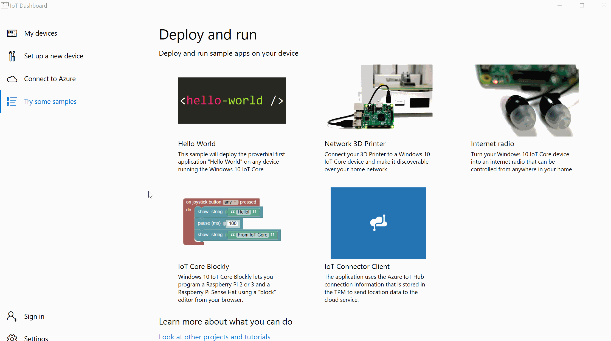

--- 
title: Get set up
author: saraclay 
ms.author: saclayt 
ms.date: 04/18/2018 
ms.topic: article 
description: Learn how to get set up your device for a 3D printer.
keywords: Windows 10 IoT Core, 3D printer
--- 

# Set up

## Get your equipment

1. Before you start, you will need a board with the latest version of the Windows 10 IoT Core Insider Preview installed. Follow the [Windows 10 IoT Core Quickstarter](../prototypeboards.md) to get set up.

2. Once you have your board, you will also need a 3D printer compatible with our Network 3D Printer app:
* Lulzbot Taz 6
* Makergear M2
* Printrbot Play, Plus and Simple
* Prusa i3 Mk2
* Ultimaker Original and Original +
* Ultimaker 2 Extended and Extended +
* CraftBot 2
* CraftBot PLUS
* LulzBot Mini
* Velleman K8200

## Connect your 3D printer to your device

1. Now that you the proper equipment, use a USB cable to plug in a 3D printer to your Windows 10 IoT Core board.

2. Using the IoT Dashboard, click on _Try some samples_ then _Network 3D Printer_, then follow the steps accordingly, as also shown in the gif below.

[LulzBot TAZ 6 image](http://devel.lulzbot.com/TAZ/Olive/photos/TAZ_6_Angle_Rock2pus_transparent.png) by [Aleph Objects, Inc.](https://www.alephobjects.com/) is licensed under [CC BY-SA 4.0](https://creativecommons.org/licenses/by-sa/4.0/).
