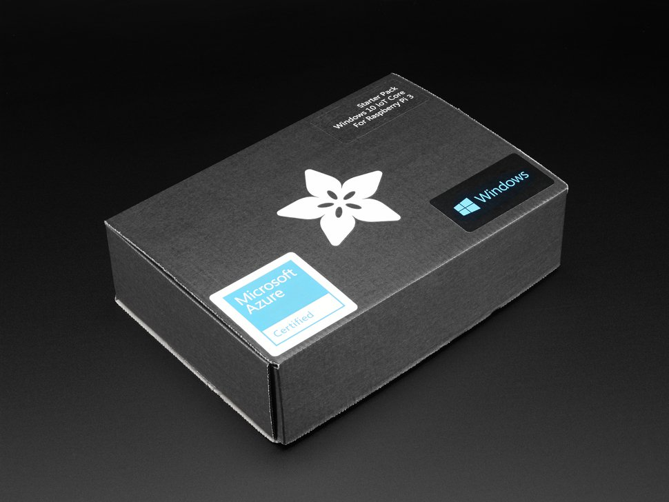

# Microsoft IoT Pack

## Overview
[Windows 10 IoT Core](../windows-iot-core.md) is a version of Windows targeted towards small, embedded devices. You can use Windows 10 IoT Core to read sensor data, control actuators, connect to the cloud, create IoT applications, and more. With the parts included in the kit and instructions provided here, you'll be ready to make your first project.

_Not sure what this is about? Learn more about the Microsoft IoT Pack [here](https://www.adafruit.com/windows10iotpi2)._

## Build your first app

Learn how to get set up and going. Start [here](https://docs.microsoft.com/en-us/windows/iot-core/tutorials/quickstarter/devicesetup#using-the-iot-dashboard-raspberry-pi-minnowboard-nxp).

## Explore sample projects

Once you're set up, try out samples from Hackster.io for Windows 10 IoT Core. View the starter projects [here](https://github.com/ms-iot/adafruitsample/blob/master/README.md).

