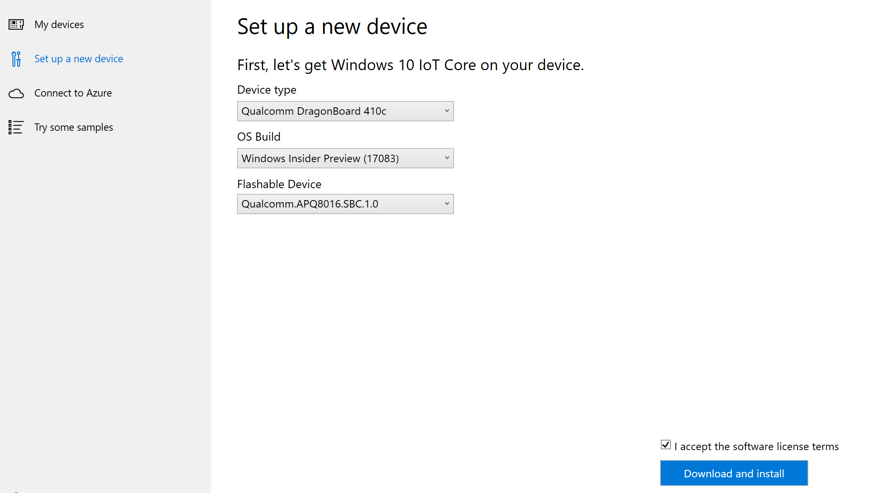

# Setting up a Dragonboard

> [!IMPORTANT]
> When you're working with a new Dragonboard, it comes with Android installed. You will need to wipe and load the device using the eMMC flashing method, [here](https://docs.microsoft.com/windows/iot-core/tutorials/qualcomm).

> [!NOTE]
> If you're running into any audio-related issues with your DragonBoard, we advise that you read through Qualcomm's manual [here](https://developer.qualcomm.com/download/db410c/stereo-connector-and-audio-routing-application-note.pdf).

When setting up a Dragonboard for prototyping, we recommend using the Windows 10 IoT Core Dashboard. However, if you're looking to manufacture with a Dragonboard, please refer to the [IoT Core Manufacturing Guide](https://docs.microsoft.com/windows-hardware/manufacture/iot/iot-core-manufacturing-guide). You cannot use maker images for manufacturing.
 
> [!Video https://www.youtube.com/embed/iPm57hGq-Q8]

## Using the Dashboard

To flash, or download, IoT Core onto your MinnowBoard, you'll need:
* A computer running Windows 10
* [Windows 10 IoT Core Dashboard](https://docs.microsoft.com/windows/iot-core/downloads)
* MicroUSB cable
* An external display
* Any other peripherals (e.g. mouse, keyboard, etc.)

### Instructions

1. Run the Windows 10 IoT Core Dashboard and click on *Set up a new device*.
2. Select "Qualcomm [DragonBoard 410c]" as the device type.
3. Connect the DragonBoard to your compuetr using a microUSB cable.
4. Hook up your DragongBoard to an external display.
5. Power on your Dragonboard using a 12V (>1A) power supply while holding down the volume up (+) button. The device - when connected to a display - should show the image of a hammer, a lightning bolt, and a cog.
6. The device should now be visible on the Dashboard as shown below. Select the appropriate device.
7. Accept the software license terms and click **Download and install**. You'll see that Windows 10 IoT Core is now flashing onto your device.

## Connect to a network
### Wired connection
If your device comes with an Ethernet port or USB Ethernet adapter support to enable a wired connection, attach an Ethernet cable to connect it to your network.

### Wireless connection
If your device supports Wi-Fi connectivity and you've connected a display to it, you'll need to:

1. Go into your default application and click the settings button next to the clock.
2. On the settings page, select _Network and Wi-Fi_.
3. Your device will begin scanning for wireless networks.
4. Once your network appears in this list, select it and click _Connect_.

If you haven't connected a display and would like to connect via Wi-Fi, you'll need to:

1. Go to the IoT Dashboard and click on _My Devices_.
2. Find your unconfigured board from the list. Its name will begin with "AJ_"... (e.g. AJ_58EA6C68). If you don't see your board appear after a few minutes, try rebooting your board.
3. Click on _Configure Device_ and enter your network credentials. This will connect your board to the network.

> [!NOTE]
> Wifi on your computer will need to be turned on in order to find other networks.

## Connect to Windows Device Portal

Use the [Windows Device Portal](../manage-your-device/DevicePortal.md) to connect your device through a web browser. The device portal makes valuable configuration and device management capabilities available.
